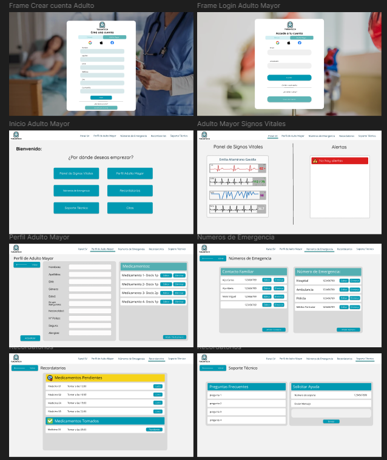
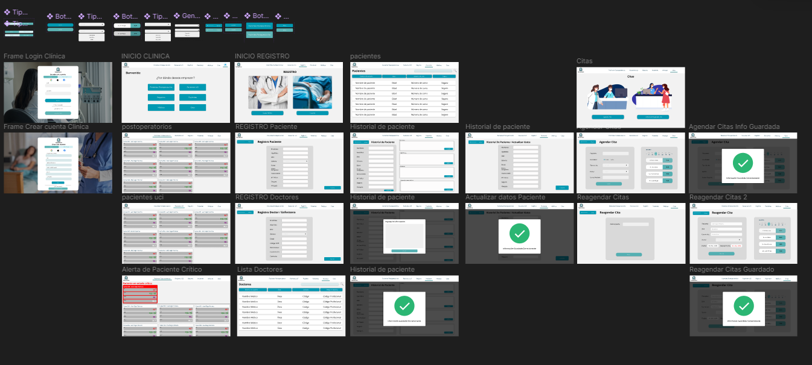

# DesarrolloOP-SW57

## 1.1. Startup Profile
## 1.1.1. Descripción de la Startup 
Actualmente, el monitoreo de signos vitales en adultos mayores, pacientes postoperatorios y en cuidados intensivos se realiza con dispositivos tradicionales que requieren intervención manual y ofrecen sistemas fragmentados, limitando la eficiencia y la capacidad de respuesta en tiempo real.
Nuestra startup aborda este desafío con una plataforma IoT innovadora que integra dispositivos inteligentes para medir continuamente la frecuencia cardíaca, la presión arterial y la oxigenación en sangre. Los datos se transmiten en tiempo real a una plataforma centralizada, donde algoritmos avanzados detectan anomalías y alertan al personal médico de inmediato. Además, la plataforma permite a los doctores hacer evaluaciones médicas en tiempo real y ajustar tratamientos de manera instantánea.
Nos enfocamos en cuidados intensivos, postoperatorios y en el monitoreo de adultos mayores que desean modernizar su seguimiento médico. Nuestra solución mejora la eficiencia, precisión y calidad de la atención, reduciendo tiempos de respuesta y optimizando la gestión del cuidado.

## 1.2. Solution Profile 
**Procut Name** Se decidió llamar a nuestro producto “TukunTech”, inspirado en el sonido “tukun”, que imita el latido del corazón, el pulso rítmico que simboliza la vida y la salud. Este sonido, asociado con el latido cardíaco, refleja el enfoque principal de nuestra aplicación: el monitoreo de signos vitales. Así como el “tukun” del corazón es esencial para la vida, nuestra aplicación es fundamental para la vigilancia y cuidado continuo de los pacientes.
El sufijo “Tech” subraya la innovación tecnológica que nuestra empresa aporta al sector salud. TukunTech combina la esencia de la vida, representada por el latido del corazón, con soluciones tecnológicas avanzadas, creando una herramienta integral para hospitales y clínicas.
Elegimos este nombre porque captura la esencia de lo que hacemos: utilizar la tecnología para monitorear y cuidar la vida, uniendo ciencia y humanidad en una plataforma que mejora la atención médica.

**Product Description** TukunTech es una innovadora plataforma de monitoreo de signos vitales diseñada para mejorar la atención médica en adultos mayores, pacientes postoperatorios y pacientes en cuidados intensivos. A diferencia de los sistemas tradicionales, TukunTech aprovecha la tecnología IoT para ofrecer un monitoreo integrado de todos los dispositivos de forma continua y en tiempo real de signos vitales críticos. A través de una red de dispositivos inteligentes que van a estar integrados entre sí con el fin de lograr que los datos se transmitan a una plataforma centralizada, donde se analizan mediante algoritmos avanzados para detectar anomalías y alertar al personal médico de manera inmediata. Además nuestra solución también permite a los doctores realizar evaluaciones médicas básicas en tiempo real, accediendo a datos actualizados de los pacientes para proporcionar recomendaciones y ajustes instantáneos. Con TukunTech, las clínicas pueden integrar de manera fluida nuestros servicios en sus sistemas existentes, mejorando la eficiencia en la gestión del cuidado de los pacientes y aumentando la precisión en la toma de decisiones. Nos enfocamos inicialmente en cuidados intensivos, postoperatorios y el monitoreo de adultos mayores, donde la necesidad de una atención más proactiva y personalizada es crítica.

**Monetización** Inicialmente, ofreceremos una versión Beta de nuestro producto para que los usuarios potenciales puedan interactuar con el sistema y familiarizarse con las herramientas que ofrecemos. Esto les permitirá experimentar de primera mano las funcionalidades del software y cómo puede mejorar la gestión de la salud.
Posteriormente, implementaremos dos tipos de suscripciones adaptadas a diferentes necesidades:

Plan Clínico: Diseñado específicamente para clínicas y hospitales, este plan ofrece acceso completo a todas las funcionalidades avanzadas del sistema, incluyendo monitoreo en tiempo real, análisis detallado de datos, alertas personalizadas y soporte técnico especializado. Es ideal para entornos médicos que requieren una supervisión continua y precisa de múltiples pacientes.

Plan Familiar: Enfocado en usuarios individuales que necesitan monitorear la salud de un adulto mayor en el entorno familiar. Este plan proporciona herramientas esenciales de monitoreo, permitiendo a las familias estar informadas sobre los signos vitales de sus seres queridos de manera sencilla y accesible.

Ambos planes tendrán diferentes estructuras de costos y se ofrecerán en un modelo de suscripción mensual, adaptado a las necesidades de cada tipo de usuario.

## 2.3.3. User Journey Mapping.

### Segmento 1: Adultos mayores que necesitan un monitoreo continuo de sus signos vitales

### Segmento 2: Personal médico y pacientes postoperatorios UCI de clínicas privadas

## 4.2.1. Organization Systems

### Segmento 1: Monitoreo de adultos mayores

**Jerárquica**:

- **Panel de control de signos vitales**: El usuario podrá acceder a un panel donde se muestran los signos vitales en tiempo real, organizados jerárquicamente. Primero se mostrarán los datos más críticos como la frecuencia cardíaca y la presión arterial, seguidos de otros indicadores como la oxigenación en sangre.

- **Notificaciones**: Los tres segmentos recibirán notificaciones organizadas en un formato matricial, donde se podrán ver alertas, recordatorios y mensajes, categorizados por relevancia.

### Segmento 2: Pacientes de cuidados intensivos

**Jerárquica**:

- **Historial de intervenciones médicas**: Este historial permitirá revisar las intervenciones realizadas del paciente, organizadas por categorías (medicación, procedimientos, ajustes en el soporte vital, etc.).

### Funcionalidades compartidas

**Jerárquica**:

- **Panel de monitoreo (pacientes postoperatorios o cuidados intensivos)**: El equipo médico encargado tendrá acceso a un sistema que proporciona una vista integral de todos los pacientes postoperatorios o de cuidados intensivos y sus signos vitales en tiempo real. Este panel estará diseñado jerárquicamente, destacando de manera prioritaria aquellos con condiciones críticas o signos vitales fuera de los rangos normales. Los pacientes que requieran atención inmediata se mostrarán en la parte superior, facilitando una respuesta rápida y eficiente por parte del personal médico, además de alertar a los médicos de turno. Esta organización permite que los pacientes reciban la atención necesaria.

- **Alertas médicas (pacientes postoperatorios o cuidados intensivos)**: El equipo médico encargado tendrá acceso al historial de alertas del turno, organizadas por gravedad y cronológicamente.

- **Historial de alertas médicas**: El usuario podrá revisar su historial de alertas emitidas por el sistema, ordenado jerárquicamente por las más recientes.

**Matricial**:

- **Landing Page**: Esta sección será visible para todos los usuarios y presentará la información clave del sistema, como la descripción del servicio, beneficios principales y contacto. La organización será jerárquica, destacando primero la información más relevante y general.

- **Menú de opciones**: Cada segmento objetivo tendrá acceso a un menú principal donde podrán seleccionar las funciones específicas que desean utilizar. Este menú estará categorizado por tópicos, permitiendo un acceso rápido y organizado a las diferentes funcionalidades según la necesidad del usuario.

**Secuencial**:

- **Alta médica (pacientes postoperatorios o cuidados intensivos)**: Para realizar el proceso de alta de un paciente postoperatorio, se deberá seguir una secuencia de pasos e informes, los cuales incluyen observaciones médicas, programación de citas de seguimiento y entrega de recetas médicas.

- **Configuración inicial de la aplicación**: Este proceso será un mini tutorial para el usuario, ayudando a familiarizarse con la app y configurarla. Este proceso se realiza de forma secuencial.

- **Alertas médicas (pacientes postoperatorios o cuidados intensivos)**: El cuerpo médico encargado tendrá acceso al historial de alertas del turno, organizadas por gravedad y cronológicamente.

---

Esta estructura asegura que cada segmento objetivo tenga acceso a la información de manera organizada y adaptada a sus necesidades específicas, facilitando la eficiencia del sistema y la experiencia del usuario.

## 4.2.4. Searching Systems

### Lista de pacientes
El equipo de médicos podrá buscar pacientes específicos en su base de datos mediante filtros. Esta información se mostrará en lista con datos breves como su nombre, edad y última atención.

### Gestión de citas
El equipo médico tendrá acceso a funciones para agendar y administrar citas de pacientes a través de herramientas como calendarios y filtros. Las listas se mostrarán en orden cronológico de atención. Si el paciente no puede asistir o se necesita reagendar la cita, el usuario puede hacerlo fácilmente.

En esta sección, describiremos los sistemas de búsqueda implementados en nuestra plataforma para garantizar que los usuarios, tanto el personal médico como los pacientes, puedan acceder de manera eficiente a la información que necesitan, evitando que se sientan abrumados por la cantidad de datos disponibles.

### Segmento 1: Adultos mayores

#### Historial de signos vitales
Los cuidadores de adultos mayores podrán buscar y revisar el historial de sus signos vitales a lo largo del tiempo. Para facilitar la búsqueda, se implementará un sistema de filtrado por fecha, permitiendo seleccionar un rango de tiempo específico (por ejemplo, la última semana, el último mes o un período personalizado). Los datos filtrados se mostrarán en un formato de lista cronológica, con una vista previa de los valores clave. Al hacer clic en un registro, se desplegará información detallada, incluyendo gráficos de tendencias y notas adicionales del personal médico.

#### Consejos de salud personalizados
La sección de consejos de salud personalizada permitirá a los usuarios buscar recomendaciones específicas mediante palabras clave (por ejemplo, "hipertensión", "diabetes", etc.). Los resultados se mostrarán categorizados por tópicos relevantes, y los usuarios podrán ordenar las recomendaciones por fecha de publicación o relevancia. Cada entrada mostrará un resumen inicial, con la opción de expandir para ver el contenido completo.

### Segmento 2: Pacientes postoperatorios

#### Panel de monitoreo de pacientes
Los profesionales de la salud podrán utilizar una barra de búsqueda para localizar rápidamente a un paciente postoperatorio en particular. Para mejorar la precisión, el sistema ofrecerá filtros avanzados que incluyen el nombre del paciente, su número de identificación y el tipo de cirugía realizada. Los resultados se presentarán en una lista organizada cronológicamente por la fecha de la última intervención. Además, cada entrada mostrará un resumen del estado actual del paciente, con acceso directo a su panel de signos vitales.

#### Alta médica
Durante el proceso de alta médica, el sistema permitirá buscar y filtrar informes previos del paciente, tales como observaciones médicas y programaciones de citas de seguimiento. Los usuarios podrán utilizar filtros basados en la fecha del informe o el tipo de observación. Los resultados se mostrarán en una lista estructurada, destacando los informes más recientes o relevantes en la parte superior. Esto permitirá al personal médico asegurar que todos los requisitos de seguimiento estén cumplidos antes de proceder con el alta del paciente.

### Segmento 3: Pacientes en cuidados intensivos

#### Lista de pacientes
El equipo de médicos podrá buscar pacientes específicos en su base de datos mediante filtros. Esta información se mostrará en lista con datos breves como su nombre, edad y última atención.

#### Monitoreo en tiempo real
En la unidad de cuidados intensivos, el personal médico podrá buscar pacientes específicos utilizando una barra de búsqueda. Los resultados estarán organizados jerárquicamente, priorizando aquellos pacientes con signos vitales fuera de los rangos normales o con alertas críticas activas. Además, se incluirá un filtro para clasificar a los pacientes por condición médica o por la gravedad de su estado.

#### Historial de intervenciones
Los médicos tendrán acceso a un sistema de búsqueda dentro del historial de intervenciones realizadas en pacientes de cuidados intensivos. Este sistema permitirá filtrar por tipo de intervención, fecha o resultados esperados. Los datos se mostrarán en una lista, con la opción de expandir cada entrada para ver detalles adicionales y notas médicas, facilitando así la revisión de los tratamientos aplicados y la planificación de futuras intervenciones.

### Funcionalidades compartidas para todos los segmentos

#### Centro de ayuda y documentación
Para todos los segmentos, se ofrecerá un centro de ayuda con una barra de búsqueda que permite a los usuarios encontrar rápidamente respuestas a preguntas frecuentes y documentación sobre el uso de la plataforma. Los resultados estarán categorizados por tópicos (por ejemplo, "uso de dispositivos", "interpretación de datos", "configuración de alertas"), y se presentarán en orden de relevancia o fecha de actualización.

---

Este formato asegura que cada segmento objetivo tenga acceso a herramientas de búsqueda adaptadas a sus necesidades específicas, mejorando la experiencia del usuario y facilitando el acceso rápido a información crítica.

## 4.4.2. Web Applications Wireflow Diagrams

**Diagrama 1**
**User Goal**: Como parte del equipo médico deseo visualizar el panel de pacientes postoperatorios.  
**Descripción**: En el presente Wireflow, se evidencia un flujo que seguirá el usuario para visualizar el panel de pacientes postoperatorios. En el inicio tendrá que seleccionar el botón de “Pacientes postoperatorios” y se visualizará el panel de signos vitales de los pacientes postoperatorios.

**Diagrama 2**
**User Goal**: Como parte del equipo médico deseo visualizar el panel de pacientes UCI.  
**Descripción**: En el presente Wireflow, se evidencia un flujo que seguirá el usuario para visualizar el panel de pacientes UCI. En el inicio tendrá que seleccionar el botón de “Pacientes UCI” y se visualizará el panel de signos vitales de los pacientes postoperatorios.

**Diagrama 3**
**User Goal**: Como usuario deseo registrar nuevos médicos en el sistema.  
**Descripción**: En el presente Wireflow, se evidencia un flujo que seguirá el usuario para registrar nuevos médicos en el proyecto. En el inicio tendrá que seleccionar el botón de “Registrar”, luego tendrá que seleccionar “Equipo Médico”, finalmente tenemos el registro médico y el usuario debe completar los datos correspondientes.

**Diagrama 4**
**User Goal**: Como usuario deseo registrar nuevos pacientes en el sistema.  
**Descripción**: En el presente Wireflow, se evidencia un flujo que seguirá el usuario para registrar nuevos pacientes en el proyecto. En el inicio tendrá que seleccionar el botón de “Registrar”, luego en la sección “Registros” tendrá que seleccionar “Pacientes”, finalmente tenemos el registro de pacientes y el usuario debe completar los datos correspondientes.

**Diagrama 5**
**User Goal**: Como usuario deseo visualizar la lista de pacientes.  
**Descripción**: En el presente Wireflow, se evidencia un flujo que seguirá el usuario para visualizar la lista de pacientes en el proyecto. En el inicio tendrá que seleccionar el botón de “Pacientes”, luego se nos mostrará la información de todos los pacientes registrados.

**Diagrama 6**
**User Goal**: Como usuario deseo agendar una cita en el proyecto.  
**Descripción**: En el presente Wireflow, se evidencia un flujo que seguirá el usuario para agendar una cita en el proyecto. En el inicio tendrá que seleccionar el botón de “Citas”, luego se nos mostrará la sección “Citas” en donde el usuario debe seleccionar el botón “Agendar citas”.

**Diagrama 7**
**User Goal**: Como usuario deseo reagendar una cita en el proyecto.  
**Descripción**: En el presente Wireflow, se evidencia un flujo que seguirá el usuario para reagendar una cita en el proyecto. En el inicio tendrá que seleccionar el botón de “Citas”, luego se nos mostrará la sección “Citas” en donde el usuario debe seleccionar el botón “Reagendar citas”, se le mostrará la sección para que el usuario ingrese el DNI del paciente para luego seleccionar el botón “Buscar” en el sistema, después se mostrará la información de la cita donde se modifica la fecha y el médico de ser necesario, finalmente se selecciona el botón “Guardar” para actualizar la información en el sistema.

**Diagrama 8**
**User Goal**: Como usuario deseo visualizar la lista de médicos en el sistema.  
**Descripción**: En el presente Wireflow, se evidencia un flujo que seguirá el usuario para visualizar la lista de doctores en el sistema. En el inicio tendrá que seleccionar el botón de “Médicos”, luego se nos mostrará la sección “Doctores” en donde el usuario podrá visualizar la lista de doctores registrados en el sistema.

**Diagrama 9**
**User Goal**: Como usuario deseo añadir notas al historial de un paciente.  
**Descripción**: En el presente Wireflow, se evidencia un flujo que seguirá el usuario para añadir notas al historial de un paciente. En el inicio tendrá que seleccionar el botón de “Pacientes”, luego se nos mostrará la sección “Lista Pacientes” en donde el usuario podrá visualizar la lista de pacientes registrados en el sistema, deberá seleccionar un paciente y se mostrará la ventana “Historial del Paciente” donde el usuario podrá visualizar la información del paciente, además de añadir una nota en el historial del paciente. Se debe ingresar en el recuadro input y finalmente el usuario debe seleccionar el botón “Guardar”.

**Diagrama 10**
**User Goal**: Como usuario deseo recibir notificación de los pacientes en estado crítico.  
**Descripción**: En el presente Wireflow, se evidencia un flujo que seguirá el usuario para visualizar la notificación de un paciente en estado crítico. En el inicio tendrá que seleccionar el botón “Pacientes UCI” y una vez en este, en la parte superior de la plataforma se visualizarán los pacientes en estado crítico.

**Diagrama 11**
**User Goal**: Como usuario deseo actualizar la información de un paciente.  
**Descripción**: En el presente Wireflow, se evidencia un flujo que seguirá el usuario para actualizar la información de un paciente. En el inicio tendrá que seleccionar el botón “Pacientes” y visualizará una lista donde se encuentran los pacientes. En esta lista se debe seleccionar un paciente y se mostrará la información de este con su historial. Después se debe seleccionar el botón “Actualizar”, en la ventana emergente actualizar la información y finalmente seleccionar el botón “Actualizar”.

## 4.4.2. Web Applications Mock-ups.
**Segmento Objetivo Cuidadores de Adultos Mayores**

**Segmento Objetivo Clínicas u Hospitales**

## 4.6.2 Software Architecture Container Diagrams.

## 4.8.1. Database Diagram

## 5.1.1. Software Development Environment Configuration

En esta sección se describirán los links de las aplicaciones que fueron utilizadas para el proyecto.  
Para ello se clasificará en las siguientes secciones:

### Product UX/UI Design
Esta herramienta permitió desarrollar el modelo de nuestro proyecto de manera digital.

- **[Miro](https://miro.com/app/dashboard/)**: Es una pizarra digital colaborativa en línea, que puede ser usada para la investigación, la ideación, la creación de lluvias de ideas, mapas mentales y una variedad de otras actividades colaborativas.  
- **[Figma](https://www.figma.com/design/)**: Es una herramienta de prototipo web y editor de gráficos vectorial.  
- **[Structurizr](https://structurizr.com/)**: Es una herramienta de diseño que soporta el modelo C4, para visualizar la arquitectura de software de nuestra solución.
- **[Trello](https://trello.com/es)**: Es un software de administración de proyectos con interfaz web y con cliente para iOS y Android para organizar proyectos.

### Software Development
Es una estructura aplicada al desarrollo de software. Se utilizó para el proceso de desarrollo de la aplicación, cada uno de ellos se enfocan en diferentes actividades que tienen lugar durante el proceso.

- **[Github](https://github.com/TukunTech/DesarrolloOP-SW57)**: Es una forja para alojar proyectos utilizando el sistema de control de versiones Git.  
- **[Visual Studio Code](https://code.visualstudio.com/)**: Es un editor de código fuente desarrollado por Microsoft para Windows, Linux, macOS y Web.  
- **[SQL Management](https://learn.microsoft.com/es-es/sql/ssms/download-sql-server-management-studio-ssms?view=sql-server-ver16)**: Es una aplicación utilizada para la gestión y administración de los componentes dentro de SQL Server.  
- **[HTML](https://www.jetbrains.com/help/webstorm/editing-html-files.html)**: Es el código que se utiliza para estructurar y desplegar una página web y sus contenidos. Este lenguaje va a ser utilizado en el presente proyecto.  
- **[CSS](https://www.jetbrains.com/help/webstorm/style-sheets.html#ws_css_completion)**: Es un lenguaje de diseño gráfico para definir y crear la presentación de un documento estructurado escrito en un lenguaje de marcado.​ Este lenguaje se utilizará para la implementación del diseño de nuestro proyecto.  
- **[JavaScript](https://developer.mozilla.org/es/docs/Web/JavaScript)**: Es un lenguaje de secuencias de comandos que te permite crear contenido de actualización dinámica, controlar multimedia, animar imágenes y prácticamente todo lo demás.  

### Software Deployment
Tiene la función de examinar los artefactos y el comportamiento del software, asimismo lo pone en prueba y lo verifica.

- **[Github Pages](https://pages.github.com/)**: Es un servicio de alojamiento de sitio estático que toma archivos HTML, CSS y JavaScript directamente desde un repositorio en GitHub.

## 5.2.1.3. Development Evidence for Sprint Review. 
En esta sección, se presentará la evidencia del progreso y desarrollo del software. Se incluirán detalles sobre las características específicas que se han implementado durante el sprint actual, destacando cualquier avance significativo en la plataforma.

## 5.2.1.7. Software Deployment Evidence for Sprint Review.
En esta sección, se redactará el proceso de implementación del software en un entorno de producción. Asimismo, se mostrarán los hitos clave que servirán para el despliegue del proyecto y la disponibilidad de este para los usuarios finales. 

