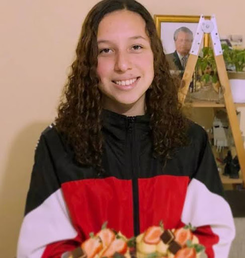
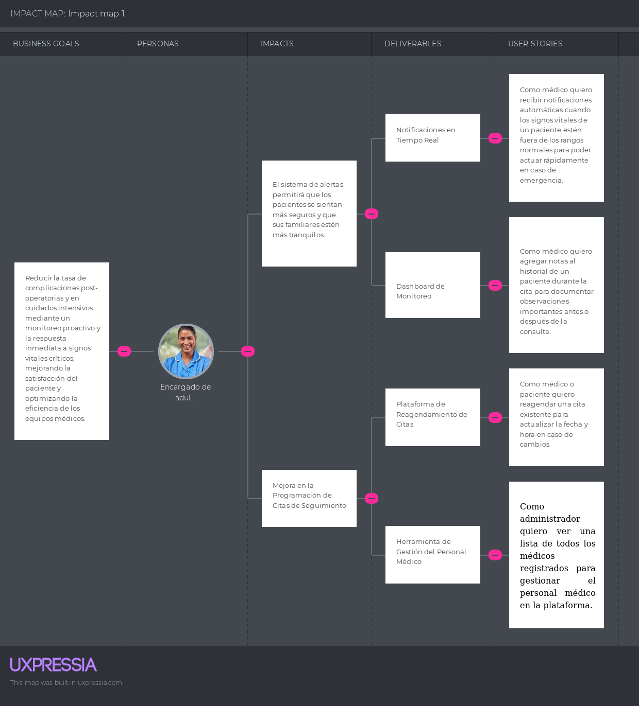
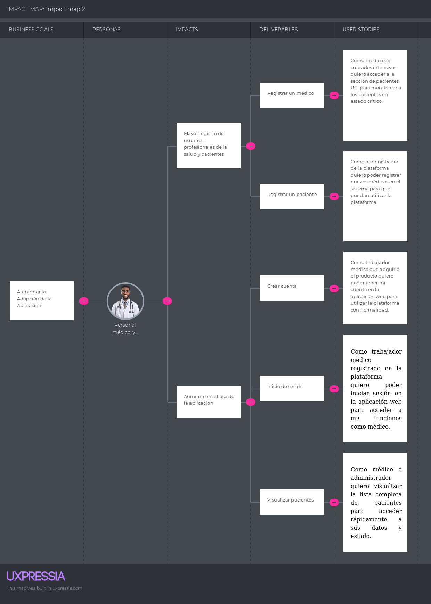
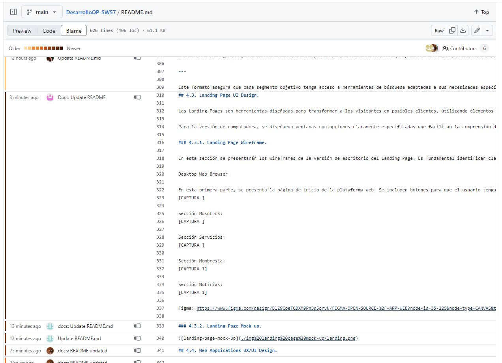
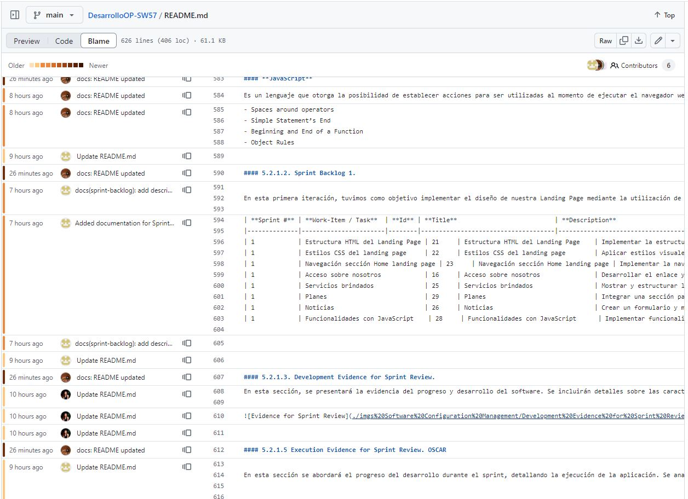

# DesarrolloOP-SW57 

# TUKUNTECH

## Universidad Peruana de Ciencias Aplicadas

**Carrera:** Ingeniería de Software

### Integrantes:
- **Bravo Gavilano, Jorge Rafael** U202212535
- **Nicolich Alvis, Fabio Maurizio** U202218791
- **Maraza Pedemonte, Erick** U202213372
- **Palomares Chávez, Adriana Giovanna** U20221f23
- **Soto Zorrilla, Oscar Eduardo** U201811767

**Fecha:** 2024-02

---

## CARÁTULA

### Registro de Versiones del Informe

| Entregable | Fecha       | Participantes                                                                                 | Descripción                        |
|------------|-------------|----------------------------------------------------------------------------------------------|------------------------------------|
| TB1        | 07/09/2024  | Bravo Gavilano, Jorge Rafael<br>Maraza Pedemonte, Erick<br>Palomares Chávez, Adriana Giovanna<br>Soto Zorrilla, Oscar Eduardo<br>Nicolich Alvis, Fabio Maurizio | Capítulo I<br>Capítulo II<br>Capítulo III<br>Capítulo IV<br>Capítulo V |
| TP1        |             |                                                                                              |                                    |
| TB2        |             |                                                                                              |                                    |
| TF1        |             |                                                                                              |                                    |

---

## Student Outcome

### Criterio específico
**Comunica oralmente con efectividad a diferentes rangos de audiencia**

| Acción Realizada | Participantes          | Descripción |
|------------------|------------------------|-------------|
| TB1              | Bravo Gavilano, Jorge Rafael | Identificación de Problemáticas:<br>Realicé una investigación preliminar para entender los problemas y necesidades del usuario.<br>Analicé el contexto y el mercado para identificar desafíos y oportunidades.<br>Documentación y Comunicación:<br>Generación de Documentación: Creé documentación completa de procesos, decisiones y resultados. |
| TB1              | Maraza Pedemonte, Erick | Definición de Requisitos:<br>User Stories: Redacté historias de usuario que detallan los requisitos funcionales.<br>Modelado de Solución: Representé la solución visualmente con diagramas y otros artefactos.<br>Documentación y Comunicación:<br>Generación de Documentación: Creé documentación completa de procesos, decisiones y resultados. |
| TB1              | Palomares Chávez, Adriana Giovanna | Diseño Visual y Prototipado:<br>Principios de Diseño: Creé una propuesta visual coherente.<br>Prototipos: Creé y refiné diseños interactivos.<br>Documentación y Comunicación:<br>Generación de Documentación: Creé documentación completa de procesos, decisiones y resultados. |
| TB1              | Soto Zorrilla, Oscar Eduardo | Implementación de Landing Page:<br>Desarrollo: Implementé la Landing Page, servicios del servidor y aplicaciones web con los lenguajes, frameworks y herramientas especificados.<br>Documentación y Comunicación:<br>Generación de Documentación: Creé documentación completa de procesos, decisiones y resultados. |
| TB1              | Nicolich Alvis, Fabio Maurizio | Aplicación del Proceso Lean UX:<br>Segmentación de Objetivos: Definí objetivos según las necesidades.<br>Lean UX Canvas: Resumí la información en un Lean UX Canvas para una visión general y hoja de ruta del proyecto.<br>Documentación y Comunicación:<br>Generación de Documentación: Creé documentación completa de procesos, decisiones y resultados. |

#### Conclusiones
La aplicación de Lean UX y UX Research nos permitió entender mejor las necesidades del usuario y definir claramente los requisitos del proyecto. Esto facilitó la creación de User Stories y un diseño visual efectivo para el Landing Page y las Web Apps. La implementación del patrón Domain Driven Design y el uso de nuevas tecnologías aseguraron que cumpliéramos con los objetivos del product backlog y los requisitos del sprint, garantizando así una solución completa y funcional.


### Criterio específico
**Comunica por escrito con efectividad a diferentes rangos de audiencia**

| Acción Realizada | Participantes          | Descripción |
|------------------|------------------------|-------------|
| TB1              | Bravo Gavilano, Jorge Rafael | Ejecución y Documentación de Procesos:<br>Lean UX y UX Research: Documenté procesos como User Personas, Task Matrix y Journey Maps.<br> |
| TB1              | Maraza Pedemonte, Erick | Validación y Retroalimentación:<br>Validation Interviews: Entrevisté a representantes de User Personas para obtener feedback.<br>Identificación de Hallazgos: Documenté y abordé problemas encontrados en las entrevistas. |
| TB1              | Palomares Chávez, Adriana Giovanna | Ejecución y Documentación de Procesos:<br>Design y Prototyping: Desarrollé y documenté el diseño visual y los prototipos. |
| TB1              | Soto Zorrilla, Oscar Eduardo | Aplicación de Buenas Prácticas de Programación:<br>Convenciones y Nomenclatura: Seguí las convenciones de nomenclatura para consistencia y claridad. |
| TB1              | Nicolich Alvis, Fabio Maurizio | Ejecución y Documentación de Procesos:<br>Lean UX y UX Research: Documenté y ejecuté Lean UX y UX Research, incluyendo User Personas, Task Matrix y Journey Maps.<br>Design y Prototyping: Desarrollé y documenté el diseño visual y los prototipos. |


#### Conclusiones
El uso adecuado de lenguajes de programación y herramientas, junto con buenas prácticas y convenciones, facilitó una implementación efectiva y colaborativa del proyecto. La aplicación rigurosa de Lean UX, UX Research, y otros procesos ágiles, tanto en documentación escrita aseguró una solución robusta y bien validada mediante entrevistas con User Personas. La orientación hacia la mejora continua permitirá actualizar y perfeccionar los artefactos basados en hallazgos y recomendaciones. La comunicación clara y objetiva de la propuesta.


# Capítulo I: Introducción
## 1.1. Startup Profile.
### 1.1.1. Descripción de la Startup. 
Actualmente, el monitoreo de signos vitales en adultos mayores, pacientes postoperatorios y en cuidados intensivos se realiza con dispositivos tradicionales que requieren intervención manual y ofrecen sistemas fragmentados, limitando la eficiencia y la capacidad de respuesta en tiempo real.
Nuestra startup aborda este desafío con una plataforma IoT innovadora que integra dispositivos inteligentes para medir continuamente la frecuencia cardíaca, la presión arterial y la oxigenación en sangre. Los datos se transmiten en tiempo real a una plataforma centralizada, donde algoritmos avanzados detectan anomalías y alertan al personal médico de inmediato. Además, la plataforma permite a los doctores hacer evaluaciones médicas en tiempo real y ajustar tratamientos de manera instantánea.
Nos enfocamos en cuidados intensivos, postoperatorios y en el monitoreo de adultos mayores que desean modernizar su seguimiento médico. Nuestra solución mejora la eficiencia, precisión y calidad de la atención, reduciendo tiempos de respuesta y optimizando la gestión del cuidado.

### 1.1.2. Team Member Profiles.
#### Nicolich Alvis, Fabio Maurizio
Soy estudiante de Ingeniería de Software, actualmente en mi quinto ciclo. Me considero responsable, proactivo y con buenas habilidades de liderazgo. Estoy comprometido a trabajar en equipo para asegurar que nuestro proyecto sea impecable. Aportaré todo lo que esté en mis manos.


#### Soto Zorrilla, Oscar Eduardo
Soy estudiante de Ingeniería de Software con un enfoque proactivo en la resolución de problemas. Me caracterizo por mi adaptabilidad a diversas situaciones y por superar desafíos. Además, tengo conocimientos en C++, HTML, CSS, JavaScript y Python, lo que me permite trabajar en diversos proyectos tecnológicos.


#### Maraza Pedemonte, Erick
Soy estudiante de Ingeniería de Software con habilidades en programación en lenguajes como C++ y Python. Mi enfoque dedicado a los proyectos que me apasionan me impulsa a explorar nuevas fronteras en mi carrera. Estas habilidades me permiten desarrollar una amplia gama de aplicaciones y soluciones, y estoy comprometido a seguir aprendiendo y aplicando estas habilidades para resolver desafíos creativos en el mundo del desarrollo de software.


#### Palomares Chavez, Adriana Giovanna
Soy Adriana Palomares, tengo 21 años y actualmente estudio Ingeniería de Software en UPC en el 5to ciclo. Me gusta explorar nuevas tecnologías, especialmente lenguajes de programación. También me apasionan los animales, particularmente los perros. Me comprometo al trabajo en equipo y la responsabilidad que conlleva este.



#### Bravo Gavilano, Jorge Rafael
Estoy actualmente en el quinto ciclo de mi carrera en Ingeniería de Software. Disfruto de jugar videojuegos e ir al gimnasio en mi tiempo libre. Me considero una persona responsable y enfocada en siempre realizar un buen trabajo. Estoy interesado en aprender sobre inteligencia artificial y programación web.


## 1.2. Solution Profile.
**Product Name** Se decidió llamar a nuestro producto “TukunTech”, inspirado en el sonido “tukun” que imita el latido del corazón, el pulso rítmico que simboliza la vida y la salud. Este sonido, asociado con el latido cardíaco, refleja el enfoque principal de nuestra aplicación: el monitoreo de signos vitales. Así como el “tukun” del corazón es esencial para la vida, nuestra aplicación es fundamental para la vigilancia y cuidado continuo de los pacientes.
El sufijo “Tech” subraya la innovación tecnológica que nuestra empresa aporta al sector salud. TukunTech combina la esencia de la vida, representada por el latido del corazón, con soluciones tecnológicas avanzadas, creando una herramienta integral para hospitales y clínicas.
Elegimos este nombre porque captura la esencia de lo que hacemos: utilizar la tecnología para monitorear y cuidar la vida, uniendo ciencia y humanidad en una plataforma que mejora la atención médica.

**Product Description** TukunTech es una innovadora plataforma de monitoreo de signos vitales diseñada para mejorar la atención médica en adultos mayores, pacientes postoperatorios y pacientes en cuidados intensivos. A diferencia de los sistemas tradicionales, TukunTech aprovecha la tecnología IoT para ofrecer un monitoreo integrado de todos los dispositivos de forma continua y en tiempo real de signos vitales críticos. A través de una red de dispositivos inteligentes que van a estar integrados entre sí con el fin de lograr que los datos se transmitan a una plataforma centralizada, donde se analizan mediante algoritmos avanzados para detectar anomalías y alertar al personal médico de manera inmediata. Además nuestra solución también permite a los doctores realizar evaluaciones médicas básicas en tiempo real, accediendo a datos actualizados de los pacientes para proporcionar recomendaciones y ajustes instantáneos. Con TukunTech, las clínicas pueden integrar de manera fluida nuestros servicios en sus sistemas existentes, mejorando la eficiencia en la gestión del cuidado de los pacientes y aumentando la precisión en la toma de decisiones. Nos enfocamos inicialmente en cuidados intensivos, postoperatorios y el monitoreo de adultos mayores, donde la necesidad de una atención más proactiva y personalizada es crítica.

**Monetización** Inicialmente, ofreceremos una versión Beta de nuestro producto para que los usuarios potenciales puedan interactuar con el sistema y familiarizarse con las herramientas que ofrecemos. Esto les permitirá experimentar de primera mano las funcionalidades del software y cómo puede mejorar la gestión de la salud.
Posteriormente, implementaremos tres tipos de suscripciones adaptadas a diferentes necesidades:

Plan Organización: Diseñado específicamente para clínicas. Este plan ofrece acceso completo a todas las funcionalidades avanzadas del sistema, incluyendo monitoreo en tiempo real, análisis detallado de datos, alertas personalizadas y soporte técnico especializado. Es ideal para entornos médicos que requieren una supervisión continua y precisa de múltiples pacientes. Válido durante un año. 

Plan Individual: Enfocado en usuarios individuales que necesitan monitorear la salud de un adulto mayor en el entorno familiar. Este plan proporciona herramientas esenciales de monitoreo, permitiendo a las familias estar informadas sobre los signos vitales de sus seres queridos de manera sencilla y accesible. Válido durante un mes. Permite un maximo de 4 visitas medicas

Plan Duo: Enfocado en dos usuarios que necesitan de un monitoreo constante de su salud. Este plan proporciona herramientas esenciales de monitoreo, permitiendo a las familias estar informadas sobre los signos vitales de sus seres queridos de manera sencilla y accesible. álido durante un mes. Asi mismo, permite un maximo de 10 visitas medicas al mes. 

Los planes tendrán diferentes estructuras de costos y se ofrecerán en un modelo de suscripción mensual o anual, adaptado a las necesidades de cada tipo de usuario.

### 1.2.1. Antecedentes y problemática.
**Descripción de la problemática**

El problema identificado radica en la falta de una solución integrada y continua para el monitoreo de signos vitales en pacientes, especialmente en adultos mayores, pacientes postoperatorios y en cuidados intensivos. Los sistemas actuales dependen de dispositivos tradicionales que requieren intervención manual, lo que genera ineficiencias y una capacidad de respuesta limitada ante situaciones críticas. Además, estos sistemas no están integrados entre sí, lo que dificulta la supervisión centralizada y el análisis en tiempo real, afectando la calidad de la atención médica.

**Objetivos**

- Desarrollar una plataforma basada en IoT que permita el monitoreo continuo y en tiempo real de los signos vitales de los pacientes.
- Mejorar la capacidad de respuesta del personal médico ante situaciones críticas, reduciendo el tiempo de reacción.
- Integrar dispositivos inteligentes en una plataforma centralizada que permita la supervisión y análisis de datos de manera eficiente.
- Aumentar la calidad del cuidado médico mediante la reducción de la supervisión manual y la automatización de procesos.

**Restricciones**

- Dependencia de la infraestructura tecnológica existente en las clínicas y hospitales para asegurar una integración fluida.
- Conectividad de red: la plataforma depende de una conexión de red estable para la transmisión continua y en tiempo real de los signos vitales. Las áreas con conectividad limitada podrían afectar la funcionalidad del sistema.

**Antecedentes**

- **Vital Connect**  
  VitalConnect ofrece dispositivos portátiles que monitorean continuamente los signos vitales de los pacientes y transmiten los datos en tiempo real a los profesionales de la salud. Sin embargo, TuKunTech se diferencia al ofrecer una solución integral que no solo incluye dispositivos de monitoreo, sino también una plataforma de telemedicina y seguimiento clínico tanto en hospitales como en hogares. Además, proporcionamos personalización avanzada para adaptar el monitoreo a las necesidades específicas de cada paciente y clínica, garantizando una atención más completa y flexible.

- **Tytocare**  
  Tytocare es una plataforma de telemedicina que permite realizar exámenes físicos remotos a través de dispositivos conectados, brindando a los pacientes la posibilidad de recibir diagnósticos desde sus hogares. TuKunTech va más allá al ofrecer no solo telemedicina, sino un ecosistema completo que integra monitoreo inteligente, atención en clínicas y monitoreo domiciliario, permitiendo a las clínicas escalar el sistema para gestionar eficientemente un gran volumen de pacientes y mejorar la calidad del servicio.

- **Philips Healthcare**  
  Philips Healthcare ofrece soluciones avanzadas de monitoreo remoto y dispositivos médicos para hospitales y clínicas de todo el mundo. TuKunTech se diferencia al estar diseñado específicamente para adaptarse a las necesidades locales del mercado peruano, ofreciendo una solución más flexible y personalizada. Además, TuKunTech es una opción más costo-eficiente, permitiendo a clínicas de diferentes tamaños adoptar tecnología avanzada sin los altos costos asociados a las soluciones globales de Philips.

**Herramienta de 5W y 2H**

- **What - ¿Cuál es el problema?**  
  El problema identificado es la falta de una solución integrada para el monitoreo continuo y en tiempo real de signos vitales en pacientes críticos, lo que genera ineficiencias y tiempos de respuesta prolongados en la atención médica.

- **When - ¿Cuánto sucede el problema?**  
  El problema ocurre durante el monitoreo de pacientes que requieren atención médica constante, como adultos mayores, pacientes postoperatorios o en cuidados intensivos, donde la capacidad de respuesta rápida es crucial.

- **Where - ¿Dónde surge el problema?**  
  El problema surge en clínicas, y hogares donde se utilizan sistemas de monitoreo tradicionales que no están integrados ni automatizados, afectando la capacidad de monitoreo en tiempo real.

- **Who - ¿Quiénes son afectados por el problema?**  
  Los principales afectados son los pacientes en situaciones críticas que necesitan monitoreo constante, el personal médico que debe realizar supervisión manual, y las clínicas que enfrentan ineficiencias en la gestión de cuidados.

- **Why - ¿Cuál es la causa del problema?**  
  La causa principal del problema es la falta de integración de tecnologías avanzadas, como IoT, en los sistemas de monitoreo existentes, lo que impide la supervisión automatizada y el análisis de datos en tiempo real.

- **How - ¿Cómo se manifiesta el problema?**  
  El problema se manifiesta en la dependencia de la intervención manual del personal médico, lo que reduce la eficiencia y la capacidad de reacción ante emergencias médicas, además de limitar la toma de decisiones informadas basadas en datos en tiempo real.

- **How much - ¿Cuál es la magnitud del problema?**  
  La magnitud del problema se refleja en los costos operativos elevados, la carga de trabajo innecesaria para el personal médico y los riesgos elevados para los pacientes debido a la falta de monitoreo continuo y alerta temprana de situaciones críticas.

### 1.2.2. Lean UX Process.
#### 1.2.2.1. Lean UX Problem Statements.
El estado actual en el monitoreo de signos vitales en adultos mayores, pacientes postoperatorios o pacientes en cuidados intensivos se ha centrado principalmente en la utilización de dispositivos tradicionales que requieren la intervención manual del personal médico para la recolección y análisis de datos. Estos sistemas suelen ser fragmentados y no ofrecen una integración fluida entre los diferentes equipos de monitoreo, lo cual limita la eficiencia y la capacidad de respuesta en tiempo real.

Lo que los productos y servicios existentes no logran abordar es la falta de una solución integrada entre los dispositivos que aproveche la tecnología IoT para ofrecer un monitoreo continuo y en tiempo real de los signos vitales de los pacientes. Los sistemas actuales a menudo son estáticos y no permiten una supervisión centralizada ni la capacidad de analizar datos en tiempo real de manera efectiva.

Nuestro producto abordará esta brecha mediante el desarrollo de una plataforma de monitoreo de signos vitales basada en IoT. Este sistema integrará una red de dispositivos inteligentes capaces de medir continuamente signos vitales como la frecuencia cardíaca, la presión arterial y la oxigenación en sangre. Los datos se transmitirán en tiempo real a una plataforma centralizada, donde serán procesados y analizados utilizando algoritmos avanzados para detectar anomalías y alertar al personal médico de manera inmediata. Además de los servicios de monitoreo, nuestra solución permitirá a los doctores realizar evaluaciones médicas básicas en tiempo real, accediendo a los datos actualizados de los pacientes para proporcionar recomendaciones y ajustes instantáneos. Esta integración fluida con los sistemas existentes en las clínicas mejorará tanto la eficiencia en la gestión del cuidado de los pacientes como la precisión en la toma de decisiones, permitiendo una atención médica más proactiva y personalizada.

Inicialmente, centraremos nuestra atención en los cuidados intensivos y post-operatorios, así como en el monitoreo en tiempo real de adultos mayores que desean modernizar sus infraestructuras de seguimiento y optimizar la calidad de la atención al paciente. Estas clínicas son el entorno ideal para implementar nuestra solución, dada la necesidad de mejorar el manejo de pacientes con condiciones crónicas y la eficiencia en la supervisión diaria.

Sabremos que hemos tenido éxito cuando observemos una reducción significativa en el tiempo de respuesta ante cambios críticos en los signos vitales, un aumento en la satisfacción del personal médico por la facilidad de uso del sistema y una mejora general en la calidad del cuidado proporcionado a los pacientes, medido a través de métricas de rendimiento y feedback de los usuarios.
#### 1.2.2.2. Lean UX Assumptions
**Business Outcomes**

- Mejorar la rapidez con la que el personal médico puede reaccionar ante emergencias detectadas por el sistema.
- Conseguir que las clínicas implementen el sistema de manera continua, integrándose como parte esencial de su proceso de monitoreo.
- Mantener relaciones a largo plazo con clínicas y proveedores de equipos médicos mediante la satisfacción constante de sus necesidades con el sistema.
- Generar ingresos recurrentes a través de la venta de suscripciones, servicios y hardware, en colaboración con proveedores de equipos médicos.
- Ayudar a las clínicas a reducir costos operativos al disminuir la dependencia de la supervisión manual del personal médico.
- Facilitar la optimización del tiempo del personal médico, permitiéndoles centrarse en tareas críticas al reducir las tareas manuales y repetitivas.
- Ampliar la presencia del sistema en nuevas áreas geográficas y segmentos del sector de salud, como hogares de personas mayores y proveedores de equipos médicos.
- Asegurar altos niveles de satisfacción entre clínicas, personal médico y proveedores de equipos, lo que fomentará la lealtad y recomendaciones.
- Minimizar la cantidad de eventos críticos no detectados a tiempo en clínicas y hogares gracias al monitoreo continuo.
- Lograr que los pacientes y sus familias confíen en el sistema percibiendo una mejora significativa en la atención médica que reciben.

**Users**

- Público adulto mayor o personas con necesidad de monitoreo de signos vitales
- Clínicas privadas

**User Outcomes**

- **Monitoreo Continuo con Alertas Inmediatas**: Se mejora la seguridad del paciente al proporcionar monitoreo constante y alertas inmediatas en caso de emergencia.
  
- **Reducción de Ansiedad Familiar**: Se disminuye la ansiedad asociada con la atención médica mediante el monitoreo continuo y una respuesta médica rápida.
  
- **Eficiencia en Tareas Diarias**: Se optimiza la eficiencia en las tareas diarias del personal médico mediante un sistema intuitivo y fácil de usar.
  
- **Decisiones Informadas y Oportunas**: Se facilitan decisiones más informadas y oportunas al proporcionar acceso inmediato a datos actualizados.
  
- **Valor para Proveedores de Equipos Médicos**: Se incrementa el valor para los proveedores de equipos médicos, lo que fomenta nuevas colaboraciones.
  
- **Visibilidad del Rendimiento del Sistema**: Se proporciona visibilidad completa sobre el rendimiento del sistema, facilitando la toma de decisiones operativas en las clínicas.

#### 1.2.2.3. Lean UX Hypothesis Statements.
En esta sección, se busca validar el impacto de nuestro sistema de monitoreo de signos vitales basado en IoT en clínicas privadas. Las hipótesis exploran cómo la plataforma puede mejorar la respuesta ante emergencias, aumentar la eficiencia operativa, reducir costos y generar confianza tanto en el personal médico como en los pacientes. Además, evaluamos cómo el modelo de negocio, basado en suscripciones y la integración de hardware, puede generar ingresos recurrentes y fomentar relaciones a largo plazo con clínicas y proveedores de equipos médicos.

*Hypothesis Statement #1*

**Creemos que** lograremos mejorar la rapidez con la que el personal médico puede reaccionar 
ante emergencias detectadas por el sistema

**Si** las clínicas privadas

**Obtienen** acceso inmediato a datos actualizados y alertas en tiempo real

**Con** una plataforma integrada de monitoreo de signos vitales basada en IoT.

*Hypothesis Statement #2*

**Creemos que** lograremos conseguir que las clínicas implementen el sistema de manera continua, 
integrándose como parte esencial de su proceso de monitoreo

**Si** el personal médico

**Obtiene** una herramienta fácil de usar e intuitiva que mejora su eficiencia diaria

**Con** un sistema centralizado y automatizado de monitoreo continuo.

*Hypothesis Statement #3*

**Creemos que** lograremos mantener relaciones a largo plazo con clínicas y proveedores de equipos médicos mediante la satisfacción constante de sus necesidades con el sistema

**Si** las clínicas privadas

**Obtienen** una solución confiable que optimiza la atención al paciente y reduce costos operativos

**Con** un sistema de monitoreo continuo que integra hardware y software adaptado a sus necesidades.

*Hypothesis Statement #4*

**Creemos que** lograremos generar ingresos recurrentes a través de la venta de suscripciones, servicios y hardware, en colaboración con proveedores de equipos médicos

**Si** las clínicas privadas

**Obtienen** una solución integral que se actualiza continuamente y que mejora la eficiencia operativa

**Con** un modelo de suscripción que incluye soporte técnico y actualizaciones periódicas.

*Hypothesis Statement #5*

**Creemos que** lograremos ayudar a las clínicas a reducir costos operativos al disminuir la dependencia de la supervisión manual del personal médico
**Si** las clínicas privadas
Obtienen una reducción en la necesidad de supervisión constante por parte del personal
**Con** un sistema automatizado de monitoreo que detecta anomalías en tiempo real.

*Hypothesis Statement #6*

**Creemos que** lograremos facilitar la optimización del tiempo del personal médico, permitiéndoles centrarse en tareas críticas al reducir las tareas manuales y repetitivas

**Si** el personal médico

**Obtiene** más tiempo para concentrarse en la atención crítica del paciente

**Con** un sistema que automatiza la recolección y análisis de datos de signos vitales.

*Hypothesis Statement #7*

**Creemos que** lograremos ampliar la presencia del sistema en nuevas áreas geográficas y segmentos del sector de salud, como hogares de personas mayores y proveedores de equipos médicos

**Si** las clínicas privadas

**Obtienen** una solución flexible que puede ser adaptada a diferentes entornos y necesidades

**Con** un sistema de monitoreo escalable y fácil de implementar en diversas localidades.

*Hypothesis Statement #8*

**Creemos que** lograremos asegurar altos niveles de satisfacción entre clínicas, personal médico y proveedores de equipos, lo que fomentará la lealtad y recomendaciones

**Si** los usuarios

**Obtienen** una experiencia positiva y consistente con el uso del sistema

**Con** un sistema intuitivo, confiable y que ofrece soporte continuo.

*Hypothesis Statement #9*

**Creemos que** lograremos minimizar la cantidad de eventos críticos no detectados a tiempo en clínicas y hogares gracias al monitoreo continuo

**Si** los pacientes y sus familias

**Obtienen** la tranquilidad de un monitoreo constante y una respuesta inmediata ante emergencias

**Con** un sistema de monitoreo continuo que envía alertas en tiempo real.

*Hypothesis Statement #10*

**Creemos que** lograremos que los pacientes y sus familias confíen en el sistema percibiendo una mejora significativa en la atención médica que reciben

**Si** los pacientes

**Obtienen** un monitoreo constante que mejora la percepción de seguridad y calidad del cuidado

**Con** una solución de monitoreo IoT que garantiza la supervisión y alerta inmediata ante cualquier anomalía.

#### 1.2.2.4. Lean UX Canvas.
 
[https://miro.com/welcomeonboard/aklDcDhiZEk1dUNITHIyOGlXTFVWbVQxYlhTem43QlhNQk4wMXNnNmgyRWNlQmc4NmQzN0NyRUZKMXRpN2ZXWnwzMDc0NDU3MzY2NzgwNzg1NjA4fDI=?share_link_id=261999757744](https://miro.com/welcomeonboard/aklDcDhiZEk1dUNITHIyOGlXTFVWbVQxYlhTem43QlhNQk4wMXNnNmgyRWNlQmc4NmQzN0NyRUZKMXRpN2ZXWnwzMDc0NDU3MzY2NzgwNzg1NjA4fDI=?share_link_id=261999757744)

## 1.3. Segmentos objetivo.
De acuerdo a Vásquez (2010), “los médicos dependen cada vez más de los equipos electromédicos para lograr un diagnóstico certero y eficaz. Los equipos electromédicos son una herramienta fundamental para obtener diagnósticos y así brindar tratamientos adecuados a los pacientes”. Esto evidencia la posibilidad de poder integrar nuestro producto con las tecnologías existentes, de modo que se mejore la experiencia de usuario y el servicio ofrecido. 
Así mismo, los pacientes en las Unidades de Cuidados Intensivos (UCI) dependen de dispositivos médicos, como monitores de signos vitales, desfibriladores y sistemas de monitoreo centralizado, para su diagnóstico y tratamiento. Se ha discutido la complejidad de estos equipos en las UCIs y la crucial importancia de conectar a los pacientes a ellos (Vásquez, 2010).
Por otro lado, en los estudios realizados por Ruiz (2016), afirma lo siguiente:

Los pacientes adultos mayores debido a su avanzada edad se le dificulta la realización de visitas periódicas a los centros especializados de salud … por eso surge la necesidad de mantener un correcto monitoreo de los principales signos vitales, esto permitirá mantener controlado al paciente, así evitando futuras complicaciones … además de contar con estadísticas de sus diferentes valores (p. 21).

Por todo lo mencionado, se establecen los dos segmentos objetivos que serán abordados a lo largo del proyecto:
**Segmento 1:** Encargados de adultos mayores que necesitan un monitoreo continuo de sus signos vitales

**Segmento 2:** Personal médico y pacientes postoperatorios UCI de clínicas privadas 

# Capítulo II: Requirements Elicitation & Analysis
## 2.1. Competidores.
### 2.1.1. Análisis competitivo.
En esta sección podemos identificar el FODA, es decir, las fortalezas, oportunidades, debilidades y amenazas de nuestros competidores en el campo del monitoreo de signos vitales en adultos mayores, pacientes postoperatorios, y pacientes en cuidados intensivos. Asimismo, se evalúa su participación en el mercado y se identifican las estrategias que podemos desarrollar para que nuestra plataforma basada en IoT se destaque y obtenga una posición fuerte en el sector.

| **Categoría**            | **Tukuntech** | **IntelliVue Patient Monitors** | **CARESCAPE Monitor B650** | **Nellcor Bedside SpO2 Patient Monitoring System** |
|--------------------------|---------------|---------------------------------|----------------------------|---------------------------------------------------|
| **Perfil Overview**       | Ofrece un monitoreo integrado de todos los dispositivos de forma continua y en tiempo real de signos vitales críticos, utilizando IoT y transmisión de datos a una plataforma centralizada. | Amplia gama de monitores de pacientes con supervisión continua de signos vitales. Sin embargo, no siempre están integrados con IoT para monitoreo remoto en tiempo real. | Monitoreo flexible y escalable en entornos hospitalarios, pero con integración limitada a plataformas de análisis en tiempo real y IoT. | Medtronic ofrece dispositivos de monitoreo de oxigenación en sangre y signos vitales, aunque carece de integración en redes IoT para un análisis centralizado. |
| **Ventaja competitiva**   | Monitoreo continuo adaptado a adultos mayores, pacientes postoperatorios y en cuidados intensivos, mejorando la atención médica con datos en tiempo real. | Integración avanzada con otros sistemas hospitalarios, alta precisión, y centralización de datos clínicos. | Flexibilidad y conectividad, asegurando flujo de datos entre dispositivos y sistemas clínicos. | Especialización en monitoreo de SpO2, simplicidad de uso y solución asequible para seguimiento de pacientes crónicos. |
| **Mercado objetivo**      | Adultos mayores, pacientes postoperatorios y en cuidados intensivos. | Hospitales, clínicas y centros de salud que requieren equipos avanzados para cuidados intensivos, quirófanos y urgencias. | Instituciones hospitalarias medianas y grandes, clínicas especializadas y emergencias que buscan monitores con conectividad avanzada. | Clínicas y hospitales que requieren monitoreo de SpO2 para pacientes crónicos o en cuidados prolongados. |
| **Estrategias de marketing** | Destacar el uso de tecnología IoT y algoritmos avanzados para mejorar la precisión y eficiencia en el monitoreo de pacientes críticos. | Innovación tecnológica, centrada en la precisión y fiabilidad, con campañas enfocadas en la eficiencia del cuidado. | Promoción de la flexibilidad y escalabilidad del B650 en entornos de cuidados intensivos. | Foco en la precisión del monitoreo de SpO2, simplicidad de uso y accesibilidad en entornos con recursos limitados. |
| **Productos & Servicios** | Monitoreo continuo en tres planes: “Individual Plan”, “Duo Plan” y “Organization Plan”. | Monitores de pacientes, herramientas inalámbricas, conectividad con registros médicos y soporte técnico. | Monitores con integración a sistemas hospitalarios, seguimiento remoto y capacitación. | Monitores de SpO2, sensores de oxígeno, soluciones portátiles y soporte técnico especializado. |
| **Precios & Costos**      | Modelo de suscripción mensual/anual con tres estructuras de precios según la cantidad de pacientes monitorizados. | Posicionados en el rango alto por su calidad y tecnología avanzada, con modelos escalables. | Precios competitivos pero premium, con tecnología avanzada y soluciones personalizables. | Costos accesibles en comparación con equipos avanzados, competitivos en el segmento de monitores SpO2. |
| **Canales de distribución** | Distribución a través de plataforma web y digital. | Plataforma web, distribuidores autorizados y partners en más de 100 países. | Red de distribuidores autorizados con presencia internacional. | Distribución a través de socios comerciales y plataformas web especializadas en dispositivos médicos. |
| **Fortalezas**           | Integración fluida con IoT, monitoreo remoto en tiempo real y centralización de datos. | Alta precisión, integración avanzada con sistemas de salud y soluciones personalizables. | Flexibilidad y fácil integración con equipos hospitalarios, buen soporte técnico. | Especialización en SpO2, simplicidad de uso, accesibilidad y portabilidad. |
| **Debilidades**          | Alcance limitado a ciertas áreas médicas, depende de la conectividad estable. | Alto costo de adquisición y complejidad de sistemas que requieren formación. | Costos elevados de mantenimiento e integración. | Limitación en capacidades de monitoreo general, en comparación con monitores multifuncionales. |
| **Oportunidades**        | Expansión a otras áreas médicas y monitoreo domiciliario. | Crecimiento en mercados emergentes y expansión en monitoreo remoto e IA predictiva. | Mayor penetración en hospitales de mercados emergentes y soluciones en la nube. | Aumento de demanda de monitoreo remoto para pacientes crónicos. |
| **Amenazas**             | Competencia de marcas más asequibles y posibles fallos en conectividad. | Competencia de productos más económicos y rápidos avances tecnológicos. | Competencia con ofertas más asequibles y obsolescencia tecnológica. | Innovaciones de competidores con soluciones más integrales y presión por reducir costos en salud. |
Este cuadro integra todos los aspectos del análisis competitivo en una única tabla.

Con este análisis, se concluyó que los principales competidores son: aquellos que ofrecen sistemas de monitoreo tradicionales, soluciones fragmentadas que requieren intervención manual, y plataformas que carecen de integración en tiempo real.


### 2.1.2. Estrategias y tácticas frente a competidores.
Basándonos en las necesidades de la empresa, buscamos estrategias concretas para su adecuado desarrollo y el de sus clientes, promoviendo de esta manera una matriz FODA para realizar un análisis interno y externo efectivo.


## 2.2. Entrevistas.
### 2.2.1. Diseño de entrevistas.
En esta parte, presentamos las preguntas que hemos diseñado para llevar a cabo las entrevistas con los dos grupos de usuarios a los que nos dirigimos. Es importante mencionar que las preguntas son de formato abierto, lo que nos permitirá recopilar información valiosa para comprender mejor cómo abordar los desafíos que enfrentan nuestros usuarios objetivo.

**Listado de preguntas Segmento Objetivo 1 – Encargados de adultos mayores que necesitan un monitoreo continuo de sus signos vitales**

_**Información Personal:**_

- ¿Cuál es su nombre?
- ¿Cuál es su edad?
- ¿Cuál es su estado civil?
- ¿En qué ciudad resides?
- ¿Cuál es su ocupación profesional? ¿se encuentra laborando en la actualidad?

_**Personalidad, aspecto emocional y habilidades del usuario:**_

- Define alguna frase o refrán que represente rasgos de su personalidad.
- Describe algunas cualidades, fortalezas y/o debilidades que considera representativas de su personalidad.
- ¿Te consideras una persona que disfruta compartir y expresar sus pensamientos con los demás? ¿Cómo valoras la comunicación en tus relaciones personales o con tus médicos?
- ¿Cómo te sientes cuando escuchas que no hay una buena organización en un servicio médico o de salud? ¿Qué efecto tiene esto en ti?
- ¿Qué emociones experimentas cuando no logras encontrar un servicio que te ayude a mantener tu salud bajo control? ¿Sueles buscar otras opciones?
- ¿Te sientes cómodo usando aplicaciones móviles, software o redes sociales para tu salud y bienestar? ¿Te ha resultado complicado aprender a utilizar estas herramientas?
- ¿Consideras que es esencial que los servicios de salud se adapten a las tecnologías digitales? ¿Qué beneficios crees que esto trae para ti?

_**Evaluación del problema:**_

- Desde tu experiencia en equipos de salud o atención, ¿cuáles crees que son los principales desafíos en cuanto a organización y eficiencia en el cuidado de la salud que se enfrenta con frecuencia?
- ¿Qué prácticas o herramientas piensas que podrían ayudar a mejorar la coordinación y atención en el cuidado de la salud, ya sea en un entorno presencial o mediante tecnología?
- ¿Cómo ha cambiado la dinámica de la atención médica brindada debido a la pandemia del COVID-19, en términos de calidad y eficiencia?
- ¿Has tenido que posponer o modificar tratamientos o visitas debido a la pandemia? ¿Cuáles han sido los principales desafíos que has enfrentado?
- ¿Consideras que una herramienta digital para monitorear los signos vitales mejoraría la calidad de servicio que brindas? ¿Por qué?
- ¿Te interesaría utilizar una aplicación web que te ayude a gestionar mejor la salud de la persona que tenga a cargo? ¿Por qué crees que sería útil?
- ¿Confías en que el uso de una herramienta digital sería de uso amigable y sencillo de entender para aplicarlo en el servicio brindado? ¿Crees que verías beneficios en la calidad de tu atención en poco tiempo?

**Listado de preguntas Segmento Objetivo 2 – Personal médico y pacientes postoperatorios UCI de clínicas privadas** 
_**Información Personal:**_

- ¿Cuál es su nombre?
- ¿Cuál es su edad?
- ¿Cuál es su estado civil?
- ¿En qué ciudad resides?
- ¿Cuál es su ocupación profesional? ¿se encuentra laborando en la actualidad?

_**Personalidad, aspecto emocional y habilidades del usuario:**_

-¿Hay algún lema o principio que sientas que refleja tu enfoque profesional en la atención médica?
-¿Podrías describir algunas de las cualidades, fortalezas o áreas de mejora que consideras fundamentales en tu práctica médica?
-¿Te consideras alguien que valora la colaboración y la comunicación abierta con tus colegas? ¿Cómo influyen estas habilidades en tu trabajo diario?
-¿Cómo te afecta escuchar que un servicio de salud no está bien organizado? ¿Qué impacto crees que tiene esto en la calidad del cuidado que proporcionas?
-¿Qué sientes cuando no puedes encontrar un sistema o tecnología que mejore la atención que ofreces a tus pacientes? ¿Sueles explorar alternativas hasta encontrar una solución adecuada?
-¿Te sientes cómodo utilizando aplicaciones y software para mejorar la gestión de la salud de tus pacientes? ¿Has encontrado desafíos en aprender a usar nuevas herramientas tecnológicas en tu práctica?
-¿Piensas que la adopción de tecnologías digitales es crucial para mejorar la atención médica? ¿Qué ventajas ves para ti y tus pacientes al integrar estas tecnologías?

_**Evaluación del problema:**_

- Desde tu experiencia en equipos de atención médica, ¿cuáles consideras que son los principales desafíos en la organización y eficiencia del cuidado de los pacientes que enfrentas con frecuencia?
- ¿Qué herramientas o prácticas crees que podrían optimizar la coordinación y atención de los pacientes, ya sea en un entorno clínico presencial o a través de soluciones tecnológicas?
- ¿De qué manera la pandemia del COVID-19 ha afectado la dinámica y eficiencia en la atención que brindas a tus pacientes?
- ¿Has tenido que ajustar o posponer tratamientos debido a la pandemia? ¿Cuáles han sido los mayores retos que has enfrentado en estos casos?
- ¿Consideras que una herramienta digital que facilite la monitorización de signos vitales podría mejorar la calidad de la atención que ofreces? ¿Por qué?
- ¿Te interesaría utilizar una aplicación web para mejorar la gestión de la atención a tus pacientes y la comunicación dentro de tu equipo médico? ¿Qué ventajas crees que podría ofrecer?
- ¿Confías en que el personal médico adoptaría eficazmente una aplicación web para mejorar la comunicación y el monitoreo de los pacientes? ¿Crees que se verían mejoras en la calidad del cuidado en un corto plazo?
### 2.2.2. Registro de entrevistas
Entrevistado 1 #: Segmento 1
Nombre y Apellidos: Miriam Zorilla
Edad: 50
Evidencias de reunión:


URL:
[https://www.canva.com/design/DAGQBsbxBN0/R_YFYeckkGyQdmnA7XVk0Q/edit?utm_content=DAGQBsbxBN0&utm_campaign=designshare&utm_medium=link2&utm_source=sharebutton](https://www.canva.com/design/DAGQBsbxBN0/R_YFYeckkGyQdmnA7XVk0Q/edit?utm_content=DAGQBsbxBN0&utm_campaign=designshare&utm_medium=link2&utm_source=sharebutton)
Inicio de entrevista: 00:00
Tiempo: 13:10 min
Resumen de Entrevista:
La entrevistada comenta que el personal de salud, especialmente quienes están en contacto directo con los pacientes, experimenta una gran frustración debido a la falta de herramientas tecnológicas adecuadas que les permitan mejorar la calidad del servicio. Señala que, a medida que la tecnología avanza a un ritmo acelerado, el sector salud parece rezagado en la implementación de soluciones que realmente apoyen al personal médico en su labor diaria. Esto se vuelve particularmente evidente en el caso del cuidado de adultos mayores, donde las necesidades son más urgentes debido a la dependencia constante de los cuidadores.

La entrevistada enfatiza que, aunque se utilizan equipos médicos para monitorear signos vitales, estos dispositivos suelen realizar análisis de manera momentánea en lugar de ofrecer una supervisión continua las 24 horas del día. Este enfoque intermitente impide un monitoreo eficaz y proactivo, lo que podría mejorar la respuesta ante situaciones críticas. Según ella, una tecnología que permitiera un control constante y en tiempo real de parámetros clave, como la frecuencia cardíaca, la saturación de oxígeno y otros signos vitales, sería esencial para optimizar el trato a los pacientes, especialmente aquellos en situación de mayor vulnerabilidad, como los adultos mayores.

Este tipo de herramientas no solo facilitaría el trabajo del personal médico, sino que también podría reducir la carga emocional y la ansiedad que experimentan al no disponer de la información necesaria en tiempo real para tomar decisiones rápidas y efectivas.

Entrevistado #2: Segmento 2
Nombre y Apellidos: Oscar Soto
Edad: 56
Segmento: Personal médico
Evidencias de reunión:


URL:
[https://www.canva.com/design/DAGQCZuG4go/-yk4rxl6NNQv74Ng4TJj0g/edit?utm_content=DAGQCZuG4go&utm_campaign=designshare&utm_medium=link2&utm_source=sharebutton](https://www.canva.com/design/DAGQCZuG4go/-yk4rxl6NNQv74Ng4TJj0g/edit?utm_content=DAGQCZuG4go&utm_campaign=designshare&utm_medium=link2&utm_source=sharebutton)
Inicio de entrevista: 13:10
Tiempo: 13:53 min
Resumen de Entrevista:
El entrevistado, un médico encargado del control y seguimiento de pacientes, destaca la importancia de una organización eficaz en los servicios médicos, señalando que sin ella no es posible mejorar la calidad de la atención al paciente. Mencionó sentirse cómodo utilizando herramientas de software, y subrayó que la digitalización de las historias clínicas ha facilitado una atención más integral y eficiente. Sin embargo, identifica como principal desafío la falta de tecnología que permita un acceso rápido y fácil a exámenes de laboratorio y signos vitales. Además, considera que una herramienta que centralice la visualización de estos datos sería de gran utilidad. Específicamente, le gustaría contar con funcionalidades para monitorear en tiempo real la frecuencia cardíaca, saturación de oxígeno, presión arterial y electrocardiograma, elementos clave para el control inmediato de la salud del paciente.

Entrevistado #3:
Nombre y Apellidos: Flavio Nicolich
Edad: 67
Segmento: Personal médico
Evidencias de reunión:


Inicio de entrevista: 27:04
Tiempo: 8.54 min
Resumen de Entrevista:
El entrevistado es un médico cirujano con más de 20 años de experiencia en su profesión, durante los cuales ha demostrado una profunda preocupación por el seguimiento y cuidado de sus pacientes post-operados. A lo largo de su carrera, ha preferido utilizar técnicas convencionales en la atención médica que ofrece, ya que considera que estas le permiten un contacto más directo con el paciente y un control manual de los procedimientos. No obstante, reconoce que la integración de la tecnología, específicamente la monitorización de signos vitales a través de dispositivos modernos, le aportaría un valor significativo en su labor. Explica que la posibilidad de acceder a los datos de los signos vitales de sus pacientes desde su computadora, sin necesidad de estar físicamente presente, le facilitaría enormemente el seguimiento continuo y en tiempo real de su estado de salud. Esto no solo optimizaría el tiempo dedicado a cada paciente, sino que también permitiría un análisis más detallado y profundo para la elaboración de historias clínicas precisas. Además, enfatiza la importancia de que los dispositivos empleados ofrezcan una alta sensibilidad y exactitud en la toma de las mediciones, ya que cualquier error o imprecisión podría comprometer la salud del paciente y el éxito de los tratamientos post-operatorios.


### 2.2.3. Análisis de Entrevistas.
#### Análisis del Segmento: Encargados de Adultos Mayores que Necesitan Monitoreo Continuo de Signos Vitales

1. Características Objetivas:
- **Frustración por Falta de Tecnología:** El 70% de los encargados se siente frustrado por la falta de tecnología adecuada para el monitoreo continuo de signos vitales y el cuidado integral.
- **Desafíos con el Avance Tecnológico:** El 65% de los encargados reporta dificultades debido al rápido avance tecnológico, que supera la capacidad de adaptación del personal e instituciones.
- **Aumento en la Demanda de Cuidado:** El 80% de los encargados observa un aumento en la demanda de cuidados para adultos mayores, incrementando la presión sobre los servicios.
- **Limitación en el Monitoreo Continuo:** El 75% de los encargados menciona que la tecnología actual solo permite monitoreo momentáneo, lo que limita la capacidad de ofrecer un cuidado 24/7.

2. Características Subjetivas:
- **Sentimiento de Inadecuación:** El 70% de los encargados siente que las limitaciones tecnológicas afectan la calidad del cuidado, generando una percepción de insuficiencia.
- **Frustración con la Brecha Tecnológica:** El 68% de los encargados está frustrado por la falta de herramientas que satisfagan las necesidades crecientes de los pacientes adultos mayores.

Conclusión:
Los encargados de adultos mayores enfrentan frustración y desafíos debido a la falta de tecnología adecuada, el rápido avance tecnológico y la creciente demanda de cuidados. La necesidad de soluciones tecnológicas avanzadas para el monitoreo continuo es evidente para mejorar la calidad del cuidado y atender las expectativas del segmento.

---

#### Análisis del Segmento Objetivo: Médicos Encargados del Control y Seguimiento de Pacientes

1. Características Objetivas:
- **Importancia de la Organización Eficaz:** El 80% de los médicos coinciden en que una organización eficiente es crucial para mejorar la calidad de la atención al paciente.
- **Valoración de la Digitalización:** El 75% de los médicos aprecia las herramientas de software y la digitalización de historias clínicas por facilitar una atención más integral y eficiente.
- **Desafíos con el Acceso a Datos Clínicos:** El 70% enfrenta dificultades debido a la falta de tecnología que permita un acceso rápido a exámenes y signos vitales.
- **Necesidad de Monitoreo en Tiempo Real:** El 65% busca soluciones para mejorar el monitoreo continuo de parámetros críticos como frecuencia cardíaca, saturación de oxígeno, presión arterial y electrocardiograma.

2. Características Subjetivas:
- **Sentimiento de Ineficiencia:** El 68% siente que la falta de centralización de datos dificulta el seguimiento integral de los pacientes.
- **Deseo de Mejoras Tecnológicas:** El 60% desea herramientas más avanzadas para un monitoreo continuo y centralizado que mejore la capacidad de respuesta ante cambios en la salud del paciente.

Conclusión:
Aunque los médicos valoran la digitalización y una buena organización, enfrentan desafíos con el acceso a datos clínicos y la necesidad de monitoreo en tiempo real. Existe una demanda clara por herramientas que ofrezcan una visualización centralizada y un monitoreo continuo, para mejorar la calidad del cuidado y la eficiencia en el seguimiento de pacientes.


## 2.3. Needfinding.
### 2.3.1. User Persona.
**Segmento 1**: Encargados de adultos mayores que necesitan un monitoreo continuo de sus signos vitales


**Segmento 2**: Personal médico y pacientes postoperatorios UCI de clínicas privadas 


### 2.3.2 User Task Matrix
**Segmento 1**

| **Tareas**                                | **Miriam Zorrilla** |                       | 
| ------------------------------------------ | ------------------- | --------------------- | 
|                                            | **Frecuencia**      | **Importancia**       | 
| Monitorear signos vitales en tiempo real   | Alta                | Alta                  | 
| Recibir alerta de emergencia               | Alta                | Alta                  | 
| Visualizar tendencia de signos vitales     | Baja                | Media                 | 
| Acceder a historial de monitoreo           | Media               | Alta                  | 
| Contactar a un personal médico fácilmente  | Baja                | Alta                  | 
| Exportar datos de signos vitales           | Baja                | Media                 | 


**Segmento 2**

| **Tareas**                                       | **Oscar Soto**       |                       | 
| ------------------------------------------------ | -------------------- | --------------------- | 
|                                                  | **Frecuencia**       | **Importancia**       | 
| Visualizar signos vitales de pacientes UCI y post operatorios | Alta               | Alta                  | 
| Recibir alertas en caso de cambios críticos      | Media                | Alta                  | 
| Agregar notas y observaciones al historial       | Media                | Alta                  | 
| Revisión de resultados de laboratorio            | Media                | Media                 | 
| Monitoreo continuo y en tiempo real              | Alta                 | Alta                  | 
| Actualizar datos clínicos de los pacientes       | Baja                 | Media                 | 


| **Tareas**                                       | **Flavio Nicolich**       |                       | 
| ------------------------------------------------ | -------------------- | --------------------- | 
|                                                  | **Frecuencia**       | **Importancia**       | 
| Visualizar signos vitales de pacientes UCI y post operatorios | Alta               | Alta                  | 
| Recibir alertas en caso de cambios críticos      | Media                | Alta                  | 
| Agregar notas y observaciones al historial       | Media                | Alta                  | 
| Revisión de resultados de laboratorio            | Alta                 | Media                 | 
| Monitoreo continuo y en tiempo real              | Alta                 | Alta                  | 
| Actualizar datos clínicos de los pacientes       | Baja                 | Media                 | 

### 2.3.3. User Journey Mapping.
En esta sección, se presenta el mapa de viaje del usuario para el sistema de monitoreo de signos vitales, destacando las interacciones clave del usuario desde la fase de concientización hasta la de recomendación. Se detallan las acciones que realiza el usuario, las experiencias emocionales asociadas en cada etapa y los puntos de contacto clave que facilitan su interacción con el sistema.

### Segmento 1: Adultos mayores que necesitan un monitoreo continuo de sus signos vitales

### Segmento 2: Personal médico y pacientes postoperatorios UCI de clínicas privadas


### 2.3.4. Empathy Mapping.
En esta parte se muestra el Empathy Mapping de los dos segmentos a los que nos dirigimos. Esta herramienta fue utilizada porque facilita la identificación de nuestro público objetivo, comprendiendo su contexto y necesidades, lo que nos ayuda a ver el mundo desde su perspectiva.

**Segmento 1: Encargados de adultos mayores que necesitan un monitoreo continuo de sus signos vitales**


**Segmento 2: Personal médico y pacientes postoperatorios UCI de clínicas privadas**


CANVAS
[https://www.canva.com/design/DAGP9Z9itkE/z4kvDeo5LXRde5e1lWzOrw/edit?utm_content=DAGP9Z9itkE&utm_campaign=designshare&utm_medium=link2&utm_source=sharebutton](https://www.canva.com/design/DAGP9Z9itkE/z4kvDeo5LXRde5e1lWzOrw/edit?utm_content=DAGP9Z9itkE&utm_campaign=designshare&utm_medium=link2&utm_source=sharebutton)

### 2.3.5. As-is Scenario Mapping.
En esta sección, se describen las fases clave del proceso actual de monitoreo de signos vitales para nuestros usuarios objetivo, detallando cómo el personal médico afronta las tareas diarias, sus pensamientos y sentimientos en cada etapa. Este análisis nos permitirá identificar de manera más clara las áreas críticas de mejora y qué soluciones son las más adecuadas para optimizar su experiencia y satisfacer sus necesidades de forma eficiente.

**Personal médico y pacientes postoperatorios UCI de clínicas privadas**


**Encargados de adultos mayores que necesitan un monitoreo continuo de sus signos vitales**


Miro: [https://miro.com/welcomeonboard/eWxucUJReFR3NjhmMHBOclVoa1FsZVVJUTNsWHN2TjZ0YjVSbzR2Q09lV1FFc3E4OXgzNWhlbEZUNzRrd3ZBVnwzNDU4NzY0NTMyNjIyNzQxMzMyfDI=?share_link_id=200676430964](https://miro.com/welcomeonboard/eWxucUJReFR3NjhmMHBOclVoa1FsZVVJUTNsWHN2TjZ0YjVSbzR2Q09lV1FFc3E4OXgzNWhlbEZUNzRrd3ZBVnwzNDU4NzY0NTMyNjIyNzQxMzMyfDI=?share_link_id=200676430964)


## 2.4. Ubiquitous Language.
En Domain-Driven Design (DDD), el concepto de “Ubiquitous Language” se refiere a la práctica de utilizar un vocabulario común y consistente entre todos los miembros del equipo, incluidos desarrolladores, expertos en el dominio y partes interesadas. Este enfoque busca prevenir malentendidos y mejorar la comunicación dentro del equipo, asegurando que todos tengan una comprensión clara y unificada del dominio del problema.

- **Paciente (Patient)**: El usuario o persona cuyo estado de salud se está monitoreando.
- **Signos Vitales (Vital Signs)**: Conjunto de métricas médicas que se monitorean, incluyendo:
  - **Frecuencia Cardíaca (Heart Rate)**
  - **Presión Arterial (Blood Pressure)**
  - **Saturación de Oxígeno (Oxygen Saturation)**
  - **Temperatura Corporal (Body Temperature)**
- **Sesión de Monitoreo (Monitoring Session)**: El periodo de tiempo durante el cual los signos vitales del paciente son recolectados y analizados por el sistema.
- **Umbral de Alarma (Alarm Threshold)**: Valores límite predefinidos para los signos vitales que, si se exceden, activan una alerta en el sistema.

## Capítulo III: Requirements Specification
### 3.1. To-Be Scenario Mapping. 
En esta sección, se detallan las fases principales del proceso optimizado de monitoreo de signos vitales utilizando nuestra solución para los usuarios objetivo. Se explica cómo la automatización de las tareas rutinarias cambia la dinámica tanto para los pacientes como para el personal médico, permitiéndoles enfocarse en decisiones basadas en datos en tiempo real. 

-**Segmento 2: Personal médico y pacientes postoperatorios UCI de clínicas privadas**

-**Segmento 2: Encargados de adultos mayores que necesitan un monitoreo continuo de sus signos vitales**

## 3.2 User Stories 
| **ID**  | **Título**                               | **Descripción**                                                                                                                                       | **Criterios de Aceptación**                                                                                                                                                   |
|--------|------------------------------------------|-------------------------------------------------------------------------------------------------------------------------------------------------------|------------------------------------------------------------------------------------------------------------------------------------------------------------------------------|
| US01   | Visualizar sección de pacientes postoperatorios | Como médico, quiero visualizar la sección de pacientes postoperatorios para ver el estado de los pacientes bajo mi cuidado.                               | **Escenario 1**: Dado que estoy en el panel de control, cuando selecciono la sección de pacientes postoperatorios, entonces puedo ver la lista de pacientes postoperatorios y sus signos vitales. <br> **Escenario 2**: Dado que selecciono un paciente de la lista, cuando hago clic en su nombre, entonces puedo ver detalles específicos de su historial postoperatorio.   |
| US02   | Visualizar sección de pacientes UCI       | Como médico de cuidados intensivos, quiero acceder a la sección de pacientes UCI para monitorear a los pacientes en estado crítico.                      | **Escenario 1**: Dado que estoy en el panel de control, cuando selecciono la sección de pacientes UCI, entonces puedo ver una lista de pacientes en cuidados intensivos. <br> **Escenario 2**: Dado que hago clic en un paciente UCI, cuando accedo a su perfil, entonces puedo ver sus signos vitales en tiempo real.   |
| US03   | Registrar un médico                      | Como administrador de la plataforma, quiero poder registrar nuevos médicos en el sistema para que puedan utilizar la plataforma.                          | **Escenario 1**: Dado que selecciono la opción “Registrar”, cuando elijo la opción “Registrar Médico”, entonces puedo ingresar los datos del médico. <br> **Escenario 2**: Dado que ingresé todos los datos requeridos, cuando presiono “Guardar”, entonces el médico será registrado en el sistema.   |
| US04   | Registrar un paciente                    | Como administrador o médico, quiero registrar un nuevo paciente en la plataforma para hacer seguimiento de su historial clínico.                         | **Escenario 1**: Dado que selecciono la opción "Registrar", cuando elijo "Registrar paciente", entonces puedo ingresar los datos personales del paciente. <br> **Escenario 2**: Dado que ingresé los datos correctamente, cuando presiono "Guardar", entonces el paciente será agregado a la lista. |
| US05   | Añadir historial clínico a un paciente    | Como médico, quiero poder agregar el historial clínico de un paciente registrado para documentar su progreso y estado de salud.                           | **Escenario 1**: Dado que he registrado un paciente, cuando selecciono la opción "Añadir historial", entonces puedo ingresar los detalles de su historial médico. <br> **Escenario 2**: Dado que completé el formulario de historial clínico, cuando presiono "Guardar", entonces los nuevos datos se añadirán al perfil del paciente.   |
| US06   | Visualizar la lista de pacientes          | Como médico o administrador, quiero visualizar la lista completa de pacientes para acceder rápidamente a sus datos y estado.                              | **Escenario 1**: Dado que estoy en la plataforma, cuando selecciono la opción "Pacientes", entonces puedo ver una lista con todos los pacientes registrados. <br> **Escenario 2**: Dado que hago clic en un paciente, cuando selecciono su nombre, entonces puedo acceder a su perfil y ver sus detalles.   |
| US07   | Agendar una cita                         | Como médico, quiero agendar una cita para un paciente para planificar su próxima consulta o procedimiento.                                                | **Escenario 1**: Dado que selecciono la opción "Citas", cuando elijo "Agendar cita", entonces puedo ingresar los detalles de la cita como la fecha, hora, y nombre del paciente. <br> **Escenario 2**: Dado que completé todos los campos, cuando presiono "Guardar", entonces la cita será agregada al calendario.   |
| US08   | Reagendar una cita                       | Como médico o paciente, quiero reagendar una cita existente para actualizar la fecha y hora en caso de cambios.                                           | **Escenario 1**: Dado que selecciono la opción "Citas", cuando elijo "Actualizar/Reagendar cita", entonces puedo modificar la fecha y hora de una cita existente. <br> **Escenario 2**: Dado que actualicé los datos de la cita, cuando presiono "Guardar", entonces la cita se actualizará en el sistema.   |
| US09   | Actualizar datos de un paciente          | Como médico, quiero poder actualizar los datos personales o clínicos de un paciente para mantener su información al día.                                  | **Escenario 1**: Dado que selecciono el perfil de un paciente, cuando elijo "Actualizar", entonces puedo editar su información. <br> **Escenario 2**: Dado que completé los cambios, cuando presiono "Guardar", entonces la información del paciente se actualizará en el sistema.   |
| US10   | Visualizar la sección de médicos          | Como administrador, quiero ver una lista de todos los médicos registrados para gestionar el personal médico en la plataforma.                             | **Escenario 1**: Dado que se selecciona la opción "Médicos", cuando accedo a la sección, entonces puedo ver una lista de todos los médicos registrados. <br> **Escenario 2**: Dado que hago clic en un médico, cuando selecciono su nombre, entonces puedo ver sus datos y detalles de su perfil.   |
| US11   | Añadir notas al historial de un paciente  | Como médico, quiero agregar notas al historial de un paciente durante la cita para documentar observaciones importantes antes o después de la consulta.   | **Escenario 1**: Dado que estoy en la sección de pacientes, cuando selecciono una paciente específico, entonces puedo ver el historial del paciente y agregar notas relacionadas con el paciente. <br> **Escenario 2**: Dado que completé las notas, cuando presiono "Guardar", entonces las notas se agregarán al historial del paciente.   |
| US12   | Recibir notificaciones de alerta por signos vitales críticos | Como médico, quiero recibir notificaciones automáticas cuando los signos vitales de un paciente estén fuera de los rangos normales para poder actuar rápidamente en caso de emergencia. | **Escenario 1**: Dado que el sistema detecta signos vitales anormales, cuando un paciente tiene una emergencia, entonces recibiré una notificación en tiempo real. <br> **Escenario 2**: Dado que recibo la notificación, cuando hago clic en ella, entonces seré redirigido al perfil del paciente para ver los detalles.   |
| US13   | Crear cuenta en la plataforma             | Como trabajador médico que adquirió el producto, quiero poder tener mi cuenta en la aplicación web para utilizar la plataforma con normalidad.          | **Escenario 1**: Dado que no tengo una cuenta registrada, cuando veo la ventana de inicio y presiono "Crear cuenta", entonces la plataforma me permitirá registrar mis datos. <br> **Escenario 2**: Dado que he ingresado todos mis datos correctamente, cuando presiono "Registrar", entonces recibiré un correo de confirmación.   |
| US14   | Iniciar sesión en la plataforma           | Como trabajador médico registrado en la plataforma, quiero poder iniciar sesión en la aplicación web para acceder a mis funciones como médico.          | **Escenario 1**: Dado que tengo una cuenta registrada, cuando veo la ventana de inicio de sesión, entonces puedo ingresar mi usuario y contraseña. <br> **Escenario 2**: Dado que ingresé correctamente mis credenciales, cuando presiono "Iniciar sesión", entonces seré redirigido al panel de control.   |
| US15   | Visualizar la sección "Nosotros"          | Como visitante del sitio web, quiero acceder a la sección "Nosotros" para conocer más sobre la misión y visión de la empresa.                          | **Escenario 1**: Dado que estoy en la landing page, cuando hago clic en el heading "Nosotros", entonces seré redirigido a la sección que describe la misión, visión y objetivos de la empresa.   |
| US16   | Visualizar la sección "Servicios"         | Como visitante del sitio web, quiero acceder a la sección "Servicios" para conocer los diferentes servicios ofrecidos por la empresa.                  | **Escenario 1**: Dado que estoy en la landing page, cuando hago clic en el heading "Servicios", entonces seré redirigido a la sección que detalla los servicios de monitoreo inteligente, monitoreo a domicilio, monitoreo en clínicas y equipos de última generación.   |
| US17   | Visualizar la sección "Noticias"          | Como visitante del sitio web, quiero acceder a la sección "Noticias" para conocer las novedades y actualizaciones de la empresa.                        | **Escenario 1**: Dado que estoy en la landing page, cuando hago clic en el heading "Noticias", entonces seré redirigido a la sección de noticias donde puedo leer sobre los últimos avances y logros de la empresa.   |
| US18   | Acceder a la sección "Contacto"           | Como visitante del sitio web, quiero acceder a la sección "Contacto" para comunicarme con la empresa y solicitar más información sobre sus servicios.    | **Escenario 1**: Dado que estoy en la landing page, cuando hago clic en el heading "Contacto", entonces se abrirá una ventana emergente con un formulario de contacto.   |
| US19   | Completar el formulario de contacto       | Como visitante interesado en los servicios de la empresa, quiero completar el formulario de contacto para enviar mis datos y solicitar información o asistencia. | **Escenario 1**: Dado que estoy en la ventana emergente del formulario de contacto, cuando ingreso mi nombre, apellido, tipo de servicio y correo electrónico, entonces puedo presionar el botón "Enviar" para completar el proceso. <br> **Escenario 2**: Dado que he completado el formulario correctamente, cuando presiono "Enviar", entonces recibiré un mensaje de confirmación de que mi solicitud ha sido enviada exitosamente.   |
| US20   | Estructura HTML del Landing Page          | Como parte del equipo de TukunTech, quiero crear la estructura básica del landing page usando HTML para asegurar que las secciones estén correctamente definidas y organizadas. | **Escenario 1**: Dado que tengo acceso al diseño del landing page, cuando construyo la página en HTML, entonces la estructura debe incluir secciones para "Home", "Nosotros", "Servicios", "Noticias" y "Contacto". <br> **Escenario 2**: Dado que estoy implementando la estructura HTML, cuando utilizo etiquetas semánticas (<header> <section> <footer> etc.), entonces la estructura debe seguir las mejores prácticas de HTML semántico.   |
| US21   | Estilos CSS del Landing Page              | Como desarrollador de TukunTech, quiero aplicar estilos visuales al landing page usando CSS para darle un diseño atractivo y coherente con el mockup.    | **Escenario 1**: Dado que tengo los estilos definidos en el mockup, cuando aplico los estilos CSS, entonces la página debe reflejar la paleta de colores y tipografías correctas. <br> **Escenario 2**: Dado que estoy aplicando los estilos CSS, cuando pruebo la página en diferentes dispositivos, entonces el diseño debe adaptarse correctamente a todas las resoluciones.   |
| US22   | Navegación en la sección Home del landing page | Como desarrollador de TukunTech, quiero implementar una navegación funcional en la sección Home para permitir a los usuarios desplazarse fácilmente por las diferentes secciones del landing page. | **Escenario 1**: Dado que el landing page tiene varias secciones, cuando los usuarios hacen clic en los ítems del menú, entonces deben ser dirigidos suavemente a la sección correspondiente. <br> **Escenario 2**: Dado que la página será visualizada en dispositivos móviles, cuando accedo al menú en diferentes resoluciones, entonces el menú debe ajustarse de manera responsiva.   |
| US23   | Acceso a la sección "Nosotros"            | Como desarrollador de TukunTech, quiero implementar la navegación a la sección "Nosotros" para que los usuarios puedan conocer más sobre la empresa.     | **Escenario 1**: Crear enlace funcional a la sección "Nosotros". Dado que los usuarios desean acceder a la información de la empresa, cuando hacen clic en el enlace "Nosotros", entonces deben ser dirigidos a la sección correspondiente en la página.   |
| US24   | Servicios brindados                      | Como desarrollador de TukunTech, quiero mostrar y estructurar los servicios ofrecidos en la plataforma para que los usuarios puedan conocer nuestras ofertas. | **Escenario 1**: Listar servicios. Dado que tengo una sección para "Servicios", cuando implemento la estructura, entonces los servicios deben estar organizados y presentados con sus respectivas descripciones.   |
| US25   | Noticias/Updates                         | Como desarrollador de TukunTech, quiero integrar una sección para mostrar noticias y actualizaciones recientes para mantener a los usuarios informados sobre las novedades. | **Escenario 1**: Mostrar noticias recientes. Dado que el sitio debe estar actualizado, cuando los usuarios acceden a la sección de "Noticias", entonces deben ver las noticias más recientes de la empresa.   |
| US26   | Contacto con la Empresa                  | Como desarrollador de TukunTech, quiero crear un formulario de contacto para que los usuarios puedan comunicarse con la empresa fácilmente.              | **Escenario 1**: Implementar formulario de contacto. Dado que los usuarios necesitan contactar a la empresa, cuando acceden a la sección de contacto, entonces deben ver un formulario que permita registrar su nombre, apellido, servicio solicitado y correo electrónico. <br> **Escenario 2**: Enviar formulario exitosamente. Dado que los usuarios completan el formulario de contacto, cuando envían el formulario, entonces deben recibir una confirmación de que su mensaje ha sido enviado exitosamente.   |
| US27   | Funcionalidades con JavaScript           | Como desarrollador de TukunTech, quiero implementar funcionalidades interactivas en el sitio utilizando JavaScript para mejorar la experiencia del usuario. | **Escenario 1**: Dado que un usuario está viendo el carrusel en la página, cuando hace clic en el botón "Siguiente", entonces el carrusel debe mostrar la siguiente imagen o elemento. <br> **Escenario 2**: Dado que un usuario está viendo el carrusel en la página, cuando hace clic en el botón "Anterior", entonces el carrusel debe mostrar la imagen o elemento anterior.   |
| US28   | Planes                                  | Como desarrollador de TukunTech, quiero implementar la sección Planes en la landing page para que el usuario pueda visualizar y elegir.                 | **Escenario 1**: Dado que un usuario está en la landing page, cuando hace clic en la sección “Planes”, entonces el usuario apreciará los planes que ofrece TukunTech.   |
| US29   | Implementación de idioma inglés y español en el Landing Page | Como visitante del sitio web, Quiero visualizar el Landing Page en inglés y español, Para mejorar mi experiencia.                 | **Escenario 1**: Dado que un usuario está en la landing page, cuando hace clic en el boton "Translate", entonces el usuario apreciará el contenido del Landing Page en el otro idioma.   |

## 3.3. Impact Mapping.
### Segmento 1
**Encargado de adultos mayores que necesitan un monitoreo continuo de sus signos vitales**



### Segmento 2
**Personal médico y pacientes postoperatorios UCI de clínicas privadas**




## 3.4. Product Backlog.
Una vez redactadas todas las User Stories (US), es fundamental priorizarlas. El Product Backlog se utiliza para organizar las historias de usuario según su importancia y el valor que aportan al proyecto. Para ello, los Story Points se asignaron utilizando la escala de Fibonacci (1, 2, 3, 5, 8), lo que permitirá estimar el esfuerzo requerido para completar cada historia. Cuantas más Story Points tenga una US, mayor será su relevancia para la plataforma, ya que implica un impacto significativo o un mayor esfuerzo de desarrollo. Por este motivo, las User Stories con más puntos se priorizan y se desarrollarán antes en el ciclo de trabajo.


| # Orden | User Story ID | Título                                           | Descripción                                                                                                                                          | Story Points |
|----|---------------|-------------------------------------------------|------------------------------------------------------------------------------------------------------------------------------------------------------|--------------|
| 01 | US 24         | Desarrollo de funcionalidad con JavaScript       | Como desarrollador de TukunTech, Quiero implementar funcionalidades interactivas en el sitio utilizando JavaScript, Para mejorar la experiencia del usuario. | 8            |
| 02 | US 19         | Desarrollo de estilos CSS del Landing Page       | Como desarrollador de TukunTech, Quiero aplicar estilos visuales al landing page usando CSS, Para darle un diseño atractivo y coherente con el mockup. | 5            |
| 03 | US 20         | Navegación en la sección Home del landing page   | Como developer de TukunTech, Quiero implementar una navegación funcional en la sección Home, Para permitir a los usuarios desplazarse fácilmente por dicha sección. | 5            |
| 04 | US 27         | Desarrollo de soporte multilingüe en la Landing Page | Como visitante del sitio web, Quiero visualizar el Landing Page en inglés y español, Para mejorar mi experiencia.                                     | 3            |
| 05 | US 18         | Desarrollo de estructura HTML del Landing Page   | Como Developer de TukunTech, Quiero crear la estructura básica del landing page usando HTML, Para asegurar que las secciones estén correctamente definidas y organizadas. | 3            |
| 06 | US 21         | Desarrollo a la sección “Nosotros”               | Como developer de TukunTech, Quiero implementar la navegación a la sección “Nosotros”, Para que los visitantes puedan conocer más sobre el start-up.   | 3            |
| 07 | US 22         | Desarrollo a la sección “Servicios”              | Como developer de TukunTech, Quiero mostrar y estructurar los servicios ofrecidos en la plataforma, Para que los visitantes puedan conocer los servicios que ofrecemos. | 3            |
| 08 | US 23         | Desarrollo a la sección “Noticias”               | Como developer de TukunTech, Quiero integrar una sección para mostrar noticias y actualizaciones recientes, Para mantener a los visitantes informados sobre las novedades. | 3            |
| 09 | US 25         | Desarrollo a la sección “Planes”                 | Como developer de TukunTech, Quiero implementar la navegación en la sección “Planes”, Para que los visitantes puedan comunicarse con la empresa fácilmente. | 3            |
| 10 | US 28         | Redirección al Aplicación Web                    | Como developer de TukunTech, Quiero implementar un botón que redireccione al visitante a la aplicación web Para facilitar el inicio de sesión.         | 2            |
| 11 | US 32         | Desarrollo de home clinic                        | Como developer de TukunTech, Quiero implementar la sección home clinic Para mostrar todas las opciones que hay en la aplicación.                      | 8            |
| 12 | US 33         | Desarrollo de panel patient postoperative        | Como developer de TukunTech, Quiero implementar la sección panel patient postoperative Para visualizar el panel de pacientes postoperatorios y sus signos vitales. | 8            |
| 13 | US 34         | Desarrollo de panel UCI patients                 | Como developer de TukunTech, Quiero implementar la sección Para visualizar el panel de pacientes UCI y sus signos vitales.                           | 8            |
| 14 | US 35         | Desarrollo de home registration                  | Como developer de TukunTech, Quiero implementar la sección de home registration Para mostrar las opciones de registro que tiene la aplicación.        | 8            |
| 15 | US 36         | Desarrollo de patient registration               | Como developer de TukunTech, Quiero implementar la sección de patient registration Para registrar nuevos pacientes que se vaya a tratar en la clínica. | 8            |
| 16 | US 37         | Desarrollo de medical registration               | Como developer de TukunTech, Quiero implementar la sección de medical registration Para registrar nuevo personal médico que se está incorporando a la clínica. | 8            |
| 17 | US 38         | Desarrollo list doctors                          | Como developer de TukunTech, Quiero implementar la sección de list doctors Para que se visualice la lista de doctores en la clínica.                  | 8            |
| 18 | US 39         | Desarrollo list patient                          | Como developer de TukunTech, Quiero implementar la sección list patient Para que se visualice la lista de pacientes y sus datos.                      | 8            |
| 19 | US 40         | Desarrollo Patient History                       | Como developer de TukunTech, Quiero implementar la sección patient history Para que se visualicen los datos del paciente, notas, tratamientos, exámenes y medical prescription. | 8            |
| 20 | US 41         | Desarrollo de add history notes                  | Como developer de TukunTech, Quiero implementar la sección add history notes Para agregar notas en las citas correspondientes y que estas se agreguen al historial. | 8            |
| 21 | US 42         | Desarrollo de update patient data                | Como developer de TukunTech, Quiero implementar la sección update patient data Para actualizar información del paciente de ser necesario.             | 8            |
| 22 | US 43         | Desarrollo de home Appointments                  | Como developer de TukunTech, Quiero implementar la sección de home Appointments Para visualizar y dar acceso a las opciones de citas.                 | 8            |
| 23 | US 44         | Desarrollo de Schedule Appointments              | Como developer de TukunTech, Quiero implementar la sección de Schedule Appointments Para la opción de agendar cita indicando toda la información correspondiente. | 8            |
| 24 | US 45         | Desarrollo de Reschedule Appointments            | Como developer de TukunTech, Quiero implementar la sección reschedule appointments Para que exista el apartado donde se pueda cambiar datos de una cita ya creada. | 8            |
| 25 | US 46         | Desarrollo de home elder                         | Como developer de TukunTech, Quiero implementar la sección de home elder Para mostrar todas las secciones que hay en la aplicación.                   | 8            |
| 26 | US 47         | Desarrollo de panel sv elder                     | Como developer de TukunTech, Quiero implementar la sección de panel sv elder Para que se visualicen los signos vitales del adulto mayor en tiempo real. | 8            |
| 27 | US 48         | Desarrollo de elder profile                      | Como developer de TukunTech, Quiero implementar la sección de elder profile Para que se visualice la información del adulto mayor.                    | 8            |
| 28 | US 49         | Desarrollo de emergency numbers                  | Como developer de TukunTech, Quiero implementar la sección de emergency numbers Para facilitar el acceso a números de emergencia y contactos privados de emergencia del adulto mayor. | 8            |
| 29 | US 50         | Desarrollo de reminders                          | Como developer de TukunTech, Quiero implementar la sección de reminders Para facilitar al cuidador la administración de medicamentos del adulto mayor. | 8            |
| 30 | US 51         | Desarrollo de technical support                  | Como developer de TukunTech, Quiero implementar la sección de technical support Para facilitar al usuario la comunicación con soporte técnico en caso de inconvenientes. | 8            |


# Capítulo IV: Product Design
## 4.1. Style Guidelines.
### 4.1.1. General Style Guidelines.
Una guía de estilo para sitios web establece un conjunto integral de estándares que aseguran que la identidad de marca de una empresa se refleje en su LandingPage. Además, incluye reglas para elementos visuales, la creación de contenido, mensajes y otros aspectos clave.

- _**Brand Name**_
Tras una lluvia de ideas, se decidió colocar Tukun porque es sencillo de recordar y se nos hizo amigable. Así mismo, agregamos tech refiriéndonos a la palabra tecnología en el idioma inglés porque resulta más corto de leer y pronunciar. Juntando ambas palabras, creamos el nombre de nuestra startup. Es fundamental darle importancia a este aspecto para tener un posicionamiento alto frente a la competencia, ya que, de esta manera, nuestro sitio web será más atractivo a vistas de nuestro público objetivo, de modo que sea más probable que adquieran el servicio, es decir, la aplicación.

A continuación se presenta el logo de TukunTech:


- _**Typography**_
La tipografía juega un papel clave en la organización y estructuración del lenguaje visual en todas las plataformas que se desarrollarán para satisfacer las principales características de la aplicación. Una buena tipografía por sí sola puede definir casi toda la estética de un sitio web y aplicación móvil. Así mismo, se trata de hacer más llevadero el proceso de diseño y no utilizar elementos que puedan ralentizar la carga de la web. 

Por todo lo mencionado, se seleccionó el siguiente tipo de letra:


- _**Colors**_
El color es un elemento muy trascendental en cualquier campo del diseño, incluido el diseño web y de aplicaciones móviles. Los colores establecen estados de ánimo a las personas. Usar los colores correctos no solo lleva a los usuarios a diferentes sitios web, sino que también ayuda a fortalecer la marca.
  -_Brand Colors:_
  
  
  
  -_State Colors:_
  
  
  
  -_Grey Colors:_
  
  

- _**Spacing:**_
El uso del espacio es crucial en cualquier diseño. Una buena distribución del espacio mejora la legibilidad del texto, separa las imágenes de otros elementos y ofrece a los usuarios una sensación de "descanso" a la vista. Esto contribuye a que la página se perciba menos saturada, evitando que resulte molesta o abrumadora. El espaciado se aplica entre gráficos, columnas, imágenes, texto, bordes y otros componentes, aportando equilibrio y fluidez al diseño. Además, es una manera efectiva de organizar el contenido y dirigir la atención del usuario hacia puntos clave.


- _**Tone & Language:**_
  - _Color Primario:_ Simboliza calma y confianza, sensaciones importantes vinculadas a la salud. Al utilizar la aplicación, el contratante percibirá este color como amigable y relajante.
  - _Color Secundario:_ Tiene un efecto relajante sobre la vista y la mente. Este color transmite tranquilidad y sobre todo un contraste pacífico con el primario.
  - _Gris:_ Representa sencillez y es comúnmente utilizado cuando se quiere colocar textos largos a modo de explicación.
  - _Negro:_ Evoca seriedad y elegancia.
    
En cuanto al lenguaje, se optará por un tono formal, respetuoso, pero también impregnado de entusiasmo. Se incluirán experiencias y recomendaciones que inspiren al usuario. Además, se han considerado elementos de diseño enfocados en optimizar la interfaz pensando en los usuarios finales.

### 4.1.2 Web Style Guidelines. 
Desarrollaremos una aplicación altamente adaptable que se ajustará a cualquier dispositivo tecnológico sin comprometer el diseño del contenido. La aplicación será **responsive**, garantizando una experiencia óptima en smartphones, tablets y ordenadores, y respetará las heurísticas de usabilidad para asegurar una interfaz intuitiva y eficiente. Cada tipo de dispositivo será considerado cuidadosamente para que el contenido esté estructurado de manera óptima y coherente en todas las plataformas.


Utilizaremos el **patrón Z** para guiar la interacción del usuario de manera efectiva. Este enfoque comenzará en la esquina superior izquierda, donde se ubicará nuestra marca o logo, lo que ayudará a reforzar nuestra identidad visual desde el primer contacto. Desde allí, el usuario se desplazará hacia la derecha para explorar opciones clave como “Nosotros”, “Servicios”, “Planes” y “Noticias”. A continuación, el usuario se moverá verticalmente hacia abajo, interactuando con el contenido principal de la aplicación. Finalmente, en la parte inferior se encontrarán enlaces a nuestras redes sociales y otros medios de contacto, completando así un recorrido fluido y organizado por toda la aplicación.


El diseño de nuestra aplicación incluirá una **paleta de colores** cuidadosamente seleccionada para motivar al usuario a seguir interactuando con la plataforma, teniendo en cuenta el contraste adecuado para evitar el cansancio visual de los posibles clientes. Además, utilizaremos **sombras** y **espacios bien definidos** que no solo mejorarán la lectura de la información, sino que también limitarán el contenido para evitar abrumar al usuario. Prestaremos especial atención a la distribución de los espacios para delimitar claramente las áreas, asegurando una experiencia de navegación fluida y agradable. Para ello se emplearán algunos de los siguientes elementos:


## 4.2. Information Architecture.
### 4.2.1. Organization Systems.

#### Segmento 1: Monitoreo de adultos mayores

**Jerárquica**:

- **Panel de control de signos vitales**: El usuario podrá acceder a un panel donde se muestran los signos vitales en tiempo real, organizados jerárquicamente. Primero se mostrarán los datos más críticos como la frecuencia cardíaca y la presión arterial, seguidos de otros indicadores como la oxigenación en sangre.

- **Notificaciones**: Los tres segmentos recibirán notificaciones organizadas en un formato matricial, donde se podrán ver alertas, recordatorios y mensajes, categorizados por relevancia.

#### Segmento 2: Personal médico y pacientes postoperatorios en UCI de clínicas privadas.

**Jerárquica**:

- **Historial de intervenciones médicas**: Este historial permitirá revisar las intervenciones realizadas del paciente, organizadas por categorías (medicación, procedimientos, ajustes en el soporte vital, etc.).

### Funcionalidades compartidas

**Jerárquica**:

- **Panel de monitoreo (pacientes postoperatorios o cuidados intensivos)**: El equipo médico encargado tendrá acceso a un sistema que proporciona una vista integral de todos los pacientes postoperatorios o de cuidados intensivos y sus signos vitales en tiempo real. Este panel estará diseñado jerárquicamente, destacando de manera prioritaria aquellos con condiciones críticas o signos vitales fuera de los rangos normales. Los pacientes que requieran atención inmediata se mostrarán en la parte superior, facilitando una respuesta rápida y eficiente por parte del personal médico, además de alertar a los médicos de turno. Esta organización permite que los pacientes reciban la atención necesaria.

- **Alertas médicas (pacientes postoperatorios o cuidados intensivos)**: El equipo médico encargado tendrá acceso al historial de alertas del turno, organizadas por gravedad y cronológicamente.

- **Historial de alertas médicas**: El usuario podrá revisar su historial de alertas emitidas por el sistema, ordenado jerárquicamente por las más recientes.

**Matricial**:

- **Landing Page**: Esta sección será visible para todos los usuarios y presentará la información clave del sistema, como la descripción del servicio, beneficios principales y contacto. La organización será jerárquica, destacando primero la información más relevante y general.

- **Menú de opciones**: Cada segmento objetivo tendrá acceso a un menú principal donde podrán seleccionar las funciones específicas que desean utilizar. Este menú estará categorizado por tópicos, permitiendo un acceso rápido y organizado a las diferentes funcionalidades según la necesidad del usuario.

**Secuencial**:

- **Alta médica (pacientes postoperatorios o cuidados intensivos)**: Para realizar el proceso de alta de un paciente postoperatorio, se deberá seguir una secuencia de pasos e informes, los cuales incluyen observaciones médicas, programación de citas de seguimiento y entrega de recetas médicas.

- **Configuración inicial de la aplicación**: Este proceso será un mini tutorial para el usuario, ayudando a familiarizarse con la app y configurarla. Este proceso se realiza de forma secuencial.

- **Alertas médicas (pacientes postoperatorios o cuidados intensivos)**: El cuerpo médico encargado tendrá acceso al historial de alertas del turno, organizadas por gravedad y cronológicamente.

---

Esta estructura asegura que cada segmento objetivo tenga acceso a la información de manera organizada y adaptada a sus necesidades específicas, facilitando la eficiencia del sistema y la experiencia del usuario.
### 4.2.2. Labeling Systems
A continuación, presentaremos el sistema de etiquetado que nos permitirá dar a los visitantes de nuestra Landing page un vistazo de lo que ofrecemos con una sola palabra.

La Landing page cuenta con 4 "headings" con fuente **QuickSand** ubicados en la parte superior de la misma.

- **Servicios**: Sección seleccionada por defecto donde los usuarios observarán los distintos servicios que ofrecemos.
- **Noticias**: Sección donde el usuario observará noticias nuevas relacionada a la plataforma.
- **Nosotros**: Sección donde el usuario podrá conocer más sobre nuestro equipo, misión, y los servicios que ofrecemos.
- **Membresía**: Sección donde el usuario podrá visualizar e informarse de los diferentes paquetes de membresías con su respectivo precio.

En la Plataforma Web contamos con 6 "headings" con fuente **QuickSand** ubicados en la parte superior derecha.

- **Pacientes postoperatorios**: Sección seleccionada donde se encuentran los signos vitales de los pacientes en postoperatorio.
- **Pacientes UCI**: Sección seleccionada donde se encuentran los signos vitales de los pacientes en cuidados intensivos (UCI).
- **Registro**: Sección donde se pueden registrar pacientes y doctores dentro de la plataforma web.
- **Pacientes**: Sección donde se puede apreciar el listado de pacientes registrados y sus datos.
- **Médicos**: Sección donde se puede apreciar el listado de doctores, sus rubros y datos.
- **Citas**: Sección donde los pacientes podrán programar o reprogramar sus citas con su médico designado.

### 4.2.3 SEO Tags and Meta Tags.
La optimización para motores de búsqueda (SEO, por sus siglas en inglés) es la práctica de mejorar la cantidad y calidad del tráfico a un sitio web mediante resultados orgánicos en los motores de búsqueda.

```html
<!DOCTYPE html>
<html lang="es">
<head>
    <!-- Meta Tags -->
    <meta charset="UTF-8">
    <meta name="viewport" content="width=device-width, initial-scale=1.0">
    <meta name="description" content="Monitorea en tiempo real los signos vitales de pacientes mediante una aplicación avanzada y equipos IoT. Detecta y responde rápidamente a emergencias médicas con alertas automáticas y análisis predictivo.">
    <meta name="keywords" content="monitoreo de signos vitales, IoT, aplicación de salud, monitoreo en tiempo real, alertas médicas, análisis predictivo, salud digital, telemedicina, seguimiento de pacientes, salud conectada">
    <meta name="author" content="TukunTech">
    
    <!-- Open Graph / Facebook -->
    <meta property="og:type" content="website">
    <meta property="og:title" content="Monitoreo en Tiempo Real de Signos Vitales con IoT">
    <meta property="og:description" content="Mantén el control de la salud de tus pacientes con nuestra aplicación de monitoreo de signos vitales en tiempo real mediante dispositivos IoT.">
    <meta property="og:url" content="https://www.TukunTech.com/monitoreo-signos-vitales">
    <meta property="og:image" content="https://www.TukunTech.com/images/monitoreo-vitales-og-image.jpg">
    
    <!-- SEO Tags -->
    <title>Monitoreo en Tiempo Real de Signos Vitales | Salud IoT | Tu Empresa</title>
    <link rel="canonical" href="https://www.TukunTech.com/monitoreo-signos-vitales">
    <link rel="alternate" hreflang="es" href="https://www.TukunTech.com/monitoreo-signos-vitales">

</head>
<body>
    <!-- Landing Page -->
</body>
</html>
```


### 4.2.4. Searching Systems.
**Lista de pacientes**
El equipo de médicos podrá buscar pacientes específicos en su base de datos mediante filtros. Esta información se mostrará en lista con datos breves como su nombre, edad y última atención.

**Gestión de citas**
El equipo médico tendrá acceso a funciones para agendar y administrar citas de pacientes a través de herramientas como calendarios y filtros. Las listas se mostrarán en orden cronológico de atención. Si el paciente no puede asistir o se necesita reagendar la cita, el usuario puede hacerlo fácilmente.

En esta sección, describiremos los sistemas de búsqueda implementados en nuestra plataforma para garantizar que los usuarios, tanto el personal médico como los pacientes, puedan acceder de manera eficiente a la información que necesitan, evitando que se sientan abrumados por la cantidad de datos disponibles.

#### Segmento: Encargados de adultos mayores que necesitan un monitoreo continuo de sus signos vitales

**Historial de signos vitales**
Los cuidadores de adultos mayores podrán buscar y revisar el historial de sus signos vitales a lo largo del tiempo. Para facilitar la búsqueda, se implementará un sistema de filtrado por fecha, permitiendo seleccionar un rango de tiempo específico (por ejemplo, la última semana, el último mes o un período personalizado). Los datos filtrados se mostrarán en un formato de lista cronológica, con una vista previa de los valores clave. Al hacer clic en un registro, se desplegará información detallada, incluyendo gráficos de tendencias y notas adicionales del personal médico.

**Consejos de salud personalizados**
La sección de consejos de salud personalizada permitirá a los usuarios buscar recomendaciones específicas mediante palabras clave (por ejemplo, "hipertensión", "diabetes", etc.). Los resultados se mostrarán categorizados por tópicos relevantes, y los usuarios podrán ordenar las recomendaciones por fecha de publicación o relevancia. Cada entrada mostrará un resumen inicial, con la opción de expandir para ver el contenido completo.

#### Segmento: Personal médico y pacientes postoperatorios UCI de clínicas privadas

**Panel de monitoreo de pacientes**
Los profesionales de la salud podrán utilizar una barra de búsqueda para localizar rápidamente a un paciente postoperatorio en particular. Para mejorar la precisión, el sistema ofrecerá filtros avanzados que incluyen el nombre del paciente, su número de identificación y el tipo de cirugía realizada. Los resultados se presentarán en una lista organizada cronológicamente por la fecha de la última intervención. Además, cada entrada mostrará un resumen del estado actual del paciente, con acceso directo a su panel de signos vitales.

**Alta médica**
Durante el proceso de alta médica, el sistema permitirá buscar y filtrar informes previos del paciente, tales como observaciones médicas y programaciones de citas de seguimiento. Los usuarios podrán utilizar filtros basados en la fecha del informe o el tipo de observación. Los resultados se mostrarán en una lista estructurada, destacando los informes más recientes o relevantes en la parte superior. Esto permitirá al personal médico asegurar que todos los requisitos de seguimiento estén cumplidos antes de proceder con el alta del paciente.

**Lista de pacientes**
El equipo de médicos podrá buscar pacientes específicos en su base de datos mediante filtros. Esta información se mostrará en lista con datos breves como su nombre, edad y última atención.

**Monitoreo en tiempo real**
En la unidad de cuidados intensivos, el personal médico podrá buscar pacientes específicos utilizando una barra de búsqueda. Los resultados estarán organizados jerárquicamente, priorizando aquellos pacientes con signos vitales fuera de los rangos normales o con alertas críticas activas. Además, se incluirá un filtro para clasificar a los pacientes por condición médica o por la gravedad de su estado.

**Historial de intervenciones**
Los médicos tendrán acceso a un sistema de búsqueda dentro del historial de intervenciones realizadas en pacientes de cuidados intensivos. Este sistema permitirá filtrar por tipo de intervención, fecha o resultados esperados. Los datos se mostrarán en una lista, con la opción de expandir cada entrada para ver detalles adicionales y notas médicas, facilitando así la revisión de los tratamientos aplicados y la planificación de futuras intervenciones.

**Funcionalidades compartidas para todos los segmentos**

**Centro de ayuda y documentación**
Para todos los segmentos, se ofrecerá un centro de ayuda con una barra de búsqueda que permite a los usuarios encontrar rápidamente respuestas a preguntas frecuentes y documentación sobre el uso de la plataforma. Los resultados estarán categorizados por tópicos (por ejemplo, "uso de dispositivos", "interpretación de datos", "configuración de alertas"), y se presentarán en orden de relevancia o fecha de actualización.

---

Este formato asegura que cada segmento objetivo tenga acceso a herramientas de búsqueda adaptadas a sus necesidades específicas, mejorando la experiencia del usuario y facilitando el acceso rápido a información crítica.

### 4.2.5. Navigation Systems.
A continuación, se presentarán los sistemas de navegación que facilitarán a nuestros usuarios desplazarse por las diferentes secciones de contenido o información disponibles.

_**Sección Landing Page:**_
Tal y como se describió en el Labeling Systems, el Landing Page cuenta con 4 headings: “Nosotros”, “Servicios”, “Planes” y “Noticias”. Las secciones se encuentran ubicadas como un menú global de forma horizontal a lo largo de la parte superior del Landing page. La información se organizó en cuatro secciones para evitar que el cliente tenga que desplazarse hacia abajo usando la barra de desplazamiento vertical y enfrentarse a un exceso de contenido. Esto facilita la navegación por nuestro sitio. La idea es que primero explore el Home, donde encontrará la información más importante y llamativa, para luego continuar navegando por el resto del menú de izquierda a derecha.

_**Sección :**_
Se optó por mantener un diseño muy similar al usado en el Landing Page, de modo que las secciones también se encuentran ubicadas como un menú global de forma horizontal a lo largo de la parte superior. A continuación se dará una breve descripción de la información que se puede visualizar en cada una de las secciones según el usuario logueado.

- Login Adulto Mayor:
	- Home: Sección a la que se accede automáticamente al iniciar sesión. Presenta las opciones de panel de signos vitales, perfil adulto mayor, números de emergencia, recordatorios, soporte técnico y citas.
	- Panel SV: Muestra un resumen en tiempo real de los signos vitales del usuario, con gráficos y alertas que indican cualquier cambio significativo en su salud
	- Perfil de Adulto Mayor: Contiene información detallada del paciente, incluyendo su medicación preexistente, para una gestión personalizada de su salud.
	- Números de emergencia: Proporciona acceso rápido a números de contacto de emergencia, incluyendo servicios médicos, familiares o cuidadores designados, para una respuesta inmediata en caso de cualquier alerta crítica.
	- Recordatorios: Permite configurar y gestionar recordatorios para la toma de medicamentos, asegurando que el usuario cumpla con su plan de cuidado.
	- Soporte Técnico: Ofrece asistencia y solución de problemas técnicos, con opciones para contactar al equipo de soporte a través de chat o llamada telefónica.

- Login Clínica:
	- Home: Sección a la que se accede automáticamente al iniciar sesión. Presenta las opciones de Pacientes Postoperatorios, Pacientes UCI, Registro, Pacientes, Médicos y Citas.
	- Pacientes Postoperatorios: Lista y detalles de los pacientes que están en recuperación tras una cirugía, con acceso a sus datos de monitoreo.
	- Pacientes UCI: Lista y detalles de los pacientes que están en recuperación tras una cirugía, con acceso a sus datos de monitoreo.
	- Registro: Permite registrar doctores y nuevos pacientes, y actualizar información existente.
	- Pacientes: Vista general de todos los pacientes, incluyendo información básica.
	- Médicos: Vista general de todos los médicos, incluyendo información básica.
	- Citas: Sección para gestionar y agendar o reagendar citas.

## 4.3. Landing Page UI Design.
Las Landing Pages son herramientas diseñadas para transformar a los visitantes en posibles clientes, utilizando elementos como mensajes atractivos e información relevante sobre el producto, entre otros. Por esta razón, se optó por emplear esta estrategia, y se creó una versión preliminar tanto para dispositivos móviles como para computadoras.

Para la versión de computadora, se diseñaron ventanas con opciones claramente especificadas que facilitan la comprensión del usuario, acompañadas de descripciones detalladas de cada función del sitio web para evitar cualquier dificultad. Además, la barra de navegación se ha colocado en una posición fija, de manera que esté siempre accesible, permitiendo al usuario navegar cómodamente por la Landing Page.

### 4.3.1. Landing Page Wireframe.
En esta sección se presentarán los wireframes de la versión de escritorio del Landing Page. Es fundamental identificar claramente los distintos tipos de componentes presentes en los diseños.

- Desktop Web Browser
  En esta primera parte, se presenta la página de inicio de la plataforma web. Se incluyen botones para que el usuario tenga acceso a otras páginas de nuestro sitio web. En el pie de página, se visualizan las opciones que te llevan a los diversas secciones.


 
- Sección Nosotros:

  
  
- Sección Servicios:
  
  

- Sección Membresía:
  
  

- Sección Noticias:
  
  

Figma:
[https://www.figma.com/design/BlZ9CoeTGDXM9Pn3d5prvN/FIGMA-OPEN-SOURCE-%2F-APP-WEB?node-id=35-225&node-type=CANVAS&t=kLzqYnjp2JaO3Bys-0 ](https://www.figma.com/design/BlZ9CoeTGDXM9Pn3d5prvN/FIGMA-OPEN-SOURCE-%2F-APP-WEB?node-id=35-225&node-type=CANVAS&t=kLzqYnjp2JaO3Bys-0 )

### 4.3.2. Landing Page Mock-up. 

Figma: [https://www.figma.com/design/BlZ9CoeTGDXM9Pn3d5prvN/FIGMA-OPEN-SOURCE-%2F-APP-WEB?node-id=173-1502&t=6aMGgAcB2OYd1KU2-1](https://www.figma.com/design/BlZ9CoeTGDXM9Pn3d5prvN/FIGMA-OPEN-SOURCE-%2F-APP-WEB?node-id=173-1502&t=6aMGgAcB2OYd1KU2-1)

## 4.4. s UX/UI Design.
### 4.4.1. Web Applications Wireframes.


### 4.4.2. Web Applications Wireflow Diagrams.
En esta sección, se presentan los wireflow diagramas que ilustran los flujos de interacción en la aplicación web. Estos diagramas permiten visualizar de manera clara y concisa los pasos que seguirá el usuario para lograr distintos objetivos dentro de la aplicación. A continuación, se detallan los diagramas correspondientes a los distintos flujos de usuario.

**Diagrama 1**
**User Goal**: Como parte del equipo médico deseo visualizar el panel de pacientes postoperatorios.  
**Descripción**: En el presente Wireflow, se evidencia un flujo que seguirá el usuario para visualizar el panel de pacientes postoperatorios. En el inicio tendrá que seleccionar el botón de “Pacientes postoperatorios” y se visualizará el panel de signos vitales de los pacientes postoperatorios.


**Diagrama 2**
**User Goal**: Como parte del equipo médico deseo visualizar el panel de pacientes UCI.  
**Descripción**: En el presente Wireflow, se evidencia un flujo que seguirá el usuario para visualizar el panel de pacientes UCI. En el inicio tendrá que seleccionar el botón de “Pacientes UCI” y se visualizará el panel de signos vitales de los pacientes postoperatorios.


**Diagrama 3**
**User Goal**: Como usuario deseo registrar nuevos médicos en el sistema.  
**Descripción**: En el presente Wireflow, se evidencia un flujo que seguirá el usuario para registrar nuevos médicos en el proyecto. En el inicio tendrá que seleccionar el botón de “Registrar”, luego tendrá que seleccionar “Equipo Médico”, finalmente tenemos el registro médico y el usuario debe completar los datos correspondientes.


**Diagrama 4**
**User Goal**: Como usuario deseo registrar nuevos pacientes en el sistema.  
**Descripción**: En el presente Wireflow, se evidencia un flujo que seguirá el usuario para registrar nuevos pacientes en el proyecto. En el inicio tendrá que seleccionar el botón de “Registrar”, luego en la sección “Registros” tendrá que seleccionar “Pacientes”, finalmente tenemos el registro de pacientes y el usuario debe completar los datos correspondientes.


**Diagrama 5**
**User Goal**: Como usuario deseo visualizar la lista de pacientes.  
**Descripción**: En el presente Wireflow, se evidencia un flujo que seguirá el usuario para visualizar la lista de pacientes en el proyecto. En el inicio tendrá que seleccionar el botón de “Pacientes”, luego se nos mostrará la información de todos los pacientes registrados.


**Diagrama 6**
**User Goal**: Como usuario deseo agendar una cita en el sistema.  
**Descripción**: En el presente Wireflow, se evidencia un flujo que seguirá el usuario para agendar una cita en el proyecto. En el inicio tendrá que seleccionar el botón de “Citas”, luego se nos mostrará la sección “Citas” en donde el usuario debe seleccionar el botón “Agendar citas”.


**Diagrama 7**
**User Goal**: Como usuario deseo reagendar una cita en el proyecto.  
**Descripción**: En el presente Wireflow, se evidencia un flujo que seguirá el usuario para reagendar una cita en el proyecto. En el inicio tendrá que seleccionar el botón de “Citas”, luego se nos mostrará la sección “Citas” en donde el usuario debe seleccionar el botón “Reagendar citas”, se le mostrará la sección para que el usuario ingrese el DNI del paciente para luego seleccionar el botón “Buscar” en el sistema, después se mostrará la información de la cita donde se modifica la fecha y el médico de ser necesario, finalmente se selecciona el botón “Guardar” para actualizar la información en el sistema.


**Diagrama 8**
**User Goal**: Como usuario deseo visualizar la lista de médicos en el sistema.  
**Descripción**: En el presente Wireflow, se evidencia un flujo que seguirá el usuario para visualizar la lista de doctores en el sistema. En el inicio tendrá que seleccionar el botón de “Médicos”, luego se nos mostrará la sección “Doctores” en donde el usuario podrá visualizar la lista de doctores registrados en el sistema.


**Diagrama 9**
**User Goal**: Como usuario deseo añadir notas al historial de un paciente.  
**Descripción**: En el presente Wireflow, se evidencia un flujo que seguirá el usuario para añadir notas al historial de un paciente. En el inicio tendrá que seleccionar el botón de “Pacientes”, luego se nos mostrará la sección “Lista Pacientes” en donde el usuario podrá visualizar la lista de pacientes registrados en el sistema, deberá seleccionar un paciente y se mostrará la ventana “Historial del Paciente” donde el usuario podrá visualizar la información del paciente, además de añadir una nota en el historial del paciente. Se debe ingresar en el recuadro input y finalmente el usuario debe seleccionar el botón “Guardar”.


**Diagrama 10**
**User Goal**: Como usuario deseo recibir notificación de los pacientes en estado crítico.  
**Descripción**: En el presente Wireflow, se evidencia un flujo que seguirá el usuario para visualizar la notificación de un paciente en estado crítico. En el inicio tendrá que seleccionar el botón “Pacientes UCI” y una vez en este, en la parte superior de la plataforma se visualizarán los pacientes en estado crítico.


**Diagrama 11**
**User Goal**: Como usuario deseo actualizar la información de un paciente.  
**Descripción**: En el presente Wireflow, se evidencia un flujo que seguirá el usuario para actualizar la información de un paciente. En el inicio tendrá que seleccionar el botón “Pacientes” y visualizará una lista donde se encuentran los pacientes. En esta lista se debe seleccionar un paciente y se mostrará la información de este con su historial. Después se debe seleccionar el botón “Actualizar”, en la ventana emergente actualizar la información y finalmente seleccionar el botón “Actualizar”.


### 4.4.3. s User Flow Diagrams.
Segmento objetivo 1: Encargados de adultos mayores que necesitan un monitoreo continuo de sus signos vitales

Se evidencia el recorrido para la creación de una cuenta nueva en el sistema 


Se evidencia el recorrido para la edición del perfil del usuario


Se evidencia el recorrido para acceder a los contactos de emergencia


Segmento objetivo 2: Personal médico y pacientes postoperatorios UCI de clínicas privadas

Se evidencia el recorrido para acceder al registro de un nuevo médico


Se evidencia el recorrido para reagendar una cita médica


Se evidencia el recorrido para agregar una nota a un paciente:


## 4.4.2. Mock-ups.
**Segmento Objetivo Cuidadores de Adultos Mayores**


**Segmento Objetivo Clínicas u Hospitales**


## 4.5. Web Aplications Prototyping.
A continuación, se describirán los criterios esenciales para las decisiones de interacción en relación con la Arquitectura de la Información de nuestra aplicación. Estos criterios abarcan los elementos de la interfaz y los principios que se aplican a ellos. Es importante destacar que, aunque la estructura general de la  aplicación será consistente, se podrán observar algunas diferencias en los detalles visuales.

**Botones / Tarjetas menú principal**
  Cada segmento objetivo cuenta con su propio menú principal con sus propios botones. Esto se tomó en cuenta debido a las diferentes necesidades que hay entre los 2 segmentos.

**Listas**
  Hay diversas secciones dentro de la Aplicación Web que utilizan listas, entre ellas están: lista de pacientes, lista de médicos. Para realizar la elección de las siguientes listas nos basamos en lo siguiente:
  -  Principio de las elecciones: Este principio establece que mientras más opciones se presenten al usuario, más difícil será para ellos tomar una decisión rápida y efectiva. Por esta razón, nuestras listas están diseñadas para ofrecer solo la información esencial en cada contexto. Esto facilita la toma de decisiones y        evita que los usuarios se sientan abrumados. 

  -  Principio del crecimiento: Este principio se basa en la capacidad de las listas para escalar a medida que la base de datos crece. Hemos diseñado nuestras listas con la flexibilidad de adaptarse a un número creciente de registros sin sacrificar la usabilidad. Esto incluye paginación o carga dinámica de datos a medida       que el usuario se desplaza hacia abajo, asegurando que la aplicación siga siendo ágil y fácil de usar, independientemente de la cantidad de datos que contenga.

**Etiquetas**
  En nuestra aplicación contamos con etiquetas que apoyan la identificación de secciones específicas dentro de este.
  -  Cada sección/ventana de nuestra aplicación se puede identificar por sí sola, nuestras etiquetas permiten a nuestros usuarios estar correctamente guiados, así mismo sabiendo donde se encuentran y que sigue a continuación
Menús
 
  En nuestra aplicación, los menús están diseñados de acuerdo con las necesidades específicas de los diferentes segmentos de usuarios, como médicos, personal de la clínica, y familiares de los pacientes. Cada segmento cuenta con un menú principal personalizado, que permite una navegación rápida y eficiente hacia las         funciones más relevantes para ellos.
Menús Personalizados por Segmento de Usuarios

**Segmento 1:** Encargados de Adultos Mayores
  - Acceso directo a información de salud:
    Los encargados pueden visualizar en tiempo real los signos vitales de sus seres queridos y recibir notificaciones personalizadas.
  - Opciones de comunicación:
    El menú incluye un acceso directo a herramientas de comunicación con el personal médico en caso de emergencias.
  - Navegación simplificada:
    Todo está diseñado para que los usuarios puedan acceder a las funciones clave con facilidad, asegurando una experiencia sin complicaciones.

**Segmento 2:** Personal Médico y Pacientes Postoperatorios UCI en Clínicas Privadas
  - Gestión médica integral:
    El menú está optimizado para permitir a los médicos gestionar listas de pacientes, citas, tratamientos y revisar signos vitales de manera rápida y eficiente.
  - Reportes y análisis en tiempo real:
    Los médicos pueden acceder a informes detallados y realizar ajustes de tratamiento basados en los datos en tiempo real.
  - Prioridad a la toma de decisiones clínicas:
    El diseño del menú favorece la rapidez y precisión en la toma de decisiones, minimizando el número de clics necesarios para acceder a funciones críticas.

Acceso al Prototyping 
[https://www.figma.com/proto/BlZ9CoeTGDXM9Pn3d5prvN/FIGMA-OPEN-SOURCE-%2F-APP-WEB?node-id=13-267&node-type=FRAME&t=c7u8njp8km85e1ua-1&scaling=min-zoom&content-scaling=fixed&page-id=0%3A1&starting-point-node-id=13%3A267](https://www.figma.com/proto/BlZ9CoeTGDXM9Pn3d5prvN/FIGMA-OPEN-SOURCE-%2F-APP-WEB?node-id=13-267&node-type=FRAME&t=c7u8njp8km85e1ua-1&scaling=min-zoom&content-scaling=fixed&page-id=0%3A1&starting-point-node-id=13%3A267)

## 4.6 Domain-Driven Software Architecture.
### 4.6.1 Software Architecture Context Diagram. 
En el presente diagrama se detalla cómo los médicos y enfermeros interactúan con nuestro sistema de software y con sistemas externos, incluyendo:

- El servicio de correos de **Microsoft Exchange** para la gestión de correos electrónicos.
- El sistema de **pasarela de pago** para la gestión de transacciones.
- El servicio de **notificaciones push** **Firebase Cloud Messaging (FCM)** para enviar alertas y actualizaciones en tiempo real a los dispositivos móviles de los profesionales de la salud.


### 4.6.2. Software Architecture Container Diagrams.
En el presente diagrama se describe cómo los médicos y enfermeros interactúan con el sistema de software de TukunTech y varios servicios externos, optimizando la atención y supervisión médica. El sistema permite a los profesionales de la salud monitorear los signos vitales de sus pacientes en tiempo real, utilizando una serie de componentes integrados.


### 4.6.3. Software Architecture Components Diagrams.
A continuación, se mostrará el diagrama de componentes que conforma la arquitectura de nuestro software. Este diagrama proporciona un desglose detallado de los componentes que integran nuestros contenedores, especificando sus funciones, responsabilidades y los aspectos técnicos relacionados con su implementación, así como las tecnologías empleadas en cada uno de ellos.


## 4.7. Software Object-Oriented Design.
### 4.7.1. Class Diagrams. 

### 4.7.2. Class Dictionary. 
Pacientes: Representa a los pacientes dentro del sistema. Esta clase contiene toda la información personal y médica básica de un paciente, como su nombre, apellido,DNI,edad,género y grupo sanguíneo.Además, almacena información relevante relacionada con el seguro médico incluyendo el número de póliza y detalles de alergias.También se incluyen los datos de contacto de emergencia para que se pueda contactar rápidamente en caso de necesidad

Médicos:Contiene información sobre los profesionales médicos en el sistema, incluye datos personales, como el nombre, apellido y DNI del médico, junto con detalles específicos de su carrera profesional, como su especialización, número de colegiatura (CMP), y nacionalidad. Esta clase es crucial para asociar médicos con consultas y citas permitiendo un seguimiento preciso de las interacciones entre médicos y pacientes.

Consultas: Representa una interacción o consulta médica entre un médico y un paciente. Contiene detalles sobre el médico y el paciente involucrados en la consulta, así como la fecha y una descripción de lo discutido o diagnosticado durante la consulta. Esta clase permite rastrear el historial de interacciones entre el personal médico y los pacientes dentro del sistema.

SignosVitales:Es responsable de almacenar los datos vitales de los pacientes en diferentes momentos. Esta clase captura información clave como la frecuencia cardíaca (bpm), presión arterial (sistólica y diastólica), saturación de oxígeno (spo2), y la temperatura corporal. Cada registro de signos vitales está vinculado a un paciente específico a través de su ID y tiene una marca de tiempo que indica cuándo se tomaron las mediciones.

Citas: Gestiona las citas programadas entre los pacientes y los médicos. Esta almacena información sobre la fecha, hora y tipo de cita. También contiene el método de pago que el paciente utilizará para la cita. Las citas están vinculadas a un paciente y un médico específicos, permitiendo una programación eficiente dentro del sistema.

Tratamientos: Almacena la información relacionada con los tratamientos prescritos a los pacientes. Cada tratamiento está asociado a un paciente y a una consulta específica, e incluye una descripción del tratamiento, así como las fechas de inicio y fin del mismo. Esta clase permite a los médicos y al sistema rastrear el progreso del tratamiento y asegurar que los pacientes sigan las prescripciones adecuadamente.

Exámenes: Es responsable de registrar los exámenes médicos que se realizan a los pacientes. Cada registro de exámenes incluye información sobre el tipo de examen, los resultados, y la fecha en la que se realizó. Los exámenes están vinculados a una consulta específica, lo que permite al sistema rastrear qué exámenes se realizaron durante una consulta y su relevancia para el diagnóstico o tratamiento del paciente.

## 4.8. Database Design. 
Implementación de la base de datos aplicado a nuestro proyecto 

### 4.8.1. Database Diagram.
En este apartado se puede visualizar la estructura y las relaciones entre las tablas de la base de datos, lo que permite comprender de manera clara cómo se organiza y conecta la información. Esta representación gráfica es esencial para garantizar la integridad de los datos, ya que facilita la identificación de las claves primarias y foráneas, también se muestran las cardinalidades entre las entidades. Además se ha utilizado la normalización de tablas, esto es clave para mantener la consistencia y evitar redundancias en los datos almacenados


# Capítulo V: Product Implementation, Validation & Deployment
## 5.1. Software Configuration Management. 
### 5.1.1. Software Development Environment Configuration.
En esta sección se describirán los links de las aplicaciones que fueron utilizadas para el proyecto.  
Para ello se clasificará en las siguientes secciones:

#### Product UX/UI Design
Esta herramienta permitió desarrollar el modelo de nuestro proyecto de manera digital.

- **[Miro](https://miro.com/app/dashboard/)**: Es una pizarra digital colaborativa en línea, que puede ser usada para la investigación, la ideación, la creación de lluvias de ideas, mapas mentales y una variedad de otras actividades colaborativas.  
- **[Figma](https://www.figma.com/design/)**: Es una herramienta de prototipo web y editor de gráficos vectorial.  
- **[Structurizr](https://structurizr.com/)**: Es una herramienta de diseño que soporta el modelo C4, para visualizar la arquitectura de software de nuestra solución.
- **[Trello](https://trello.com/es)**: Es un software de administración de proyectos con interfaz web y con cliente para iOS y Android para organizar proyectos.

#### Software Development
Es una estructura aplicada al desarrollo de software. Se utilizó para el proceso de desarrollo de la aplicación, cada uno de ellos se enfocan en diferentes actividades que tienen lugar durante el proceso.

- **[Github](https://github.com/TukunTech/DesarrolloOP-SW57)**: Es una forja para alojar proyectos utilizando el sistema de control de versiones Git.  
- **[Visual Studio Code](https://code.visualstudio.com/)**: Es un editor de código fuente desarrollado por Microsoft para Windows, Linux, macOS y Web.  
- **[SQL Management](https://learn.microsoft.com/es-es/sql/ssms/download-sql-server-management-studio-ssms?view=sql-server-ver16)**: Es una aplicación utilizada para la gestión y administración de los componentes dentro de SQL Server.  
- **[HTML](https://www.jetbrains.com/help/webstorm/editing-html-files.html)**: Es el código que se utiliza para estructurar y desplegar una página web y sus contenidos. Este lenguaje va a ser utilizado en el presente proyecto.  
- **[CSS](https://www.jetbrains.com/help/webstorm/style-sheets.html#ws_css_completion)**: Es un lenguaje de diseño gráfico para definir y crear la presentación de un documento estructurado escrito en un lenguaje de marcado.​ Este lenguaje se utilizará para la implementación del diseño de nuestro proyecto.  
- **[JavaScript](https://developer.mozilla.org/es/docs/Web/JavaScript)**: Es un lenguaje de secuencias de comandos que te permite crear contenido de actualización dinámica, controlar multimedia, animar imágenes y prácticamente todo lo demás.  

#### Software Deployment
Tiene la función de examinar los artefactos y el comportamiento del software, asimismo lo pone en prueba y lo verifica.

- **[Github Pages](https://pages.github.com/)**: Es un servicio de alojamiento de sitio estático que toma archivos HTML, CSS y JavaScript directamente desde un repositorio en GitHub.

### 5.1.2 Source Code Management.
La gestión de código fuente, también conocida como **SCM** (Source Code Management) en inglés, es una práctica crucial en el desarrollo de software. Su propósito es registrar y controlar las modificaciones que los miembros del equipo hacen en los repositorios de código a lo largo del ciclo de vida del proyecto. Este sistema permite rastrear los cambios introducidos por cada desarrollador, asegurando que todas las contribuciones estén documentadas y gestionadas de manera eficiente. En este caso, utilizaremos **GitHub** como la plataforma para implementar el control de versiones y garantizar una colaboración fluida entre los integrantes del equipo.

**Organización:https://github.com/TukunTech**

**Landing Page: https://tukuntech.github.io/DesarrolloOP-SW57/**


En este proyecto, implementaremos **GitFlow** como la estrategia principal para la gestión de ramas y el control de versiones. GitFlow es un modelo estructurado que facilita la organización del desarrollo, permitiendo a los equipos trabajar en múltiples funcionalidades de manera simultánea y ordenada. Con GitFlow, seguiremos un flujo de trabajo definido que incluye ramas dedicadas para el desarrollo, las nuevas funcionalidades, las versiones de lanzamiento y las correcciones rápidas. Esta metodología nos permitirá mantener un control claro sobre el proceso de desarrollo, asegurando que las funcionalidades se integren de manera efectiva y minimizando los conflictos durante las fusiones.

Como se indicó anteriormente, gracias a GitFlow se trabajará con **branches** (ramas) para realizar el desarrollo de manera progresiva. A continuación, se describirán las ramas que se emplearán y la función específica de cada una.

- **Main Branches**: Son las ramas principales que estructuran y organizan el flujo de trabajo del desarrollo del proyecto. Las dos main branches fundamentales en GitFlow son:
  - **Main**: La rama `main` es la línea principal de desarrollo y representa el estado estable del proyecto. Esta rama contiene el código que está listo para ser liberado o desplegado en producción. En GitFlow, `main` se mantiene siempre en un estado estable, lo que significa que solo se fusionan en ella cambios que han sido completamente probados y aprobados.
  - **Develop**: La rama `develop` sirve como la base de desarrollo en curso. Es donde se integran todas las nuevas características y mejoras antes de que estén listas para ser lanzadas. En GitFlow, las ramas de **feature** (funcionalidades) se derivan de `develop` y, una vez completadas y probadas, se fusionan de nuevo en `develop`, preparándose para un eventual lanzamiento. Cuando el código en `develop` alcanza un punto estable y se decide liberar una nueva versión, se fusiona en `main` y se crea una nueva rama **release**.

- **Support Branches**: Las ramas de soporte son aquellas que apoyan el desarrollo principal y permiten gestionar distintas etapas y necesidades del proyecto de manera efectiva. Estas ramas se crean temporalmente y cumplen funciones específicas antes de ser fusionadas o eliminadas. Las principales support branches en GitFlow son:
  - **Feature Branches**: Las `feature branches` se crean a partir de la rama `develop` y se utilizan para desarrollar nuevas funcionalidades o mejoras.
  - **Release Branches**: Las `release branches` se crean a partir de `develop` cuando el proyecto alcanza un estado en el que se considera listo para una nueva versión.
  - **Hotfix Branches**: Las `hotfix branches` se crean a partir de `main` cuando es necesario corregir un error crítico en producción.


#### Conventional Commits:

La especificación de **Conventional Commits** es una convención sencilla que se aplica a los “commits”. Este proporciona un conjunto claro de reglas para crear un historial de confirmaciones explícito. Esta convención se complementa con **Semantic Versioning** (SemVer), al describir las características, correcciones y cambios incompatibles realizados en los mensajes de confirmación.

- **Estructura:**
<type>[optional scope]: <description>

[optional body]

[optional footer(s)]


#### Semantic Versioning:

Proporciona una manera clara y consistente de numerar versiones de software para comunicar la naturaleza de los cambios realizados en cada nueva versión. La idea principal de SemVer es que los números de versión reflejan el tipo y el alcance de las modificaciones introducidas, lo que facilita la gestión de dependencias y la interoperabilidad entre diferentes versiones de un software.

- **Esquema de versiones:**
- **MAJOR**: Se incrementa cuando se realizan cambios incompatibles en la API.
- **MINOR**: Se incrementa cuando se añaden nuevas funcionalidades de manera compatible con versiones anteriores.
- **PATCH**: Se incrementa cuando se realizan correcciones de errores compatibles con versiones anteriores.

- **Tipos de Commits:**
- **feat**: Cuando se añade nueva funcionalidad.
- **fix**: Cuando se arregla un error.
- **chore**: Tareas rutinarias no específicas.
- **test**: Al añadir o arreglar tests.
- **docs**: Al modificar sólo documentación.
- **build**: Cuando el cambio afecta al compilado del proyecto.
- **ci**: Cuando el cambio afecta a ficheros de configuración y scripts.
- **style**: Cambios en la organización del código que no afectan la funcionalidad.
- **refactor**: Cambio en el código que no corrige errores, pero mejora el código.
- **perf**: Cuando hay mejoras de rendimiento.
- **revert**: Revertir al commit anterior.

### 5.1.3. Source Code Style Guide & Conventions.
En esta sección se mostrarán las convenciones y estilos que se emplearán en la creación del proyecto. A continuación, se van a mencionar las reglas y recomendaciones generales que tendremos en cuenta para el desarrollo.

#### **Nomenclatura General**
Se le designarán términos en inglés al nombre de las variables, variables, objetos, elementos y funciones que se utilicen. Además, no se usarán mayúsculas porque de acuerdo con W3Schools (s.f.), la mezcla de estas con las letras minúsculas luce desagradable y el uso exclusivo de minúsculas otorga mayor legibilidad al código.

#### **Sangría**
En el caso de utilizar HTML, CSS y/o JavaScript se utilizará un espaciado antes de cada línea dentro de un bloque. Este espacio debe ser de dos y según W3Schools (s.f.) no se debe utilizar la tecla “TAB”.

#### **HTML**
Es un lenguaje de marcado que define la estructura de una página web, este cuenta con funciones que determinan el comportamiento del contenido de la página. Para el proyecto empleamos HTML5, y las pautas para el correcto uso del lenguaje de programación son las siguientes:

- Declare Document Type
- Blank Lines
- Quote Attribute Values
- Multimedia Fallback
- Never Skip the Element

#### **CSS**
Es un lenguaje de marcado que permite definir y mejorar la presentación visual de un documento HTML, las pautas para el correcto uso del lenguaje de programación son las siguientes:
- Shorthand Properties
- Declaration Stops
- Property Name Stops
- Declaration Block Separation
- CSS Quotation Marks

#### **JavaScript**
Es un lenguaje que otorga la posibilidad de establecer acciones para ser utilizadas al momento de ejecutar el navegador web,  las pautas para el correcto uso del lenguaje de programación son las siguientes:
- Spaces around operators
- Simple Statement’s End
- Beginning and End of a Function
- Object Rules

### 5.1.4. Software Deployment Configuration.
Tal como se ha indicado anteriormente, la gestión de nuestro código fuente se llevará a cabo a través de GitHub. Además, se empleará GitHub Pages para la publicación y el despliegue de la página. Cada sección del Landing Page creada estará disponible en el siguiente enlace: [https://tukuntech.github.io/DesarrolloOP-SW57/](https://tukuntech.github.io/DesarrolloOP-SW57/)

El despliegue de la Landing Page de TukunTech fue posible gracias al uso de las siguientes tecnologías:
  - **Git:** Sistema de control de versiones diseñado para garantizar la eficiencia y compatibilidad, el cual facilitó el trabajo en equipo durante el desarrollo de la Landing Page.
  - **GitHub:** Plataforma para el desarrollo colaborativo.
  - **Git Flow:** Herramienta que nos permitió controlar el progreso de cada integrante en el desarrollo de la Landing Page.
  - **GitHub Pages:** Servicio de GitHub que nos permitió alojar la Landing Page de manera efectiva.

Los pasos realizados fueron los siguientes:
1) Acceder al repositorio de la página. Como se ha utilizado GitHub, debemos dirigirnos al repositorio creado en esta plataforma para publicar la Landing Page desarrollada por el equipo. Desde allí, se procede a configurar el enlace de la página en la sección de Settings.


2) Acceder a la opción pages y configurar las opciones para obtener el link o vínculo del Landing Page


Tras realizar el paso anterior, se obtuvo el siguiente link: [https://tukuntech.github.io/DesarrolloOP-SW57/](https://tukuntech.github.io/DesarrolloOP-SW57/)
Lo que nos redirige al Landing Page desplegado:


# 5.2. Landing Page, Services & Applications Implementation.
### 5.2.1. Sprint 1.
#### 5.2.1.1. Sprint Planning 1.


#### 5.2.1.2. Sprint Backlog 1. 
En esta primera iteración, tuvimos como objetivo implementar el diseño de nuestra Landing Page mediante la utilización de Visual Studio Code. Es decir, todas las secciones deben estar terminadas al finalizar el Sprint, ya sea **About**, **Servicios**, **Noticias** o **Contáctanos**.

| **Sprint #** | **Work-Item / Task**  | **Id** | **Title**                           | **Description**                                                | **Estimation (hours)** | **Assigned To** | **Status** |
|--------------|-----------------------|--------|-------------------------------------|----------------------------------------------------------------|------------------------|-----------------|------------|
| 1            | Estructura HTML del Landing Page | 20     | Estructura HTML del Landing Page    | Implementar la estructura básica del landing page usando HTML.  | 6                      | Oscar           | Done       |
| 1            | Estilos CSS del landing page     | 21     | Estilos CSS del landing page        | Aplicar estilos visuales y de diseño al landing page utilizando CSS. | 7                      | Rafael          | Done       |
| 1            | Navegación sección Home landing page | 22     | Navegación sección Home landing page | Implementar la navegación funcional en la sección Home.         | 3                      | Adriana         | Done       |
| 1            | Acceso sobre nosotros            | 15     | Acceso sobre nosotros               | Desarrollar el enlace y la navegación a la sección "Sobre Nosotros". | 4                      | Erick           | Done       |
| 1            | Servicios brindados              | 24     | Servicios brindados                 | Mostrar y estructurar los servicios ofrecidos en la plataforma. | 4                      | Fabio           | Done       |
| 1            | Planes                           | 28     | Planes                              | Integrar una sección para mostrar noticias y actualizaciones recientes. | 5                      | Oscar           | Done       |
| 1            | Noticias                         | 25     | Noticias                            | Crear un formulario y mostrar información de contacto.         | 4                      | Rafael          | Done       |
| 1            | Funcionalidades con JavaScript    | 27     | Funcionalidades con JavaScript      | Implementar funcionalidades interactivas en el sitio mediante JavaScript. | 6                      | Adriana         | Done       |


#### 5.2.1.3. Development Evidence for Sprint Review. 
En esta sección, se presentará la evidencia del progreso y desarrollo del software. Se incluirán detalles sobre las características específicas que se han implementado durante el sprint actual, destacando cualquier avance significativo en el Landing Page, Web Applications, Web Services.

Sprint Landing Page:

| Repository                      | Branch       | Commit Id | Commit Message                                         | Commit Message Body | Commited on (Date) |
|----------------------------------|--------------|-----------|--------------------------------------------------------|---------------------|--------------------|
| Oscaredu1/DesarrolloOP-SW57      | feature      | 98fa44d   | feat: add HTML structure for the landing page           | empty               | 06/09/2024         |
| Oscaredu1/DesarrolloOP-SW57      | fix/img      | 053477d   | fix(images): update outdated images on product page     | empty               | 07/09/2024         |
| Oscaredu1/DesarrolloOP-SW57      | chore/img    | eeab6ff   | chore(images): remove deprecated images from assets folder | empty             | 07/09/2024         |
| Oscaredu1/DesarrolloOP-SW57      | feature      | 38c9e1e   | feat: add CSS styles for the landing page               | empty               | 07/09/2024         |
| Oscaredu1/DesarrolloOP-SW57      | feature      | 617af5c   | feat: add project team members photos                   | empty               | 07/09/2024         |
| Oscaredu1/DesarrolloOP-SW57      | fix          | 2f39717   | fix(images): update outdated images on product page     | empty               | 07/09/2024         |
| Oscaredu1/DesarrolloOP-SW57      | fix          | 6882ec7   | fix: update content in the News section                 | empty               | 07/09/2024         |
| Oscaredu1/DesarrolloOP-SW57      | feature      | b2f3438   | feat: add images to the Services section                | empty               | 07/09/2024         |
| Oscaredu1/DesarrolloOP-SW57      | docs         | 233bdac   | docs: update appointment scheduling text in Services section | empty            | 07/09/2024         |
| Oscaredu1/DesarrolloOP-SW57      | chore        | 12683a4   | chore: remove unnecessary photos                       | empty               | 07/09/2024         |
| Oscaredu1/DesarrolloOP-SW57      | feature      | 55575db   | feat: add CSS styles for the landing page               | empty               | 07/09/2024         |
| Oscaredu1/DesarrolloOP-SW57      | feature      | 46a0ec4   | feat: implement navigation for Home section on landing page | empty            | 07/09/2024         |
| Oscaredu1/DesarrolloOP-SW57      | chore        | cab2225   | chore: reposition landing page files to a new folder    | empty               | 07/09/2024         |
| Oscaredu1/DesarrolloOP-SW57      | fix          | 613005f   | fix: correct typos in text                             | empty               | 07/09/2024         |
| Oscaredu1/DesarrolloOP-SW57      | feature      | 33c07b9   | feat(i18n): switch content language from Spanish to English | empty            | 07/09/2024         |


### 5.2.1.4. Testing Suite Evidence for Sprint Review. 
En esta sección se realizan las pruebas de funcionalidad de validación de datos. Se realizó la validación de ingreso de caracteres válidos sobre el campo ‘Contacto’, al cual se ingresa clickeando el botón ‘Meeting Us’ de la sección de ‘Servicios’.

Sección ‘Name and Lastname:’
Valida que el campo no esté vacío


Sección ‘Date:’
Valida que se ingrese una fecha


Sección ‘Email:’
Valida que se ingresa un correo:

	
 Valida que se ingresa un arroba en el correo:


#### 5.2.1.5 Execution Evidence for Sprint Review.
En esta sección se abordará el progreso del desarrollo durante el sprint, detallando la ejecución de la aplicación. Se analizará cómo los usuarios han interactuado con la plataforma, incluyendo su experiencia de usuario, comentarios y cualquier inconveniente que hayan encontrado. Además, se resaltan las mejoras implementadas en términos de usabilidad y diseño de la interfaz. Durante este período, también se mostrarán los commits realizados, permitiendo visualizar el avance técnico y las contribuciones del equipo en tiempo real.




#### 5.2.1.6. Services Documentation Evidence for Sprint Review.
Aquí se presentará la documentación relacionada con los servicios de atención médica ofrecidos a través de la plataforma. Esto puede incluir perfiles de profesionales de salud, detalles sobre los paquetes disponibles.


#### 5.2.1.7. Software Deployment Evidence for Sprint Review.
En esta sección, se redactará el proceso de implementación del software en un entorno de producción. Asimismo, se mostrarán los hitos clave que servirán para el despliegue del proyecto y la disponibilidad de este para los usuarios finales.

Para el Landing Page:
Nuestro equipo de trabajo creó una rama en el repositorio llamada “develop”, en esta pusimos todos los archivos que pertenecieran a la creación del landing page.

foto
Luego, utilizamos “Github Pages”, el servicio de alojamiento de sitio estático de Github, para despegar nuestra Landing Page. 

foto
Seleccionamos la rama previamente creada y desplegamos la página.

foto

Finalmente tenemos el link, el cual nos permitirá visualizar la landing page.


#### 5.2.1.8. Team Collaboration Insights during Sprint.
Se ofrecerá información detallada sobre la colaboración y la comunicación entre los miembros del equipo de desarrollo a lo largo del sprint. Esto abarcará la coordinación de actividades, la resolución de inconvenientes y la gestión de las tareas asignadas. 

Integrantes y aportantes:


Desarrollo para el Sprint 1: 


Network: se muestran los últimos commits efectuados

