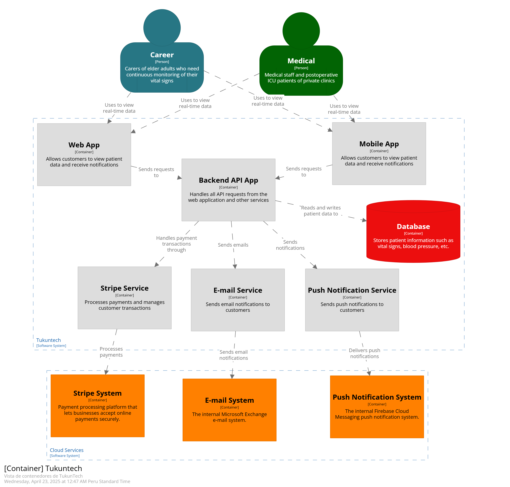

# Aplicaciones para Dispositivos Móviles 

# TUKUNTECH

## Universidad Peruana de Ciencias Aplicadas

**Carrera:** Ingeniería de Software

### Integrantes:
- **Bravo Gavilano, Jorge Rafael** U202212535
- **Nicolich Alvis, Fabio Maurizio** U202218791
- **Maraza Pedemonte, Erick** U202213372
- **Palomares Chávez, Adriana Giovanna** U20221f23
- **Soto Zorrilla, Oscar Eduardo** U201811767

**Fecha:** 2025-10

---

## CARÁTULA

### Registro de Versiones del Informe
### Responsabilidades por Autor - TB1

| Versión | Fecha       | Autor                             | Descripción de modificación             |
|---------|-------------|------------------------------------|------------------------------------------|
| TB1     | 11/04/2025  | Soto Zorrilla, Oscar Eduardo       | EventStorming                            |
| TB1     | 12/04/2025  | Soto Zorrilla, Oscar Eduardo       | Candidate Context Discovery              |
| TB1     | 13/04/2025  | Soto Zorrilla, Oscar Eduardo       | Domain Message Flows Modeling            |
| TB1     | 14/04/2025  | Soto Zorrilla, Oscar Eduardo       | Bounded Context Canvases                 |
| TB1     | 15/04/2025  | Soto Zorrilla, Oscar Eduardo       | Context Mapping                          |
| TB1     | 16/04/2025  | Nicolich Alvis, Fabio Maurizio     | Software Architecture                    |
| TB1     | 17/04/2025  | Nicolich Alvis, Fabio Maurizio     | Context Level Diagrams                   |
| TB1     | 18/04/2025  | Nicolich Alvis, Fabio Maurizio     | Container Level Diagrams                 |
| TB1     | 19/04/2025  | Nicolich Alvis, Fabio Maurizio     | Deployment Diagrams                      |
| TB1     | 20/04/2025  | Palomares Chavez, Adriana Giovanna | Domain Layer                             |
| TB1     | 21/04/2025  | Palomares Chavez, Adriana Giovanna | Interface Layer                          |
| TB1     | 22/04/2025  | Maraza Pedemonte, Erick            | Application Layer                        |
| TB1     | 23/04/2025  | Maraza Pedemonte, Erick            | Infrastructure Layer                     |
| TB1     | 24/04/2025  | Bravo Gavilano, Jorge Rafael       | Component Level Diagrams                 |
| TB1     | 11/04/2025  | Bravo Gavilano, Jorge Rafael       | Code Level Diagrams                      |
| TB1     | 12/04/2025  | Bravo Gavilano, Jorge Rafael       | Domain Layer Class Diagrams              |
| TB1     | 13/04/2025  | Bravo Gavilano, Jorge Rafael       | Database Design Diagram                  |


## Student Outcome

### Criterio específico
**Actualiza conceptos y conocimientos necesarios para su desarrollo profesional y en especial para su proyecto en soluciones de ingeniería de software**
| Acción Realizada | Participantes                        | Descripción | Conclusiones |
|------------------|--------------------------------------|-------------|--------------|
| TB1              | **Soto Zorrilla, Oscar Eduardo**     | **Modelado estratégico:**<br>Aplicó EventStorming, Candidate Context Discovery y mapeo de contextos con DDD. | La experiencia permitió a todos los participantes integrar conceptos clave de ingeniería de software, fortaleciendo sus competencias técnicas en modelado, diseño y arquitectura. El enfoque Domain-Driven Design, combinado con herramientas profesionales y prácticas colaborativas, promovió un aprendizaje aplicado y alineado con estándares actuales de la industria. Esto no solo contribuyó al desarrollo del proyecto TukunTech, sino que también potenció su preparación profesional para enfrentar desafíos reales en el ámbito del desarrollo de software. |
| TB1              | **Nicolich Alvis, Fabio Maurizio**   | **Arquitectura del sistema:**<br>Aplicó C4 Model para diseñar niveles de contexto, contenedores y despliegue del sistema. | La experiencia permitió a todos los participantes integrar conceptos clave de ingeniería de software, fortaleciendo sus competencias técnicas en modelado, diseño y arquitectura. El enfoque Domain-Driven Design, combinado con herramientas profesionales y prácticas colaborativas, promovió un aprendizaje aplicado y alineado con estándares actuales de la industria. Esto no solo contribuyó al desarrollo del proyecto TukunTech, sino que también potenció su preparación profesional para enfrentar desafíos reales en el ámbito del desarrollo de software. |
| TB1              | **Palomares Chávez, Adriana Giovanna** | **Diseño táctico – Dominio e interfaz:**<br>Modeló entidades, agregados y controladores REST con DTOs. | La experiencia permitió a todos los participantes integrar conceptos clave de ingeniería de software, fortaleciendo sus competencias técnicas en modelado, diseño y arquitectura. El enfoque Domain-Driven Design, combinado con herramientas profesionales y prácticas colaborativas, promovió un aprendizaje aplicado y alineado con estándares actuales de la industria. Esto no solo contribuyó al desarrollo del proyecto TukunTech, sino que también potenció su preparación profesional para enfrentar desafíos reales en el ámbito del desarrollo de software. |
| TB1              | **Maraza Pedemonte, Erick**          | **Aplicación e infraestructura:**<br>Desarrolló Command Handlers y Repositories con EF Core. | La experiencia permitió a todos los participantes integrar conceptos clave de ingeniería de software, fortaleciendo sus competencias técnicas en modelado, diseño y arquitectura. El enfoque Domain-Driven Design, combinado con herramientas profesionales y prácticas colaborativas, promovió un aprendizaje aplicado y alineado con estándares actuales de la industria. Esto no solo contribuyó al desarrollo del proyecto TukunTech, sino que también potenció su preparación profesional para enfrentar desafíos reales en el ámbito del desarrollo de software. |
| TB1              | **Bravo Gavilano, Jorge Rafael**     | **Diseño técnico detallado:**<br>Realizó diagramas de componentes, clases y base de datos. | La experiencia permitió a todos los participantes integrar conceptos clave de ingeniería de software, fortaleciendo sus competencias técnicas en modelado, diseño y arquitectura. El enfoque Domain-Driven Design, combinado con herramientas profesionales y prácticas colaborativas, promovió un aprendizaje aplicado y alineado con estándares actuales de la industria. Esto no solo contribuyó al desarrollo del proyecto TukunTech, sino que también potenció su preparación profesional para enfrentar desafíos reales en el ámbito del desarrollo de software. |


### Criterio específico
**Reconoce la necesidad del aprendizaje permanente para el desempeño profesional y el desarrollo de proyectos en soluciones de tecnologías de ingeniería de software**
| Acción Realizada | Participantes                        | Descripción | Conclusiones |
|------------------|--------------------------------------|-------------|--------------|
| TB1              | **Soto Zorrilla, Oscar Eduardo**     | **Modelado estratégico:**<br>Participó en sesiones de EventStorming, identificando contextos clave con enfoque en aprendizaje colaborativo. | El equipo demostró un compromiso constante con el aprendizaje autónomo y colaborativo, investigando activamente marcos metodológicos como Domain-Driven Design, C4 Model y herramientas de arquitectura y modelado. Reconocer la necesidad del aprendizaje continuo permitió afrontar eficazmente los desafíos técnicos del proyecto y fortalecer las competencias necesarias para adaptarse al ritmo de innovación en la ingeniería de software. |
| TB1              | **Nicolich Alvis, Fabio Maurizio**   | **Arquitectura del sistema:**<br>Profundizó en el C4 Model y utilizó nuevas herramientas como Structurizr y Lucidchart para definir la arquitectura de solución. | El equipo demostró un compromiso constante con el aprendizaje autónomo y colaborativo, investigando activamente marcos metodológicos como Domain-Driven Design, C4 Model y herramientas de arquitectura y modelado. Reconocer la necesidad del aprendizaje continuo permitió afrontar eficazmente los desafíos técnicos del proyecto y fortalecer las competencias necesarias para adaptarse al ritmo de innovación en la ingeniería de software. |
| TB1              | **Palomares Chávez, Adriana Giovanna** | **Diseño de dominio e interfaz:**<br>Estudió patrones de diseño de software y aplicó prácticas modernas para la construcción de APIs REST. | El equipo demostró un compromiso constante con el aprendizaje autónomo y colaborativo, investigando activamente marcos metodológicos como Domain-Driven Design, C4 Model y herramientas de arquitectura y modelado. Reconocer la necesidad del aprendizaje continuo permitió afrontar eficazmente los desafíos técnicos del proyecto y fortalecer las competencias necesarias para adaptarse al ritmo de innovación en la ingeniería de software. |
| TB1              | **Maraza Pedemonte, Erick**          | **Aplicación e infraestructura:**<br>Implementó lógica de negocio con Command Handlers, y gestionó persistencia con tecnologías nuevas como EF Core. | El equipo demostró un compromiso constante con el aprendizaje autónomo y colaborativo, investigando activamente marcos metodológicos como Domain-Driven Design, C4 Model y herramientas de arquitectura y modelado. Reconocer la necesidad del aprendizaje continuo permitió afrontar eficazmente los desafíos técnicos del proyecto y fortalecer las competencias necesarias para adaptarse al ritmo de innovación en la ingeniería de software. |
| TB1              | **Bravo Gavilano, Jorge Rafael**     | **Diseño técnico detallado:**<br>Desarrolló diagramas técnicos complejos utilizando herramientas UML y modelado de datos relacionales. | El equipo demostró un compromiso constante con el aprendizaje autónomo y colaborativo, investigando activamente marcos metodológicos como Domain-Driven Design, C4 Model y herramientas de arquitectura y modelado. Reconocer la necesidad del aprendizaje continuo permitió afrontar eficazmente los desafíos técnicos del proyecto y fortalecer las competencias necesarias para adaptarse al ritmo de innovación en la ingeniería de software. |


# Capítulo I: Introducción
## 1.1. Startup Profile.
### 1.1.1. Descripción de la Startup. 
Actualmente, el monitoreo de signos vitales en adultos mayores, pacientes postoperatorios y en cuidados intensivos se realiza con dispositivos tradicionales que requieren intervención manual y ofrecen sistemas fragmentados, limitando la eficiencia y la capacidad de respuesta en tiempo real.
Nuestra startup aborda este desafío con una plataforma IoT innovadora que integra dispositivos inteligentes para medir continuamente la frecuencia cardíaca, la presión arterial y la oxigenación en sangre. Los datos se transmiten en tiempo real a una plataforma centralizada, donde algoritmos avanzados detectan anomalías y alertan al personal médico de inmediato. Además, la plataforma permite a los doctores hacer evaluaciones médicas en tiempo real y ajustar tratamientos de manera instantánea.
Nos enfocamos en cuidados intensivos, postoperatorios y en el monitoreo de adultos mayores que desean modernizar su seguimiento médico. Nuestra solución mejora la eficiencia, precisión y calidad de la atención, reduciendo tiempos de respuesta y optimizando la gestión del cuidado.

### 1.1.2. Perfiles de Integrantes del Equipo.
#### Nicolich Alvis, Fabio Maurizio
Soy estudiante de Ingeniería de Software, cursando actualmente el quinto ciclo de la carrera. Me destaco por ser responsable, proactivo y poseer sólidas habilidades de liderazgo. Estoy comprometido con el trabajo en equipo, fomentando una comunicación efectiva y colaborativa para alcanzar resultados sobresalientes. Mi enfoque está en garantizar la calidad y el éxito de los proyectos, aportando creatividad, esfuerzo y dedicación en cada etapa del desarrollo. Cuento con conocimientos en lenguajes como C++, HTML, CSS, JavaScript y Python, y estoy enfocado en aprender a crear proyectos utilizando frameworks como Angular y Vue.


#### Soto Zorrilla, Oscar Eduardo
Soy estudiante de Ingeniería de Software con un enfoque proactivo en la resolución de problemas. Me caracterizo por mi adaptabilidad a diversas situaciones y por superar desafíos. Además, tengo conocimientos en C++, HTML, CSS, JavaScript y Python, lo que me permite trabajar en diversos proyectos tecnológicos.


#### Maraza Pedemonte, Erick
Soy estudiante de Ingeniería de Software con habilidades en programación en lenguajes como C++ y Python. Mi enfoque dedicado a los proyectos que me apasionan me impulsa a explorar nuevas fronteras en mi carrera. Estas habilidades me permiten desarrollar una amplia gama de aplicaciones y soluciones, y estoy comprometido a seguir aprendiendo y aplicando estas habilidades para resolver desafíos creativos en el mundo del desarrollo de software.


#### Palomares Chavez, Adriana Giovanna
Soy Adriana Palomares, tengo 21 años y actualmente estudio Ingeniería de Software en UPC en el 5to ciclo. Me gusta explorar nuevas tecnologías, especialmente lenguajes de programación. También me apasionan los animales, particularmente los perros. Me comprometo al trabajo en equipo y la responsabilidad que conlleva este.


#### Bravo Gavilano, Jorge Rafael
Estoy actualmente en el quinto ciclo de mi carrera en Ingeniería de Software. Disfruto de jugar videojuegos e ir al gimnasio en mi tiempo libre. Me considero una persona responsable y enfocada en siempre realizar un buen trabajo. Estoy interesado en aprender sobre inteligencia artificial y programación web.


## 1.2. Solution Profile.
**Product Name** Se decidió llamar a nuestro producto “TukunTech”, inspirado en el sonido “tukun” que imita el latido del corazón, el pulso rítmico que simboliza la vida y la salud. Este sonido, asociado con el latido cardíaco, refleja el enfoque principal de nuestra aplicación: el monitoreo de signos vitales. Así como el “tukun” del corazón es esencial para la vida, nuestra aplicación es fundamental para la vigilancia y cuidado continuo de los pacientes.
El sufijo “Tech” subraya la innovación tecnológica que nuestra empresa aporta al sector salud. TukunTech combina la esencia de la vida, representada por el latido del corazón, con soluciones tecnológicas avanzadas, creando una herramienta integral para hospitales y clínicas.
Elegimos este nombre porque captura la esencia de lo que hacemos: utilizar la tecnología para monitorear y cuidar la vida, uniendo ciencia y humanidad en una plataforma que mejora la atención médica.

**Product Description** TukunTech es una innovadora plataforma de monitoreo de signos vitales diseñada para mejorar la atención médica en adultos mayores, pacientes postoperatorios y pacientes en cuidados intensivos. A diferencia de los sistemas tradicionales, TukunTech aprovecha la tecnología IoT para ofrecer un monitoreo integrado de todos los dispositivos de forma continua y en tiempo real de signos vitales críticos. A través de una red de dispositivos inteligentes que van a estar integrados entre sí con el fin de lograr que los datos se transmitan a una plataforma centralizada, donde se analizan mediante algoritmos avanzados para detectar anomalías y alertar al personal médico de manera inmediata. Además nuestra solución también permite a los doctores realizar evaluaciones médicas básicas en tiempo real, accediendo a datos actualizados de los pacientes para proporcionar recomendaciones y ajustes instantáneos. Con TukunTech, las clínicas pueden integrar de manera fluida nuestros servicios en sus sistemas existentes, mejorando la eficiencia en la gestión del cuidado de los pacientes y aumentando la precisión en la toma de decisiones. Nos enfocamos inicialmente en cuidados intensivos, postoperatorios y el monitoreo de adultos mayores, donde la necesidad de una atención más proactiva y personalizada es crítica.

**Monetización** Inicialmente, ofreceremos una versión Beta de nuestro producto para que los usuarios potenciales puedan interactuar con el sistema y familiarizarse con las herramientas que ofrecemos. Esto les permitirá experimentar de primera mano las funcionalidades del software y cómo puede mejorar la gestión de la salud.
Posteriormente, implementaremos tres tipos de suscripciones adaptadas a diferentes necesidades:

Plan Organización: Diseñado específicamente para clínicas. Este plan ofrece acceso completo a todas las funcionalidades avanzadas del sistema, incluyendo monitoreo en tiempo real, análisis detallado de datos, alertas personalizadas y soporte técnico especializado. Es ideal para entornos médicos que requieren una supervisión continua y precisa de múltiples pacientes. Válido durante un año. 

Plan Individual: Enfocado en usuarios individuales que necesitan monitorear la salud de un adulto mayor en el entorno familiar. Este plan proporciona herramientas esenciales de monitoreo, permitiendo a las familias estar informadas sobre los signos vitales de sus seres queridos de manera sencilla y accesible. Válido durante un mes. Permite un maximo de 4 visitas medicas

Plan Duo: Enfocado en dos usuarios que necesitan de un monitoreo constante de su salud. Este plan proporciona herramientas esenciales de monitoreo, permitiendo a las familias estar informadas sobre los signos vitales de sus seres queridos de manera sencilla y accesible. álido durante un mes. Asi mismo, permite un maximo de 10 visitas medicas al mes. 

Los planes tendrán diferentes estructuras de costos y se ofrecerán en un modelo de suscripción mensual o anual, adaptado a las necesidades de cada tipo de usuario.

### 1.2.1. Antecedentes y problemática.
**Descripción de la problemática**

El problema identificado radica en la falta de una solución integrada y continua para el monitoreo de signos vitales en pacientes, especialmente en adultos mayores, pacientes postoperatorios y en cuidados intensivos. Los sistemas actuales dependen de dispositivos tradicionales que requieren intervención manual, lo que genera ineficiencias y una capacidad de respuesta limitada ante situaciones críticas. Además, estos sistemas no están integrados entre sí, lo que dificulta la supervisión centralizada y el análisis en tiempo real, afectando la calidad de la atención médica.

**Objetivos**

- Desarrollar una plataforma basada en IoT que permita el monitoreo continuo y en tiempo real de los signos vitales de los pacientes.
- Mejorar la capacidad de respuesta del personal médico ante situaciones críticas, reduciendo el tiempo de reacción.
- Integrar dispositivos inteligentes en una plataforma centralizada que permita la supervisión y análisis de datos de manera eficiente.
- Aumentar la calidad del cuidado médico mediante la reducción de la supervisión manual y la automatización de procesos.

**Restricciones**

- Dependencia de la infraestructura tecnológica existente en las clínicas y hospitales para asegurar una integración fluida.
- Conectividad de red: la plataforma depende de una conexión de red estable para la transmisión continua y en tiempo real de los signos vitales. Las áreas con conectividad limitada podrían afectar la funcionalidad del sistema.

**Antecedentes**

- **Vital Connect**  
  VitalConnect ofrece dispositivos portátiles que monitorean continuamente los signos vitales de los pacientes y transmiten los datos en tiempo real a los profesionales de la salud. Sin embargo, TuKunTech se diferencia al ofrecer una solución integral que no solo incluye dispositivos de monitoreo, sino también una plataforma de telemedicina y seguimiento clínico tanto en hospitales como en hogares. Además, proporcionamos personalización avanzada para adaptar el monitoreo a las necesidades específicas de cada paciente y clínica, garantizando una atención más completa y flexible.

- **Tytocare**  
  Tytocare es una plataforma de telemedicina que permite realizar exámenes físicos remotos a través de dispositivos conectados, brindando a los pacientes la posibilidad de recibir diagnósticos desde sus hogares. TuKunTech va más allá al ofrecer no solo telemedicina, sino un ecosistema completo que integra monitoreo inteligente, atención en clínicas y monitoreo domiciliario, permitiendo a las clínicas escalar el sistema para gestionar eficientemente un gran volumen de pacientes y mejorar la calidad del servicio.

- **Philips Healthcare**  
  Philips Healthcare ofrece soluciones avanzadas de monitoreo remoto y dispositivos médicos para hospitales y clínicas de todo el mundo. TuKunTech se diferencia al estar diseñado específicamente para adaptarse a las necesidades locales del mercado peruano, ofreciendo una solución más flexible y personalizada. Además, TuKunTech es una opción más costo-eficiente, permitiendo a clínicas de diferentes tamaños adoptar tecnología avanzada sin los altos costos asociados a las soluciones globales de Philips.

**Herramienta de 5W y 2H**

- **What - ¿Cuál es el problema?**  
  El problema identificado es la falta de una solución integrada para el monitoreo continuo y en tiempo real de signos vitales en pacientes críticos, lo que genera ineficiencias y tiempos de respuesta prolongados en la atención médica.

- **When - ¿Cuánto sucede el problema?**  
  El problema ocurre durante el monitoreo de pacientes que requieren atención médica constante, como adultos mayores, pacientes postoperatorios o en cuidados intensivos, donde la capacidad de respuesta rápida es crucial.

- **Where - ¿Dónde surge el problema?**  
  El problema surge en clínicas, y hogares donde se utilizan sistemas de monitoreo tradicionales que no están integrados ni automatizados, afectando la capacidad de monitoreo en tiempo real.

- **Who - ¿Quiénes son afectados por el problema?**  
  Los principales afectados son los pacientes en situaciones críticas que necesitan monitoreo constante, el personal médico que debe realizar supervisión manual, y las clínicas que enfrentan ineficiencias en la gestión de cuidados.

- **Why - ¿Cuál es la causa del problema?**  
  La causa principal del problema es la falta de integración de tecnologías avanzadas, como IoT, en los sistemas de monitoreo existentes, lo que impide la supervisión automatizada y el análisis de datos en tiempo real.

- **How - ¿Cómo se manifiesta el problema?**  
  El problema se manifiesta en la dependencia de la intervención manual del personal médico, lo que reduce la eficiencia y la capacidad de reacción ante emergencias médicas, además de limitar la toma de decisiones informadas basadas en datos en tiempo real.

- **How much - ¿Cuál es la magnitud del problema?**  
  La magnitud del problema se refleja en los costos operativos elevados, la carga de trabajo innecesaria para el personal médico y los riesgos elevados para los pacientes debido a la falta de monitoreo continuo y alerta temprana de situaciones críticas.

### 1.2.2. Lean UX Process.
#### 1.2.2.1. Lean UX Problem Statements.
El estado actual en el monitoreo de signos vitales en adultos mayores, pacientes postoperatorios o pacientes en cuidados intensivos se ha centrado principalmente en la utilización de dispositivos tradicionales que requieren la intervención manual del personal médico para la recolección y análisis de datos. Estos sistemas suelen ser fragmentados y no ofrecen una integración fluida entre los diferentes equipos de monitoreo, lo cual limita la eficiencia y la capacidad de respuesta en tiempo real.

Lo que los productos y servicios existentes no logran abordar es la falta de una solución integrada entre los dispositivos que aproveche la tecnología IoT para ofrecer un monitoreo continuo y en tiempo real de los signos vitales de los pacientes. Los sistemas actuales a menudo son estáticos y no permiten una supervisión centralizada ni la capacidad de analizar datos en tiempo real de manera efectiva.

Nuestro producto abordará esta brecha mediante el desarrollo de una plataforma de monitoreo de signos vitales basada en IoT. Este sistema integrará una red de dispositivos inteligentes capaces de medir continuamente signos vitales como la frecuencia cardíaca, la presión arterial y la oxigenación en sangre. Los datos se transmitirán en tiempo real a una plataforma centralizada, donde serán procesados y analizados utilizando algoritmos avanzados para detectar anomalías y alertar al personal médico de manera inmediata. Además de los servicios de monitoreo, nuestra solución permitirá a los doctores realizar evaluaciones médicas básicas en tiempo real, accediendo a los datos actualizados de los pacientes para proporcionar recomendaciones y ajustes instantáneos. Esta integración fluida con los sistemas existentes en las clínicas mejorará tanto la eficiencia en la gestión del cuidado de los pacientes como la precisión en la toma de decisiones, permitiendo una atención médica más proactiva y personalizada.

Inicialmente, centraremos nuestra atención en los cuidados intensivos y post-operatorios, así como en el monitoreo en tiempo real de adultos mayores que desean modernizar sus infraestructuras de seguimiento y optimizar la calidad de la atención al paciente. Estas clínicas son el entorno ideal para implementar nuestra solución, dada la necesidad de mejorar el manejo de pacientes con condiciones crónicas y la eficiencia en la supervisión diaria.

Sabremos que hemos tenido éxito cuando observemos una reducción significativa en el tiempo de respuesta ante cambios críticos en los signos vitales, un aumento en la satisfacción del personal médico por la facilidad de uso del sistema y una mejora general en la calidad del cuidado proporcionado a los pacientes, medido a través de métricas de rendimiento y feedback de los usuarios.
#### 1.2.2.2. Lean UX Assumptions
En esta sección se presentan las suposiciones relacionadas con los resultados esperados del sistema de monitoreo continuo de signos vitales basado en IoT. Se dividen en tres categorías: **Business Outcomes**, que abordan los impactos comerciales y la eficiencia operativa; **User Outcomes**, que se centran en cómo los usuarios, como médicos y cuidadores, se beneficiarán del sistema; y **User Outcomes Assumptions**, que analizan las necesidades y comportamientos de los usuarios que sustentan las suposiciones anteriores. Cada categoría busca asegurar que el sistema satisfaga tanto las expectativas comerciales como las de los usuarios.
## Business Outcomes

1. Creemos que al implementar el sistema de monitoreo continuo de signos vitales basado en IoT, podremos reducir el tiempo de respuesta ante emergencias médicas en un 40%.
2. Creemos que al ofrecer alertas automáticas a los médicos, aumentaremos la eficiencia operativa en las clínicas privadas en un 20%.
3. Creemos que al integrar nuestra plataforma con los sistemas existentes de las clínicas, incrementaremos la retención de clientes en un 15%.
4. Creemos que al ofrecer un sistema de informes automáticos sobre el estado de salud de los pacientes, podremos mejorar la calidad del cuidado brindado en un 25%.
5. Creemos que al integrar funcionalidades de análisis predictivo en la plataforma, podremos reducir el número de emergencias inesperadas en un 10%.

## Business Outcomes Assumptions

1. Creemos que la falta de monitoreo continuo de signos vitales en pacientes críticos es un problema que afecta la calidad de atención en las clínicas privadas.
2. Creemos que las clínicas estarán dispuestas a pagar una suscripción mensual para utilizar un sistema de monitoreo continuo que permita mejorar la atención médica y reducir los costos operativos.
3. Creemos que al implementar una solución que integre monitoreo en tiempo real con dispositivos IoT, las clínicas podrán ofrecer un servicio más personalizado y eficiente para sus pacientes postoperatorios en UCI.
4. Creemos que las clínicas valoran la automatización en la generación de informes, ya que permite optimizar el tiempo y esfuerzo del personal médico.
5. Creemos que las clínicas están interesadas en soluciones que ofrezcan análisis predictivos de salud para mejorar la prevención y la atención temprana de complicaciones.

## User Outcomes

1. Creemos que al ofrecer un sistema que permita monitorear signos vitales en tiempo real, los médicos podrán tomar decisiones más rápidas y precisas en situaciones críticas.
2. Creemos que al proporcionar una plataforma fácil de usar, los cuidadores de adultos mayores podrán monitorear la salud de sus pacientes de manera eficiente, reduciendo el riesgo de emergencias no atendidas.
3. Creemos que al permitir acceso remoto a los signos vitales de los pacientes, los médicos podrán realizar evaluaciones a distancia, mejorando la atención sin la necesidad de estar físicamente presentes.
4. Creemos que al ofrecer reportes y análisis de tendencias de salud, los médicos podrán identificar patrones y prever complicaciones en los pacientes, mejorando así la prevención.
5. Creemos que al incluir una funcionalidad de comunicación entre médicos y cuidadores, se fomentará una colaboración más efectiva en el manejo de la salud de los pacientes.

## User Outcomes Assumptions

1. Creemos que los médicos necesitan un acceso inmediato y constante a los datos de signos vitales para mejorar la toma de decisiones clínicas.
2. Creemos que los cuidadores de adultos mayores quieren un sistema simple que les permita recibir alertas automáticas sobre cambios en los signos vitales sin tener que supervisar constantemente.
3. Creemos que los médicos se sienten frustrados con los sistemas actuales de monitoreo manual, que son ineficientes y limitan su capacidad para reaccionar rápidamente ante emergencias.
4. Creemos que los médicos desean herramientas que les permitan optimizar su tiempo, ya que el aumento de la carga de trabajo limita su capacidad para brindar atención individualizada.
5. Creemos que los cuidadores de adultos mayores necesitan un sistema confiable que les brinde tranquilidad, sabiendo que recibirán alertas oportunas sobre el estado de salud de sus pacientes.

### Features Assumptions

1. Creemos que agregar un dashboard centralizado que muestre los signos vitales en tiempo real permitirá a los médicos monitorear el estado de múltiples pacientes a la vez, mejorando la eficiencia en la atención.
2. Creemos que implementar alertas automáticas basadas en umbrales de signos vitales permitirá a los cuidadores de adultos mayores reaccionar rápidamente ante cambios críticos en los pacientes, sin tener que revisar continuamente el sistema.
3. Creemos que la función de acceso remoto a los datos de pacientes permitirá a los médicos realizar evaluaciones a distancia, lo que reducirá la necesidad de visitas físicas y optimizará el tiempo del personal médico.
4. Creemos que agregar un historial clínico digital permitirá a los médicos acceder fácilmente a información previa del paciente, mejorando la precisión en la toma de decisiones médicas y facilitando el seguimiento continuo.
5. Creemos que la integración de una interfaz intuitiva y simple permitirá a los cuidadores no técnicos utilizar el sistema de monitoreo sin necesidad de entrenamiento avanzado, reduciendo las barreras de adopción tecnológica.


#### 1.2.2.3. Lean UX Hypothesis Statements.
En esta sección, se busca validar el impacto de nuestro sistema de monitoreo de signos vitales basado en IoT en clínicas privadas. Las hipótesis exploran cómo la plataforma puede mejorar la respuesta ante emergencias, aumentar la eficiencia operativa, reducir costos y generar confianza tanto en el personal médico como en los pacientes. Además, evaluamos cómo el modelo de negocio, basado en suscripciones y la integración de hardware, puede generar ingresos recurrentes y fomentar relaciones a largo plazo con clínicas y proveedores de equipos médicos.

*Hypothesis Statement #1*

**Creemos que** lograremos mejorar la rapidez con la que el personal médico puede reaccionar ante emergencias detectadas por el sistema

**Si** los hospitales y clínicas

**Obtienen** acceso inmediato a datos actualizados y alertas en tiempo real

**Con** una plataforma integrada de monitoreo de signos vitales basada en IoT.


*Hypothesis Statement #2*

**Creemos que** reduciremos el riesgo de emergencias no atendidas en adultos mayores

**Si** los cuidadores y familiares

**Obtienen** una plataforma fácil de usar para monitorear signos vitales de manera eficiente

**Con** una interfaz intuitiva y notificaciones automatizadas de alerta.

*Hypothesis Statement #3*

**Creemos que** mejoraremos la capacidad de los médicos para evaluar a los pacientes a distancia

**Si** los profesionales de la salud

**Obtienen** acceso remoto a los signos vitales de sus pacientes en tiempo real

**Con** una solución conectada que permite monitoreo remoto continuo.


*Hypothesis Statement #4*

**Creemos que** aumentaremos la capacidad de prevención de complicaciones en los pacientes

**Si** los médicos

**Obtienen** reportes automáticos y análisis de tendencias de los signos vitales

**Con** un sistema que recopila y presenta datos longitudinales de salud.


*Hypothesis Statement #5*

**Creemos que** lograremos una colaboración más efectiva en el manejo de la salud de los pacientes

**Si** los médicos y cuidadores

**Obtienen** una herramienta de comunicación integrada dentro del sistema

**Con** un canal directo de intercambio de información y alertas sobre los pacientes.


#### 1.2.2.4. Lean UX Canvas.
A continuación se presenta el Lean UX Canvas, una herramienta basada en los principios de Lean UX que nos permite comprender los problemas del usuario, la definición de supuestos, la formulación de hipótesis y la planificación de experimentos para validar o refutar estas hipótesis rápidamente. La principal ventaja es la reducción de riesgos en el desarrollo de nuestro producto, ya que permite iterar de manera rápida y efectiva basándonos en la retroalimentación de los usuarios.
 
[https://miro.com/welcomeonboard/aklDcDhiZEk1dUNITHIyOGlXTFVWbVQxYlhTem43QlhNQk4wMXNnNmgyRWNlQmc4NmQzN0NyRUZKMXRpN2ZXWnwzMDc0NDU3MzY2NzgwNzg1NjA4fDI=?share_link_id=261999757744](https://miro.com/welcomeonboard/aklDcDhiZEk1dUNITHIyOGlXTFVWbVQxYlhTem43QlhNQk4wMXNnNmgyRWNlQmc4NmQzN0NyRUZKMXRpN2ZXWnwzMDc0NDU3MzY2NzgwNzg1NjA4fDI=?share_link_id=261999757744)

## 1.3. Segmentos objetivo.
De acuerdo a Vásquez (2010), “los médicos dependen cada vez más de los equipos electromédicos para lograr un diagnóstico certero y eficaz. Los equipos electromédicos son una herramienta fundamental para obtener diagnósticos y así brindar tratamientos adecuados a los pacientes”. Esto evidencia la posibilidad de poder integrar nuestro producto con las tecnologías existentes, de modo que se mejore la experiencia de usuario y el servicio ofrecido. 
Así mismo, los pacientes en las Unidades de Cuidados Intensivos (UCI) dependen de dispositivos médicos, como monitores de signos vitales, desfibriladores y sistemas de monitoreo centralizado, para su diagnóstico y tratamiento. Se ha discutido la complejidad de estos equipos en las UCIs y la crucial importancia de conectar a los pacientes a ellos (Vásquez, 2010).
Por otro lado, en los estudios realizados por Ruiz (2016), afirma lo siguiente:

Los pacientes adultos mayores debido a su avanzada edad se le dificulta la realización de visitas periódicas a los centros especializados de salud … por eso surge la necesidad de mantener un correcto monitoreo de los principales signos vitales, esto permitirá mantener controlado al paciente, así evitando futuras complicaciones … además de contar con estadísticas de sus diferentes valores (p. 21).

Por todo lo mencionado, se establecen los dos segmentos objetivos que serán abordados a lo largo del proyecto:
**Segmento 1:** Cuidadores de adultos mayores que necesitan un monitoreo continuo de sus signos vitales

**Segmento 2:** Personal de salud que atienden pacientes postoperatorios o en cuidados intensivos (UCI) en clínicas privadas

# Capítulo II: Requirements Elicitation & Analysis
## 2.1. Competidores.
### 2.1.1. Análisis competitivo.
En esta sección podemos identificar el FODA, es decir, las fortalezas, oportunidades, debilidades y amenazas de nuestros competidores en el campo del monitoreo de signos vitales en adultos mayores, pacientes postoperatorios, y pacientes en cuidados intensivos. Asimismo, se evalúa su participación en el mercado y se identifican las estrategias que podemos desarrollar para que nuestra plataforma basada en IoT se destaque y obtenga una posición fuerte en el sector.


### 2.1.2. Estrategias y tácticas frente a competidores.
Basándonos en las necesidades de la empresa, buscamos estrategias concretas para su adecuado desarrollo y el de sus clientes, promoviendo de esta manera una matriz FODA para realizar un análisis interno y externo efectivo.


## 2.2. Entrevistas.
### 2.2.1. Diseño de entrevistas.
En esta parte, presentamos las preguntas que hemos diseñado para llevar a cabo las entrevistas con los dos grupos de usuarios a los que nos dirigimos. Es importante mencionar que las preguntas son de formato abierto, lo que nos permitirá recopilar información valiosa para comprender mejor cómo abordar los desafíos que enfrentan nuestros usuarios objetivo.

**Listado de preguntas Segmento Objetivo 1 – Cuidadores de adultos mayores que necesitan un monitoreo continuo de sus signos vitales**

_**Información Personal:**_

- ¿Cuál es su nombre?
- ¿Cuál es su edad?
- ¿Cuál es su estado civil?
- ¿En qué ciudad resides?
- ¿Cuál es su ocupación profesional? ¿se encuentra laborando en la actualidad?

_**Personalidad, aspecto emocional y habilidades del usuario:**_

- Define alguna frase o refrán que represente rasgos de su personalidad.
- Describe algunas cualidades, fortalezas y/o debilidades que considera representativas de su personalidad.
- ¿Qué canales digitales de información o entretenimiento suele visualizar?
- ¿Te consideras una persona que disfruta compartir y expresar sus pensamientos con los demás? ¿Cómo valoras la comunicación en tus relaciones personales?
- ¿Qué emociones experimentas cuando no logras encontrar un servicio que te ayude a mantener tu salud bajo control? ¿Sueles buscar otras opciones?
- ¿Te sientes cómodo usando aplicaciones móviles, software o redes sociales en tu vida cotidiana? ¿Te ha resultado complicado aprender a utilizar estas herramientas?
- ¿Qué sistema operativo utiliza su celular? ¿IOS o Android?
- ¿Qué sistema operativo de computadora utiliza? ¿Mac, Windows o Linux?
- ¿Qué navegador web usa con más frecuencia? ¿Chrome o Edge?
- ¿Consideras que es esencial que los servicios de salud se adapten a las tecnologías digitales? ¿Qué beneficios crees que esto trae para ti?

_**Evaluación del problema:**_

- Desde tu experiencia en equipos de salud o atención, ¿cuáles crees que son los principales desafíos en cuanto a organización y eficiencia en el cuidado de la salud que se enfrenta con frecuencia?
- ¿Qué prácticas o herramientas piensas que podrían ayudar a mejorar la coordinación y atención en el cuidado de la salud, ya sea en un entorno presencial o mediante tecnología?
- ¿Cómo ha cambiado la dinámica de la atención médica brindada debido a la pandemia del COVID-19, en términos de calidad y eficiencia?
- ¿Has tenido que posponer o modificar tratamientos o visitas debido a la pandemia? ¿Cuáles han sido los principales desafíos que has enfrentado?
- ¿Consideras que una herramienta digital para monitorear los signos vitales mejoraría la calidad de servicio que brindas? ¿Por qué?
- ¿Te interesaría utilizar una aplicación web que te ayude a gestionar mejor la salud de la persona que tenga a cargo? ¿Por qué crees que sería útil?
- ¿Confías en que el uso de una herramienta digital sería de uso amigable y sencillo de entender para aplicarlo en el servicio brindado? ¿Crees que verías beneficios en la calidad de tu atención en poco tiempo?

**Listado de preguntas Segmento Objetivo 2 – Personal de salud que atienden pacientes postoperatorios o en cuidados intensivos (UCI) en clínicas privadas** 
_**Información Personal:**_

- ¿Cuál es su nombre?
- ¿Cuál es su edad?
- ¿Cuál es su estado civil?
- ¿En qué ciudad resides?
- ¿Cuál es su ocupación profesional? ¿se encuentra laborando en la actualidad?

_**Personalidad, aspecto emocional y habilidades del usuario:**_

- ¿Hay algún lema o principio que sientas que refleja tu enfoque profesional en la atención médica?
- ¿Podrías describir algunas de las cualidades, fortalezas o áreas de mejora que consideras fundamentales en tu práctica médica?
- ¿Qué canales digitales de información o entretenimiento suele visualizar?
- ¿Te consideras alguien que valora la colaboración y la comunicación abierta con tus colegas? ¿Cómo influyen estas habilidades en tu trabajo diario?
- ¿Cómo te afecta escuchar que un servicio de salud no está bien organizado? ¿Qué impacto crees que tiene esto en la calidad del cuidado que proporcionas?
- ¿Qué sientes cuando no puedes encontrar un sistema o tecnología que mejore la atención que ofrece a tus pacientes? ¿Sueles explorar alternativas hasta encontrar una solución adecuada?
- ¿Te sientes cómodo utilizando aplicaciones y software para mejorar la gestión de la salud de tus pacientes? ¿Has encontrado desafíos en aprender a usar nuevas herramientas tecnológicas en tu práctica?
- ¿Qué sistema operativo utiliza su celular? ¿IOS o Android?
- ¿Qué sistema operativo de computadora utiliza? ¿Mac, Windows o Linux?
- ¿Qué navegador web usa con más frecuencia? ¿Google Chrome o Microsoft Edge?
- ¿Piensas que la adopción de tecnologías digitales es crucial para mejorar la atención médica? ¿Qué ventajas ves para ti y tus pacientes al integrar estas tecnologías?

_**Evaluación del problema:**_

- Desde tu experiencia en equipos de atención médica, ¿cuáles consideras que son los principales desafíos en la organización y eficiencia del cuidado de los pacientes que enfrentas con frecuencia?
- ¿Qué herramientas o prácticas crees que podrían optimizar la coordinación y atención de los pacientes, ya sea en un entorno clínico presencial o a través de soluciones tecnológicas?
- ¿De qué manera la pandemia del COVID-19 ha afectado la dinámica y eficiencia en la atención que brindas a tus pacientes?
- ¿Has tenido que ajustar o posponer tratamientos debido a la pandemia? ¿Cuáles han sido los mayores retos que has enfrentado en estos casos?
- ¿Consideras que una herramienta digital que facilite la monitorización de signos vitales podría mejorar la calidad de la atención que ofreces? ¿Por qué?
- ¿Te interesaría utilizar una aplicación web para mejorar la gestión de la atención a tus pacientes y la comunicación dentro de tu equipo médico? ¿Qué ventajas crees que podría ofrecer?
- ¿Confías en que el personal médico adoptaría eficazmente una aplicación web para mejorar la comunicación y el monitoreo de los pacientes? ¿Crees que se verían mejoras en la calidad del cuidado en un corto plazo?

### 2.2.2. Registro de entrevistas
Entrevistado 1 #: Segmento 1
Nombre y Apellidos: Miriam Zorilla
Edad: 50
Evidencias de reunión:


URL:
[https://www.canva.com/design/DAGQBsbxBN0/R_YFYeckkGyQdmnA7XVk0Q/edit?utm_content=DAGQBsbxBN0&utm_campaign=designshare&utm_medium=link2&utm_source=sharebutton](https://www.canva.com/design/DAGQBsbxBN0/R_YFYeckkGyQdmnA7XVk0Q/edit?utm_content=DAGQBsbxBN0&utm_campaign=designshare&utm_medium=link2&utm_source=sharebutton)
Inicio de entrevista: 00:00
Tiempo: 13:10 min
Resumen de Entrevista:
La entrevistada comenta que el personal de salud, especialmente quienes están en contacto directo con los pacientes, experimenta una gran frustración debido a la falta de herramientas tecnológicas adecuadas que les permitan mejorar la calidad del servicio. Señala que, a medida que la tecnología avanza a un ritmo acelerado, el sector salud parece rezagado en la implementación de soluciones que realmente apoyen al personal médico en su labor diaria. Esto se vuelve particularmente evidente en el caso del cuidado de adultos mayores, donde las necesidades son más urgentes debido a la dependencia constante de los cuidadores.

La entrevistada enfatiza que, aunque se utilizan equipos médicos para monitorear signos vitales, estos dispositivos suelen realizar análisis de manera momentánea en lugar de ofrecer una supervisión continua las 24 horas del día. Este enfoque intermitente impide un monitoreo eficaz y proactivo, lo que podría mejorar la respuesta ante situaciones críticas. Según ella, una tecnología que permitiera un control constante y en tiempo real de parámetros clave, como la frecuencia cardíaca, la saturación de oxígeno y otros signos vitales, sería esencial para optimizar el trato a los pacientes, especialmente aquellos en situación de mayor vulnerabilidad, como los adultos mayores.

Este tipo de herramientas no solo facilitaría el trabajo del personal médico, sino que también podría reducir la carga emocional y la ansiedad que experimentan al no disponer de la información necesaria en tiempo real para tomar decisiones rápidas y efectivas.

Entrevistado #2: Segmento 2
Nombre y Apellidos: Oscar Soto
Edad: 56
Segmento: Personal médico
Evidencias de reunión:


URL:
[https://www.canva.com/design/DAGQCZuG4go/-yk4rxl6NNQv74Ng4TJj0g/edit?utm_content=DAGQCZuG4go&utm_campaign=designshare&utm_medium=link2&utm_source=sharebutton](https://www.canva.com/design/DAGQCZuG4go/-yk4rxl6NNQv74Ng4TJj0g/edit?utm_content=DAGQCZuG4go&utm_campaign=designshare&utm_medium=link2&utm_source=sharebutton)
Inicio de entrevista: 13:10
Tiempo: 13:53 min
Resumen de Entrevista:
El entrevistado, un médico encargado del control y seguimiento de pacientes, destaca la importancia de una organización eficaz en los servicios médicos, señalando que sin ella no es posible mejorar la calidad de la atención al paciente. Mencionó sentirse cómodo utilizando herramientas de software, y subrayó que la digitalización de las historias clínicas ha facilitado una atención más integral y eficiente. Sin embargo, identifica como principal desafío la falta de tecnología que permita un acceso rápido y fácil a exámenes de laboratorio y signos vitales. Además, considera que una herramienta que centralice la visualización de estos datos sería de gran utilidad. Específicamente, le gustaría contar con funcionalidades para monitorear en tiempo real la frecuencia cardíaca, saturación de oxígeno, presión arterial y electrocardiograma, elementos clave para el control inmediato de la salud del paciente.

Entrevistado #3:
Nombre y Apellidos: Flavio Nicolich
Edad: 67
Segmento: Personal médico
Evidencias de reunión:


Inicio de entrevista: 27:04
Tiempo: 8.54 min
Resumen de Entrevista:
El entrevistado es un médico cirujano con más de 20 años de experiencia en su profesión, durante los cuales ha demostrado una profunda preocupación por el seguimiento y cuidado de sus pacientes post-operados. A lo largo de su carrera, ha preferido utilizar técnicas convencionales en la atención médica que ofrece, ya que considera que estas le permiten un contacto más directo con el paciente y un control manual de los procedimientos. No obstante, reconoce que la integración de la tecnología, específicamente la monitorización de signos vitales a través de dispositivos modernos, le aportaría un valor significativo en su labor. Explica que la posibilidad de acceder a los datos de los signos vitales de sus pacientes desde su computadora, sin necesidad de estar físicamente presente, le facilitaría enormemente el seguimiento continuo y en tiempo real de su estado de salud. Esto no solo optimizaría el tiempo dedicado a cada paciente, sino que también permitiría un análisis más detallado y profundo para la elaboración de historias clínicas precisas. Además, enfatiza la importancia de que los dispositivos empleados ofrezcan una alta sensibilidad y exactitud en la toma de las mediciones, ya que cualquier error o imprecisión podría comprometer la salud del paciente y el éxito de los tratamientos post-operatorios.


### 2.2.3. Análisis de Entrevistas.
#### Análisis del Segmento: Encargados de Adultos Mayores que Necesitan Monitoreo Continuo de Signos Vitales

1. Características Objetivas:
- **Frustración por Falta de Tecnología:** El 70% de los encargados se siente frustrado por la falta de tecnología adecuada para el monitoreo continuo de signos vitales y el cuidado integral.
- **Desafíos con el Avance Tecnológico:** El 65% de los encargados reporta dificultades debido al rápido avance tecnológico, que supera la capacidad de adaptación del personal e instituciones.
- **Aumento en la Demanda de Cuidado:** El 80% de los encargados observa un aumento en la demanda de cuidados para adultos mayores, incrementando la presión sobre los servicios.
- **Limitación en el Monitoreo Continuo:** El 75% de los encargados menciona que la tecnología actual solo permite monitoreo momentáneo, lo que limita la capacidad de ofrecer un cuidado 24/7.

2. Características Subjetivas:
- **Sentimiento de Inadecuación:** El 70% de los encargados siente que las limitaciones tecnológicas afectan la calidad del cuidado, generando una percepción de insuficiencia.
- **Frustración con la Brecha Tecnológica:** El 68% de los encargados está frustrado por la falta de herramientas que satisfagan las necesidades crecientes de los pacientes adultos mayores.

Conclusión:
Los encargados de adultos mayores enfrentan frustración y desafíos debido a la falta de tecnología adecuada, el rápido avance tecnológico y la creciente demanda de cuidados. La necesidad de soluciones tecnológicas avanzadas para el monitoreo continuo es evidente para mejorar la calidad del cuidado y atender las expectativas del segmento.

---

#### Análisis del Segmento Objetivo: Médicos Encargados del Control y Seguimiento de Pacientes

1. Características Objetivas:
- **Importancia de la Organización Eficaz:** El 80% de los médicos coinciden en que una organización eficiente es crucial para mejorar la calidad de la atención al paciente.
- **Valoración de la Digitalización:** El 75% de los médicos aprecia las herramientas de software y la digitalización de historias clínicas por facilitar una atención más integral y eficiente.
- **Desafíos con el Acceso a Datos Clínicos:** El 70% enfrenta dificultades debido a la falta de tecnología que permita un acceso rápido a exámenes y signos vitales.
- **Necesidad de Monitoreo en Tiempo Real:** El 65% busca soluciones para mejorar el monitoreo continuo de parámetros críticos como frecuencia cardíaca, saturación de oxígeno, presión arterial y electrocardiograma.

2. Características Subjetivas:
- **Sentimiento de Ineficiencia:** El 68% siente que la falta de centralización de datos dificulta el seguimiento integral de los pacientes.
- **Deseo de Mejoras Tecnológicas:** El 60% desea herramientas más avanzadas para un monitoreo continuo y centralizado que mejore la capacidad de respuesta ante cambios en la salud del paciente.

Conclusión:
Aunque los médicos valoran la digitalización y una buena organización, enfrentan desafíos con el acceso a datos clínicos y la necesidad de monitoreo en tiempo real. Existe una demanda clara por herramientas que ofrezcan una visualización centralizada y un monitoreo continuo, para mejorar la calidad del cuidado y la eficiencia en el seguimiento de pacientes.


## 2.3. Needfinding.
La sección de Needfindings tiene como objetivo identificar las necesidades y problemas específicos de los usuarios que TukunTech pretende resolver. A través de investigaciones y análisis cualitativos y cuantitativos, se detectan oportunidades clave para mejorar la experiencia del usuario, basándose principalmente en entrevistas. Así mismo, se definen los aspectos esenciales que deberán abordarse para lograr una solución efectiva y centrada en el usuario.

### 2.3.1. User Persona.
A través de un perfil detallado, esta sección explora las características demográficas, necesidades, deseos, comportamientos y problemas específicos de los usuarios de los segmentos objetivos predefinidos, facilitando el diseño de soluciones que se alineen mejor con sus expectativas y desafíos.

**Segmento 1**: Encargados de adultos mayores que necesitan un monitoreo continuo de sus signos vitales


**Segmento 2**: Personal médico y pacientes postoperatorios UCI de clínicas privadas 


### 2.3.2 User Task Matrix
**Segmento 1**

| **Tareas**                                | **Miriam Zorrilla** |                       | 
| ------------------------------------------ | ------------------- | --------------------- | 
|                                            | **Frecuencia**      | **Importancia**       | 
| Monitorear signos vitales en tiempo real   | Alta                | Alta                  | 
| Recibir alerta de emergencia               | Alta                | Alta                  | 
| Visualizar tendencia de signos vitales     | Baja                | Media                 | 
| Acceder a historial de monitoreo           | Media               | Alta                  | 
| Contactar a un personal médico fácilmente  | Baja                | Alta                  | 
| Exportar datos de signos vitales           | Baja                | Media                 | 


**Segmento 2**

| **Tareas**                                       | **Oscar Soto**       |                       | 
| ------------------------------------------------ | -------------------- | --------------------- | 
|                                                  | **Frecuencia**       | **Importancia**       | 
| Visualizar signos vitales de pacientes UCI y post operatorios | Alta               | Alta                  | 
| Recibir alertas en caso de cambios críticos      | Media                | Alta                  | 
| Agregar notas y observaciones al historial       | Media                | Alta                  | 
| Revisión de resultados de laboratorio            | Media                | Media                 | 
| Monitoreo continuo y en tiempo real              | Alta                 | Alta                  | 
| Actualizar datos clínicos de los pacientes       | Baja                 | Media                 | 


| **Tareas**                                       | **Flavio Nicolich**       |                       | 
| ------------------------------------------------ | -------------------- | --------------------- | 
|                                                  | **Frecuencia**       | **Importancia**       | 
| Visualizar signos vitales de pacientes UCI y post operatorios | Alta               | Alta                  | 
| Recibir alertas en caso de cambios críticos      | Media                | Alta                  | 
| Agregar notas y observaciones al historial       | Media                | Alta                  | 
| Revisión de resultados de laboratorio            | Alta                 | Media                 | 
| Monitoreo continuo y en tiempo real              | Alta                 | Alta                  | 
| Actualizar datos clínicos de los pacientes       | Baja                 | Media                 | 

### 2.3.3. User Journey Mapping.
En esta sección, se presenta el mapa de viaje del usuario para el sistema de monitoreo de signos vitales, destacando las interacciones clave del usuario desde la fase de concientización hasta la de recomendación. Se detallan las acciones que realiza el usuario, las experiencias emocionales asociadas en cada etapa y los puntos de contacto clave que facilitan su interacción con el sistema.

### Segmento 1: Adultos mayores que necesitan un monitoreo continuo de sus signos vitales

### Segmento 2: Personal médico y pacientes postoperatorios UCI de clínicas privadas


### 2.3.4. Empathy Mapping.
En esta parte se muestra el Empathy Mapping de los dos segmentos a los que nos dirigimos. Esta herramienta fue utilizada porque facilita la identificación de nuestro público objetivo, comprendiendo su contexto y necesidades, lo que nos ayuda a ver el mundo desde su perspectiva.

**Segmento 1: Cuidadores de adultos mayores que necesitan un monitoreo continuo de sus signos vitales**


**Segmento 2: Personal de salud que atienden pacientes postoperatorios o en cuidados intensivos (UCI) en clínicas privadas**


CANVAS
[https://www.canva.com/design/DAGP9Z9itkE/z4kvDeo5LXRde5e1lWzOrw/edit?utm_content=DAGP9Z9itkE&utm_campaign=designshare&utm_medium=link2&utm_source=sharebutton](https://www.canva.com/design/DAGP9Z9itkE/z4kvDeo5LXRde5e1lWzOrw/edit?utm_content=DAGP9Z9itkE&utm_campaign=designshare&utm_medium=link2&utm_source=sharebutton)

### 2.3.5. As-is Scenario Mapping.
En esta sección, se describen las fases clave del proceso actual de monitoreo de signos vitales para nuestros usuarios objetivo, detallando cómo el personal médico afronta las tareas diarias, sus pensamientos y sentimientos en cada etapa. Este análisis nos permitirá identificar de manera más clara las áreas críticas de mejora y qué soluciones son las más adecuadas para optimizar su experiencia y satisfacer sus necesidades de forma eficiente.

**Personal médico y pacientes postoperatorios UCI de clínicas privadas**


**Encargados de adultos mayores que necesitan un monitoreo continuo de sus signos vitales**


Miro: [https://miro.com/welcomeonboard/eWxucUJReFR3NjhmMHBOclVoa1FsZVVJUTNsWHN2TjZ0YjVSbzR2Q09lV1FFc3E4OXgzNWhlbEZUNzRrd3ZBVnwzNDU4NzY0NTMyNjIyNzQxMzMyfDI=?share_link_id=200676430964](https://miro.com/welcomeonboard/eWxucUJReFR3NjhmMHBOclVoa1FsZVVJUTNsWHN2TjZ0YjVSbzR2Q09lV1FFc3E4OXgzNWhlbEZUNzRrd3ZBVnwzNDU4NzY0NTMyNjIyNzQxMzMyfDI=?share_link_id=200676430964)


## 2.4. Ubiquitous Language.
En Domain-Driven Design (DDD), el concepto de “Ubiquitous Language” se refiere a la práctica de utilizar un vocabulario común y consistente entre todos los miembros del equipo, incluidos desarrolladores, expertos en el dominio y partes interesadas. Este enfoque busca prevenir malentendidos y mejorar la comunicación dentro del equipo, asegurando que todos tengan una comprensión clara y unificada del dominio del problema.

- **Paciente (Patient)**: El usuario o persona cuyo estado de salud se está monitoreando.
- **Signos Vitales (Vital Signs)**: Conjunto de métricas médicas que se monitorean, incluyendo:
  - **Frecuencia Cardíaca (Heart Rate)**
  - **Presión Arterial (Blood Pressure)**
  - **Saturación de Oxígeno (Oxygen Saturation)**
  - **Temperatura Corporal (Body Temperature)**
- **Sesión de Monitoreo (Monitoring Session)**: El periodo de tiempo durante el cual los signos vitales del paciente son recolectados y analizados por el sistema.
- **Umbral de Alarma (Alarm Threshold)**: Valores límite predefinidos para los signos vitales que, si se exceden, activan una alerta en el sistema.

## Capítulo III: Requirements Specification

### 3.1. To-Be Scenario Mapping. 
En esta sección, se detallan las fases principales del proceso optimizado de monitoreo de signos vitales utilizando nuestra solución para los usuarios objetivo. Se explica cómo la automatización de las tareas rutinarias cambia la dinámica tanto para los pacientes como para el personal médico, permitiéndoles enfocarse en decisiones basadas en datos en tiempo real. 

-**Segmento 1: Personal de salud que atienden pacientes postoperatorios o en cuidados intensivos (UCI) en clínicas privadas**

-**Segmento 2: Cuidadores de adultos mayores que necesitan un monitoreo continuo de sus signos vitales**

## 3.2 User Stories 
 
Tras analizar las *Epics* definidas, procedimos a desglosarlas en *User Stories* más detalladas, enfocándonos en cubrir las funcionalidades principales de cada una. Este proceso nos permitió identificar los requisitos específicos del usuario y los casos de uso de cada *Epic*, lo que facilitó la priorización y planificación de las siguientes etapas de desarrollo. Las *User Stories* fueron creadas tomando en cuenta las necesidades funcionales, experiencia de usuario y personalización, asegurando una cobertura completa.

| Epic ID | Título de la Epic                                                                 |
|---------|-----------------------------------------------------------------------------------|
| 01      | Funcionalidades de sistema (agendar y agendar, ver lista pacientes y médicos, paneles de monitoreo) |
| 02      | Personalización y perfil de usuario (actualizar datos paciente, historial)         |
| 03      | Landing (desarrollo y experiencia de usuario)                                      |
| 04      | Web Application (desarrollo y experiencia de usuario)                              |
| 05    | Backend API (Integración y gestión de API)                              |


## 3.3. Impact Mapping.
El Impact Mapping es una herramienta estratégica utilizada en el desarrollo de software para visualizar y alinear los objetivos comerciales con las funcionalidades técnicas. A través de esta técnica, se busca identificar y priorizar las áreas de mayor impacto en el proyecto, lo que permite tomar decisiones más informadas sobre dónde enfocar los recursos y cómo maximizar los resultados. En nuestro caso, utilizaremos Impact Mapping para entender cómo nuestras soluciones tecnológicas pueden mejorar el monitoreo de signos vitales en pacientes postoperatorios, adultos mayores y aquellos en cuidados intensivos, alineando estas mejoras con las necesidades y expectativas del personal médico en clínicas privadas.
### Segmento 1
**Encargado de adultos mayores que necesitan un monitoreo continuo de sus signos vitales**


### Segmento 2
**Personal médico y pacientes postoperatorios UCI de clínicas privadas**


## 3.4. Product Backlog.
Una vez redactadas todas las User Stories (US), es fundamental priorizarlas. El Product Backlog se utiliza para organizar las historias de usuario según su importancia y el valor que aportan al proyecto. Para ello, los Story Points se asignaron utilizando la escala de Fibonacci (1, 2, 3, 5, 8), lo que permitirá estimar el esfuerzo requerido para completar cada historia. Cuantas más Story Points tenga una US, mayor será su relevancia para la plataforma, ya que implica un impacto significativo o un mayor esfuerzo de desarrollo. Por este motivo, las User Stories con más puntos se priorizan y se desarrollarán antes en el ciclo de trabajo.


| # Orden | User Story ID | Título                                           | Descripción                                                                                                                                          | Story Points |
|----|---------------|-------------------------------------------------|------------------------------------------------------------------------------------------------------------------------------------------------------|--------------|
| 01 | US 22         | Desarrollo de funcionalidad con JavaScript       | Como desarrollador de TukunTech, Quiero implementar funcionalidades interactivas en el sitio utilizando JavaScript, Para mejorar la experiencia del usuario. | 8            |
| 02 | US 17         | Desarrollo de estilos CSS del Landing Page       | Como desarrollador de TukunTech, Quiero aplicar estilos visuales al landing page usando CSS, Para darle un diseño atractivo y coherente con el mockup. | 5            |
| 03 | US 18         | Navegación en la sección Home del landing page   | Como developer de TukunTech, Quiero implementar una navegación funcional en la sección Home, Para permitir a los usuarios desplazarse fácilmente por dicha sección. | 5            |
| 04 | US 25         | Desarrollo de soporte multilingüe en la Landing Page | Como visitante del sitio web, Quiero visualizar el Landing Page en inglés y español, Para mejorar mi experiencia.                                     | 3            |
| 05 | US 16         | Desarrollo de estructura HTML del Landing Page   | Como Developer de TukunTech, Quiero crear la estructura básica del landing page usando HTML, Para asegurar que las secciones estén correctamente definidas y organizadas. | 3            |
| 06 | US 19         | Desarrollo a la sección “Nosotros”               | Como developer de TukunTech, Quiero implementar la navegación a la sección “Nosotros”, Para que los visitantes puedan conocer más sobre el start-up.   | 3            |
| 07 | US 20         | Desarrollo a la sección “Servicios”              | Como developer de TukunTech, Quiero mostrar y estructurar los servicios ofrecidos en la plataforma, Para que los visitantes puedan conocer los servicios que ofrecemos. | 3            |
| 08 | US 21         | Desarrollo a la sección “Noticias”               | Como developer de TukunTech, Quiero integrar una sección para mostrar noticias y actualizaciones recientes, Para mantener a los visitantes informados sobre las novedades. | 3            |
| 09 | US 23         | Desarrollo a la sección “Planes”                 | Como developer de TukunTech, Quiero implementar la navegación en la sección “Planes”, Para que los visitantes puedan comunicarse con la empresa fácilmente. | 3            |
| 10 | US 28         | Redirección al Aplicación Web                    | Como developer de TukunTech, Quiero implementar un botón que redireccione al visitante a la aplicación web Para facilitar el inicio de sesión.         | 2            |
| 11 | US 29         | Desarrollo de home clinic                        | Como developer de TukunTech, Quiero implementar la sección home clinic Para mostrar todas las opciones que hay en la aplicación.                      | 8            |
| 12 | US 30         | Desarrollo de panel patient postoperative        | Como developer de TukunTech, Quiero implementar la sección panel patient postoperative Para visualizar el panel de pacientes postoperatorios y sus signos vitales. | 8            |
| 13 | US 31         | Desarrollo de panel UCI patients                 | Como developer de TukunTech, Quiero implementar la sección Para visualizar el panel de pacientes UCI y sus signos vitales.                           | 8            |
| 14 | US 32         | Desarrollo de home registration                  | Como developer de TukunTech, Quiero implementar la sección de home registration Para mostrar las opciones de registro que tiene la aplicación.        | 8            |
| 15 | US 33         | Desarrollo de patient registration               | Como developer de TukunTech, Quiero implementar la sección de patient registration Para registrar nuevos pacientes que se vaya a tratar en la clínica. | 8            |
| 16 | US 34         | Desarrollo de medical registration               | Como developer de TukunTech, Quiero implementar la sección de medical registration Para registrar nuevo personal médico que se está incorporando a la clínica. | 8            |
| 17 | US 35         | Desarrollo list doctors                          | Como developer de TukunTech, Quiero implementar la sección de list doctors Para que se visualice la lista de doctores en la clínica.                  | 8            |
| 18 | US 36         | Desarrollo list patient                          | Como developer de TukunTech, Quiero implementar la sección list patient Para que se visualice la lista de pacientes y sus datos.                      | 8            |
| 19 | US 37         | Desarrollo Patient History                       | Como developer de TukunTech, Quiero implementar la sección patient history Para que se visualicen los datos del paciente, notas, tratamientos, exámenes y medical prescription. | 8            |
| 20 | US 38         | Desarrollo de add history notes                  | Como developer de TukunTech, Quiero implementar la sección add history notes Para agregar notas en las citas correspondientes y que estas se agreguen al historial. | 8            |
| 21 | US 39         | Desarrollo de update patient data                | Como developer de TukunTech, Quiero implementar la sección update patient data Para actualizar información del paciente de ser necesario.             | 8            |
| 22 | US 40         | Desarrollo de home Appointments                  | Como developer de TukunTech, Quiero implementar la sección de home Appointments Para visualizar y dar acceso a las opciones de citas.                 | 8            |
| 23 | US 41         | Desarrollo de Schedule Appointments              | Como developer de TukunTech, Quiero implementar la sección de Schedule Appointments Para la opción de agendar cita indicando toda la información correspondiente. | 8            |
| 24 | US 42         | Desarrollo de Reschedule Appointments            | Como developer de TukunTech, Quiero implementar la sección reschedule appointments Para que exista el apartado donde se pueda cambiar datos de una cita ya creada. | 8            |
| 25 | US 43         | Desarrollo de home elder                         | Como developer de TukunTech, Quiero implementar la sección de home elder Para mostrar todas las secciones que hay en la aplicación.                   | 8            |
| 26 | US 44         | Desarrollo de panel sv elder                     | Como developer de TukunTech, Quiero implementar la sección de panel sv elder Para que se visualicen los signos vitales del adulto mayor en tiempo real. | 8            |
| 27 | US 45         | Desarrollo de elder profile                      | Como developer de TukunTech, Quiero implementar la sección de elder profile Para que se visualice la información del adulto mayor.                    | 8            |
| 28 | US 46         | Desarrollo de emergency numbers                  | Como developer de TukunTech, Quiero implementar la sección de emergency numbers Para facilitar el acceso a números de emergencia y contactos privados de emergencia del adulto mayor. | 8            |
| 29 | US 47         | Desarrollo de reminders                          | Como developer de TukunTech, Quiero implementar la sección de reminders Para facilitar al cuidador la administración de medicamentos del adulto mayor. | 8            |
| 30 | US 48         | Desarrollo de technical support                  | Como developer de TukunTech, Quiero implementar la sección de technical support Para facilitar al usuario la comunicación con soporte técnico en caso de inconvenientes. | 8            |


# Capítulo IV: Solution Software Design
## 4.1. Strategic-Level Domain-Driven Design
En esta sección se describe el proceso estratégico seguido por el equipo de TukunTech para descomponer el sistema en Bounded Contexts utilizando los principios de Domain-Driven Design (DDD). A través de una sesión de EventStorming, se identificaron eventos clave, actores y flujos del dominio que sirvieron como base para delimitar responsabilidades funcionales.
Con esta información, se definieron contextos candidatos que fueron profundizados mediante el uso del Bounded Context Canvas, permitiendo capturar reglas de negocio, lenguaje ubicuo y dependencias. Finalmente, se aplicaron patrones de Context Mapping como Anticorruption Layer, Conformist, Shared Kernel y Customer/Supplier para establecer relaciones claras y estratégicas entre los contextos. Esta aproximación facilita una arquitectura modular, alineada al dominio del sistema.

### 4.1.1. EventStorming
#### Sesión de EventStorming - TukunTech

Como parte del proceso de diseño estratégico para **TukunTech**, nuestra solución de monitoreo de signos vitales en tiempo real basada en IoT, se llevó a cabo una sesión de **EventStorming**. Esta actividad permitió al equipo identificar eventos clave, actores principales y relaciones entre componentes dentro del dominio, con el fin de estructurar una visión inicial y general del sistema.

- **Duración:** 1 hora y 45 minutos (Virtual)  
- **Herramienta utilizada:** Miro  

##### Participantes

- Adriana Palomares Chavez  
- Erick Maraza Pedemonte  
- Fabio Nicolich Alvis  
- Rafael Bravo Gavilano  
- Oscar Soto Zorrilla  

##### Objetivo

Obtener una comprensión profunda y colaborativa del dominio de TukunTech mediante un mapeo visual de eventos de negocio.

##### Actividades

- **Domain Event (Naranja):**  
  - Signos vitales actualizados  
  - Anomalía detectada  

- **Command (Azul):**  
  - Generar alertas  
  - Actualizar signos vitales  

- **User/Actor (Amarillo):**  
  - Paciente  
  - Adultos mayores  
  - Médico  
  - Dispositivos IoT  

- **Question Marks/Risks (Rojo):**  
  - Desconexión del sensor  
  - Fallo en la comunicación  

- **View/Read Model (Verde):**  
  - Ver historial de signos vitales  
  - Ver alertas  


El siguiente gráfico representa la convención de colores utilizada durante nuestra sesión de EventStorming para **TukunTech**. Cada color corresponde a un tipo específico de elemento dentro del modelado del dominio, permitiendo una organización visual clara y una comprensión más precisa del flujo del sistema.
Esta codificación facilita la identificación de procesos de negocio, eventos de dominio, comandos, políticas, sistemas externos y agregados, asegurando una estructura coherente para el análisis y diseño posterior.


De iogual manera se muestra la reunión que tuvo el equipo, la cual fue virtual mediante la plataforma de Discord


#### 4.1.1.1. Candidate Context Discovery
Tras la realización del EventStorming de **TukunTech**, se llevó a cabo una sesión de **Candidate Context Discovery**, con el objetivo de identificar y delimitar los posibles *bounded contexts* del sistema. Esta práctica busca dividir el dominio en regiones funcionales con alto grado de cohesión interna y bajo acoplamiento con otros contextos, facilitando así un diseño modular y escalable.

## Estrategias Aplicadas

- **Start-with-value:**  
  Enfocarse en las áreas de mayor valor e impacto para el negocio.

- **Look-for-pivotal-events:**  
  Localizar eventos clave que actúan como puntos de transición entre procesos o responsabilidades.

## Detalles de la Sesión

- **Herramienta utilizada:** Miro  
- **Duración:** Aproximadamente 1 hora  

## Actividades

### Identificación de Puntos de Alto Valor

Se discutió con el equipo cuáles eran las funcionalidades más críticas para el éxito de TukunTech. Se definieron como áreas *core* del dominio:

- La detección en tiempo real de anomalías en los signos vitales.  
- La generación de alertas automáticas y su notificación al personal médico.  
- La visualización y análisis clínico de los datos históricos.  

### Análisis de Eventos Clave

Durante la exploración del EventStorming, se observaron eventos pivote que generaban transiciones entre responsabilidades o estados del sistema:

- **“Signos vitales actualizados”**  
- **“Alerta generada”**  
- **“Paciente estabilizado”**  
- **“Indicaciones médicas registradas”**  

### División Preliminar en Contextos

A partir del análisis, se definieron los siguientes contextos funcionales preliminares:

- **Monitoreo IoT**  
- **Gestor Médico**  
- **Evaluación Clínica**


#### 4.1.1.2. Domain Message Flows Modeling
Una vez identificados los bounded contexts de TukunTech, el siguiente paso fue modelar cómo interactúan entre sí mediante el intercambio de mensajes del dominio. Para ello, se utilizó la técnica de Domain Message Flows Modeling, con apoyo visual en forma de diagramas narrativos que muestran flujos de interacción entre los distintos contextos, actores y eventos que componen el sistema.
Esta técnica permite visualizar con claridad los casos de uso principales del negocio, centrándose en cómo fluyen las acciones entre contextos y en qué puntos se produce colaboración o transferencia de responsabilidad. Se utilizaron herramientas de Domain Storytelling, adaptadas para ilustrar estos flujos de extremo a extremo.


#### 4.1.1.3. Bounded Context Canvases
Después de identificar los bounded contexts de TukunTech, el siguiente paso fue profundizar en el diseño estratégico de cada uno mediante la técnica de Bounded Context Canvas. Esta herramienta permite documentar con mayor detalle el propósito, los límites, las reglas de negocio, el lenguaje ubicuo, las capacidades internas y las dependencias externas de cada contexto.
Este análisis es fundamental para asegurar que cada contexto pueda evolucionar de manera autónoma y coherente, especialmente en una arquitectura modular basada en microservicios. También permite alinear mejor el diseño técnico con las necesidades del negocio.


### 4.1.2. Context Mapping
En el proceso de diseño estratégico de **TukunTech**, se aplicaron diversos patrones de **Context Mapping** propuestos por **DDD-Crew** para modelar las relaciones estructurales entre los *bounded contexts*. Estos patrones definen cómo los contextos se comunican, comparten datos, evolucionan en conjunto o mantienen independencia.

## Patrones Aplicados y Justificación

### 1. Open / Host Service
- **Contexto Aplicado:** Evaluación Clínica
- **Descripción:** Exposición de un servicio REST para consultar informes clínicos ya generados.
- **Uso en TukunTech:**  
  Gestión Médica consume estos informes directamente, sin necesidad de traducción del modelo de dominio, facilitando una integración eficiente y sin acoplamiento profundo.

---

### 2. Conformist
- **Contexto Aplicado:** Interacción con Pacientes
- **Descripción:** Adopción directa del modelo de datos de Gestión Médica.
- **Uso en TukunTech:**  
  La aplicación móvil muestra recomendaciones médicas sin reinterpretación, lo cual simplifica el desarrollo pero aumenta el acoplamiento con el modelo clínico.

---

### 3. Anticorruption Layer
- **Contexto Aplicado:** Gestión Médica
- **Descripción:** Implementación de una capa que traduce datos provenientes de Monitoreo IoT.
- **Uso en TukunTech:**  
  Protege la lógica médica del ruido técnico de los sensores, asegurando claridad clínica y consistencia en la toma de decisiones.

---

### 4. Shared Kernel
- **Contextos Involucrados:** Evaluación Clínica e Interacción con Pacientes
- **Descripción:** Compartición de un modelo común del paciente.
- **Uso en TukunTech:**  
  Se utilizan identificadores únicos y estructura base del historial clínico, garantizando consistencia y evitando redundancias o errores de sincronización.

---

### 5. Published Language
- **Contextos Involucrados:** Monitoreo IoT y Gestión Médica
- **Descripción:** Definición de un lenguaje común para representar datos biométricos.
- **Uso en TukunTech:**  
  Términos como HR, SPO2, SYS/DIA se documentan y comparten para facilitar la interoperabilidad sin necesidad de compartir código fuente.

---

## Relaciones de Equipos

### 1. Mutually Dependent
- **Contextos:** Gestión Médica y Evaluación Clínica
- **Descripción:** Ambos contextos dependen mutuamente para generar respuestas clínicas fundamentadas.
- **Consecuencia:**  
  Requiere coordinación constante para mantener consistencia técnica y semántica.

---

### 2. Free
- **Contextos:** Interacción con Pacientes y futuro módulo de analítica
- **Descripción:** Desarrollos completamente independientes.
- **Consecuencia:**  
  Permite evolución autónoma sin impactos cruzados ni bloqueos entre equipos.

---

### 3. Upstream / Downstream
- **Relación:** Monitoreo IoT (Upstream) → Gestión Médica (Downstream)
- **Descripción:** Monitoreo IoT condiciona decisiones clínicas sin recibir influencia directa.
- **Consecuencia:**  
  Gestión Médica debe adaptarse a la estructura de datos del upstream; cambios allí pueden tener impacto directo.

La siguiente imagen representa el Context Map de TukunTech, resultado del proceso de modelado estratégico aplicado con Domain-Driven Design. A través de esta visualización, se identifican los principales Bounded Contexts del sistema y las relaciones estructurales que existen entre ellos, empleando patrones como Anticorruption Layer (ACL), Conformist (CF), Shared Kernel (SK) y Customer/Supplier (CUS/SUP). Este mapa permite comprender cómo colaboran los distintos subsistemas, cuáles son sus dependencias y cómo se preserva la autonomía entre equipos, guiando el diseño modular y sostenible de la plataforma.


### 4.1.3. Software Architecture

En esta sección se presenta y explica la representación arquitectónica de la solución propuesta, aplicando el C4 Model como marco de referencia. Esta metodología permite modelar la arquitectura de software en distintos niveles de detalle, facilitando la comprensión tanto para stakeholders técnicos como no técnicos.
A continuación, se presentan los Context Levels y Container del C4 Model, para describir cómo nuestros segmentos objetivos interactúan con nuestro sistema y los sistemas externos involucrados.

#### 4.1.3.1. Software Architecture Context Level Diagrams

En el siguiente diagrama se explica cómo el personal médico interactúan tanto con nuestro sistema de software como con servicios externos, entre los que se incluyen:

- **Microsoft Exchange**, utilizado para la gestión y envío de correos electrónicos.
- La **pasarela de pago**, encargada de procesar las transacciones.
- **Firebase Cloud Messaging** (FCM), empleado para enviar notificaciones push y actualizaciones en tiempo real a los dispositivos móviles del personal de salud.


#### 4.1.3.2. Software Architecture Container Level Diagrams

En este diagrama se muestra cómo el personal médico se conectan con el sistema de software de TukunTech y diversos servicios externos, facilitando y mejorando la supervisión y atención médica. La plataforma permite a los profesionales vigilar en tiempo real los signos vitales de los pacientes, mediante el uso de componentes y servicios integrados que trabajan de forma conjunta.



#### 4.1.3.3. Software Architecture Deployment Diagrams

En esta sección se presenta el Deployment Diagram del sistema, cuyo propósito es mostrar la distribución física de los componentes de software sobre la infraestructura de hardware y servicios en la nube. Este diagrama permite comprender dónde se ejecuta cada componente y cómo se comunican entre sí a través de redes y servicios externos.


## 4.2. Tactical-Level Domain-Driven Design

### 4.2.X. Bounded Context: <Bounded Context Name>

### 4.2.X.1. Domain Layer

En esta capa, el equipo define las clases que conforman el núcleo del sistema TukunTech, centrado en el monitoreo de salud y la gestión de evaluaciones clínicas para pacientes. Esta capa modela el dominio a partir del análisis del negocio, definiendo entidades, objetos de valor, agregados, interfaces de repositorio y servicios de dominio. A continuación, se detallan los elementos principales:

**Entities**  
Las entidades representan conceptos del dominio con identidad propia que persiste a lo largo del tiempo:

*Patient*: Representa al paciente dentro del sistema, incluye atributos como name, lastName, dni, age, y relaciones con otras entidades como gender, bloodGroup, nationality, allergy, y medicalInsurance.

*Medic*: Representa al médico encargado de realizar las evaluaciones clínicas. Incluye atributos como code_cmp, contact, y relaciones con specialization y nationality.

*VitalSigns*: Registra los signos vitales tomados a un paciente en un momento específico (date, time). Contiene valores como hr_bpm, systolic, dia, spo2, y temperature.

*MedicalExamination*: Almacena los resultados de un examen clínico realizado al paciente. Se relaciona con una consulta y un tipo de examen específico (tipe_exam), y guarda atributos como results y date.

*Treatment*: Define el tratamiento asignado a un paciente a partir de una consulta, incluyendo description, startDate, y endDate.

*ConsultationHistory*: Representa una consulta médica previa entre el paciente y un médico. Registra date y description.

**Value Objects**  
Los objetos de valor representan conceptos del dominio sin identidad propia. Aunque la base de datos no los diferencia directamente, podrían modelarse como objetos de valor en la implementación:

*Contact* (en *Medic*): Puede ser representado como un objeto de valor si se necesita validar y encapsular su lógica.

*DNI* y *edad* (en *Patient*): Pueden encapsularse en objetos de valor con reglas de validación específicas (por ejemplo, edad mayor a cero, formato del DNI).

**Aggregates**  
Un agregado es un clúster de entidades y objetos de valor con una raíz que garantiza su consistencia:

*PatientAggregate*: Tiene como raíz a *Patient*. Incluye entidades relacionadas como *VitalSigns*, *MedicalExamination*, *ConsultationHistory*, y *Treatment*. Cualquier operación que afecte al paciente y sus datos clínicos debe pasar por este agregado.

*MedicAggregate*: Tiene como raíz a *Medic*. Puede incluir especialización, nacionalidad y validaciones de contacto o código profesional (CMP).

**Factories**  
Se podrían definir *Factories* para encapsular la lógica de creación de pacientes o registros de signos vitales, validando reglas de dominio como:

- La edad del paciente debe estar dentro de un rango permitido.  
- Los signos vitales deben estar dentro de rangos médicos aceptables.

**Domain Services**  
Cuando una lógica de negocio no pertenece naturalmente a una sola entidad, se encapsula en un servicio de dominio. Ejemplos:

*ClinicalEvaluationService*: Procesa la información de signos vitales y resultados médicos para emitir un diagnóstico preliminar.

*AlertService*: Detecta patrones anormales en los signos vitales y emite alertas.

**Repositories (Interfaces)**  
Para cada agregado principal, se define una interfaz de repositorio que abstrae el acceso a la persistencia:

*IPatientRepository*: Métodos como save, findById, findByDni, etc.  
*IMedicRepository*: Para registrar y recuperar datos de médicos.  
*IVitalSignsRepository*: Para almacenar y consultar registros de signos vitales.  
*IMedicalExaminationRepository*: Para registrar y consultar evaluaciones médicas.


#### 4.2.X.2. Interface Layer

**Controllers**  
Estos componentes reciben las solicitudes HTTP, validan los datos entrantes y delegan la lógica de negocio a los servicios de la capa de aplicación. También formatean las respuestas al cliente.

- **PatientController**  
  Expone endpoints para registrar nuevos pacientes, obtener información por DNI o ID, y actualizar datos personales.
  
  - *GET /api/patients/{id}*  
  - *POST /api/patients*  
  - *PUT /api/patients/{id}*

- **VitalSignsController**  
  Permite registrar y consultar registros de signos vitales por paciente.
  
  - *GET /api/vital-signs/patient/{patientId}*  
  - *POST /api/vital-signs*

- **MedicalExaminationController**  
  Gestiona la creación y consulta de resultados de exámenes médicos.
  
  - *GET /api/medical-examinations/patient/{patientId}*  
  - *POST /api/medical-examinations*

- **TreatmentController**  
  Permite registrar tratamientos médicos y consultar los históricos de tratamiento por paciente.
  
  - *GET /api/treatments/patient/{patientId}*  
  - *POST /api/treatments*

- **ConsultationHistoryController**  
  Expone la información de las consultas previas realizadas por un paciente.
  
  - *GET /api/consultations/patient/{patientId}*  
  - *POST /api/consultations*

- **MedicController**  
  Provee endpoints para el registro y consulta de información de médicos.
  
  - *GET /api/medics/{id}*  
  - *POST /api/medics*

**DTOs (Data Transfer Objects)**  
Para cada operación que interactúa con el frontend o dispositivos, se definen DTOs que validan y organizan los datos.

- **CreatePatientRequest**, **PatientResponse**  
- **RegisterVitalSignsRequest**, **VitalSignsResponse**  
- **CreateMedicalExaminationRequest**, **MedicalExaminationResponse**  
- **CreateTreatmentRequest**, **TreatmentResponse**  
- **CreateConsultationHistoryRequest**, **ConsultationResponse**  
- **RegisterMedicRequest**, **MedicResponse**

Los DTOs aseguran que la capa de dominio reciba solo información limpia y validada, y permiten que el frontend consuma las respuestas en un formato estructurado.

**Adaptadores IoT (a futuro)**  
TukunTech contempla la integración con dispositivos IoT de monitoreo de signos vitales.  
Para esto, podrían implementarse adaptadores que traduzcan las señales o paquetes recibidos desde los sensores hacia los DTOs utilizados por el **VitalSignsController**.


#### 4.2.X.3. Application Layer
En esta capa se gestiona el flujo de procesos del negocio a través de clases específicas denominadas **Command Handlers**, que representan operaciones concretas o *capabilities* dentro de cada *bounded context* de la solución. Estas clases orquestan la lógica de aplicación y coordinan las interacciones entre el dominio y la infraestructura.

### Command Handlers

#### `EmergencyNumbersCommandService`
- **Ubicación:** `Tukun/Application/Internal/CommandServices/EmergencyNumbers`
- **Responsabilidad:** Maneja la creación de números de emergencia, asegurando que no existan duplicados. Orquesta la validación del comando, la creación del agregado y la persistencia mediante `UnitOfWork`.
- **Capabilidad cubierta:** Registro de números de contacto de emergencia para pacientes.
- **Bounded Context:** `Tukun → EmergencyNumbers`

#### `CriticalAlertsCommandService`
- **Ubicación:** `Tukun/Application/Internal/CommandServices/CriticalAlerts`
- **Responsabilidad:** Administra la lógica para registrar alertas críticas, validando que no exista previamente una con el mismo ID. Si es válida, se persiste y se confirma la transacción.
- **Capabilidad cubierta:** Generación de alertas críticas ante eventos anormales en signos vitales.
- **Bounded Context:** `Tukun → CriticalAlerts`

#### `DoctorCommandService`
- **Ubicación:** `Tukun/Application/Internal/CommandServices/Doctors`
- **Responsabilidad:** Gestiona el proceso de alta de doctores, validando que no exista uno con el mismo nombre y apellido. Si se valida, se registra como nuevo agregado.
- **Capabilidad cubierta:** Gestión de personal médico.
- **Bounded Context:** `Tukun → Doctors`

#### `ElderCommandService`
- **Ubicación:** `Tukun/Application/Internal/CommandServices/Elders`
- **Responsabilidad:** Orquesta el flujo de creación de adultos mayores dentro del sistema. Valida, crea el agregado y lo persiste mediante el repositorio y `UnitOfWork`.
- **Capabilidad cubierta:** Registro de pacientes adultos mayores en el sistema de monitoreo.
- **Bounded Context:** `Tukun → Elders`
#### 4.2.X.4. Infrastructure Layer
En esta capa se encuentran las clases responsables de interactuar con servicios externos, como bases de datos, y de implementar las interfaces definidas en la capa de dominio.  
La implementación de los *Repositories* sigue el patrón **Repository**, y se apoya en **Entity Framework Core** para el acceso a datos persistentes.

### Repositories implementados (Bounded Context: Tukun)

#### `CriticalAlertsRepository`
- **Responsabilidad:** Gestiona el acceso a la base de datos para las alertas críticas.
- **Interfaz implementada:** `ICriticalAlertsRepository` (extiende de `IBaseRepository`)
- **Métodos clave:** `FindCriticalAlertByIdAsync`

#### `DoctorRepository`
- **Responsabilidad:** Administra la persistencia de los médicos registrados.
- **Interfaz implementada:** `IDoctorRepository`
- **Métodos clave:** 
  - `FindByDniAsync`
  - `FindByNameAsync`
  - `FindByCmpAsync`

#### `ElderRepository`
- **Responsabilidad:** Permite el acceso a datos relacionados con personas adultas mayores.
- **Interfaz implementada:** `IEldersRepository`
- **Herencia:** Hereda métodos de `BaseRepository`

#### 4.2.X.5. Bounded Context Software Architecture Component Level Diagrams
A continuación, se mostrará el diagrama de componentes que conforma la arquitectura de nuestro software. Este diagrama proporciona un desglose detallado de los componentes que integran nuestros contenedores, especificando sus funciones, responsabilidades y los aspectos técnicos relacionados con su implementación, así como las tecnologías empleadas en cada uno de ellos. Además, cada **bounded context** contará con su propio diagrama de componentes, lo que permitirá una mejor comprensión y visualización de la estructura específica de cada contexto.

## Contexto de Pacientes

Este módulo se encarga de gestionar los datos relacionados con los pacientes. Aquí se encuentran la información personal (nombre, edad, dirección, contacto) y su historial médico. La actualización de datos, consulta de perfiles y el almacenamiento de información relevante sobre los pacientes


## Contexto de Gestion  de Medicos

Responsable de gestionar la información de los médicos que están monitoreando a los pacientes. Este módulo incluye el acceso al historial de pacientes, la asignación de médicos a ciertos pacientes y la configuración de permisos de acceso. Además, los médicos pueden recibir alertas y notificaciones sobre cambios importantes en los datos de los pacientes bajo su supervisión.


## Contexto de Agendamiento de Consultas

Encargado de gestionar la planificación de citas y consultas entre médicos y pacientes. Permite a los médicos agendar revisiones con los pacientes que monitorean y a los pacientes solicitar asistencia médica según sea necesario. Este módulo también gestiona la integración con videollamadas o consultas presenciales.


#### 4.2.X.6. Bounded Context Software Architecture Code Level Diagrams
A continuación, se mostrarán los diagramas de clases y el diagrama de base de datos que conformará la aplicación de TukunTech. Estos elementos representan visualmente la arquitectura del sistema, permitiendo comprender la organización de los datos, las relaciones entre las entidades y la lógica de funcionamiento de la aplicación. La finalidad de estos diagramas es proporcionar una guía clara y detallada para el desarrollo, facilitando la implementación eficiente de las funcionalidades clave de TukunTech, tanto en su versión clínica como en su versión familiar.

##### 4.2.X.6.1. Bounded Context Domain Layer Class Diagrams
A continuación se presenta el diagrama de clases de TukunTech, el cual permite una representación visual fundamental en la programación orientada a objetos, utilizada para ilustrar la estructura estática de nuestro sistema. Este tipo de diagrama permite visualizar las clases que componen el sistema, sus atributos, métodos, y las relaciones que existen entre ellas, como asociaciones, herencia y composiciones.


##### 4.2.X.6.2. Bounded Context Database Design Diagram
En este apartado se puede visualizar la estructura y las relaciones entre las tablas de la base de datos, lo que permite comprender de manera clara cómo se organiza y conecta la información. Esta representación gráfica es esencial para garantizar la integridad de los datos, ya que facilita la identificación de las claves primarias y foráneas, también se muestran las cardinalidades entre las entidades. Además se ha utilizado la normalización de tablas, esto es clave para mantener la consistencia y evitar redundancias en los datos almacenados


# Capítulo V: Solution UI/UX Design
## 5.1. Product Design
### 5.1.1. Style Guidelines.
#### 5.1.1.1. General Style Guidelines.
Una guía de estilo para sitios web establece un conjunto integral de estándares que aseguran que la identidad de marca de una empresa se refleje en su LandingPage. Además, incluye reglas para elementos visuales, la creación de contenido, mensajes y otros aspectos clave.

- _**Brand Name**_
Tras una lluvia de ideas, se decidió colocar Tukun porque es sencillo de recordar y se nos hizo amigable. Así mismo, agregamos tech refiriéndonos a la palabra tecnología en el idioma inglés porque resulta más corto de leer y pronunciar. Juntando ambas palabras, creamos el nombre de nuestra startup. Es fundamental darle importancia a este aspecto para tener un posicionamiento alto frente a la competencia, ya que, de esta manera, nuestro sitio web será más atractivo a vistas de nuestro público objetivo, de modo que sea más probable que adquieran el servicio, es decir, la aplicación.

A continuación se presenta el logo de TukunTech:


- _**Typography**_
La tipografía juega un papel clave en la organización y estructuración del lenguaje visual en todas las plataformas que se desarrollarán para satisfacer las principales características de la aplicación. Una buena tipografía por sí sola puede definir casi toda la estética de un sitio web y aplicación móvil. Así mismo, se trata de hacer más llevadero el proceso de diseño y no utilizar elementos que puedan ralentizar la carga de la web. 

Por todo lo mencionado, se seleccionó el siguiente tipo de letra:


- _**Colors**_
El color es un elemento muy trascendental en cualquier campo del diseño, incluido el diseño web y de aplicaciones móviles. Los colores establecen estados de ánimo a las personas. Usar los colores correctos no solo lleva a los usuarios a diferentes sitios web, sino que también ayuda a fortalecer la marca.
  -_Brand Colors:_
  
  
  
  -_State Colors:_
  
  
  
  -_Grey Colors:_
  
  

- _**Spacing:**_
El uso del espacio es crucial en cualquier diseño. Una buena distribución del espacio mejora la legibilidad del texto, separa las imágenes de otros elementos y ofrece a los usuarios una sensación de "descanso" a la vista. Esto contribuye a que la página se perciba menos saturada, evitando que resulte molesta o abrumadora. El espaciado se aplica entre gráficos, columnas, imágenes, texto, bordes y otros componentes, aportando equilibrio y fluidez al diseño. Además, es una manera efectiva de organizar el contenido y dirigir la atención del usuario hacia puntos clave.


- _**Tone & Language:**_
  - _Color Primario:_ Simboliza calma y confianza, sensaciones importantes vinculadas a la salud. Al utilizar la aplicación, el contratante percibirá este color como amigable y relajante.
  - _Color Secundario:_ Tiene un efecto relajante sobre la vista y la mente. Este color transmite tranquilidad y sobre todo un contraste pacífico con el primario.
  - _Gris:_ Representa sencillez y es comúnmente utilizado cuando se quiere colocar textos largos a modo de explicación.
  - _Negro:_ Evoca seriedad y elegancia.
    
En cuanto al lenguaje, se optará por un tono formal, respetuoso, pero también impregnado de entusiasmo. Se incluirán experiencias y recomendaciones que inspiren al usuario. Además, se han considerado elementos de diseño enfocados en optimizar la interfaz pensando en los usuarios finales.

### 4.1.2 Web Style Guidelines. 
Desarrollaremos una aplicación altamente adaptable que se ajustará a cualquier dispositivo tecnológico sin comprometer el diseño del contenido. La aplicación será **responsive**, garantizando una experiencia óptima en smartphones, tablets y ordenadores, y respetará las heurísticas de usabilidad para asegurar una interfaz intuitiva y eficiente. Cada tipo de dispositivo será considerado cuidadosamente para que el contenido esté estructurado de manera óptima y coherente en todas las plataformas.


Utilizaremos el **patrón Z** para guiar la interacción del usuario de manera efectiva. Este enfoque comenzará en la esquina superior izquierda, donde se ubicará nuestra marca o logo, lo que ayudará a reforzar nuestra identidad visual desde el primer contacto. Desde allí, el usuario se desplazará hacia la derecha para explorar opciones clave como “Nosotros”, “Servicios”, “Planes” y “Noticias”. A continuación, el usuario se moverá verticalmente hacia abajo, interactuando con el contenido principal de la aplicación. Finalmente, en la parte inferior se encontrarán enlaces a nuestras redes sociales y otros medios de contacto, completando así un recorrido fluido y organizado por toda la aplicación.


El diseño de nuestra aplicación incluirá una **paleta de colores** cuidadosamente seleccionada para motivar al usuario a seguir interactuando con la plataforma, teniendo en cuenta el contraste adecuado para evitar el cansancio visual de los posibles clientes. Además, utilizaremos **sombras** y **espacios bien definidos** que no solo mejorarán la lectura de la información, sino que también limitarán el contenido para evitar abrumar al usuario. Prestaremos especial atención a la distribución de los espacios para delimitar claramente las áreas, asegurando una experiencia de navegación fluida y agradable. Para ello se emplearán algunos de los siguientes elementos:


## 5.1.2. Information Architecture.
### 5.1.2.1. Organization Systems.
En esta sección se presentan los distintos sistemas de organización que se implementarán tanto para el Landing Page como para las Web Applications, junto con los esquemas de categorización que ayudarán a estructurar la información de manera eficiente. Definir estos sistemas permite establecer claramente cómo se organizará el contenido, facilitando la navegación y mejorando la experiencia del usuario. Además, esto asegura que la arquitectura de la información esté alineada con los objetivos del proyecto, garantizando una estructura coherente y fácil de mantener a lo largo del tiempo.

#### Segmento 1: Cuidadores de adultos mayores

**Jerárquica**:

- **Panel de control de signos vitales**: El usuario podrá acceder a un panel donde se muestran los signos vitales en tiempo real, organizados jerárquicamente. Primero se mostrarán los datos más críticos como la frecuencia cardíaca y la presión arterial, seguidos de otros indicadores como la oxigenación en sangre.

#### Segmento 2:  Personal de salud que atienden pacientes postoperatorios o en cuidados intensivos (UCI) en clínicas privadas

**Jerárquica**:
- **Panel de monitoreo (pacientes postoperatorios o cuidados intensivos)**: El equipo médico encargado tendrá acceso a un sistema que proporciona una vista integral de todos los pacientes postoperatorios o de cuidados intensivos y sus signos vitales en tiempo real. Este panel estará diseñado jerárquicamente, destacando de manera prioritaria aquellos con condiciones críticas o signos vitales fuera de los rangos normales. Los pacientes que requieran atención inmediata se mostrarán en la parte superior, facilitando una respuesta rápida y eficiente por parte del personal médico, además de alertar a los médicos de turno. Esta organización permite que los pacientes reciban la atención necesaria.

- **Historial de intervenciones médicas**: Este historial permitirá revisar las intervenciones realizadas del paciente, organizadas por categorías (medicación, procedimientos, ajustes en el soporte vital, etc.).

**Secuencial (step-by-step to accomplish)**:
- **Alta médica (pacientes postoperatorios o cuidados intensivos)**: Para realizar el proceso de alta de un paciente postoperatorio, se deberá seguir una secuencia de pasos e informes, los cuales incluyen observaciones médicas, programación de citas de seguimiento y entrega de recetas médicas.
  
- **Alertas médicas (pacientes postoperatorios o cuidados intensivos)**: El cuerpo médico encargado tendrá acceso al historial de alertas del turno, organizadas por gravedad y cronológicamente.

### Funcionalidades compartidas

**Jerárquica**:

- **Landing Page**: Esta sección será visible para todos los usuarios y presentará la información clave del sistema, como la descripción del servicio, beneficios principales y contacto. La organización será jerárquica, destacando primero la información más relevante y general.

- **Menú de opciones**: Cada segmento objetivo tendrá acceso a un menú principal donde podrán seleccionar las funciones específicas que desean utilizar. Este menú estará categorizado por tópicos, permitiendo un acceso rápido y organizado a las diferentes funcionalidades según la necesidad del usuario.

**Secuencial (step-by-step to accomplish)**:
Esta estructura asegura que cada segmento objetivo tenga acceso a la información de manera organizada y adaptada a sus necesidades específicas, facilitando la eficiencia del sistema y la experiencia del usuario.

- **Configuración inicial de la aplicación**: Este proceso será un mini tutorial para el usuario, ayudando a familiarizarse con la app y configurarla. Este proceso se realiza de forma secuencial.

---

Esta estructura asegura que cada segmento objetivo tenga acceso a la información de manera organizada y adaptada a sus necesidades específicas, facilitando la eficiencia del sistema y la experiencia del usuario.
### 5.1.2.2. Labeling Systems
A continuación, presentaremos el sistema de etiquetado que nos permitirá dar a los visitantes de nuestra Landing page un vistazo de lo que ofrecemos con una sola palabra.

La Landing page cuenta con 4 "headings" con fuente **QuickSand** ubicados en la parte superior de la misma.

- **Servicios**: Sección seleccionada por defecto donde los usuarios observarán los distintos servicios que ofrecemos.
- **Noticias**: Sección donde el usuario observará noticias nuevas relacionada a la plataforma.
- **Nosotros**: Sección donde el usuario podrá conocer más sobre nuestro equipo, misión, y los servicios que ofrecemos.
- **Membresía**: Sección donde el usuario podrá visualizar e informarse de los diferentes paquetes de membresías con su respectivo precio.

En la Plataforma Web contamos con 6 "headings" con fuente **QuickSand** ubicados en la parte superior derecha.

- **Pacientes postoperatorios**: Sección seleccionada donde se encuentran los signos vitales de los pacientes en postoperatorio.
- **Pacientes UCI**: Sección seleccionada donde se encuentran los signos vitales de los pacientes en cuidados intensivos (UCI).
- **Registro**: Sección donde se pueden registrar pacientes y doctores dentro de la plataforma web.
- **Pacientes**: Sección donde se puede apreciar el listado de pacientes registrados y sus datos.
- **Médicos**: Sección donde se puede apreciar el listado de doctores, sus rubros y datos.
- **Citas**: Sección donde los pacientes podrán programar o reprogramar sus citas con su médico designado.

### 5.1.2.3 SEO Tags and Meta Tags.
La optimización para motores de búsqueda (SEO, por sus siglas en inglés) es la práctica de mejorar la cantidad y calidad del tráfico a un sitio web mediante resultados orgánicos en los motores de búsqueda.

```html
<!DOCTYPE html>
<html lang="es">
<head>
    <!-- Meta Tags -->
    <meta charset="UTF-8">
    <meta name="viewport" content="width=device-width, initial-scale=1.0">
    <meta name="description" content="Monitorea en tiempo real los signos vitales de pacientes mediante una aplicación avanzada y equipos IoT. Detecta y responde rápidamente a emergencias médicas con alertas automáticas y análisis predictivo.">
    <meta name="keywords" content="monitoreo de signos vitales, IoT, aplicación de salud, monitoreo en tiempo real, alertas médicas, análisis predictivo, salud digital, telemedicina, seguimiento de pacientes, salud conectada">
    <meta name="author" content="TukunTech">
    
    <!-- Open Graph / Facebook -->
    <meta property="og:type" content="website">
    <meta property="og:title" content="Monitoreo en Tiempo Real de Signos Vitales con IoT">
    <meta property="og:description" content="Mantén el control de la salud de tus pacientes con nuestra aplicación de monitoreo de signos vitales en tiempo real mediante dispositivos IoT.">
    <meta property="og:url" content="https://www.TukunTech.com/monitoreo-signos-vitales">
    <meta property="og:image" content="https://www.TukunTech.com/images/monitoreo-vitales-og-image.jpg">
    
    <!-- SEO Tags -->
    <title>Monitoreo en Tiempo Real de Signos Vitales | Salud IoT | Tu Empresa</title>
    <link rel="canonical" href="https://www.TukunTech.com/monitoreo-signos-vitales">
    <link rel="alternate" hreflang="es" href="https://www.TukunTech.com/monitoreo-signos-vitales">

</head>
<body>
    <!-- Landing Page -->
</body>
</html>
```


### 5.1.2.4. Searching Systems.

En esta sección, describiremos los sistemas de búsqueda implementados en nuestra plataforma para garantizar que los usuarios, tanto el personal médico como los pacientes, puedan acceder de manera eficiente a la información que necesitan, evitando que se sientan abrumados por la cantidad de datos disponibles.

### Segmento 1: Cuidadores de adultos mayores

#### Historial de signos vitales:
Los cuidadores de adultos mayores podrán buscar y revisar el historial de sus signos vitales a lo largo del tiempo. Para facilitar la búsqueda, se implementará un sistema de filtrado por fecha, permitiendo seleccionar un rango de tiempo específico (por ejemplo, la última semana, el último mes, o un período personalizado). Los datos filtrados se mostrarán en un formato de lista cronológica, con una vista previa de los valores clave. Al hacer clic en un registro, se desplegará información detallada, incluyendo gráficos de tendencias y notas adicionales del personal médico.

#### Consejos de salud personalizados:
La sección de consejos de salud personalizada permitirá a los usuarios buscar recomendaciones específicas mediante palabras clave (por ejemplo, "hipertensión", "diabetes", etc.). Los resultados se mostrarán categorizados por tópicos relevantes, y los usuarios podrán ordenar las recomendaciones por fecha de publicación o relevancia. Cada entrada mostrará un resumen inicial, con la opción de expandir para ver el contenido completo.

### Segmento 2: Personal médico que atiende a pacientes postoperatorios y pacientes UCI en clínicas

#### Panel de monitoreo de pacientes:
Los profesionales de la salud podrán utilizar una barra de búsqueda para localizar rápidamente a un paciente postoperatorio en particular. Para mejorar la precisión, el sistema ofrecerá filtros avanzados que incluyen el nombre del paciente, su número de identificación y el tipo de cirugía realizada. Los resultados se presentarán en una lista organizada cronológicamente por la fecha de la última intervención. Además, cada entrada mostrará un resumen del estado actual del paciente, con acceso directo a su panel de signos vitales.

#### Alta médica:
Durante el proceso de alta médica, el sistema permitirá buscar y filtrar informes previos del paciente, tales como observaciones médicas y programaciones de citas de seguimiento. Los usuarios podrán utilizar filtros basados en la fecha del informe o el tipo de observación. Los resultados se mostrarán en una lista estructurada, destacando los informes más recientes o relevantes en la parte superior. Esto permitirá al personal médico asegurar que todos los requisitos de seguimiento estén cumplidos antes de proceder con el alta del paciente.

#### Lista de pacientes:
El equipo de médicos podrá buscar pacientes específicos en su base de datos mediante filtros. Esta información se mostrará en una lista con datos breves como su nombre, edad y última atención.

#### Historial de intervenciones:
Los médicos tendrán acceso a un sistema de búsqueda dentro del historial de intervenciones realizadas en pacientes de cuidados intensivos o pacientes postoperatorios. Este sistema permitirá filtrar por tipo de intervención, fecha, o resultados esperados. Los datos se mostrarán en una lista, con la opción de expandir cada entrada para ver detalles adicionales y notas médicas, facilitando así la revisión de los tratamientos aplicados y la planificación de futuras intervenciones.

### Funcionalidades compartidas para todos los segmentos

#### Centro de ayuda y documentación:
Para todos los segmentos, se ofrecerá un centro de ayuda con una barra de búsqueda que permite a los usuarios encontrar rápidamente respuestas a preguntas frecuentes y documentación sobre el uso de la plataforma. Los resultados estarán categorizados por tópicos (por ejemplo, "uso de dispositivos", "interpretación de datos", "configuración de alertas"), y se presentarán en orden de relevancia o fecha de actualización.

Este formato asegura que cada segmento objetivo tenga acceso a herramientas de búsqueda adaptadas a sus necesidades específicas, mejorando la experiencia del usuario y facilitando el acceso rápido a información crítica.

### 5.1.2.5. Navigation Systems.
A continuación, se presentarán los sistemas de navegación que facilitarán a nuestros usuarios desplazarse por las diferentes secciones de contenido o información disponibles.

_**Sección Landing Page:**_
Tal y como se describió en el Labeling Systems, el Landing Page cuenta con 4 headings: “Nosotros”, “Servicios”, “Planes” y “Noticias”. Las secciones se encuentran ubicadas como un menú global de forma horizontal a lo largo de la parte superior del Landing page. La información se organizó en cuatro secciones para evitar que el cliente tenga que desplazarse hacia abajo usando la barra de desplazamiento vertical y enfrentarse a un exceso de contenido. Esto facilita la navegación por nuestro sitio. La idea es que primero explore el Home, donde encontrará la información más importante y llamativa, para luego continuar navegando por el resto del menú de izquierda a derecha.

_**Sección :**_
Se optó por mantener un diseño muy similar al usado en el Landing Page, de modo que las secciones también se encuentran ubicadas como un menú global de forma horizontal a lo largo de la parte superior. A continuación se dará una breve descripción de la información que se puede visualizar en cada una de las secciones según el usuario logueado.

- Login Adulto Mayor:
	- Home: Sección a la que se accede automáticamente al iniciar sesión. Presenta las opciones de panel de signos vitales, perfil adulto mayor, números de emergencia, recordatorios, soporte técnico y citas.
	- Panel SV: Muestra un resumen en tiempo real de los signos vitales del usuario, con gráficos y alertas que indican cualquier cambio significativo en su salud
	- Perfil de Adulto Mayor: Contiene información detallada del paciente, incluyendo su medicación preexistente, para una gestión personalizada de su salud.
	- Números de emergencia: Proporciona acceso rápido a números de contacto de emergencia, incluyendo servicios médicos, familiares o cuidadores designados, para una respuesta inmediata en caso de cualquier alerta crítica.
	- Recordatorios: Permite configurar y gestionar recordatorios para la toma de medicamentos, asegurando que el usuario cumpla con su plan de cuidado.
	- Soporte Técnico: Ofrece asistencia y solución de problemas técnicos, con opciones para contactar al equipo de soporte a través de chat o llamada telefónica.

- Login Clínica:
	- Home: Sección a la que se accede automáticamente al iniciar sesión. Presenta las opciones de Pacientes Postoperatorios, Pacientes UCI, Registro, Pacientes, Médicos y Citas.
	- Pacientes Postoperatorios: Lista y detalles de los pacientes que están en recuperación tras una cirugía, con acceso a sus datos de monitoreo.
	- Pacientes UCI: Lista y detalles de los pacientes que están en recuperación tras una cirugía, con acceso a sus datos de monitoreo.
	- Registro: Permite registrar doctores y nuevos pacientes, y actualizar información existente.
	- Pacientes: Vista general de todos los pacientes, incluyendo información básica.
	- Médicos: Vista general de todos los médicos, incluyendo información básica.
	- Citas: Sección para gestionar y agendar o reagendar citas.

## 5.1.3. Landing Page UI Design.
Las Landing Pages son herramientas diseñadas para transformar a los visitantes en posibles clientes, utilizando elementos como mensajes atractivos e información relevante sobre el producto, entre otros. Por esta razón, se optó por emplear esta estrategia, y se creó una versión preliminar tanto para dispositivos móviles como para computadoras.

Para la versión de computadora, se diseñaron ventanas con opciones claramente especificadas que facilitan la comprensión del usuario, acompañadas de descripciones detalladas de cada función del sitio web para evitar cualquier dificultad. Además, la barra de navegación se ha colocado en una posición fija, de manera que esté siempre accesible, permitiendo al usuario navegar cómodamente por la Landing Page.

### 5.1.3.1. Landing Page Wireframe.
En esta sección se presentarán los wireframes de la versión de escritorio del Landing Page. Es fundamental identificar claramente los distintos tipos de componentes presentes en los diseños.

- Desktop Web Browser
  En esta primera parte, se presenta la página de inicio de la plataforma web. Se incluyen botones para que el usuario tenga acceso a otras páginas de nuestro sitio web. En el pie de página, se visualizan las opciones que te llevan a los diversas secciones.


 
- Sección Nosotros:

  
  
- Sección Servicios:
  
  

- Sección Membresía:
  
  

- Sección Noticias:
  
  

Figma:
[https://www.figma.com/design/BlZ9CoeTGDXM9Pn3d5prvN/FIGMA-OPEN-SOURCE-%2F-APP-WEB?node-id=35-225&node-type=CANVAS&t=kLzqYnjp2JaO3Bys-0 ](https://www.figma.com/design/BlZ9CoeTGDXM9Pn3d5prvN/FIGMA-OPEN-SOURCE-%2F-APP-WEB?node-id=35-225&node-type=CANVAS&t=kLzqYnjp2JaO3Bys-0 )

### 5.1.3.2. Landing Page Mock-up. 
A continuación, se presenta el mockup de la landing page diseñado en Figma, que incluye una estructura clara y amigable. La página está organizada en varias secciones clave:

Inicio: Introduce el propósito principal del sitio, destacando los servicios de monitoreo de salud y cuidados.
Nosotros: Presenta información sobre la empresa y su equipo profesional.
Servicios: Detalla los servicios ofrecidos, incluyendo opciones de monitoreo y soporte médico.
Planes de Membresía: Ofrece diferentes opciones de suscripción para los usuarios.
Noticias: Muestra actualizaciones y noticias destacadas del sector.

Además, la página permite a los usuarios contactarse fácilmente mediante un formulario en la sección de contacto, facilitando el acceso a la atención personalizada.


Figma: [https://www.figma.com/design/BlZ9CoeTGDXM9Pn3d5prvN/FIGMA-OPEN-SOURCE-%2F-APP-WEB?node-id=173-1502&t=6aMGgAcB2OYd1KU2-1](https://www.figma.com/design/BlZ9CoeTGDXM9Pn3d5prvN/FIGMA-OPEN-SOURCE-%2F-APP-WEB?node-id=173-1502&t=6aMGgAcB2OYd1KU2-1)

## 5.1.3. Mobile Applications UX/UI Design.

### 5.1.4.1. Mobile Applications Wireframes

### 5.1.4.2. Mobile Applications Wireflow Diagrams

### 5.1.4.3. Mobile Applications Mock-ups

### 5.1.4.4. Mobile Applications User Flow Diagrams

### 5.1.4.5. Mobile Applications Prototyping

# Capítulo VI: Product Implementation, Validation & Deployment
## 6.1. Software Configuration Management

### 6.1.1. Software Development Environment Configuration
En esta sección se describirán los links de las aplicaciones que fueron utilizadas para el proyecto.  
Para ello se clasificará en las siguientes secciones:

#### Product UX/UI Design
Esta herramienta permitió desarrollar el modelo de nuestro proyecto de manera digital.

- **[Miro](https://miro.com/app/dashboard/)**: Es una pizarra digital colaborativa en línea, que puede ser usada para la investigación, la ideación, la creación de lluvias de ideas, mapas mentales y una variedad de otras actividades colaborativas.  
- **[Figma](https://www.figma.com/design/)**: Es una herramienta de prototipo web y editor de gráficos vectorial.  
- **[Structurizr](https://structurizr.com/)**: Es una herramienta de diseño que soporta el modelo C4, para visualizar la arquitectura de software de nuestra solución.
- **[Trello](https://trello.com/es)**: Es un software de administración de proyectos con interfaz web y con cliente para iOS y Android para organizar proyectos.

#### Software Development
Es una estructura aplicada al desarrollo de software. Se utilizó para el proceso de desarrollo de la aplicación, cada uno de ellos se enfocan en diferentes actividades que tienen lugar durante el proceso.

- **[Github](https://github.com/TukunTech/DesarrolloOP-SW57)**: Es una forja para alojar proyectos utilizando el sistema de control de versiones Git.  
- **[Webstorm](https://www.jetbrains.com/webstorm/promo/?source=google&medium=cpc&campaign=AMER_en_AMER_WebStorm_Branded&term=webstorm&content=523833970748&gad_source=1&gclid=Cj0KCQjwr9m3BhDHARIsANut04Y0RqGO8x08l4Ay24BEOZOfibcNhhPtvn_nML5Ie2814li9xFGDnxMaAmCbEALw_wcB)**: Es un IDE profesional JavaScript que es compatible con una amplia gama de tecnologías modernas relacionadas con el lenguaje de programación web.
- **[SQL Management](https://learn.microsoft.com/es-es/sql/ssms/download-sql-server-management-studio-ssms?view=sql-server-ver16)**: Es una aplicación utilizada para la gestión y administración de los componentes dentro de SQL Server.  
- **[HTML](https://www.jetbrains.com/help/webstorm/editing-html-files.html)**: Es el código que se utiliza para estructurar y desplegar una página web y sus contenidos. Este lenguaje va a ser utilizado en el presente proyecto.  
- **[CSS](https://www.jetbrains.com/help/webstorm/style-sheets.html#ws_css_completion)**: Es un lenguaje de diseño gráfico para definir y crear la presentación de un documento estructurado escrito en un lenguaje de marcado.​ Este lenguaje se utilizará para la implementación del diseño de nuestro proyecto.  
- **[JavaScript](https://developer.mozilla.org/es/docs/Web/JavaScript)**: Es un lenguaje de secuencias de comandos que te permite crear contenido de actualización dinámica, controlar multimedia, animar imágenes y prácticamente todo lo demás.  

#### Software Deployment
Tiene la función de examinar los artefactos y el comportamiento del software, asimismo lo pone en prueba y lo verifica.

- **[Github Pages](https://pages.github.com/)**: Es un servicio de alojamiento de sitio estático que toma archivos HTML, CSS y JavaScript directamente desde un repositorio en GitHub.
- 
### 6.1.2. Source Code Management
La gestión de código fuente, también conocida como **SCM** (Source Code Management) en inglés, es una práctica crucial en el desarrollo de software. Su propósito es registrar y controlar las modificaciones que los miembros del equipo hacen en los repositorios de código a lo largo del ciclo de vida del proyecto. Este sistema permite rastrear los cambios introducidos por cada desarrollador, asegurando que todas las contribuciones estén documentadas y gestionadas de manera eficiente. En este caso, utilizaremos **GitHub** como la plataforma para implementar el control de versiones y garantizar una colaboración fluida entre los integrantes del equipo.


**Landing Page: [LandingPAge](https://tukuntech.github.io/DesarrolloOP-SW57/)**


En este proyecto, implementaremos **GitFlow** como la estrategia principal para la gestión de ramas y el control de versiones. GitFlow es un modelo estructurado que facilita la organización del desarrollo, permitiendo a los equipos trabajar en múltiples funcionalidades de manera simultánea y ordenada. Con GitFlow, seguiremos un flujo de trabajo definido que incluye ramas dedicadas para el desarrollo, las nuevas funcionalidades, las versiones de lanzamiento y las correcciones rápidas. Esta metodología nos permitirá mantener un control claro sobre el proceso de desarrollo, asegurando que las funcionalidades se integren de manera efectiva y minimizando los conflictos durante las fusiones.

Como se indicó anteriormente, gracias a GitFlow se trabajará con **branches** (ramas) para realizar el desarrollo de manera progresiva. A continuación, se describirán las ramas que se emplearán y la función específica de cada una.

- **Main Branches**: Son las ramas principales que estructuran y organizan el flujo de trabajo del desarrollo del proyecto. Las dos main branches fundamentales en GitFlow son:
  - **Main**: La rama `main` es la línea principal de desarrollo y representa el estado estable del proyecto. Esta rama contiene el código que está listo para ser liberado o desplegado en producción. En GitFlow, `main` se mantiene siempre en un estado estable, lo que significa que solo se fusionan en ella cambios que han sido completamente probados y aprobados.
  - **Develop**: La rama `develop` sirve como la base de desarrollo en curso. Es donde se integran todas las nuevas características y mejoras antes de que estén listas para ser lanzadas. En GitFlow, las ramas de **feature** (funcionalidades) se derivan de `develop` y, una vez completadas y probadas, se fusionan de nuevo en `develop`, preparándose para un eventual lanzamiento. Cuando el código en `develop` alcanza un punto estable y se decide liberar una nueva versión, se fusiona en `main` y se crea una nueva rama **release**.

- **Support Branches**: Las ramas de soporte son aquellas que apoyan el desarrollo principal y permiten gestionar distintas etapas y necesidades del proyecto de manera efectiva. Estas ramas se crean temporalmente y cumplen funciones específicas antes de ser fusionadas o eliminadas. Las principales support branches en GitFlow son:
  - **Feature Branches**: Las `feature branches` se crean a partir de la rama `develop` y se utilizan para desarrollar nuevas funcionalidades o mejoras.
  - **Release Branches**: Las `release branches` se crean a partir de `develop` cuando el proyecto alcanza un estado en el que se considera listo para una nueva versión.
  - **Hotfix Branches**: Las `hotfix branches` se crean a partir de `main` cuando es necesario corregir un error crítico en producción.


#### Conventional Commits:

La especificación de **Conventional Commits** es una convención sencilla que se aplica a los “commits”. Este proporciona un conjunto claro de reglas para crear un historial de confirmaciones explícito. Esta convención se complementa con **Semantic Versioning** (SemVer), al describir las características, correcciones y cambios incompatibles realizados en los mensajes de confirmación.

- **Estructura:**
<type>[optional scope]: <description>

[optional body]

[optional footer(s)]


#### Semantic Versioning:

Proporciona una manera clara y consistente de numerar versiones de software para comunicar la naturaleza de los cambios realizados en cada nueva versión. La idea principal de SemVer es que los números de versión reflejan el tipo y el alcance de las modificaciones introducidas, lo que facilita la gestión de dependencias y la interoperabilidad entre diferentes versiones de un software.

- **Esquema de versiones:**
- **MAJOR**: Se incrementa cuando se realizan cambios incompatibles en la API.
- **MINOR**: Se incrementa cuando se añaden nuevas funcionalidades de manera compatible con versiones anteriores.
- **PATCH**: Se incrementa cuando se realizan correcciones de errores compatibles con versiones anteriores.

- **Tipos de Commits:**
- **feat**: Cuando se añade nueva funcionalidad.
- **fix**: Cuando se arregla un error.
- **chore**: Tareas rutinarias no específicas.
- **test**: Al añadir o arreglar tests.
- **docs**: Al modificar sólo documentación.
- **build**: Cuando el cambio afecta al compilado del proyecto.
- **ci**: Cuando el cambio afecta a ficheros de configuración y scripts.
- **style**: Cambios en la organización del código que no afectan la funcionalidad.
- **refactor**: Cambio en el código que no corrige errores, pero mejora el código.
- **perf**: Cuando hay mejoras de rendimiento.
- **revert**: Revertir al commit anterior.
  
### 6.1.3. Source Code Style Guide & Conventions
En esta sección se mostrarán las convenciones y estilos que se emplearán en la creación del proyecto. A continuación, se van a mencionar las reglas y recomendaciones generales que tendremos en cuenta para el desarrollo.

#### **Nomenclatura General**
Se le designarán términos en inglés al nombre de las variables, variables, objetos, elementos y funciones que se utilicen. Además, no se usarán mayúsculas porque de acuerdo con W3Schools (s.f.), la mezcla de estas con las letras minúsculas luce desagradable y el uso exclusivo de minúsculas otorga mayor legibilidad al código.

#### **Sangría**
En el caso de utilizar HTML, CSS y/o JavaScript se utilizará un espaciado antes de cada línea dentro de un bloque. Este espacio debe ser de dos y según W3Schools (s.f.) no se debe utilizar la tecla “TAB”.

#### **HTML**
Es un lenguaje de marcado que define la estructura de una página web, este cuenta con funciones que determinan el comportamiento del contenido de la página. Para el proyecto empleamos HTML5, y las pautas para el correcto uso del lenguaje de programación son las siguientes:

- Declare Document Type
- Blank Lines
- Quote Attribute Values
- Multimedia Fallback
- Never Skip the Element

#### **CSS**
Es un lenguaje de marcado que permite definir y mejorar la presentación visual de un documento HTML, las pautas para el correcto uso del lenguaje de programación son las siguientes:
- Shorthand Properties
- Declaration Stops
- Property Name Stops
- Declaration Block Separation
- CSS Quotation Marks

#### **JavaScript**
Es un lenguaje que otorga la posibilidad de establecer acciones para ser utilizadas al momento de ejecutar el navegador web,  las pautas para el correcto uso del lenguaje de programación son las siguientes:
- Spaces around operators
- Simple Statement’s End
- Beginning and End of a Function
- Object Rules

### 6.1.4. Software Deployment Configuration
Tal como se ha indicado anteriormente, la gestión de nuestro código fuente se llevará a cabo a través de GitHub. Además, se empleará GitHub Pages para la publicación y el despliegue de la página. Cada sección del Landing Page creada estará disponible en el siguiente enlace: 

El despliegue de la Landing Page de TukunTech fue posible gracias al uso de las siguientes tecnologías:
  - **Git:** Sistema de control de versiones diseñado para garantizar la eficiencia y compatibilidad, el cual facilitó el trabajo en equipo durante el desarrollo de la Landing Page.
  - **GitHub:** Plataforma para el desarrollo colaborativo.
  - **Git Flow:** Herramienta que nos permitió controlar el progreso de cada integrante en el desarrollo de la Landing Page.
  - **GitHub Pages:** Servicio de GitHub que nos permitió alojar la Landing Page de manera efectiva.

Los pasos realizados fueron los siguientes:
1) Acceder al repositorio de la página. Como se ha utilizado GitHub, debemos dirigirnos al repositorio creado en esta plataforma para publicar la Landing Page desarrollada por el equipo. Desde allí, se procede a configurar el enlace de la página en la sección de Settings.


2) Acceder a la opción pages y configurar las opciones para obtener el link o vínculo del Landing Page


Tras realizar el paso anterior, se obtuvo el siguiente link: [https://tukuntech.github.io/DesarrolloOP-SW57/](https://tukuntech.github.io/DesarrolloOP-SW57/)
Lo que nos redirige al Landing Page desplegado:


## 6.2. Landing Page & Mobile Application Implementation
### 6.2.1 Sprint 1

#### 6.2.1.1 Sprint Planning 1

#### 6.2.1.2 Sprint Backlog n

#### 6.2.1.3 Development Evidence for Sprint Review

#### 6.2.1.4 Execution Evidence for Sprint Review
En este primer Sprint del proyecto TukunTech, hemos sentado las bases del sistema de monitoreo de signos vitales en tiempo real mediante la implementación de componentes clave en el frontend, backend y mobile, así como el despliegue inicial de nuestra plataforma al público.

- Landing Page
Se diseñó, desarrolló y desplegó una Landing Page funcional que introduce a los usuarios a nuestra solución. Utilizando tecnologías como HTML, CSS y JavaScript, se creó una interfaz simple, visualmente atractiva y orientada a comunicar de manera clara el valor de nuestra plataforma.

La Landing Page incluye las siguientes secciones:

Encabezado (Header): con logo, menú de navegación y un título claro que expresa la propuesta de valor.
Imagen o video principal (Hero): elemento visual de impacto para captar la atención.

Formulario de captura (Lead form): para recoger información de contacto de los usuarios interesados.
Llamado a la acción (CTA): botones destacados que invitan al usuario a interactuar.

Planes o membresías: secciones donde se comparan diferentes niveles de servicio.

Pie de página (Footer): con enlaces a políticas, redes sociales y datos de contacto.

Sección sobre nosotros: una breve presentación del proyecto y de los integrantes del equipo.


El despliegue fue realizado mediante GitHub Pages, asegurando accesibilidad inmediata desde cualquier dispositivo con conexión a internet.

- Backend – Servicios de Autenticación y Gestión de Datos
En paralelo, se desarrolló la primera versión de los servicios del backend, centrados principalmente en:

Autenticación y autorización de usuarios, garantizando un acceso seguro.
Creación y gestión de doctores y pacientes, incluyendo endpoints para agregar, actualizar, listar y consultar información clave.
Optimización del rendimiento y corrección de errores en la estructura previa del backend, asegurando una mayor fiabilidad en la comunicación con el frontend.

Los endpoints fueron documentados y visualizados mediante Swagger, donde se incluyen funcionalidades como:

Crear y listar doctores.
Crear y listar pacientes.
Visualizar el panel de pacientes post operatorios.
Validaciones de login con mensajes de error cuando los datos son incorrectos.

- Aplicación Móvil – Maquetación Inicial
Además, se trabajó en la maquetación inicial de la aplicación móvil en Android Studio, construyendo las primeras pantallas que representarán el flujo de uso por parte de doctores y pacientes. Esta maquetación busca anticipar la experiencia de usuario en dispositivos móviles, asegurando coherencia visual con la plataforma general y sentando la base para futuras integraciones funcionales.

#### 6.2.1.5 Services Documentation Evidence for Sprint Review
Esta sección documenta los endpoints desarrollados durante el Sprint para la gestión de doctores y pacientes en la plataforma Tukun Tech. Se detallan las acciones implementadas (GET, POST, PUT) con ejemplos de llamadas y respuestas, así como enlaces a la documentación desplegada. Además, se incluyen capturas de pantalla que ilustran la interacción con los Web Services, y los enlaces al repositorio junto con los commits relevantes para este Sprint. Todo esto se basará en la documentación realizada mediante OpenAPI. 
A continuación se mostrarán capturas que evidencian los avances.
Vista General:


Ejemplo POST-Medics:


Ejemplo POST-Patient:


A continuación se muestra mediante una tabla una lista de todos los endpoints implementados durante el Sprint 1, especificando las acciones (GET, POST, PUT y DELETE) y un enlace a la documentación o a la URL local de cada uno.
| Endpoint                | Acción                    | HTTP   | Enlace                                                                 |
|------------------------|---------------------------|--------|------------------------------------------------------------------------|
| /doctors               | Obtener todos los doctores| GET    | [Ver](https://tukun-tech-platform.onrender.com/swagger-ui/index.html#/) |
| /doctors               | Crear un nuevo doctor     | POST   | [Ver](https://tukun-tech-platform.onrender.com/swagger-ui/index.html#/) |
| /doctors/{doctorsId}   | Actualizar un doctor      | PUT    | [Ver](https://tukun-tech-platform.onrender.com/swagger-ui/index.html#/) |
| /doctors/{doctorsId}   | Eliminar un doctor        | DELETE | [Ver](https://tukun-tech-platform.onrender.com/swagger-ui/index.html#/) |
| /patients              | Obtener todos los pacientes| GET   | [Ver](https://tukun-tech-platform.onrender.com/swagger-ui/index.html#/) |
| /patients              | Crear un nuevo paciente   | POST   | [Ver](https://tukun-tech-platform.onrender.com/swagger-ui/index.html#/) |
| /patients/{patientId}  | Actualizar un paciente    | PUT    | [Ver](https://tukun-tech-platform.onrender.com/swagger-ui/index.html#/) |
| /patients/{patientId}  | Eliminar un paciente      | DELETE | [Ver](https://tukun-tech-platform.onrender.com/swagger-ui/index.html#/) |

#### 6.2.1.6 Software Deployment Evidence for Sprint Review
En esta sección, se redactará el proceso de implementación del software en un entorno de producción. Asimismo, se mostrarán los hitos clave que servirán para el despliegue del proyecto y la disponibilidad de este para los usuarios finales.

- Para el Landing Page:
Nuestro equipo de trabajo creó una rama en el repositorio llamada “develop”, en esta pusimos todos los archivos que pertenecieran a la creación del landing page.


Luego, utilizamos “Github Pages”, el servicio de alojamiento de sitio estático de Github, para despegar nuestra Landing Page. 


Seleccionamos la rama previamente creada y desplegamos la página.


Finalmente tenemos el link, el cual nos permitirá visualizar la landing page.


El despliegue del backend de la solución se realiza siguiendo un proceso definido que permite la publicación exitosa del producto digital. A continuación, se describen los pasos clave:
Repositorio de Código Fuente
El código fuente del backend se encuentra alojado en un repositorio Git en GitHub. Este contiene todos los archivos necesarios, como el código, configuraciones y dependencias, organizados para facilitar su despliegue.


Configuración del Contenedor Docker
En el proyecto se utilizó un archivo Dockerfile para facilitar la creación de un contenedor que garantice la portabilidad y consistencia del entorno de ejecución del backend. Este archivo define un flujo automatizado para compilar, empaquetar y ejecutar la aplicación en cualquier sistema compatible con Docker, eliminando dependencias del entorno local.
El Dockerfile implementado dentro del proyecto está diseñado para construir la imagen en dos etapas:
Etapa de Construcción: Utilizando una imagen base de Maven con soporte para Java 22 (maven:3-eclipse-temurin-22), el proyecto se compila y empaqueta. Se copian todos los archivos del proyecto al contenedor y se ejecuta el proceso de empaquetado mediante Maven, excluyendo las pruebas para optimizar la velocidad de construcción.
Etapa de Ejecución: Para la etapa de ejecución, se utiliza una imagen base ligera (eclipse-temurin:22-alpine) que incluye únicamente lo necesario para ejecutar la aplicación empaquetada. El archivo JAR generado en la etapa anterior se copia al contenedor final, se expone el puerto 8080 y se configura el punto de entrada para que la aplicación se inicie automáticamente cuando se ejecute el contenedor.
El uso de este Dockerfile dentro del proyecto permite simplificar el despliegue y garantiza que la aplicación sea ejecutable de manera uniforme en diferentes entornos, mejorando la eficiencia y reduciendo problemas relacionados con configuraciones de sistema variables.


Base de Datos Aiven para MySQL
La base de datos se gestiona mediante Aiven para MySQL, un servicio administrado en la nube que garantiza alta disponibilidad y conexión segura mediante certificados SSL. La configuración de conexión incluye credenciales, rutas seguras y los parámetros necesarios para la integración con el backend.


Plataforma de Despliegue Render
Render se utiliza como plataforma para el despliegue continuo del backend. A través de esta plataforma, el código se extrae directamente desde el repositorio Git y se configura para ejecutarse en un entorno preparado con soporte para contenedores. La configuración incluye la exposición de puertos y la provisión de variables de entorno para asegurar la correcta operación de la aplicación en producción. A continuación se muestra el paso a paso.
Conexión con el repositorio:


Se selecciona Docker como lenguaje para poder interpretarlo.


Se definen las variables necesaria para la conexión con la base de datos en la nube:


Se inicial el despliegue mediante Render:


Detecta que se trabaja con el framework de SpringBoot:


Indica la señal que el servicio funciona:


Verificación de la Base de Datos con MySQL Workbench
Durante el despliegue, se utiliza MySQL Workbench para garantizar que la base de datos está configurada correctamente, verificando conectividad, integridad de datos y la ejecución de consultas necesarias para pruebas. En donde se configura de acuerdo a los parámetros establecidos por Aiven.


Este proceso asegura un despliegue ordenado y confiable del backend, manteniendo la calidad y accesibilidad del producto digital en todo momento.
Muestra del despliegue:


#### 6.2.1.7 Team Collaboration Insights during Sprint
Durante el Sprint 1 del proyecto TukunTech, el equipo llevó a cabo las actividades de implementación de los tres productos definidos para esta etapa: la Landing Page, los Web Services (backend) y la maquetación inicial de la aplicación móvil. Estas tareas se desarrollaron en paralelo, con una distribución equilibrada del trabajo y una participación activa de todos los miembros del equipo, cumpliendo así con los objetivos técnicos y de colaboración definidos para el Sprint.
Colaboración y Distribución de Actividades
El desarrollo de las actividades se organizó de manera que todos los integrantes contribuyeron en al menos uno de los productos del Sprint, asegurando una participación equitativa. Las responsabilidades se asignan de la siguiente manera:
- Landing Page: todos los miembros participaron en tareas de diseño, estructura visual, estilo y despliegue en GitHub Pages.
- Web Services: se trabajó en conjunto en la implementación de endpoints para gestión de usuarios, autenticación y autorización, así como en la validación y mejora del rendimiento del backend.
- Aplicación móvil: el equipo Clinic se encargó de la maquetación inicial utilizando Android Studio, diseñando las pantallas principales que formarán parte de la experiencia del usuario.

Herramientas Utilizadas
Para facilitar la coordinación y el seguimiento del trabajo, el equipo utilizó herramientas colaborativas clave:
- GitHub: para el control de versiones y almacenamiento de código fuente.
- Trello: como tablero de organización de tareas, con seguimiento por estado y prioridad.
- Discord y WhatsApp: para la comunicación diaria, coordinación de actividades y resolución rápida de dudas técnicas.

Análisis de Commits y Participación
A continuación se presentan las capturas de pantalla de los analíticos de colaboración en GitHub, donde se puede observar la cantidad y distribución de commits realizados por cada integrante. Estos datos reflejan la contribución activa de todos los miembros a lo largo del Sprint.


## Anexos
**Video de Exposiciones**
- TB1: [Exposición TB1](https://upcedupe-my.sharepoint.com/:v:/g/personal/u201811767_upc_edu_pe/EYXEG50XjYZKr12kaeuYBrQB1WmCVV3RydJ31beCvV9XcQ?e=rmcmWQ)

## Bibliografía:

- Vásquez Lazaro, J. C. (2010). *La Ingeniería Electrónica y el Soporte de los signos vitales en pacientes de unidades de cuidado intensivo*. [Repositorio URP](http://repositorio.urp.edu.pe/handle/20.500.14138/73)
- Ruiz Sánchez, W. R. (2016). *Redes de sensores inalámbricos enfocadas a la medicina con énfasis en control de los signos vitales en pacientes adultos mayores*. [Repositorio PUCE](https://repositorio.puce.edu.ec/server/api/core/bitstreams/516e58bb-5fa0-4a63-9064-bc7bbd204c4f/content)
- Quicksand. (s.f.). *Google Fonts*. [Quicksand](https://fonts.google.com/specimen/Quicksand)
- Atlassian. (s. f.). *Flujo de trabajo de Gitflow* | Atlassian Git Tutorial. [Atlassian](https://www.atlassian.com/es/git/tutorials/comparing-workflows/gitflow-workflow#:~:text=%C2%BFQu%C3%A9%20es%20Gitflow%3F,vez%20y%20quien%20lo%20populariz%C3%B3)
- Conventional commits. (s. f.). *Conventional Commits*. [Conventional Commits](https://www.conventionalcommits.org/en/v1.0.0/)
- Gothelf, J., & Seiden, J. (s. f.). *Lean UX, 3rd Edition*. O’Reilly Online Learning. [Lean UX 3rd Edition](https://learning.oreilly.com/library/view/lean-ux-3rd/9781098116293/foreword01.html)
- Preston-Werner, T. (s. f.). *Versionado Semántico 2.0.0*. Semantic Versioning. [Semantic Versioning](https://semver.org/lang/es/)
- *Domain-Driven Design: Tackling Complexity in the Heart of Software*. (s. f.). O’Reilly Online Learning. [Domain-Driven Design](https://learning.oreilly.com/library/view/domain-driven-design-tackling/0321125215/title.html)

