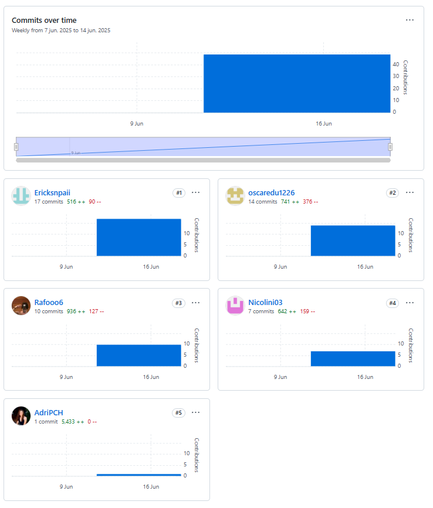
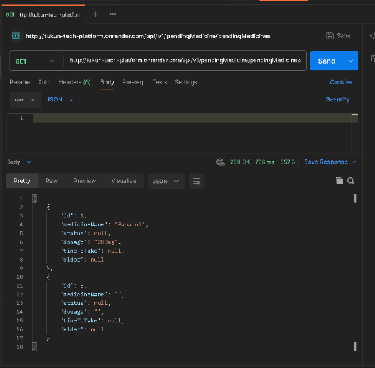

# Aplicaciones para Dispositivos Móviles 

# TUKUNTECH

## Universidad Peruana de Ciencias Aplicadas

**Carrera:** Ingeniería de Software

### Integrantes:
- **Bravo Gavilano, Jorge Rafael** U202212535
- **Nicolich Alvis, Fabio Maurizio** U202218791
- **Maraza Pedemonte, Erick** U202213372
- **Palomares Chávez, Adriana Giovanna** U20221f23
- **Soto Zorrilla, Oscar Eduardo** U201811767

**Fecha:** 2025-10

---

## CARÁTULA

### Registro de Versiones del Informe
### Responsabilidades por Autor - TB1

| Versión | Fecha       | Autor                             | Descripción de modificación             |
|---------|-------------|------------------------------------|------------------------------------------|
| TB1     | 11/04/2025  | Soto Zorrilla, Oscar Eduardo       | EventStorming                            |
| TB1     | 12/04/2025  | Soto Zorrilla, Oscar Eduardo       | Candidate Context Discovery              |
| TB1     | 13/04/2025  | Soto Zorrilla, Oscar Eduardo       | Domain Message Flows Modeling            |
| TB1     | 14/04/2025  | Soto Zorrilla, Oscar Eduardo       | Bounded Context Canvases                 |
| TB1     | 15/04/2025  | Soto Zorrilla, Oscar Eduardo       | Context Mapping                          |
| TB1     | 16/04/2025  | Nicolich Alvis, Fabio Maurizio     | Software Architecture                    |
| TB1     | 17/04/2025  | Nicolich Alvis, Fabio Maurizio     | Context Level Diagrams                   |
| TB1     | 18/04/2025  | Nicolich Alvis, Fabio Maurizio     | Container Level Diagrams                 |
| TB1     | 19/04/2025  | Nicolich Alvis, Fabio Maurizio     | Deployment Diagrams                      |
| TB1     | 20/04/2025  | Palomares Chavez, Adriana Giovanna | Domain Layer                             |
| TB1     | 21/04/2025  | Palomares Chavez, Adriana Giovanna | Interface Layer                          |
| TB1     | 22/04/2025  | Maraza Pedemonte, Erick            | Application Layer                        |
| TB1     | 23/04/2025  | Maraza Pedemonte, Erick            | Infrastructure Layer                     |
| TB1     | 24/04/2025  | Bravo Gavilano, Jorge Rafael       | Component Level Diagrams                 |
| TB1     | 11/04/2025  | Bravo Gavilano, Jorge Rafael       | Code Level Diagrams                      |
| TB1     | 12/04/2025  | Bravo Gavilano, Jorge Rafael       | Domain Layer Class Diagrams              |
| TB1     | 13/04/2025  | Bravo Gavilano, Jorge Rafael       | Database Design Diagram                  |

### Responsabilidades por Autor - TP
| Versión | Fecha       | Autor                            | Descripción de modificación                          |
|---------|-------------|---------------------------------|-----------------------------------------------------|
| TP      | 02/05/2025  | Soto Zorrilla, Oscar Eduardo    | Revisión y ajuste de historias de usuario           |
| TP      | 03/05/2025  | Soto Zorrilla, Oscar Eduardo    | Mejoras en la dinámica y resultados de Eventing|
| TP      | 04/05/2025  | Nicolich Alvis, Fabio Maurizio  | Definición y desarrollo de lineamientos visuales    |
| TP      | 05/05/2025  | Nicolich Alvis, Fabio Maurizio  | Organización y estructura de la información         |
| TP      | 06/05/2025  | Palomares Chavez, Adriana Giovanna | Diseño de sistemas de etiquetado y navegación      |
| TP      | 07/05/2025  | Palomares Chavez, Adriana Giovanna | Elaboración de prototipos iniciales para página principal |
| TP      | 08/05/2025  | Maraza Pedemonte, Erick         | Desarrollo de wireframes para la página de aterrizaje|
| TP      | 09/05/2025  | Maraza Pedemonte, Erick         | Creación de diagramas de flujo para experiencia móvil|
| TP      | 10/05/2025  | Bravo Gavilano, Jorge Rafael    | Diseño y revisión de diagramas a nivel componente   |
| TP      | 11/05/2025  | Bravo Gavilano, Jorge Rafael    | Modelado y ajuste de diagramas a nivel de código    |
| TP      | 12/05/2025  | Soto Zorrilla, Oscar Eduardo    | Ajustes finales en el diseño general UI/UX          |
| TP      | 13/05/2025  | Nicolich Alvis, Fabio Maurizio  | Optimización y mejoras en sistemas de búsqueda      |
| TP      | 14/05/2025  | Palomares Chavez, Adriana Giovanna | Refinamiento de interfaces y navegación             |
| TP      | 15/05/2025  | Maraza Pedemonte, Erick         | Presentación final de prototipos y experiencia móvil|

### Responsabilidades por Autor - TB2


| Versión | Fecha       | Autor                              | Descripción de modificación                                                               |
|---------|-------------|------------------------------------|--------------------------------------------------------------------------------------------|
| TB2     | 09/06/2025  | Soto Zorrilla, Oscar Eduardo       | Revisión y ajuste de historias de usuario                                                  |
| TB2     | 09/06/2025  | Nicolich Alvis, Fabio Maurizio     | Desarrollo de funcionalidades asignadas y documentación de avances técnicos               |
| TB2     | 09/06/2025  | Palomares Chavez, Adriana Giovanna | Integración de funcionalidades en el sistema y validación de comportamiento esperado       |
| TB2     | 09/06/2025  | Maraza Pedemonte, Erick            | Documentación de la ejecución de tareas y validación funcional de componentes              |
| TB2     | 09/06/2025  | Bravo Gavilano, Jorge Rafael       | Documentación de servicios REST implementados y ajustes en endpoints                       |
| TB2     | 09/06/2025  | Soto Zorrilla, Oscar Eduardo       | Configuración e integración del entorno de despliegue en nube y validación final del sistema |
| TB2     | 09/06/2025  | Nicolich Alvis, Fabio Maurizio     | Sistematización de reuniones técnicas y coordinación colaborativa del equipo               |
| TB2     | 09/06/2025  | Palomares Chavez, Adriana Giovanna | Diseño y organización de entrevistas con usuarios para evaluación funcional de entregables |
| TB2     | 09/06/2025  | Maraza Pedemonte, Erick            | Registro de resultados obtenidos en entrevistas y aportes para próximas iteraciones        |

### Responsabilidades por Autor - TF


| Versión | Fecha      | Autor                              | Descripción de modificación                                                                                             |
| ------- | ---------- | ---------------------------------- | ----------------------------------------------------------------------------------------------------------------------- |
| TF      | 07/07/2025 | Soto Zorrilla, Oscar Eduardo       | Validación de flujo de datos entre backend y frontend, y resolución de incidencias en la integración final              |
| TF      | 07/07/2025 | Nicolich Alvis, Fabio Maurizio     | Desarrollo de funciones con validaciones de input en Flutter y documentación del comportamiento técnico esperado        |
| TF      | 07/07/2025 | Palomares Chavez, Adriana Giovanna | Integración de la app con backend, pruebas de validación de inputs y aseguramiento de consistencia en la interfaz       |
| TF      | 07/07/2025 | Maraza Pedemonte, Erick            | Pruebas funcionales del prototipo móvil y documentación de resultados en la visualización de signos vitales             |
| TF      | 07/07/2025 | Bravo Gavilano, Jorge Rafael       | Implementación de servicios REST para monitoreo en tiempo real y ajustes en endpoints según requerimientos del frontend |
| TF      | 07/07/2025 | Soto Zorrilla, Oscar Eduardo       | Configuración del entorno de despliegue y verificación del correcto funcionamiento del prototipo en la nube             |
| TF      | 07/07/2025 | Nicolich Alvis, Fabio Maurizio     | Coordinación de iteraciones técnicas y planificación de la entrega funcional del prototipo en Kotlin y Dart             |
| TF      | 07/07/2025 | Palomares Chavez, Adriana Giovanna | Realización de sesiones de prueba con usuarios para validar flujos de interacción y precisión en datos mostrados        |
| TF      | 07/07/2025 | Maraza Pedemonte, Erick            | Sistematización de hallazgos durante las validaciones de usuarios y propuestas de mejora para próximas entregas         |


## Student Outcome

### Criterio específico
**Actualiza conceptos y conocimientos necesarios para su desarrollo profesional y en especial para su proyecto en soluciones de ingeniería de software**
| Acción Realizada | Participantes                        | Descripción | Conclusiones |
|------------------|--------------------------------------|-------------|--------------|
| TB1              | **Soto Zorrilla, Oscar Eduardo**     | **Modelado estratégico:**<br>Aplicó Eventing, Candidate Context Discovery y mapeo de contextos con DDD. | La experiencia permitió a todos los participantes integrar conceptos clave de ingeniería de software, fortaleciendo sus competencias técnicas en modelado, diseño y arquitectura. El enfoque Domain-Driven Design, combinado con herramientas profesionales y prácticas colaborativas, promovió un aprendizaje aplicado y alineado con estándares actuales de la industria. Esto no solo contribuyó al desarrollo del proyecto TukunTech, sino que también potenció su preparación profesional para enfrentar desafíos reales en el ámbito del desarrollo de software. |
| TB1              | **Nicolich Alvis, Fabio Maurizio**   | **Arquitectura del sistema:**<br>Aplicó C4 Model para diseñar niveles de contexto, contenedores y despliegue del sistema. | La experiencia permitió a todos los participantes integrar conceptos clave de ingeniería de software, fortaleciendo sus competencias técnicas en modelado, diseño y arquitectura. El enfoque Domain-Driven Design, combinado con herramientas profesionales y prácticas colaborativas, promovió un aprendizaje aplicado y alineado con estándares actuales de la industria. Esto no solo contribuyó al desarrollo del proyecto TukunTech, sino que también potenció su preparación profesional para enfrentar desafíos reales en el ámbito del desarrollo de software. |
| TB1              | **Palomares Chávez, Adriana Giovanna** | **Diseño táctico – Dominio e interfaz:**<br>Modeló entidades, agregados y controladores REST con DTOs. | La experiencia permitió a todos los participantes integrar conceptos clave de ingeniería de software, fortaleciendo sus competencias técnicas en modelado, diseño y arquitectura. El enfoque Domain-Driven Design, combinado con herramientas profesionales y prácticas colaborativas, promovió un aprendizaje aplicado y alineado con estándares actuales de la industria. Esto no solo contribuyó al desarrollo del proyecto TukunTech, sino que también potenció su preparación profesional para enfrentar desafíos reales en el ámbito del desarrollo de software. |
| TB1              | **Maraza Pedemonte, Erick**          | **Aplicación e infraestructura:**<br>Desarrolló Command Handlers y Repositories con EF Core. | La experiencia permitió a todos los participantes integrar conceptos clave de ingeniería de software, fortaleciendo sus competencias técnicas en modelado, diseño y arquitectura. El enfoque Domain-Driven Design, combinado con herramientas profesionales y prácticas colaborativas, promovió un aprendizaje aplicado y alineado con estándares actuales de la industria. Esto no solo contribuyó al desarrollo del proyecto TukunTech, sino que también potenció su preparación profesional para enfrentar desafíos reales en el ámbito del desarrollo de software. |
| TB1              | **Bravo Gavilano, Jorge Rafael**     | **Diseño técnico detallado:**<br>Realizó diagramas de componentes, clases y base de datos. | La experiencia permitió a todos los participantes integrar conceptos clave de ingeniería de software, fortaleciendo sus competencias técnicas en modelado, diseño y arquitectura. El enfoque Domain-Driven Design, combinado con herramientas profesionales y prácticas colaborativas, promovió un aprendizaje aplicado y alineado con estándares actuales de la industria. Esto no solo contribuyó al desarrollo del proyecto TukunTech, sino que también potenció su preparación profesional para enfrentar desafíos reales en el ámbito del desarrollo de software. |

| Acción Realizada | Participantes                      | Descripción                                                                                                     | Conclusiones                                                                                                           |
|---------|----------------------------------|-----------------------------------------------------------------------------------------------------------------|-----------------------------------------------------------------------------------------------------------------------|
| TP      | **Soto Zorrilla, Oscar Eduardo** | Actualizó sus conocimientos en diseño y prototipado de interfaces móviles, fortaleciendo su capacidad para crear experiencias de usuario efectivas y adaptadas a proyectos reales.       | La experiencia desarrollada por todos los participantes permitió actualizar y consolidar conocimientos técnicos y metodológicos esenciales en ingeniería de software, mejorando su desempeño profesional y aportando valor significativo al proyecto en curso. |
| TP      | **Nicolich Alvis, Fabio Maurizio** | Amplió sus habilidades en el desarrollo backend y la gestión eficiente de servicios y APIs, aplicando prácticas modernas que mejoran la calidad y escalabilidad del software.             | La experiencia desarrollada por todos los participantes permitió actualizar y consolidar conocimientos técnicos y metodológicos esenciales en ingeniería de software, mejorando su desempeño profesional y aportando valor significativo al proyecto en curso. |
| TP      | **Palomares Chávez, Adriana Giovanna** | Profundizó en la creación de interfaces web funcionales y atractivas, fortaleciendo su experiencia en diseño front-end orientado a la usabilidad y presentación de productos digitales.   | La experiencia desarrollada por todos los participantes permitió actualizar y consolidar conocimientos técnicos y metodológicos esenciales en ingeniería de software, mejorando su desempeño profesional y aportando valor significativo al proyecto en curso. |
| TP      | **Maraza Pedemonte, Erick**      | Fortaleció sus competencias en la integración de sistemas frontend y backend, asegurando la comunicación efectiva entre capas para ofrecer soluciones coherentes y funcionales.           | La experiencia desarrollada por todos los participantes permitió actualizar y consolidar conocimientos técnicos y metodológicos esenciales en ingeniería de software, mejorando su desempeño profesional y aportando valor significativo al proyecto en curso. |
| TP      | **Bravo Gavilano, Jorge Rafael** | Mejoró su conocimiento en pruebas funcionales y aseguramiento de la calidad del software, incorporando prácticas clave para mantener la fiabilidad y estabilidad del producto.            | La experiencia desarrollada por todos los participantes permitió actualizar y consolidar conocimientos técnicos y metodológicos esenciales en ingeniería de software, mejorando su desempeño profesional y aportando valor significativo al proyecto en curso. |

| Acción Realizada | Participantes                        | Descripción | Conclusiones |
|------------------|--------------------------------------|-------------|--------------|
| TB2              | **Soto Zorrilla, Oscar Eduardo**     | **Deployment y mantenimiento en producción:**<br>Configuró el entorno de despliegue en Render y supervisó el correcto funcionamiento de los servicios backend y frontend. | La entrega TB2 permitió consolidar conocimientos sobre entornos de despliegue reales, automatización y pruebas post-deploy. Este aprendizaje fortalece habilidades prácticas esenciales para el ejercicio profesional en ingeniería de software, integrando aspectos técnicos y operativos del ciclo de vida de una aplicación. |
| TB2              | **Nicolich Alvis, Fabio Maurizio**   | **Integración funcional y gestión colaborativa:**<br>Implementó funcionalidades clave en el backend y coordinó tareas del equipo con enfoque ágil. | Participar activamente en la entrega reforzó competencias en integración de servicios, organización de código escalable y trabajo colaborativo. El enfoque ágil aplicado fomenta habilidades de liderazgo técnico y comunicación, esenciales para el desarrollo profesional. |
| TB2              | **Palomares Chávez, Adriana Giovanna** | **Pruebas automatizadas y validación funcional:**<br>Desarrolló pruebas unitarias e integradas en los módulos de Flutter y backend Kotlin. | La práctica con pruebas en entornos reales refuerza el enfoque de calidad desde el desarrollo. Esta experiencia mejora la capacidad de implementar software confiable y robustece el perfil técnico orientado a la calidad del producto. |
| TB2              | **Maraza Pedemonte, Erick**          | **Documentación técnica y validación con usuarios:**<br>Redactó servicios REST en Swagger y lideró sesiones de validación de funcionalidades con feedback de usuarios. | El contacto directo con usuarios reales y la producción de documentación técnica sólida enriquecen la visión del ciclo completo del software. Esta experiencia aporta habilidades valiosas para roles de analista, QA o ingeniero de requisitos. |
| TB2              | **Bravo Gavilano, Jorge Rafael**     | **Revisión de código y optimización técnica:**<br>Realizó ajustes de performance en servicios críticos y estandarización de código en Flutter. | A través de la revisión cruzada y optimización del código, se promovió un entendimiento más profundo de buenas prácticas de desarrollo. Esta habilidad resulta fundamental para un perfil profesional que prioriza mantenibilidad, eficiencia y escalabilidad. |

| Acción Realizada | Participantes                          | Descripción                                                                                                                                                                                              | Conclusiones                                                                                                                                                                                    |
| ---------------- | -------------------------------------- | -------------------------------------------------------------------------------------------------------------------------------------------------------------------------------------------------------- | ----------------------------------------------------------------------------------------------------------------------------------------------------------------------------------------------- |
| TF               | **Soto Zorrilla, Oscar Eduardo**       | **Integración backend–frontend y despliegue en producción:**<br>Configuró el entorno de despliegue en la nube, solucionó incidencias en el flujo de datos y garantizó la conectividad entre componentes. | La experiencia fortaleció habilidades en integración de sistemas distribuidos y despliegue real, fundamentales en el desarrollo profesional de soluciones escalables en ingeniería de software. |
| TF               | **Nicolich Alvis, Fabio Maurizio**     | **Validación de inputs y coordinación técnica:**<br>Implementó validaciones en los formularios y lideró la organización del trabajo técnico para la integración funcional de la app.                     | Este proceso reforzó competencias en gestión de calidad del software, organización de componentes reutilizables y liderazgo técnico en proyectos colaborativos.                                 |
| TF               | **Palomares Chávez, Adriana Giovanna** | **Integración de funcionalidades y pruebas en prototipo móvil:**<br>Desarrolló validaciones en Flutter y participó en la entrega del primer prototipo funcional con monitoreo en tiempo real.            | La entrega fortaleció conocimientos en desarrollo mobile y pruebas funcionales, esenciales para construir productos digitales confiables en entornos de producción.                             |
| TF               | **Maraza Pedemonte, Erick**            | **Pruebas funcionales y análisis de comportamiento del sistema:**<br>Realizó validaciones del sistema a partir de interacciones reales y documentó los resultados.                                       | Esta experiencia mejoró su capacidad de análisis funcional y validación de sistemas reales, aportando habilidades clave en QA, testing y evaluación de producto.                                |
| TF               | **Bravo Gavilano, Jorge Rafael**       | **Diseño de servicios REST y soporte para visualización de datos:**<br>Desarrolló endpoints enfocados en el monitoreo de signos vitales y en la integración con la interfaz Flutter.                     | A través del diseño de APIs orientadas a la visualización en tiempo real, fortaleció su capacidad de construir servicios eficientes y seguros, clave para entornos productivos modernos.        |


### Criterio específico
**Reconoce la necesidad del aprendizaje permanente para el desempeño profesional y el desarrollo de proyectos en soluciones de tecnologías de ingeniería de software**
| Acción Realizada | Participantes                        | Descripción | Conclusiones |
|------------------|--------------------------------------|-------------|--------------|
| TB1              | **Soto Zorrilla, Oscar Eduardo**     | **Modelado estratégico:**<br>Participó en sesiones de Eventing, identificando contextos clave con enfoque en aprendizaje colaborativo. | El equipo demostró un compromiso constante con el aprendizaje autónomo y colaborativo, investigando activamente marcos metodológicos como Domain-Driven Design, C4 Model y herramientas de arquitectura y modelado. Reconocer la necesidad del aprendizaje continuo permitió afrontar eficazmente los desafíos técnicos del proyecto y fortalecer las competencias necesarias para adaptarse al ritmo de innovación en la ingeniería de software. |
| TB1              | **Nicolich Alvis, Fabio Maurizio**   | **Arquitectura del sistema:**<br>Profundizó en el C4 Model y utilizó nuevas herramientas como Structurizr y Lucidchart para definir la arquitectura de solución. | El equipo demostró un compromiso constante con el aprendizaje autónomo y colaborativo, investigando activamente marcos metodológicos como Domain-Driven Design, C4 Model y herramientas de arquitectura y modelado. Reconocer la necesidad del aprendizaje continuo permitió afrontar eficazmente los desafíos técnicos del proyecto y fortalecer las competencias necesarias para adaptarse al ritmo de innovación en la ingeniería de software. |
| TB1              | **Palomares Chávez, Adriana Giovanna** | **Diseño de dominio e interfaz:**<br>Estudió patrones de diseño de software y aplicó prácticas modernas para la construcción de APIs REST. | El equipo demostró un compromiso constante con el aprendizaje autónomo y colaborativo, investigando activamente marcos metodológicos como Domain-Driven Design, C4 Model y herramientas de arquitectura y modelado. Reconocer la necesidad del aprendizaje continuo permitió afrontar eficazmente los desafíos técnicos del proyecto y fortalecer las competencias necesarias para adaptarse al ritmo de innovación en la ingeniería de software. |
| TB1              | **Maraza Pedemonte, Erick**          | **Aplicación e infraestructura:**<br>Implementó lógica de negocio con Command Handlers, y gestionó persistencia con tecnologías nuevas como EF Core. | El equipo demostró un compromiso constante con el aprendizaje autónomo y colaborativo, investigando activamente marcos metodológicos como Domain-Driven Design, C4 Model y herramientas de arquitectura y modelado. Reconocer la necesidad del aprendizaje continuo permitió afrontar eficazmente los desafíos técnicos del proyecto y fortalecer las competencias necesarias para adaptarse al ritmo de innovación en la ingeniería de software. |
| TB1              | **Bravo Gavilano, Jorge Rafael**     | **Diseño técnico detallado:**<br>Desarrolló diagramas técnicos complejos utilizando herramientas UML y modelado de datos relacionales. | El equipo demostró un compromiso constante con el aprendizaje autónomo y colaborativo, investigando activamente marcos metodológicos como Domain-Driven Design, C4 Model y herramientas de arquitectura y modelado. Reconocer la necesidad del aprendizaje continuo permitió afrontar eficazmente los desafíos técnicos del proyecto y fortalecer las competencias necesarias para adaptarse al ritmo de innovación en la ingeniería de software. |

| Acción Realizada | Participantes                      | Descripción                                                                                                      | Conclusiones                                                                                                            |
|---------|----------------------------------|------------------------------------------------------------------------------------------------------------------|-------------------------------------------------------------------------------------------------------------------------|
| TP      | **Soto Zorrilla, Oscar Eduardo** | Reconoció la importancia del aprendizaje continuo en diseño y prototipado de interfaces móviles para mantener su desarrollo profesional actualizado y adaptado a las nuevas demandas del proyecto. | El compromiso con el aprendizaje permanente permitió a todos los participantes mejorar sus capacidades técnicas y metodológicas, asegurando un desempeño profesional eficiente y contribuyendo al éxito sostenido del proyecto. |
| TP      | **Nicolich Alvis, Fabio Maurizio** | Asumió la necesidad de actualizar constantemente sus conocimientos en desarrollo backend y gestión de APIs para responder eficazmente a los retos tecnológicos del proyecto.               | El compromiso con el aprendizaje permanente permitió a todos los participantes mejorar sus capacidades técnicas y metodológicas, asegurando un desempeño profesional eficiente y contribuyendo al éxito sostenido del proyecto. |
| TP      | **Palomares Chávez, Adriana Giovanna** | Valoró la actualización continua en diseño front-end y experiencia de usuario como elemento clave para ofrecer soluciones innovadoras y funcionales en el proyecto.                        | El compromiso con el aprendizaje permanente permitió a todos los participantes mejorar sus capacidades técnicas y metodológicas, asegurando un desempeño profesional eficiente y contribuyendo al éxito sostenido del proyecto. |
| TP      | **Maraza Pedemonte, Erick**      | Entendió la relevancia del aprendizaje permanente en la integración de sistemas para asegurar una comunicación efectiva y evolución tecnológica constante.                               | El compromiso con el aprendizaje permanente permitió a todos los participantes mejorar sus capacidades técnicas y metodológicas, asegurando un desempeño profesional eficiente y contribuyendo al éxito sostenido del proyecto. |
| TP      | **Bravo Gavilano, Jorge Rafael** | Reconoció la necesidad de mantener actualizados sus conocimientos en pruebas y aseguramiento de calidad para garantizar la confiabilidad del producto a lo largo del tiempo.             | El compromiso con el aprendizaje permanente permitió a todos los participantes mejorar sus capacidades técnicas y metodológicas, asegurando un desempeño profesional eficiente y contribuyendo al éxito sostenido del proyecto. |

| Acción Realizada | Participantes                        | Descripción | Conclusiones |
|------------------|--------------------------------------|-------------|--------------|
| TB2              | **Soto Zorrilla, Oscar Eduardo**     | **Automatización y despliegue:**<br>Investigó sobre flujos de integración y despliegue continuo (CI/CD) para configurar entornos cloud en Render. | El equipo fortaleció su capacidad de autoaprendizaje enfrentando tecnologías y procesos que no dominaban inicialmente. Se reconoció la importancia de mantenerse actualizado para garantizar la entrega eficiente y profesional de soluciones de software. |
| TB2              | **Nicolich Alvis, Fabio Maurizio**   | **Nuevas prácticas de desarrollo móvil:**<br>Profundizó en Jetpack Compose para Android y su integración con servicios REST mediante Retrofit y ViewModel. | El equipo fortaleció su capacidad de autoaprendizaje enfrentando tecnologías y procesos que no dominaban inicialmente. Se reconoció la importancia de mantenerse actualizado para garantizar la entrega eficiente y profesional de soluciones de software. |
| TB2              | **Palomares Chávez, Adriana Giovanna** | **Testing y debugging avanzado:**<br>Exploró técnicas modernas de testing en Flutter y aprendió a integrar flujos BLoC con pruebas automatizadas. | El equipo fortaleció su capacidad de autoaprendizaje enfrentando tecnologías y procesos que no dominaban inicialmente. Se reconoció la importancia de mantenerse actualizado para garantizar la entrega eficiente y profesional de soluciones de software. |
| TB2              | **Maraza Pedemonte, Erick**          | **Documentación de APIs y validación de usuarios:**<br>Aprendió a utilizar Swagger para documentar endpoints y aplicar entrevistas de validación. | El equipo fortaleció su capacidad de autoaprendizaje enfrentando tecnologías y procesos que no dominaban inicialmente. Se reconoció la importancia de mantenerse actualizado para garantizar la entrega eficiente y profesional de soluciones de software. |
| TB2              | **Bravo Gavilano, Jorge Rafael**     | **Optimización de interfaz y estructura de código:**<br>Investigó mejores prácticas para estructuración de carpetas en Flutter y mejora de rendimiento visual. | El equipo fortaleció su capacidad de autoaprendizaje enfrentando tecnologías y procesos que no dominaban inicialmente. Se reconoció la importancia de mantenerse actualizado para garantizar la entrega eficiente y profesional de soluciones de software. |

| Acción Realizada | Participantes                          | Descripción                                                                                                                                                                                                          | Conclusiones                                                                                                                                                                                                                                            |
| ---------------- | -------------------------------------- | -------------------------------------------------------------------------------------------------------------------------------------------------------------------------------------------------------------------- | ------------------------------------------------------------------------------------------------------------------------------------------------------------------------------------------------------------------------------------------------------- |
| TF               | **Soto Zorrilla, Oscar Eduardo**       | **Despliegue y solución de integración backend–frontend:**<br>Investigó sobre resolución de conflictos en flujos de datos entre servicios REST y la interfaz Flutter, aplicando configuraciones avanzadas en Render. | El equipo fortaleció su capacidad de autoaprendizaje enfrentando tecnologías y desafíos nuevos como la integración en tiempo real. Se reafirmó la necesidad de actualizarse constantemente para implementar soluciones funcionales en contextos reales. |
| TF               | **Nicolich Alvis, Fabio Maurizio**     | **Validación dinámica y estructura modular en Jetpack Compose:**<br>Exploró patrones arquitectónicos modernos para integrar servicios backend en Android con validaciones robustas.                                  | El equipo fortaleció su capacidad de autoaprendizaje enfrentando tecnologías y desafíos nuevos como la integración en tiempo real. Se reafirmó la necesidad de actualizarse constantemente para implementar soluciones funcionales en contextos reales. |
| TF               | **Palomares Chávez, Adriana Giovanna** | **Integración y testing de prototipo Flutter:**<br>Aprendió nuevas prácticas para conectar BLoC con validaciones de formularios y testing funcional automatizado.                                                    | El equipo fortaleció su capacidad de autoaprendizaje enfrentando tecnologías y desafíos nuevos como la integración en tiempo real. Se reafirmó la necesidad de actualizarse constantemente para implementar soluciones funcionales en contextos reales. |
| TF               | **Maraza Pedemonte, Erick**            | **Evaluación de funcionalidades mediante validaciones con usuarios:**<br>Profundizó en métodos de análisis de resultados desde entrevistas funcionales para refinar comportamientos del sistema.                     | El equipo fortaleció su capacidad de autoaprendizaje enfrentando tecnologías y desafíos nuevos como la integración en tiempo real. Se reafirmó la necesidad de actualizarse constantemente para implementar soluciones funcionales en contextos reales. |
| TF               | **Bravo Gavilano, Jorge Rafael**       | **Diseño eficiente de endpoints para visualización en tiempo real:**<br>Investigó sobre formatos óptimos para entregar datos clínicos desde el backend hacia la app de forma continua y efectiva.                    | El equipo fortaleció su capacidad de autoaprendizaje enfrentando tecnologías y desafíos nuevos como la integración en tiempo real. Se reafirmó la necesidad de actualizarse constantemente para implementar soluciones funcionales en contextos reales. |


## Objetivos SMART
A continuación, cada miembro del equipo ha planteado dos objetivos SMART que guían su crecimiento profesional una vez finalizada la carrera.

**Integrante 1 – Oscar Soto**
- Objetivo 1.1:
Actualizar y mejorar mi portafolio personal en línea incluyendo al menos 2 proyectos realizados con Flutter durante el primer semestre después de egresar, para aumentar mis oportunidades de empleabilidad.

- Objetivo 1.2:
Postular a prácticas profesionales o posiciones junior en empresas de tecnología móvil dentro de los primeros 3 meses después de la graduación, enfocándome en roles relacionados con Flutter o desarrollo frontend.

**Integrante 2 – Adriana Palomares**
- Objetivo 2.1:
Participar en al menos un curso en línea (gratuito o de bajo costo) sobre Kotlin o desarrollo backend durante los primeros 4 meses después de egresar, con el fin de reforzar mis conocimientos prácticos.

- Objetivo 2.2:
Crear un proyecto personal simple (como una app de notas o lista de tareas) utilizando Kotlin y publicarlo en GitHub antes de cumplir 6 meses como egresado, para demostrar mis habilidades en entrevistas laborales.

**Integrante 3 – Rafael Bravo**
- Objetivo 3.1:
Unirme a una comunidad local o virtual de desarrolladores (como un grupo de Discord) durante el primer trimestre tras la graduación, con el objetivo de mantenerme actualizado y generar redes profesionales.

- Objetivo 3.2:
Ver al menos un video tutorial o curso completo mensual sobre desarrollo móvil o nuevas tecnologías durante los primeros 8 meses, con el fin de mantener un aprendizaje continuo.

**Integrante 4 – Erick Maraza**
- Objetivo 4.1:
Realizar prácticas personales de pruebas unitarias en al menos 2 de mis proyectos desarrollados con Flutter o Kotlin antes de cumplir 10 meses egresado, con el objetivo de mejorar la calidad de mi código.

- Objetivo 4.2:
Escribir y compartir un post en LinkedIn sobre mi experiencia desarrollando una app móvil, en los 12 meses posteriores a la graduación, para mostrar mi iniciativa y capacidad de comunicación técnica.

**Integrante 5 – Fabio Nicolich**
- Objetivo 5.1:
Aprender los fundamentos de metodologías ágiles a través de recursos gratuitos y aplicarlos en un proyecto personal dentro de los primeros 6 meses después de egresar.

- Objetivo 5.2:
Desarrollar una versión funcional de una app móvil básica (por ejemplo, una app de gestión de gastos o tareas) y compartir el archivo con amigos antes de finalizar el primer año, para practicar despliegue y recibir retroalimentación.

# Capítulo I: Introducción
## 1.1. Startup Profile.
### 1.1.1. Descripción de la Startup. 
Actualmente, el monitoreo de signos vitales en adultos mayores, pacientes postoperatorios y en cuidados intensivos se realiza con dispositivos tradicionales que requieren intervención manual y ofrecen sistemas fragmentados, limitando la eficiencia y la capacidad de respuesta en tiempo real.
Nuestra startup aborda este desafío con una plataforma IoT innovadora que integra dispositivos inteligentes para medir continuamente la frecuencia cardíaca, la presión arterial y la oxigenación en sangre. Los datos se transmiten en tiempo real a una plataforma centralizada, donde algoritmos avanzados detectan anomalías y alertan al personal médico de inmediato. Además, la plataforma permite a los doctores hacer evaluaciones médicas en tiempo real y ajustar tratamientos de manera instantánea.
Nos enfocamos en cuidados intensivos, postoperatorios y en el monitoreo de adultos mayores que desean modernizar su seguimiento médico. Nuestra solución mejora la eficiencia, precisión y calidad de la atención, reduciendo tiempos de respuesta y optimizando la gestión del cuidado.

### 1.1.2. Perfiles de Integrantes del Equipo.
#### Nicolich Alvis, Fabio Maurizio
Soy estudiante de Ingeniería de Software, cursando actualmente el quinto ciclo de la carrera. Me destaco por ser responsable, proactivo y poseer sólidas habilidades de liderazgo. Estoy comprometido con el trabajo en equipo, fomentando una comunicación efectiva y colaborativa para alcanzar resultados sobresalientes. Mi enfoque está en garantizar la calidad y el éxito de los proyectos, aportando creatividad, esfuerzo y dedicación en cada etapa del desarrollo. Cuento con conocimientos en lenguajes como C++, HTML, CSS, JavaScript y Python, y estoy enfocado en aprender a crear proyectos utilizando frameworks como Angular y Vue.


#### Soto Zorrilla, Oscar Eduardo
Soy estudiante de Ingeniería de Software con un enfoque proactivo en la resolución de problemas. Me caracterizo por mi adaptabilidad a diversas situaciones y por superar desafíos. Además, tengo conocimientos en C++, HTML, CSS, JavaScript y Python, lo que me permite trabajar en diversos proyectos tecnológicos.


#### Maraza Pedemonte, Erick
Soy estudiante de Ingeniería de Software con habilidades en programación en lenguajes como C++ y Python. Mi enfoque dedicado a los proyectos que me apasionan me impulsa a explorar nuevas fronteras en mi carrera. Estas habilidades me permiten desarrollar una amplia gama de aplicaciones y soluciones, y estoy comprometido a seguir aprendiendo y aplicando estas habilidades para resolver desafíos creativos en el mundo del desarrollo de software.


#### Palomares Chavez, Adriana Giovanna
Soy Adriana Palomares, tengo 21 años y actualmente estudio Ingeniería de Software en UPC en el 5to ciclo. Me gusta explorar nuevas tecnologías, especialmente lenguajes de programación. También me apasionan los animales, particularmente los perros. Me comprometo al trabajo en equipo y la responsabilidad que conlleva este.


#### Bravo Gavilano, Jorge Rafael
Estoy actualmente en el quinto ciclo de mi carrera en Ingeniería de Software. Disfruto de jugar videojuegos e ir al gimnasio en mi tiempo libre. Me considero una persona responsable y enfocada en siempre realizar un buen trabajo. Estoy interesado en aprender sobre inteligencia artificial y programación web.


## 1.2. Solution Profile.
**Product Name** Se decidió llamar a nuestro producto “TukunTech”, inspirado en el sonido “tukun” que imita el latido del corazón, el pulso rítmico que simboliza la vida y la salud. Este sonido, asociado con el latido cardíaco, refleja el enfoque principal de nuestra aplicación: el monitoreo de signos vitales. Así como el “tukun” del corazón es esencial para la vida, nuestra aplicación es fundamental para la vigilancia y cuidado continuo de los pacientes.
El sufijo “Tech” subraya la innovación tecnológica que nuestra empresa aporta al sector salud. TukunTech combina la esencia de la vida, representada por el latido del corazón, con soluciones tecnológicas avanzadas, creando una herramienta integral para hospitales y clínicas.
Elegimos este nombre porque captura la esencia de lo que hacemos: utilizar la tecnología para monitorear y cuidar la vida, uniendo ciencia y humanidad en una plataforma que mejora la atención médica.

**Product Description** TukunTech es una innovadora plataforma de monitoreo de signos vitales diseñada para mejorar la atención médica en adultos mayores, pacientes postoperatorios y pacientes en cuidados intensivos. A diferencia de los sistemas tradicionales, TukunTech aprovecha la tecnología IoT para ofrecer un monitoreo integrado de todos los dispositivos de forma continua y en tiempo real de signos vitales críticos. A través de una red de dispositivos inteligentes que van a estar integrados entre sí con el fin de lograr que los datos se transmitan a una plataforma centralizada, donde se analizan mediante algoritmos avanzados para detectar anomalías y alertar al personal médico de manera inmediata. Además nuestra solución también permite a los doctores realizar evaluaciones médicas básicas en tiempo real, accediendo a datos actualizados de los pacientes para proporcionar recomendaciones y ajustes instantáneos. Con TukunTech, las clínicas pueden integrar de manera fluida nuestros servicios en sus sistemas existentes, mejorando la eficiencia en la gestión del cuidado de los pacientes y aumentando la precisión en la toma de decisiones. Nos enfocamos inicialmente en cuidados intensivos, postoperatorios y el monitoreo de adultos mayores, donde la necesidad de una atención más proactiva y personalizada es crítica.

**Monetización** Inicialmente, ofreceremos una versión Beta de nuestro producto para que los usuarios potenciales puedan interactuar con el sistema y familiarizarse con las herramientas que ofrecemos. Esto les permitirá experimentar de primera mano las funcionalidades del software y cómo puede mejorar la gestión de la salud.
Posteriormente, implementaremos tres tipos de suscripciones adaptadas a diferentes necesidades:

Plan Organización: Diseñado específicamente para clínicas. Este plan ofrece acceso completo a todas las funcionalidades avanzadas del sistema, incluyendo monitoreo en tiempo real, análisis detallado de datos, alertas personalizadas y soporte técnico especializado. Es ideal para entornos médicos que requieren una supervisión continua y precisa de múltiples pacientes. Válido durante un año. 

Plan Individual: Enfocado en usuarios individuales que necesitan monitorear la salud de un adulto mayor en el entorno familiar. Este plan proporciona herramientas esenciales de monitoreo, permitiendo a las familias estar informadas sobre los signos vitales de sus seres queridos de manera sencilla y accesible. Válido durante un mes. Permite un maximo de 4 visitas medicas

Plan Duo: Enfocado en dos usuarios que necesitan de un monitoreo constante de su salud. Este plan proporciona herramientas esenciales de monitoreo, permitiendo a las familias estar informadas sobre los signos vitales de sus seres queridos de manera sencilla y accesible. álido durante un mes. Asi mismo, permite un maximo de 10 visitas medicas al mes. 

Los planes tendrán diferentes estructuras de costos y se ofrecerán en un modelo de suscripción mensual o anual, adaptado a las necesidades de cada tipo de usuario.

### 1.2.1. Antecedentes y problemática.
**Descripción de la problemática**

El problema identificado radica en la falta de una solución integrada y continua para el monitoreo de signos vitales en pacientes, especialmente en adultos mayores, pacientes postoperatorios y en cuidados intensivos. Los sistemas actuales dependen de dispositivos tradicionales que requieren intervención manual, lo que genera ineficiencias y una capacidad de respuesta limitada ante situaciones críticas. Además, estos sistemas no están integrados entre sí, lo que dificulta la supervisión centralizada y el análisis en tiempo real, afectando la calidad de la atención médica.

**Objetivos**

- Desarrollar una plataforma basada en IoT que permita el monitoreo continuo y en tiempo real de los signos vitales de los pacientes.
- Mejorar la capacidad de respuesta del personal médico ante situaciones críticas, reduciendo el tiempo de reacción.
- Integrar dispositivos inteligentes en una plataforma centralizada que permita la supervisión y análisis de datos de manera eficiente.
- Aumentar la calidad del cuidado médico mediante la reducción de la supervisión manual y la automatización de procesos.

**Restricciones**

- Dependencia de la infraestructura tecnológica existente en las clínicas y hospitales para asegurar una integración fluida.
- Conectividad de red: la plataforma depende de una conexión de red estable para la transmisión continua y en tiempo real de los signos vitales. Las áreas con conectividad limitada podrían afectar la funcionalidad del sistema.

**Antecedentes**

- **Vital Connect**  
  VitalConnect ofrece dispositivos portátiles que monitorean continuamente los signos vitales de los pacientes y transmiten los datos en tiempo real a los profesionales de la salud. Sin embargo, TuKunTech se diferencia al ofrecer una solución integral que no solo incluye dispositivos de monitoreo, sino también una plataforma de telemedicina y seguimiento clínico tanto en hospitales como en hogares. Además, proporcionamos personalización avanzada para adaptar el monitoreo a las necesidades específicas de cada paciente y clínica, garantizando una atención más completa y flexible.

- **Tytocare**  
  Tytocare es una plataforma de telemedicina que permite realizar exámenes físicos remotos a través de dispositivos conectados, brindando a los pacientes la posibilidad de recibir diagnósticos desde sus hogares. TuKunTech va más allá al ofrecer no solo telemedicina, sino un ecosistema completo que integra monitoreo inteligente, atención en clínicas y monitoreo domiciliario, permitiendo a las clínicas escalar el sistema para gestionar eficientemente un gran volumen de pacientes y mejorar la calidad del servicio.

- **Philips Healthcare**  
  Philips Healthcare ofrece soluciones avanzadas de monitoreo remoto y dispositivos médicos para hospitales y clínicas de todo el mundo. TuKunTech se diferencia al estar diseñado específicamente para adaptarse a las necesidades locales del mercado peruano, ofreciendo una solución más flexible y personalizada. Además, TuKunTech es una opción más costo-eficiente, permitiendo a clínicas de diferentes tamaños adoptar tecnología avanzada sin los altos costos asociados a las soluciones globales de Philips.

**Herramienta de 5W y 2H**

- **What - ¿Cuál es el problema?**  
  El problema identificado es la falta de una solución integrada para el monitoreo continuo y en tiempo real de signos vitales en pacientes críticos, lo que genera ineficiencias y tiempos de respuesta prolongados en la atención médica.

- **When - ¿Cuánto sucede el problema?**  
  El problema ocurre durante el monitoreo de pacientes que requieren atención médica constante, como adultos mayores, pacientes postoperatorios o en cuidados intensivos, donde la capacidad de respuesta rápida es crucial.

- **Where - ¿Dónde surge el problema?**  
  El problema surge en clínicas, y hogares donde se utilizan sistemas de monitoreo tradicionales que no están integrados ni automatizados, afectando la capacidad de monitoreo en tiempo real.

- **Who - ¿Quiénes son afectados por el problema?**  
  Los principales afectados son los pacientes en situaciones críticas que necesitan monitoreo constante, el personal médico que debe realizar supervisión manual, y las clínicas que enfrentan ineficiencias en la gestión de cuidados.

- **Why - ¿Cuál es la causa del problema?**  
  La causa principal del problema es la falta de integración de tecnologías avanzadas, como IoT, en los sistemas de monitoreo existentes, lo que impide la supervisión automatizada y el análisis de datos en tiempo real.

- **How - ¿Cómo se manifiesta el problema?**  
  El problema se manifiesta en la dependencia de la intervención manual del personal médico, lo que reduce la eficiencia y la capacidad de reacción ante emergencias médicas, además de limitar la toma de decisiones informadas basadas en datos en tiempo real.

- **How much - ¿Cuál es la magnitud del problema?**  
  La magnitud del problema se refleja en los costos operativos elevados, la carga de trabajo innecesaria para el personal médico y los riesgos elevados para los pacientes debido a la falta de monitoreo continuo y alerta temprana de situaciones críticas.

### 1.2.2. Lean UX Process.
#### 1.2.2.1. Lean UX Problem Statements.
El estado actual en el monitoreo de signos vitales en adultos mayores, pacientes postoperatorios o pacientes en cuidados intensivos se ha centrado principalmente en la utilización de dispositivos tradicionales que requieren la intervención manual del personal médico para la recolección y análisis de datos. Estos sistemas suelen ser fragmentados y no ofrecen una integración fluida entre los diferentes equipos de monitoreo, lo cual limita la eficiencia y la capacidad de respuesta en tiempo real.

Lo que los productos y servicios existentes no logran abordar es la falta de una solución integrada entre los dispositivos que aproveche la tecnología IoT para ofrecer un monitoreo continuo y en tiempo real de los signos vitales de los pacientes. Los sistemas actuales a menudo son estáticos y no permiten una supervisión centralizada ni la capacidad de analizar datos en tiempo real de manera efectiva.

Nuestro producto abordará esta brecha mediante el desarrollo de una plataforma de monitoreo de signos vitales basada en IoT. Este sistema integrará una red de dispositivos inteligentes capaces de medir continuamente signos vitales como la frecuencia cardíaca, la presión arterial y la oxigenación en sangre. Los datos se transmitirán en tiempo real a una plataforma centralizada, donde serán procesados y analizados utilizando algoritmos avanzados para detectar anomalías y alertar al personal médico de manera inmediata. Además de los servicios de monitoreo, nuestra solución permitirá a los doctores realizar evaluaciones médicas básicas en tiempo real, accediendo a los datos actualizados de los pacientes para proporcionar recomendaciones y ajustes instantáneos. Esta integración fluida con los sistemas existentes en las clínicas mejorará tanto la eficiencia en la gestión del cuidado de los pacientes como la precisión en la toma de decisiones, permitiendo una atención médica más proactiva y personalizada.

Inicialmente, centraremos nuestra atención en los cuidados intensivos y post-operatorios, así como en el monitoreo en tiempo real de adultos mayores que desean modernizar sus infraestructuras de seguimiento y optimizar la calidad de la atención al paciente. Estas clínicas son el entorno ideal para implementar nuestra solución, dada la necesidad de mejorar el manejo de pacientes con condiciones crónicas y la eficiencia en la supervisión diaria.

Sabremos que hemos tenido éxito cuando observemos una reducción significativa en el tiempo de respuesta ante cambios críticos en los signos vitales, un aumento en la satisfacción del personal médico por la facilidad de uso del sistema y una mejora general en la calidad del cuidado proporcionado a los pacientes, medido a través de métricas de rendimiento y feedback de los usuarios.
#### 1.2.2.2. Lean UX Assumptions
En esta sección se presentan las suposiciones relacionadas con los resultados esperados del sistema de monitoreo continuo de signos vitales basado en IoT. Se dividen en tres categorías: **Business Outcomes**, que abordan los impactos comerciales y la eficiencia operativa; **User Outcomes**, que se centran en cómo los usuarios, como médicos y cuidadores, se beneficiarán del sistema; y **User Outcomes Assumptions**, que analizan las necesidades y comportamientos de los usuarios que sustentan las suposiciones anteriores. Cada categoría busca asegurar que el sistema satisfaga tanto las expectativas comerciales como las de los usuarios.
## Business Outcomes

1. Creemos que al implementar el sistema de monitoreo continuo de signos vitales basado en IoT, podremos reducir el tiempo de respuesta ante emergencias médicas en un 40%.
2. Creemos que al ofrecer alertas automáticas a los médicos, aumentaremos la eficiencia operativa en las clínicas privadas en un 20%.
3. Creemos que al integrar nuestra plataforma con los sistemas existentes de las clínicas, incrementaremos la retención de clientes en un 15%.
4. Creemos que al ofrecer un sistema de informes automáticos sobre el estado de salud de los pacientes, podremos mejorar la calidad del cuidado brindado en un 25%.
5. Creemos que al integrar funcionalidades de análisis predictivo en la plataforma, podremos reducir el número de emergencias inesperadas en un 10%.

## Business Outcomes Assumptions

1. Creemos que la falta de monitoreo continuo de signos vitales en pacientes críticos es un problema que afecta la calidad de atención en las clínicas privadas.
2. Creemos que las clínicas estarán dispuestas a pagar una suscripción mensual para utilizar un sistema de monitoreo continuo que permita mejorar la atención médica y reducir los costos operativos.
3. Creemos que al implementar una solución que integre monitoreo en tiempo real con dispositivos IoT, las clínicas podrán ofrecer un servicio más personalizado y eficiente para sus pacientes postoperatorios en UCI.
4. Creemos que las clínicas valoran la automatización en la generación de informes, ya que permite optimizar el tiempo y esfuerzo del personal médico.
5. Creemos que las clínicas están interesadas en soluciones que ofrezcan análisis predictivos de salud para mejorar la prevención y la atención temprana de complicaciones.

## User Outcomes

1. Creemos que al ofrecer un sistema que permita monitorear signos vitales en tiempo real, los médicos podrán tomar decisiones más rápidas y precisas en situaciones críticas.
2. Creemos que al proporcionar una plataforma fácil de usar, los cuidadores de adultos mayores podrán monitorear la salud de sus pacientes de manera eficiente, reduciendo el riesgo de emergencias no atendidas.
3. Creemos que al permitir acceso remoto a los signos vitales de los pacientes, los médicos podrán realizar evaluaciones a distancia, mejorando la atención sin la necesidad de estar físicamente presentes.
4. Creemos que al ofrecer reportes y análisis de tendencias de salud, los médicos podrán identificar patrones y prever complicaciones en los pacientes, mejorando así la prevención.
5. Creemos que al incluir una funcionalidad de comunicación entre médicos y cuidadores, se fomentará una colaboración más efectiva en el manejo de la salud de los pacientes.

## User Outcomes Assumptions

1. Creemos que los médicos necesitan un acceso inmediato y constante a los datos de signos vitales para mejorar la toma de decisiones clínicas.
2. Creemos que los cuidadores de adultos mayores quieren un sistema simple que les permita recibir alertas automáticas sobre cambios en los signos vitales sin tener que supervisar constantemente.
3. Creemos que los médicos se sienten frustrados con los sistemas actuales de monitoreo manual, que son ineficientes y limitan su capacidad para reaccionar rápidamente ante emergencias.
4. Creemos que los médicos desean herramientas que les permitan optimizar su tiempo, ya que el aumento de la carga de trabajo limita su capacidad para brindar atención individualizada.
5. Creemos que los cuidadores de adultos mayores necesitan un sistema confiable que les brinde tranquilidad, sabiendo que recibirán alertas oportunas sobre el estado de salud de sus pacientes.

### Features Assumptions

1. Creemos que agregar un dashboard centralizado que muestre los signos vitales en tiempo real permitirá a los médicos monitorear el estado de múltiples pacientes a la vez, mejorando la eficiencia en la atención.
2. Creemos que implementar alertas automáticas basadas en umbrales de signos vitales permitirá a los cuidadores de adultos mayores reaccionar rápidamente ante cambios críticos en los pacientes, sin tener que revisar continuamente el sistema.
3. Creemos que la función de acceso remoto a los datos de pacientes permitirá a los médicos realizar evaluaciones a distancia, lo que reducirá la necesidad de visitas físicas y optimizará el tiempo del personal médico.
4. Creemos que agregar un historial clínico digital permitirá a los médicos acceder fácilmente a información previa del paciente, mejorando la precisión en la toma de decisiones médicas y facilitando el seguimiento continuo.
5. Creemos que la integración de una interfaz intuitiva y simple permitirá a los cuidadores no técnicos utilizar el sistema de monitoreo sin necesidad de entrenamiento avanzado, reduciendo las barreras de adopción tecnológica.


#### 1.2.2.3. Lean UX Hypothesis Statements.
En esta sección, se busca validar el impacto de nuestro sistema de monitoreo de signos vitales basado en IoT en clínicas privadas. Las hipótesis exploran cómo la plataforma puede mejorar la respuesta ante emergencias, aumentar la eficiencia operativa, reducir costos y generar confianza tanto en el personal médico como en los pacientes. Además, evaluamos cómo el modelo de negocio, basado en suscripciones y la integración de hardware, puede generar ingresos recurrentes y fomentar relaciones a largo plazo con clínicas y proveedores de equipos médicos.

*Hypothesis Statement #1*

**Creemos que** lograremos mejorar la rapidez con la que el personal médico puede reaccionar ante emergencias detectadas por el sistema

**Si** los hospitales y clínicas

**Obtienen** acceso inmediato a datos actualizados y alertas en tiempo real

**Con** una plataforma integrada de monitoreo de signos vitales basada en IoT.


*Hypothesis Statement #2*

**Creemos que** reduciremos el riesgo de emergencias no atendidas en adultos mayores

**Si** los cuidadores y familiares

**Obtienen** una plataforma fácil de usar para monitorear signos vitales de manera eficiente

**Con** una interfaz intuitiva y notificaciones automatizadas de alerta.

*Hypothesis Statement #3*

**Creemos que** mejoraremos la capacidad de los médicos para evaluar a los pacientes a distancia

**Si** los profesionales de la salud

**Obtienen** acceso remoto a los signos vitales de sus pacientes en tiempo real

**Con** una solución conectada que permite monitoreo remoto continuo.


*Hypothesis Statement #4*

**Creemos que** aumentaremos la capacidad de prevención de complicaciones en los pacientes

**Si** los médicos

**Obtienen** reportes automáticos y análisis de tendencias de los signos vitales

**Con** un sistema que recopila y presenta datos longitudinales de salud.


*Hypothesis Statement #5*

**Creemos que** lograremos una colaboración más efectiva en el manejo de la salud de los pacientes

**Si** los médicos y cuidadores

**Obtienen** una herramienta de comunicación integrada dentro del sistema

**Con** un canal directo de intercambio de información y alertas sobre los pacientes.


#### 1.2.2.4. Lean UX Canvas.
A continuación se presenta el Lean UX Canvas, una herramienta basada en los principios de Lean UX que nos permite comprender los problemas del usuario, la definición de supuestos, la formulación de hipótesis y la planificación de experimentos para validar o refutar estas hipótesis rápidamente. La principal ventaja es la reducción de riesgos en el desarrollo de nuestro producto, ya que permite iterar de manera rápida y efectiva basándonos en la retroalimentación de los usuarios.
 
[https://miro.com/welcomeonboard/aklDcDhiZEk1dUNITHIyOGlXTFVWbVQxYlhTem43QlhNQk4wMXNnNmgyRWNlQmc4NmQzN0NyRUZKMXRpN2ZXWnwzMDc0NDU3MzY2NzgwNzg1NjA4fDI=?share_link_id=261999757744](https://miro.com/welcomeonboard/aklDcDhiZEk1dUNITHIyOGlXTFVWbVQxYlhTem43QlhNQk4wMXNnNmgyRWNlQmc4NmQzN0NyRUZKMXRpN2ZXWnwzMDc0NDU3MzY2NzgwNzg1NjA4fDI=?share_link_id=261999757744)

## 1.3. Segmentos objetivo.
De acuerdo a Vásquez (2010), “los médicos dependen cada vez más de los equipos electromédicos para lograr un diagnóstico certero y eficaz. Los equipos electromédicos son una herramienta fundamental para obtener diagnósticos y así brindar tratamientos adecuados a los pacientes”. Esto evidencia la posibilidad de poder integrar nuestro producto con las tecnologías existentes, de modo que se mejore la experiencia de usuario y el servicio ofrecido. 
Así mismo, los pacientes en las Unidades de Cuidados Intensivos (UCI) dependen de dispositivos médicos, como monitores de signos vitales, desfibriladores y sistemas de monitoreo centralizado, para su diagnóstico y tratamiento. Se ha discutido la complejidad de estos equipos en las UCIs y la crucial importancia de conectar a los pacientes a ellos (Vásquez, 2010).
Por otro lado, en los estudios realizados por Ruiz (2016), afirma lo siguiente:

Los pacientes adultos mayores debido a su avanzada edad se le dificulta la realización de visitas periódicas a los centros especializados de salud … por eso surge la necesidad de mantener un correcto monitoreo de los principales signos vitales, esto permitirá mantener controlado al paciente, así evitando futuras complicaciones … además de contar con estadísticas de sus diferentes valores (p. 21).

Por todo lo mencionado, se establecen los dos segmentos objetivos que serán abordados a lo largo del proyecto:
**Segmento 1:** Cuidadores de adultos mayores que necesitan un monitoreo continuo de sus signos vitales

**Segmento 2:** Personal de salud que atienden pacientes postoperatorios o en cuidados intensivos (UCI) en clínicas privadas

# Capítulo II: Requirements Elicitation & Analysis
## 2.1. Competidores.
### 2.1.1. Análisis competitivo.
En esta sección podemos identificar el FODA, es decir, las fortalezas, oportunidades, debilidades y amenazas de nuestros competidores en el campo del monitoreo de signos vitales en adultos mayores, pacientes postoperatorios, y pacientes en cuidados intensivos. Asimismo, se evalúa su participación en el mercado y se identifican las estrategias que podemos desarrollar para que nuestra plataforma basada en IoT se destaque y obtenga una posición fuerte en el sector.


### 2.1.2. Estrategias y tácticas frente a competidores.
Basándonos en las necesidades de la empresa, buscamos estrategias concretas para su adecuado desarrollo y el de sus clientes, promoviendo de esta manera una matriz FODA para realizar un análisis interno y externo efectivo.


## 2.2. Entrevistas.
### 2.2.1. Diseño de entrevistas.
En esta parte, presentamos las preguntas que hemos diseñado para llevar a cabo las entrevistas con los dos grupos de usuarios a los que nos dirigimos. Es importante mencionar que las preguntas son de formato abierto, lo que nos permitirá recopilar información valiosa para comprender mejor cómo abordar los desafíos que enfrentan nuestros usuarios objetivo.

**Listado de preguntas Segmento Objetivo 1 – Cuidadores de adultos mayores que necesitan un monitoreo continuo de sus signos vitales**

_**Información Personal:**_

- ¿Cuál es su nombre?
- ¿Cuál es su edad?
- ¿Cuál es su estado civil?
- ¿En qué ciudad resides?
- ¿Cuál es su ocupación profesional? ¿se encuentra laborando en la actualidad?

_**Personalidad, aspecto emocional y habilidades del usuario:**_

- Define alguna frase o refrán que represente rasgos de su personalidad.
- Describe algunas cualidades, fortalezas y/o debilidades que considera representativas de su personalidad.
- ¿Qué canales digitales de información o entretenimiento suele visualizar?
- ¿Te consideras una persona que disfruta compartir y expresar sus pensamientos con los demás? ¿Cómo valoras la comunicación en tus relaciones personales?
- ¿Qué emociones experimentas cuando no logras encontrar un servicio que te ayude a mantener tu salud bajo control? ¿Sueles buscar otras opciones?
- ¿Te sientes cómodo usando aplicaciones móviles, software o redes sociales en tu vida cotidiana? ¿Te ha resultado complicado aprender a utilizar estas herramientas?
- ¿Qué sistema operativo utiliza su celular? ¿IOS o Android?
- ¿Qué sistema operativo de computadora utiliza? ¿Mac, Windows o Linux?
- ¿Qué navegador web usa con más frecuencia? ¿Chrome o Edge?
- ¿Consideras que es esencial que los servicios de salud se adapten a las tecnologías digitales? ¿Qué beneficios crees que esto trae para ti?

_**Evaluación del problema:**_

- Desde tu experiencia en equipos de salud o atención, ¿cuáles crees que son los principales desafíos en cuanto a organización y eficiencia en el cuidado de la salud que se enfrenta con frecuencia?
- ¿Qué prácticas o herramientas piensas que podrían ayudar a mejorar la coordinación y atención en el cuidado de la salud, ya sea en un entorno presencial o mediante tecnología?
- ¿Cómo ha cambiado la dinámica de la atención médica brindada debido a la pandemia del COVID-19, en términos de calidad y eficiencia?
- ¿Has tenido que posponer o modificar tratamientos o visitas debido a la pandemia? ¿Cuáles han sido los principales desafíos que has enfrentado?
- ¿Consideras que una herramienta digital para monitorear los signos vitales mejoraría la calidad de servicio que brindas? ¿Por qué?
- ¿Te interesaría utilizar una aplicación web que te ayude a gestionar mejor la salud de la persona que tenga a cargo? ¿Por qué crees que sería útil?
- ¿Confías en que el uso de una herramienta digital sería de uso amigable y sencillo de entender para aplicarlo en el servicio brindado? ¿Crees que verías beneficios en la calidad de tu atención en poco tiempo?

**Listado de preguntas Segmento Objetivo 2 – Personal de salud que atienden pacientes postoperatorios o en cuidados intensivos (UCI) en clínicas privadas** 
_**Información Personal:**_

- ¿Cuál es su nombre?
- ¿Cuál es su edad?
- ¿Cuál es su estado civil?
- ¿En qué ciudad resides?
- ¿Cuál es su ocupación profesional? ¿se encuentra laborando en la actualidad?

_**Personalidad, aspecto emocional y habilidades del usuario:**_

- ¿Hay algún lema o principio que sientas que refleja tu enfoque profesional en la atención médica?
- ¿Podrías describir algunas de las cualidades, fortalezas o áreas de mejora que consideras fundamentales en tu práctica médica?
- ¿Qué canales digitales de información o entretenimiento suele visualizar?
- ¿Te consideras alguien que valora la colaboración y la comunicación abierta con tus colegas? ¿Cómo influyen estas habilidades en tu trabajo diario?
- ¿Cómo te afecta escuchar que un servicio de salud no está bien organizado? ¿Qué impacto crees que tiene esto en la calidad del cuidado que proporcionas?
- ¿Qué sientes cuando no puedes encontrar un sistema o tecnología que mejore la atención que ofrece a tus pacientes? ¿Sueles explorar alternativas hasta encontrar una solución adecuada?
- ¿Te sientes cómodo utilizando aplicaciones y software para mejorar la gestión de la salud de tus pacientes? ¿Has encontrado desafíos en aprender a usar nuevas herramientas tecnológicas en tu práctica?
- ¿Qué sistema operativo utiliza su celular? ¿IOS o Android?
- ¿Qué sistema operativo de computadora utiliza? ¿Mac, Windows o Linux?
- ¿Qué navegador web usa con más frecuencia? ¿Google Chrome o Microsoft Edge?
- ¿Piensas que la adopción de tecnologías digitales es crucial para mejorar la atención médica? ¿Qué ventajas ves para ti y tus pacientes al integrar estas tecnologías?

_**Evaluación del problema:**_

- Desde tu experiencia en equipos de atención médica, ¿cuáles consideras que son los principales desafíos en la organización y eficiencia del cuidado de los pacientes que enfrentas con frecuencia?
- ¿Qué herramientas o prácticas crees que podrían optimizar la coordinación y atención de los pacientes, ya sea en un entorno clínico presencial o a través de soluciones tecnológicas?
- ¿De qué manera la pandemia del COVID-19 ha afectado la dinámica y eficiencia en la atención que brindas a tus pacientes?
- ¿Has tenido que ajustar o posponer tratamientos debido a la pandemia? ¿Cuáles han sido los mayores retos que has enfrentado en estos casos?
- ¿Consideras que una herramienta digital que facilite la monitorización de signos vitales podría mejorar la calidad de la atención que ofreces? ¿Por qué?
- ¿Te interesaría utilizar una aplicación web para mejorar la gestión de la atención a tus pacientes y la comunicación dentro de tu equipo médico? ¿Qué ventajas crees que podría ofrecer?
- ¿Confías en que el personal médico adoptaría eficazmente una aplicación web para mejorar la comunicación y el monitoreo de los pacientes? ¿Crees que se verían mejoras en la calidad del cuidado en un corto plazo?

### 2.2.2. Registro de entrevistas
Entrevistado 1 #: Segmento 1
Nombre y Apellidos: Miriam Zorilla
Edad: 50
Evidencias de reunión:


URL:
[https://www.canva.com/design/DAGQBsbxBN0/R_YFYeckkGyQdmnA7XVk0Q/edit?utm_content=DAGQBsbxBN0&utm_campaign=designshare&utm_medium=link2&utm_source=sharebutton](https://www.canva.com/design/DAGQBsbxBN0/R_YFYeckkGyQdmnA7XVk0Q/edit?utm_content=DAGQBsbxBN0&utm_campaign=designshare&utm_medium=link2&utm_source=sharebutton)
Inicio de entrevista: 00:00
Tiempo: 13:10 min
Resumen de Entrevista:
La entrevistada comenta que el personal de salud, especialmente quienes están en contacto directo con los pacientes, experimenta una gran frustración debido a la falta de herramientas tecnológicas adecuadas que les permitan mejorar la calidad del servicio. Señala que, a medida que la tecnología avanza a un ritmo acelerado, el sector salud parece rezagado en la implementación de soluciones que realmente apoyen al personal médico en su labor diaria. Esto se vuelve particularmente evidente en el caso del cuidado de adultos mayores, donde las necesidades son más urgentes debido a la dependencia constante de los cuidadores.

La entrevistada enfatiza que, aunque se utilizan equipos médicos para monitorear signos vitales, estos dispositivos suelen realizar análisis de manera momentánea en lugar de ofrecer una supervisión continua las 24 horas del día. Este enfoque intermitente impide un monitoreo eficaz y proactivo, lo que podría mejorar la respuesta ante situaciones críticas. Según ella, una tecnología que permitiera un control constante y en tiempo real de parámetros clave, como la frecuencia cardíaca, la saturación de oxígeno y otros signos vitales, sería esencial para optimizar el trato a los pacientes, especialmente aquellos en situación de mayor vulnerabilidad, como los adultos mayores.

Este tipo de herramientas no solo facilitaría el trabajo del personal médico, sino que también podría reducir la carga emocional y la ansiedad que experimentan al no disponer de la información necesaria en tiempo real para tomar decisiones rápidas y efectivas.

Entrevistado #2: Segmento 2
Nombre y Apellidos: Oscar Soto
Edad: 56
Segmento: Personal médico
Evidencias de reunión:


URL:
[https://www.canva.com/design/DAGQCZuG4go/-yk4rxl6NNQv74Ng4TJj0g/edit?utm_content=DAGQCZuG4go&utm_campaign=designshare&utm_medium=link2&utm_source=sharebutton](https://www.canva.com/design/DAGQCZuG4go/-yk4rxl6NNQv74Ng4TJj0g/edit?utm_content=DAGQCZuG4go&utm_campaign=designshare&utm_medium=link2&utm_source=sharebutton)
Inicio de entrevista: 13:10
Tiempo: 13:53 min
Resumen de Entrevista:
El entrevistado, un médico encargado del control y seguimiento de pacientes, destaca la importancia de una organización eficaz en los servicios médicos, señalando que sin ella no es posible mejorar la calidad de la atención al paciente. Mencionó sentirse cómodo utilizando herramientas de software, y subrayó que la digitalización de las historias clínicas ha facilitado una atención más integral y eficiente. Sin embargo, identifica como principal desafío la falta de tecnología que permita un acceso rápido y fácil a exámenes de laboratorio y signos vitales. Además, considera que una herramienta que centralice la visualización de estos datos sería de gran utilidad. Específicamente, le gustaría contar con funcionalidades para monitorear en tiempo real la frecuencia cardíaca, saturación de oxígeno, presión arterial y electrocardiograma, elementos clave para el control inmediato de la salud del paciente.

Entrevistado #3:
Nombre y Apellidos: Flavio Nicolich
Edad: 67
Segmento: Personal médico
Evidencias de reunión:


Inicio de entrevista: 27:04
Tiempo: 8.54 min
Resumen de Entrevista:
El entrevistado es un médico cirujano con más de 20 años de experiencia en su profesión, durante los cuales ha demostrado una profunda preocupación por el seguimiento y cuidado de sus pacientes post-operados. A lo largo de su carrera, ha preferido utilizar técnicas convencionales en la atención médica que ofrece, ya que considera que estas le permiten un contacto más directo con el paciente y un control manual de los procedimientos. No obstante, reconoce que la integración de la tecnología, específicamente la monitorización de signos vitales a través de dispositivos modernos, le aportaría un valor significativo en su labor. Explica que la posibilidad de acceder a los datos de los signos vitales de sus pacientes desde su computadora, sin necesidad de estar físicamente presente, le facilitaría enormemente el seguimiento continuo y en tiempo real de su estado de salud. Esto no solo optimizaría el tiempo dedicado a cada paciente, sino que también permitiría un análisis más detallado y profundo para la elaboración de historias clínicas precisas. Además, enfatiza la importancia de que los dispositivos empleados ofrezcan una alta sensibilidad y exactitud en la toma de las mediciones, ya que cualquier error o imprecisión podría comprometer la salud del paciente y el éxito de los tratamientos post-operatorios.


### 2.2.3. Análisis de Entrevistas.
#### Análisis del Segmento: Encargados de Adultos Mayores que Necesitan Monitoreo Continuo de Signos Vitales

1. Características Objetivas:
- **Frustración por Falta de Tecnología:** El 70% de los encargados se siente frustrado por la falta de tecnología adecuada para el monitoreo continuo de signos vitales y el cuidado integral.
- **Desafíos con el Avance Tecnológico:** El 65% de los encargados reporta dificultades debido al rápido avance tecnológico, que supera la capacidad de adaptación del personal e instituciones.
- **Aumento en la Demanda de Cuidado:** El 80% de los encargados observa un aumento en la demanda de cuidados para adultos mayores, incrementando la presión sobre los servicios.
- **Limitación en el Monitoreo Continuo:** El 75% de los encargados menciona que la tecnología actual solo permite monitoreo momentáneo, lo que limita la capacidad de ofrecer un cuidado 24/7.

2. Características Subjetivas:
- **Sentimiento de Inadecuación:** El 70% de los encargados siente que las limitaciones tecnológicas afectan la calidad del cuidado, generando una percepción de insuficiencia.
- **Frustración con la Brecha Tecnológica:** El 68% de los encargados está frustrado por la falta de herramientas que satisfagan las necesidades crecientes de los pacientes adultos mayores.

Conclusión:
Los encargados de adultos mayores enfrentan frustración y desafíos debido a la falta de tecnología adecuada, el rápido avance tecnológico y la creciente demanda de cuidados. La necesidad de soluciones tecnológicas avanzadas para el monitoreo continuo es evidente para mejorar la calidad del cuidado y atender las expectativas del segmento.

---

#### Análisis del Segmento Objetivo: Médicos Encargados del Control y Seguimiento de Pacientes

1. Características Objetivas:
- **Importancia de la Organización Eficaz:** El 80% de los médicos coinciden en que una organización eficiente es crucial para mejorar la calidad de la atención al paciente.
- **Valoración de la Digitalización:** El 75% de los médicos aprecia las herramientas de software y la digitalización de historias clínicas por facilitar una atención más integral y eficiente.
- **Desafíos con el Acceso a Datos Clínicos:** El 70% enfrenta dificultades debido a la falta de tecnología que permita un acceso rápido a exámenes y signos vitales.
- **Necesidad de Monitoreo en Tiempo Real:** El 65% busca soluciones para mejorar el monitoreo continuo de parámetros críticos como frecuencia cardíaca, saturación de oxígeno, presión arterial y electrocardiograma.

2. Características Subjetivas:
- **Sentimiento de Ineficiencia:** El 68% siente que la falta de centralización de datos dificulta el seguimiento integral de los pacientes.
- **Deseo de Mejoras Tecnológicas:** El 60% desea herramientas más avanzadas para un monitoreo continuo y centralizado que mejore la capacidad de respuesta ante cambios en la salud del paciente.

Conclusión:
Aunque los médicos valoran la digitalización y una buena organización, enfrentan desafíos con el acceso a datos clínicos y la necesidad de monitoreo en tiempo real. Existe una demanda clara por herramientas que ofrezcan una visualización centralizada y un monitoreo continuo, para mejorar la calidad del cuidado y la eficiencia en el seguimiento de pacientes.


## 2.3. Needfinding.
La sección de Needfindings tiene como objetivo identificar las necesidades y problemas específicos de los usuarios que TukunTech pretende resolver. A través de investigaciones y análisis cualitativos y cuantitativos, se detectan oportunidades clave para mejorar la experiencia del usuario, basándose principalmente en entrevistas. Así mismo, se definen los aspectos esenciales que deberán abordarse para lograr una solución efectiva y centrada en el usuario.

### 2.3.1. User Persona.
A través de un perfil detallado, esta sección explora las características demográficas, necesidades, deseos, comportamientos y problemas específicos de los usuarios de los segmentos objetivos predefinidos, facilitando el diseño de soluciones que se alineen mejor con sus expectativas y desafíos.

**Segmento 1**: Encargados de adultos mayores que necesitan un monitoreo continuo de sus signos vitales


**Segmento 2**: Personal médico y pacientes postoperatorios UCI de clínicas privadas 


### 2.3.2 User Task Matrix
**Segmento 1**

| **Tareas**                                | **Miriam Zorrilla** |                       | 
| ------------------------------------------ | ------------------- | --------------------- | 
|                                            | **Frecuencia**      | **Importancia**       | 
| Monitorear signos vitales en tiempo real   | Alta                | Alta                  | 
| Recibir alerta de emergencia               | Alta                | Alta                  | 
| Visualizar tendencia de signos vitales     | Baja                | Media                 | 
| Acceder a historial de monitoreo           | Media               | Alta                  | 
| Contactar a un personal médico fácilmente  | Baja                | Alta                  | 
| Exportar datos de signos vitales           | Baja                | Media                 | 


**Segmento 2**

| **Tareas**                                       | **Oscar Soto**       |                       | 
| ------------------------------------------------ | -------------------- | --------------------- | 
|                                                  | **Frecuencia**       | **Importancia**       | 
| Visualizar signos vitales de pacientes UCI y post operatorios | Alta               | Alta                  | 
| Recibir alertas en caso de cambios críticos      | Media                | Alta                  | 
| Agregar notas y observaciones al historial       | Media                | Alta                  | 
| Revisión de resultados de laboratorio            | Media                | Media                 | 
| Monitoreo continuo y en tiempo real              | Alta                 | Alta                  | 
| Actualizar datos clínicos de los pacientes       | Baja                 | Media                 | 


| **Tareas**                                       | **Flavio Nicolich**       |                       | 
| ------------------------------------------------ | -------------------- | --------------------- | 
|                                                  | **Frecuencia**       | **Importancia**       | 
| Visualizar signos vitales de pacientes UCI y post operatorios | Alta               | Alta                  | 
| Recibir alertas en caso de cambios críticos      | Media                | Alta                  | 
| Agregar notas y observaciones al historial       | Media                | Alta                  | 
| Revisión de resultados de laboratorio            | Alta                 | Media                 | 
| Monitoreo continuo y en tiempo real              | Alta                 | Alta                  | 
| Actualizar datos clínicos de los pacientes       | Baja                 | Media                 | 

### 2.3.3. User Journey Mapping.
En esta sección, se presenta el mapa de viaje del usuario para el sistema de monitoreo de signos vitales, destacando las interacciones clave del usuario desde la fase de concientización hasta la de recomendación. Se detallan las acciones que realiza el usuario, las experiencias emocionales asociadas en cada etapa y los puntos de contacto clave que facilitan su interacción con el sistema.

### Segmento 1: Adultos mayores que necesitan un monitoreo continuo de sus signos vitales

### Segmento 2: Personal médico y pacientes postoperatorios UCI de clínicas privadas


### 2.3.4. Empathy Mapping.
En esta parte se muestra el Empathy Mapping de los dos segmentos a los que nos dirigimos. Esta herramienta fue utilizada porque facilita la identificación de nuestro público objetivo, comprendiendo su contexto y necesidades, lo que nos ayuda a ver el mundo desde su perspectiva.

**Segmento 1: Cuidadores de adultos mayores que necesitan un monitoreo continuo de sus signos vitales**


**Segmento 2: Personal de salud que atienden pacientes postoperatorios o en cuidados intensivos (UCI) en clínicas privadas**


CANVAS
[https://www.canva.com/design/DAGP9Z9itkE/z4kvDeo5LXRde5e1lWzOrw/edit?utm_content=DAGP9Z9itkE&utm_campaign=designshare&utm_medium=link2&utm_source=sharebutton](https://www.canva.com/design/DAGP9Z9itkE/z4kvDeo5LXRde5e1lWzOrw/edit?utm_content=DAGP9Z9itkE&utm_campaign=designshare&utm_medium=link2&utm_source=sharebutton)

### 2.3.5. As-is Scenario Mapping.
En esta sección, se describen las fases clave del proceso actual de monitoreo de signos vitales para nuestros usuarios objetivo, detallando cómo el personal médico afronta las tareas diarias, sus pensamientos y sentimientos en cada etapa. Este análisis nos permitirá identificar de manera más clara las áreas críticas de mejora y qué soluciones son las más adecuadas para optimizar su experiencia y satisfacer sus necesidades de forma eficiente.

**Personal médico y pacientes postoperatorios UCI de clínicas privadas**


**Encargados de adultos mayores que necesitan un monitoreo continuo de sus signos vitales**


Miro: [https://miro.com/welcomeonboard/eWxucUJReFR3NjhmMHBOclVoa1FsZVVJUTNsWHN2TjZ0YjVSbzR2Q09lV1FFc3E4OXgzNWhlbEZUNzRrd3ZBVnwzNDU4NzY0NTMyNjIyNzQxMzMyfDI=?share_link_id=200676430964](https://miro.com/welcomeonboard/eWxucUJReFR3NjhmMHBOclVoa1FsZVVJUTNsWHN2TjZ0YjVSbzR2Q09lV1FFc3E4OXgzNWhlbEZUNzRrd3ZBVnwzNDU4NzY0NTMyNjIyNzQxMzMyfDI=?share_link_id=200676430964)


## 2.4. Ubiquitous Language.
En Domain-Driven Design (DDD), el concepto de “Ubiquitous Language” se refiere a la práctica de utilizar un vocabulario común y consistente entre todos los miembros del equipo, incluidos desarrolladores, expertos en el dominio y partes interesadas. Este enfoque busca prevenir malentendidos y mejorar la comunicación dentro del equipo, asegurando que todos tengan una comprensión clara y unificada del dominio del problema.

- **Paciente (Patient)**: El usuario o persona cuyo estado de salud se está monitoreando.
- **Signos Vitales (Vital Signs)**: Conjunto de métricas médicas que se monitorean, incluyendo:
  - **Frecuencia Cardíaca (Heart Rate)**
  - **Presión Arterial (Blood Pressure)**
  - **Saturación de Oxígeno (Oxygen Saturation)**
  - **Temperatura Corporal (Body Temperature)**
- **Sesión de Monitoreo (Monitoring Session)**: El periodo de tiempo durante el cual los signos vitales del paciente son recolectados y analizados por el sistema.
- **Umbral de Alarma (Alarm Threshold)**: Valores límite predefinidos para los signos vitales que, si se exceden, activan una alerta en el sistema.

## Capítulo III: Requirements Specification

### 3.1. To-Be Scenario Mapping. 
En esta sección, se detallan las fases principales del proceso optimizado de monitoreo de signos vitales utilizando nuestra solución para los usuarios objetivo. Se explica cómo la automatización de las tareas rutinarias cambia la dinámica tanto para los pacientes como para el personal médico, permitiéndoles enfocarse en decisiones basadas en datos en tiempo real. 

-**Segmento 1: Personal de salud que atienden pacientes postoperatorios o en cuidados intensivos (UCI) en clínicas privadas**

-**Segmento 2: Cuidadores de adultos mayores que necesitan un monitoreo continuo de sus signos vitales**

## 3.2 User Stories 
 
Tras analizar las *Epics* definidas, procedimos a desglosarlas en *User Stories* más detalladas, enfocándonos en cubrir las funcionalidades principales de cada una. Este proceso nos permitió identificar los requisitos específicos del usuario y los casos de uso de cada *Epic*, lo que facilitó la priorización y planificación de las siguientes etapas de desarrollo. Las *User Stories* fueron creadas tomando en cuenta las necesidades funcionales, experiencia de usuario y personalización, asegurando una cobertura completa.

| Epic ID | Título de la Epic                                                                 |
|---------|-----------------------------------------------------------------------------------|
| 01      | Funcionalidades de sistema 							|
| 02      | Personalización y perfil de usuario         				|
| 03      | Landing Page (desarrollo y experiencia de usuario)                               |
| 04      | Mobile Application (desarrollo y experiencia de usuario)                         |
| 05      | Backend API (Integración y gestión de API)                              |

| Epic / Story ID | Título                                                   | Descripción                                                                                                                                                                                                                                                           | Criterios de Aceptación                                                                                               | Relacionado con (Epic ID) |
|------------------|---------------------------------------------------------|----------------------------------------------------------------------------------------------------------------------------------------------------------------------------------------------------------------------------------------------------------------------|------------------------------------------------------------------------------------------------------------------------|----------------------------|
| 01               | Monitoreo del estado de pacientes postoperatorios        | Como personal médico de clínicas que atienden pacientes UCI y postoperatorio, quiero tener acceso al estado de los pacientes postoperatorios para realizar el monitoreo oportuno de su evolución clínica.                                                             | Escenario 1:<br>Given que el personal médico tiene pendiente el monitoreo de los pacientes postoperatorios<br>When el personal médico se encuentra en turno<br>Then el personal médico accede a la información actualizada sobre los signos vitales de los pacientes postoperatorios | EPIC 01                   |
| 02               | Monitoreo de pacientes en cuidados intensivos            | Como personal médico de clínicas que atienden pacientes UCI y postoperatorio, quiero disponer de la información clínica actualizada de los pacientes en cuidados intensivos para monitorear a los pacientes en estado crítico de manera continua.                     | Escenario 1:<br>Given que el personal médico tiene pendiente el monitoreo de los pacientes de cuidados intensivos<br>When el personal médico se encuentra en turno<br>Then el personal médico revisa los signos vitales registrados de los pacientes en cuidados intensivos | EPIC 01                   |
| 03               | Registro de pacientes nuevos para seguimiento clínico    | Como personal médico de clínicas que atienden pacientes UCI y postoperatorio, quiero dejar constancia de los datos clínicos relevantes de un nuevo paciente para asegurar el seguimiento adecuado de su historial médico.                                             | Escenario 1:<br>Given que el personal médico necesita registrar la información de un nuevo paciente<br>When atiende a un paciente que no tiene historial previo registrado<br>Then el sistema almacena los datos clínicos necesarios del nuevo paciente para futuras consultas | EPIC 01                   |
| 04               | Acceso a información consolidada de pacientes            | Como personal médico de clínicas que atienden pacientes UCI y postoperatorio, quiero disponer de información consolidada de todos los pacientes para consultar sus datos clínicos y su estado de salud en el momento requerido.                                       | Escenario 1:<br>Given que el personal médico necesita consultar información sobre los pacientes<br>When el personal médico se encuentra en turno<br>Then el sistema proporciona los datos registrados y el estado clínico de los pacientes asignados | EPIC 01                   |
| 05               | Consulta del estado de salud del adulto mayor            | Como cuidador de adulto mayor, quiero contar con acceso a los datos actualizados del estado de salud de la persona a mi cuidado, para monitorear oportunamente cualquier cambio en sus signos vitales.                                                               | Escenario 1:<br>Given que el cuidador necesita conocer el estado de salud del adulto mayor<br>When se requiere información sobre su condición actual<br>Then el sistema muestra los signos vitales registrados más recientes del adulto mayor | EPIC 01                   |
| 06               | Registro de un nuevo adulto mayor bajo cuidado           | Como cuidador de adulto mayor, quiero registrar los datos personales y clínicos de un adulto mayor que tengo a mi cargo, para facilitar su monitoreo y seguimiento en la plataforma de salud.                                                                        | Escenario 1:<br>Given que el cuidador atiende a un nuevo adulto mayor sin historial previo<br>When se registra la primera interacción con la plataforma<br>Then el sistema almacena los datos personales y clínicos esenciales del adulto mayor | EPIC 01                   |
| 07               | Gestión del recordatorio de medicación diaria            | Como cuidador de adulto mayor, quiero visualizar recordatorios sobre las medicinas que debe tomar y ha tomado el adulto mayor, para asegurar el cumplimiento correcto del tratamiento diario.                                                                        | Escenario 1:<br>Given que el adulto mayor tiene un tratamiento farmacológico diario<br>When llega el momento programado para una dosis<br>Then el sistema notifica al cuidador sobre la medicina correspondiente y registra si ha sido administrada | EPIC 01                   |
| 08               | Consulta institucional sobre la identidad de la start-up | Como visitante del segmento personal médico interesado en servicios para clínicas, quiero consultar el contenido informativo sobre la identidad de la start-up en la Landing Page, para conocer su propósito institucional y su enfoque de trabajo.                  | Escenario 1:<br>Given que un visitante del segmento personal médico desea conocer información sobre la empresa<br>When accede a la Landing Page institucional<br>Then el visitante encuentra contenido que describe la misión, visión y enfoque de la start-up | EPIC 03                   |
| 09               | Consulta de servicios ofrecidos por la start-up          | Como visitante del segmento personal médico interesado en soluciones clínicas, quiero conocer el contenido informativo sobre los servicios disponibles en la Landing Page, para identificar si los servicios ofrecidos responden a las necesidades de su institución. | Escenario 1:<br>Given que un visitante del segmento personal médico busca conocer los servicios de la start-up<br>When accede a la sección informativa de servicios en la Landing Page<br>Then el visitante encuentra una descripción clara de los servicios disponibles ofrecidos por la start-up | EPIC 03                   |
| 10               | Consulta de novedades institucionales                    | Como visitante del segmento personal médico interesado en soluciones clínicas, quiero acceder a información sobre actualizaciones y novedades relevantes en la Landing Page, para estar al tanto de los cambios recientes vinculados a la plataforma y sus servicios. | Escenario 1:<br>Given que un visitante del segmento personal médico busca mantenerse informado sobre la plataforma<br>When accede a la sección de noticias en la Landing Page<br>Then el visitante encuentra contenido actualizado sobre novedades y actualizaciones de la plataforma | EPIC 03                   |
| 11               | Consulta de información para contacto institucional     | Como visitante del segmento personal médico interesado en establecer comunicación institucional, quiero encontrar los medios de contacto disponibles en la Landing Page, para poder iniciar una comunicación directa con la empresa desarrolladora.                   | Escenario 1:<br>Given que un visitante del segmento personal médico necesita comunicarse con la empresa desarrolladora<br>When accede a la sección de contacto en la Landing Page<br>Then el visitante encuentra información verificada con los canales disponibles para establecer comunicación | EPIC 03                   |
| 12               | Estructura base en HTML del Landing Page                | Como Developer de TukunTech, quiero implementar la estructura base del Landing Page utilizando HTML semántico, para organizar correctamente las secciones informativas dirigidas a los segmentos objetivo.                                                             | Escenario 1:<br>Given que el Landing Page debe presentar información de forma comprensible para clínicas<br>When el Developer estructura el contenido HTML<br>Then cada sección está definida con etiquetas semánticas que reflejan su propósito y posición jerárquica<br>Escenario 2:<br>Given que el Landing Page debe visualizarse correctamente en múltiples dispositivos<br>When el Developer define la estructura en HTML<br>Then la estructura permite la adaptación responsiva del contenido usando principios de diseño flexible | EPIC 03                   |
| 13               | Aplicación de estilos visuales CSS al Landing Page      | Como Developer de TukunTech, quiero aplicar estilos visuales al Landing Page utilizando CSS, para asegurar una presentación coherente con el diseño aprobado y adecuada para su visualización en distintos dispositivos.                                               | Escenario 1:<br>Given que el diseño visual del Landing Page debe seguir los lineamientos del mock-up aprobado<br>When el Developer aplica los estilos con CSS<br>Then los colores, fuentes y distribución visual coinciden con las especificaciones del mock-up validado<br>Escenario 2:<br>Given que el Landing Page debe adaptarse a diferentes resoluciones de pantalla<br>When el Developer aplica los estilos responsivos<br>Then el contenido se ajusta sin pérdida de estructura ni legibilidad en dispositivos móviles, tablets y pantallas de escritorio | EPIC 03                   |
| 14               | Implementación de navegación estructurada en sección Home del Landing Page | Como Developer de TukunTech, quiero implementar una estructura de navegación interna en la sección Home del Landing Page, para asegurar que los visitantes puedan desplazarse verticalmente por los bloques informativos definidos.                                    | Escenario 1:<br>Given que la sección Home del Landing Page contiene varios bloques informativos<br>When el Developer implementa la estructura de navegación interna<br>Then cada bloque de contenido puede ser accedido mediante anclas o enlaces semánticos sin pérdida de contexto | EPIC 03                   |
| 15               | Implementación de la sección “Nosotros” en el Landing Page | Como Developer de TukunTech, quiero implementar la navegación estructurada hacia la sección "Nosotros" del Landing Page, para presentar información institucional de manera organizada.                                        | Escenario 1:<br>Given que la sección "Nosotros" debe mostrar información clara para clínicas interesadas<br>When el Developer implementa la navegación hacia esa sección en el Landing Page<br>Then la sección presenta los datos institucionales organizados semánticamente y accesibles | EPIC 03                   |
| 16               | Estructuración de la sección "Servicios" en el Landing Page | Como Developer de TukunTech, quiero estructurar la sección "Servicios" en el Landing Page usando HTML y CSS, para presentar información sobre los servicios de manera comprensible.                                           | Escenario 1:<br>Given que el contenido de la sección "Servicios" debe mostrarse sin errores<br>When el Developer finaliza la programación HTML/CSS<br>Then la navegación funciona sin fallos y la información se muestra correctamente | EPIC 03                   |
| 17               | Desarrollo de la sección "Noticias" en el Landing Page  | Como Developer de TukunTech, quiero implementar la sección "Noticias" en el Landing Page, para mostrar novedades y actualizaciones relevantes.                                                                                  | Escenario 1:<br>Given que el Developer programa la sección "Noticias"<br>When finaliza la implementación<br>Then la navegación no presenta errores ni fallos de carga | EPIC 03                   |
| 18               | Interactividad con JavaScript en el Landing Page        | Como Developer de TukunTech, quiero implementar interacciones en el Landing Page usando JavaScript, para mejorar la reactividad ante acciones del visitante.                                                                  | Escenario 1:<br>Given que el Developer define una funcionalidad interactiva<br>When se implementa en la Landing Page<br>Then el comportamiento reacciona de forma dinámica a las acciones del visitante | EPIC 03                   |
| 19               | Desarrollo de la sección "Planes" en el Landing Page    | Como Developer de TukunTech, quiero estructurar la sección "Planes" en el Landing Page, para que se muestre información relevante de forma ordenada.                                                                          | Escenario 1:<br>Given que el Developer programa la sección "Planes"<br>When la programación está concluida<br>Then la navegación no presenta errores y los datos se muestran correctamente | EPIC 03                   |
| 20               | Consulta de planes disponibles                          | Como visitante del segmento personal médico, quiero conocer los planes disponibles en el Landing Page, para evaluar opciones que se adecuen a las necesidades de la institución.                                              | Escenario 1:<br>Given que un visitante del segmento personal médico consulta la sección "Planes"<br>When accede a la información publicada<br>Then se muestran claramente los diferentes planes disponibles y sus características | EPIC 03                   |
| 21               | Soporte multilingüe en el Landing Page                 | Como Developer de TukunTech, quiero implementar soporte multilingüe (inglés y español) en el Landing Page, para garantizar accesibilidad a visitantes con distintos idiomas. | Escenario 1:<br>Given que el Developer habilita la opción de cambio de idioma<br>When un visitante selecciona un idioma<br>Then todo el contenido del Landing Page se actualiza correctamente en el idioma seleccionado | EPIC 03                   |
| 22               | Redirección al Login de la Aplicación Móvil            | Como visitante de algún segmento, quiero acceder al Login de la Aplicación Móvil, para ingresar con una nueva cuenta a la plataforma operativa.                              | Escenario 1:<br>Given que un visitante necesita ingresar a la Aplicación Móvil<br>When utiliza la opción de logout en la Aplicación Móvil<br>Then el visitante es dirigido sin errores al Login | EPIC 03                   |
| 23               | Desarrollo de la sección "Contacto" en el Landing Page | Como Developer de TukunTech, quiero implementar la sección "Contacto" en el Landing Page, para permitir que visitantes establezcan comunicación con la empresa.              | Escenario 1:<br>Given que el Developer concluye la programación HTML y CSS de la sección<br>When se verifica el código implementado<br>Then el formulario de contacto funciona sin errores técnicos | EPIC 03                   |
| 24               | Implementación de la sección Home Clinic               | Como Developer de TukunTech, quiero implementar la sección Home Clinic, para estructurar el acceso a las diferentes funcionalidades de la aplicación.                        | Escenario 1:<br>Given que el Developer está trabajando en la sección Home Clinic<br>When se implementa la estructura de navegación<br>Then se presentan correctamente todas las opciones disponibles de la aplicación | EPIC 04                   |
| 25               | Desarrollo del panel de pacientes postoperatorios      | Como Developer de TukunTech, quiero implementar el panel de pacientes postoperatorios utilizando Kotlin como lenguaje de programación, para mostrar sus signos vitales de forma clara y ordenada.                            | Escenario 1:<br>Given que el Developer está implementando el panel de pacientes postoperatorios<br>When se finaliza su desarrollo<br>Then el sistema muestra correctamente los signos vitales de los pacientes postoperatorios | EPIC 04                   |
| 26               | Desarrollo del panel de pacientes en UCI               | Como Developer de TukunTech, quiero implementar el panel de pacientes en UCI utilizando Kotlin como lenguaje de programación, para asegurar el monitoreo de signos vitales de estos pacientes.                               | Escenario 1:<br>Given que el Developer trabaja en la implementación del panel de pacientes UCI<br>When se completa su desarrollo<br>Then el panel no presenta conflictos con otras secciones de la plataforma<br>And los signos vitales de los pacientes en UCI se visualizan correctamente | EPIC 04                   |
| 27               | Desarrollo de la sección de registro de pacientes      | Como Developer de TukunTech, quiero implementar la sección de registro de pacientes utilizando Kotlin como lenguaje de programación, para permitir el almacenamiento de nuevos pacientes que serán tratados en la clínica.   | Escenario 1:<br>Given que el Developer está trabajando en la funcionalidad de registro de pacientes<br>When se implementa la sección correspondiente<br>Then el sistema permite registrar nuevos pacientes con los datos clínicos requeridos | EPIC 04                   |
| 28               | Implementación de la sección de listado de pacientes   | Como Developer de TukunTech, quiero implementar la sección de listado de pacientes utilizando Kotlin como lenguaje de programación, para presentar información organizada sobre los pacientes registrados.                   | Escenario 1:<br>Given que el Developer está desarrollando la sección de listado de pacientes<br>When se implementa la funcionalidad<br>Then el sistema muestra correctamente la lista de pacientes y sus datos registrados | EPIC 04                   |
| 29               | Implementación de la sección Home del adulto mayor     | Como Developer de TukunTech, quiero implementar la sección Home Elder, para estructurar el acceso a las distintas secciones relevantes para el cuidado del adulto mayor.     | Escenario 1:<br>Given que el Developer trabaja en la sección Home Elder<br>When se finaliza su implementación<br>Then el sistema permite visualizar correctamente todas las secciones disponibles | EPIC 04                   |
| 30               | Desarrollo del panel de signos vitales del adulto mayor | Como Developer de TukunTech, quiero implementar el panel de signos vitales del adulto mayor utilizando Flutter como lenguaje de programación, para mostrar su información en tiempo real dentro de la aplicación.             | Escenario 1:<br>Given que el Developer implementa el panel SV Elder<br>When el panel está disponible en la aplicación<br>Then los signos vitales del adulto mayor se muestran correctamente y en tiempo real | EPIC 04                   |
| 31               | Desarrollo del perfil del adulto mayor                 | Como Developer de TukunTech, quiero implementar la sección del perfil del adulto mayor utilizando Flutter como lenguaje de programación, para gestionar su información clínica y personal.                                   | Escenario 1:<br>Given que el Developer está trabajando en la sección Elder Profile<br>When se completa su implementación<br>Then el sistema permite registrar los datos clínicos y personales del adulto mayor | EPIC 04 |
| 32               | Desarrollo del panel de recordatorios del adulto mayor  | Como Developer de TukunTech, quiero implementar la sección de recordatorios utilizando Flutter como lenguaje de programación, para facilitar al cuidador la gestión de la medicación del adulto mayor.                       | Escenario 1:<br>Given que el Developer trabaja en la funcionalidad de recordatorios de medicación<br>When se configura una dosis de medicación<br>Then el sistema muestra la medicación | EPIC 04 |
| 33               | Desarrollo de funcionalidad de monitoreo de signos vitales del adulto mayor | Como Developer de TukunTech, quiero implementar la funcionalidad de monitoreo de signos vitales del adulto mayor utilizando Flutter como lenguaje de programación, para generar alertas automáticas ante anomalías y conservar un historial accesible. | Escenario 1:<br>Given que el sistema recibe datos de signos vitales en tiempo real<br>When los valores superan los rangos configurados<br>Then el sistema genera una alerta dirigida al cuidador | EPIC 04 |
| 34               | Implementación de los números de emergencia del adulto mayor       | Como developer de TukunTech, quiero implementar la funcionalidad de visualización y gestión de números de emergencia utilizando Flutter como lenguaje de programación, para asegurar que los cuidadores puedan acceder rápidamente a contactos clave en situaciones críticas. | Escenario 1:<br>Given que los números de emergencia están registrados en el sistema,<br>When el cuidador accede a la sección de contactos de emergencia,<br>Then el sistema muestra correctamente la lista de contactos con su información asociada. | EPIC 04 |
| 35               | Obtener lista de pacientes                             | Como Desarrollador, quiero implementar la visualización de la lista de pacientes a través de una API, para poder mostrar información completa de pacientes en la interfaz de la aplicación. | Escenario 1:<br>GET a `/api/v1/pacientes` → 200 con lista de pacientes<br>Escenario 2:<br>Fallo GET → 500 y mensaje de error | EPIC 05 |
| 36               | Añadir un paciente nuevo                               | Como Desarrollador, quiero utilizar la API para añadir pacientes a la aplicación, para poder mostrar la información de nuevos pacientes en el sistema.                       | Escenario 1:<br>POST con nombre único → 201 con datos registrados<br>Escenario 2:<br>POST con duplicados → 400 y mensaje de error | EPIC 05 |
| 37               | Obtener datos personales de un paciente                | Como miembro del personal del sistema, quiero obtener los datos personales de un paciente a través de la API, para visualizar esta información en el sistema de gestión.    | Escenario 1:<br>GET a `/api/v1/pacientes/{id}/datos` válido → 200 con datos<br>Escenario 2:<br>ID inexistente → 404 y mensaje de error | EPIC 05 |
| 38               | Obtener signos vitales de un paciente                  | Como Desarrollador, quiero implementar la visualización de los signos vitales de un paciente mediante la API, para poder monitorear sus parámetros de salud en la aplicación. | Escenario 1:<br>GET a `/api/v1/pacientes/{id}/signos-vitales` → 200 con datos<br>Escenario 2:<br>ID inexistente → 404 y mensaje de error | EPIC 05 |
| 39               | Agregar de un adulto mayor                             | Como Desarrollador, quiero añadir el perfil de un adulto mayor a través de una API, para poder registrar sus datos en el sistema.                                            | Escenario 1:<br>POST válido → 201 con nuevo ID<br>Escenario 2:<br>POST duplicado → 400 con mensaje de error | EPIC 05 |
| 40               | Obtener datos personales del perfil de un adulto mayor | Como Desarrollador, quiero obtener los datos personales de un adulto mayor a través de una API, para mostrar su perfil completo en la aplicación.                           | Escenario 1:<br>GET válido → 200 con datos<br>Escenario 2:<br>ID inexistente → 404 con mensaje | EPIC 05 |
| 41               | Obtener medicamentos pendientes                                                          | Como Desarrollador, quiero obtener los medicamentos pendientes de un adulto mayor a través de una API para mostrarlos al personal médico o familiar.                                                           | Escenario 1:<br>GET a `/api/v1/adultos-mayores/{id}/medicamentos-pendientes` → 200 con lista<br>Escenario 2:<br>GET con ID inexistente → 404 y mensaje de error                        | EPIC 05                   |
| 42               | Agregar medicamentos pendientes                                                          | Como Desarrollador, quiero permitir al usuario crear medicamentos pendientes a través de una API para que puedan ser gestionados adecuadamente.                                                                | Escenario 1:<br>POST válido → 201<br>Escenario 2:<br>POST con datos inválidos → 400 y mensaje de error                                                                                   | EPIC 05                   |
| 43               | Obtener alertas de estado crítico o advertencia de anomalía para adultos mayores         | Como Desarrollador, quiero obtener alertas de estado crítico o advertencias de anomalía de un adulto mayor a través de una API para que los cuidadores puedan monitorear situaciones de riesgo en tiempo real. | Escenario 1:<br>GET con alertas activas → 200 con detalles<br>Escenario 2:<br>Sin alertas → 200 indicando ausencia                                                                      | EPIC 05                   |
| 44               | Obtener alertas de estado crítico o advertencia de anomalía para pacientes de clínica    | Como Desarrollador, quiero obtener alertas de estado crítico o advertencias de anomalía de un paciente a través de una API para visualizar alertas médicas importantes en tiempo real.                         | Escenario 1:<br>GET con alertas → 200 con detalles<br>Escenario 2:<br>Sin alertas → 200 indicando ausencia                                                                             | EPIC 05                   |
| 45               | Alerta para recordar tomar medicamento pendiente                                         | Como Desarrollador, quiero enviar una alerta para recordar que un adulto mayor debe tomar un medicamento pendiente a través de una API para que los cuidadores puedan recibir recordatorios en tiempo real.    | Escenario 1:<br>GET con medicamento pendiente → 200 con detalles<br>Escenario 2:<br>Sin medicamentos pendientes → 200 indicando ausencia                                                | EPIC 05                   |
| 46               | Inicio de sesión de usuario                                                              | Como Desarrollador, quiero implementar la funcionalidad de inicio de sesión en la API, para que los usuarios puedan autenticar su acceso al sistema.                                                           | Escenario 1:<br>POST con credenciales válidas → 200 con JWT<br>Escenario 2:<br>Credenciales inválidas → 401 con mensaje                                                               | EPIC 05                   |
| 47               | Registro de usuario para autenticación                                                   | Como Desarrollador, quiero implementar la funcionalidad de registro en la API, para que los usuarios puedan crear una cuenta en el sistema y autenticar su acceso.                                             | Escenario 1:<br>POST con datos válidos → 201 con ID<br>Escenario 2:<br>Correo ya registrado → 400 con mensaje                                                                          | EPIC 05                   |
| 48               | Obtener datos predefinidos                                                               | Como Desarrollador, quiero implementar un endpoint que devuelva datos predefinidos, para que los clientes de la API puedan acceder a información útil y consistente desde el sistema.                          | Escenario:<br>GET a `/api/v1/util` → 200 con JSON                                                                                                                                       | EPIC 05                   |
| 49               | Listar tipos de sangre                                                                   | Como Desarrollador, quiero implementar un endpoint para listar todos los tipos de sangre disponibles, para que se puedan mostrar las opciones en el sistema.                                                   | Escenario:<br>GET a `/api/v1/util/listBlood` → 200 con lista                                                                                                                             | EPIC 05                   |
| 50               | Listar nacionalidades                                                                    | Como Desarrollador, quiero implementar un endpoint para listar todas las nacionalidades disponibles, para que se puedan usar en formularios o filtros del sistema.                                             | Escenario:<br>GET a `/api/v1/util/listNationality` → 200 con lista                                                                                                                       | EPIC 05                   |
| 51               | Listar géneros                                       | Como Desarrollador, quiero implementar un endpoint para listar todos los géneros disponibles, para que se puedan usar en formularios o configuraciones del sistema.                                  | Escenario:<br>GET a '/api/v1/util/listGender' → 200 con lista                   | EPIC 05                   |
| 52               | Listar especializaciones médicas                     | Como Desarrollador, quiero implementar un endpoint para listar todas las especializaciones médicas disponibles, para que se puedan usar en la selección de doctores o configuraciones del sistema.   | Escenario:<br>GET a '/api/v1/util/listSpecialization' → 200 con lista           | EPIC 05                   |
| 53               | Listar estados de medicamentos pendientes            | Como Desarrollador, quiero implementar un endpoint para listar todos los estados posibles para medicamentos pendientes, para que se puedan usar en el flujo de aprobación o rechazo de medicamentos. | Escenario:<br>GET a '/api/v1/util/listStatus' → 200 con lista                   | EPIC 05                   |
| 54               | Listar tipos de alertas críticas                     | Como Desarrollador, quiero implementar un endpoint para listar todos los tipos de alertas críticas, para que el sistema pueda clasificarlas adecuadamente.                                           | Escenario:<br>GET a '/api/v1/util/listTypeAlert' → 200 con lista                | EPIC 05                   |
| 55               | Listar alergias                                      | Como Desarrollador, quiero implementar un endpoint para listar todas las alergias conocidas, para que se puedan mostrar y seleccionar en los registros médicos.                                      | Escenario:<br>GET a '/api/v1/util/listAllergy' → 200 con lista                  | EPIC 05                   |
| 56               | Listar aseguradoras médicas                          | Como Desarrollador, quiero implementar un endpoint para listar todas las aseguradoras médicas disponibles, para que se puedan seleccionar al registrar un paciente o consulta médica.                | Escenario:<br>GET a '/api/v1/util/listMedicalInsurance' → 200 con lista         | EPIC 05                   |
| 57               | Creación de la entidad AuthEntity para autenticación | Como Desarrollador, quiero implementar una entidad AuthEntity para representar a los usuarios en el sistema, para que puedan ser registrados, autenticados y administrados.                          | Escenario:<br>Clase AuthEntity debe incluir: id, username, password, firstName, lastName, email | EPIC 05                   |
| 58               | Creación Auth Guard                                  | Como Desarrollador, quiero implementar un guard para la autenticación, para que pueda proteger rutas y verificar si el usuario tiene acceso.                                                         | Escenario 1:<br>Token válido → acceso permitido<br>Escenario 2:<br>Token inválido/ausente → acceso denegado | EPIC 05                   |
| 59               | Creación Auth Interceptor                            | Como Desarrollador, quiero implementar un interceptor para agregar el token de autenticación a las solicitudes, para que el web service pueda validar al usuario.                                    | Escenario 1:<br>Token válido → se añade al header<br>Escenario 2:<br>Sin token → no se añade header<br>Escenario 3:<br>Token expirado → error 401 y redirección a login | EPIC 05                   |
| 60               | Creación Auth Service                                | Como Desarrollador, quiero implementar un servicio de autenticación, para que pueda gestionar el inicio de sesión, registro y almacenamiento de tokens.                                              | Escenario 1:<br>login() almacena token tras inicio exitoso<br>Escenario 2:<br>isAuthenticated() verifica si hay token válido | EPIC 05                   |
| 61               | Login                                                   | Como Desarrollador, quiero conectar el componente login al backend, para que los usuarios puedan autenticarse en el sistema.                                                                                   | Escenario 1:<br>Dado que el usuario ingresa credenciales válidas<br>When se realiza POST a '/api/v1/auth/login'<br>Then se recibe token válido y se almacena<br>Escenario 2:<br>Credenciales inválidas → mensaje de error | EPIC 05 |
| 62               | Crear cuenta                                            | Como Desarrollador, quiero conectar el componente create-account y create-account-elder al backend, para que los usuarios puedan registrarse en el sistema.                                                    | Escenario 1:<br>Formulario completado → POST a '/api/v1/auth/register' → éxito y redirección al login<br>Escenario 2:<br>Correo duplicado → mensaje: 'El correo electrónico ya está en uso.' | EPIC 05 |
| 63               | Ver perfil Adultos mayores                              | Como Desarrollador, quiero conectar el componente elder-profile al API service, para que los usuarios puedan ver la información de adultos mayores registrados.                                                | Escenario:<br>GET a '/api/v1/elder/:id' → muestra perfil                             | EPIC 05 |
| 64               | Ver lista de medicinas pendientes                       | Como Desarrollador, quiero conectar el componente elder-reminders al API service, para que los usuarios puedan ver la información de medicinas pendientes.                                                     | Escenario:<br>GET a '/api/v1/pendingMedicine/pendingMedicines' → muestra lista       | EPIC 05 |
| 65               | Ver signos vitales de adultos mayores                   | Como Desarrollador, quiero conectar el componente elder-vital-signs al API service, para que los usuarios puedan visualizar los signos vitales del adulto mayor.                                               | Escenario:<br>GET a '/api/v1/elder/:id/vital-signs' → muestra datos                  | EPIC 05 |
| 66               | Visualización signos vitales pacientes post operatorios | Como Desarrollador, quiero crear una pantalla que muestre los signos vitales de pacientes post operatorios, para que médicos y usuarios autorizados puedan monitorear su estado de salud en tiempo real.       | Escenario:<br>GET a '/api/v1/elder-bed.' → muestra signos vitales                    | EPIC 05 |
| 67               | Visualización signos vitales pacientes en UCI           | Como Desarrollador, quiero crear una pantalla que muestre los signos vitales de pacientes en cuidados intensivos, para que médicos y usuarios autorizados puedan monitorear su estado de salud en tiempo real. | Escenario:<br>GET a '/api/v1/bed.' → muestra signos vitales                          | EPIC 05 |
| 68               | Implementación de validaciones en los inputs           | Como Desarrollador, quiero implementar validaciones en los inputs, para que los usuarios puedan ingresar sólo los datos que se soliciten. | Escenario 1:<br>Given que el Developer está desarrollando las validaciones en los inputs<br>When se ingresen datos erróneos<br>Then el sistema muestra una advertencia<br>Escenario 2:<br>Given que el Developer está desarrollando las validaciones en los inputs<br>When un input sea obligatorio y no se rellene<br>Then el sistema muestra una advertencia<br>| EPIC 04 |


## 3.3. Impact Mapping.
El Impact Mapping es una herramienta estratégica utilizada en el desarrollo de software para visualizar y alinear los objetivos comerciales con las funcionalidades técnicas. A través de esta técnica, se busca identificar y priorizar las áreas de mayor impacto en el proyecto, lo que permite tomar decisiones más informadas sobre dónde enfocar los recursos y cómo maximizar los resultados. En nuestro caso, utilizaremos Impact Mapping para entender cómo nuestras soluciones tecnológicas pueden mejorar el monitoreo de signos vitales en pacientes postoperatorios, adultos mayores y aquellos en cuidados intensivos, alineando estas mejoras con las necesidades y expectativas del personal médico en clínicas privadas.
### Segmento 1
**Encargado de adultos mayores que necesitan un monitoreo continuo de sus signos vitales**


### Segmento 2
**Personal médico y pacientes postoperatorios UCI de clínicas privadas**


## 3.4. Product Backlog.
Una vez redactadas todas las User Stories (US), es fundamental priorizarlas. El Product Backlog se utiliza para organizar las historias de usuario según su importancia y el valor que aportan al proyecto. Para ello, los Story Points se asignaron utilizando la escala de Fibonacci (1, 2, 3, 5, 8), lo que permitirá estimar el esfuerzo requerido para completar cada historia. Cuantas más Story Points tenga una US, mayor será su relevancia para la plataforma, ya que implica un impacto significativo o un mayor esfuerzo de desarrollo. Por este motivo, las User Stories con más puntos se priorizan y se desarrollarán antes en el ciclo de trabajo.
| Orden | User Story ID | Título                                                                     | Descripción                                                                                                                                                                             | Story Points |
|--------|----------------|-----------------------------------------------------------------------------|----------------------------------------------------------------------------------------------------------------------------------------------------------------------------------------|---------------|
| 01     | US 18           | Interactividad con JavaScript en el Landing Page                           | Como Developer de TukunTech, Quiero implementar interacciones en el Landing Page usando JavaScript, Para mejorar la reactividad ante acciones del visitante.                            | 8             |
| 02     | US 13           | Aplicación de estilos visuales CSS al Landing Page                         | Como Developer de TukunTech, Quiero aplicar estilos visuales al Landing Page utilizando CSS, Para asegurar una presentación coherente con el diseño aprobado.                           | 5             |
| 03     | US 14           | Implementación de navegación estructurada en sección Home del Landing Page | Como Developer de TukunTech, Quiero implementar una estructura de navegación interna en la sección Home del Landing Page, Para asegurar desplazamiento vertical.                        | 5             |
| 04     | US 21           | Soporte multilingüe en el Landing Page                                     | Como Developer de TukunTech, Quiero implementar soporte multilingüe (inglés y español) en el Landing Page, Para garantizar accesibilidad a visitantes con distintos idiomas.            | 3             |
| 05     | US 12           | Estructura base en HTML del Landing Page                                   | Como Developer de TukunTech, Quiero implementar la estructura base del Landing Page utilizando HTML semántico, Para organizar correctamente las secciones informativas.                 | 3             |
| 06     | US 15           | Implementación de la sección “Nosotros” en el Landing Page                 | Como Developer de TukunTech, Quiero implementar la navegación estructurada hacia la sección "Nosotros" del Landing Page, Para presentar información institucional de manera organizada. | 3             |
| 07     | US 16           | Estructuración de la sección "Servicios" en el Landing Page                | Como Developer de TukunTech, Quiero estructurar la sección "Servicios" en el Landing Page usando HTML y CSS, Para presentar información sobre los servicios de manera comprensible.     | 3             |
| 08     | US 17           | Desarrollo de la sección "Noticias" en el Landing Page                     | Como Developer de TukunTech, Quiero implementar la sección "Noticias" en el Landing Page, Para mostrar novedades y actualizaciones relevantes.                                          | 3             |
| 09     | US 19           | Desarrollo de la sección "Planes" en el Landing Page                       | Como Developer de TukunTech, Quiero estructurar la sección "Planes" en el Landing Page, Para que se muestre información relevante de forma ordenada.                                    | 3             |
| 10     | US 24           | Implementación de la sección Home Clinic                                   | Como Developer de TukunTech, Quiero implementar la sección Home Clinic utilizando Kotlin como lenguaje de programación, Para estructurar el acceso a las diferentes funcionalidades de la aplicación.                                   | 8             |
| 11     | US 25          | Desarrollo del panel de pacientes postoperatorios          | Como Developer de TukunTech, Quiero implementar el panel de pacientes postoperatorios utilizando Kotlin como lenguaje de programación, Para mostrar sus signos vitales de forma clara y ordenada.                                                     | 5             |
| 12     | US 26          | Desarrollo del panel de pacientes en UCI                   | Como Developer de TukunTech, Quiero implementar el panel de pacientes en UCI utilizando Kotlin como lenguaje de programación, Para asegurar el monitoreo de signos vitales de estos pacientes.                                                        | 5             |
| 13     | US 27          | Desarrollo de la sección de registro de pacientes          | Como Developer de TukunTech, Quiero implementar la sección de registro de pacientes utilizando Kotlin como lenguaje de programación, Para permitir el almacenamiento de nuevos pacientes que serán tratados en la clínica.                            | 5             |
| 14     | US 28          | Implementación de la sección de listado de pacientes       | Como Developer de TukunTech, Quiero implementar la sección de listado de pacientes utilizando Kotlin como lenguaje de programación, Para presentar información organizada sobre los pacientes registrados.                                            | 5             |
| 15     | US 29          | Implementación de la sección Home del adulto mayor         | Como Developer de TukunTech, Quiero implementar la sección Home Elder utilizando Flutter como lenguaje de programación, Para estructurar el acceso a las distintas secciones relevantes para el cuidado del adulto mayor.                              | 3             |
| 16     | US 30          | Desarrollo del panel de signos vitales del adulto mayor    | Como Developer de TukunTech, Quiero implementar el panel de signos vitales del adulto mayor utilizando Flutter como lenguaje de programación, Para mostrar su información en tiempo real dentro de la aplicación.                                      | 3             |
| 17     | US 31          | Desarrollo del perfil del adulto mayor                     | Como Developer de TukunTech, Quiero implementar la sección del perfil del adulto mayor utilizando Flutter como lenguaje de programación, Para gestionar su información clínica y personal.                                                             | 5             |
| 18     | US 32          | Desarrollo del panel de recordatorios del adulto mayor    | Como Developer de TukunTech, Quiero implementar la sección de recordatorios utilizando Flutter como lenguaje de programación, Para facilitar al cuidador la gestión de la medicación del adulto mayor.                                                 | 8             |
| 19     | US 33          | Desarrollo de funcionalidad de monitoreo de signos vitales del adulto mayor | Como Developer de TukunTech, Quiero implementar la funcionalidad de monitoreo de signos vitales del adulto mayor utilizando Flutter como lenguaje de programación, Para generar alertas automáticas ante anomalías y conservar un historial accesible. | 8             |
| 20     | US 34          | Implementación de números de emergencia del adulto mayor  | Como developer de TukunTech, quiero implementar la funcionalidad de visualización y gestión de números de emergencia utilizando Flutter como lenguaje de programación, para asegurar que los cuidadores puedan acceder rápidamente a contactos clave en situaciones críticas. | 8             |
| 21     | US 23          | Desarrollo de la sección "Contacto" en el Landing Page   | Como Developer de TukunTech, Quiero implementar la sección "Contacto" en el Landing Page, Para permitir que visitantes establezcan comunicación con la empresa.                                               | 3            |
| 22     | US 22          | Redirección al Login de la Aplicación Móvil              | Como visitante de algún segmento, Quiero acceder al Login de la Aplicación Móvil, Para ingresar con una nueva cuenta a la plataforma operativa.                                                               | 8            |
| 23     | US 01          | Monitoreo del estado de pacientes postoperatorios        | Como personal médico de clínicas que atienden pacientes UCI y postoperatorio, Quiero tener acceso al estado de los pacientes postoperatorios Para realizar el monitoreo oportuno de su evolución clínica.     | 1            |
| 24     | US 02          | Monitoreo de pacientes en cuidados intensivos            | Como personal médico de clínicas que atienden pacientes UCI y postoperatorio, Quiero disponer de la información clínica actualizada de los pacientes en cuidados intensivos Para monitorear su estado.        | 1            |
| 25     | US 03          | Registro de pacientes nuevos para seguimiento clínico    | Como personal médico de clínicas que atienden pacientes UCI y postoperatorio, Quiero dejar constancia de los datos clínicos relevantes de un nuevo paciente Para asegurar su seguimiento adecuado.            | 1            |
| 26     | US 04          | Acceso a información consolidada de pacientes            | Como personal médico de clínicas que atienden pacientes UCI y postoperatorio, Quiero disponer de información consolidada de todos los pacientes Para consultar su estado de salud en el momento requerido.    | 1            |
| 27     | US 05          | Consulta del estado de salud del adulto mayor            | Como cuidador de adulto mayor, Quiero contar con acceso a los datos actualizados del estado de salud de la persona a mi cuidado, Para monitorear oportunamente cualquier cambio.                              | 1            |
| 28     | US 06          | Registro de un nuevo adulto mayor bajo cuidado           | Como cuidador de adulto mayor, Quiero registrar los datos personales y clínicos de un adulto mayor que tengo a mi cargo, Para facilitar su monitoreo y seguimiento en la plataforma de salud.                 | 1            |
| 29     | US 07          | Gestión del recordatorio de medicación diaria            | Como cuidador de adulto mayor, Quiero visualizar recordatorios sobre las medicinas que debe tomar y ha tomado el adulto mayor, Para asegurar el cumplimiento correcto del tratamiento diario.                 | 1            |
| 30     | US 08          | Consulta institucional sobre la identidad de la start-up | Como visitante del segmento personal médico interesado en servicios para clínicas, Quiero consultar el contenido informativo sobre la identidad de la start-up en la Landing Page, Para conocer su propósito. | 1            |
| 31     | US 09           | Consulta de servicios ofrecidos por la start-up        | Como visitante del segmento personal médico interesado en soluciones clínicas, Quiero conocer el contenido informativo sobre los servicios disponibles en la Landing Page, Para identificar si los servicios ofrecidos responden a las necesidades de su institución. | 1            |
| 32     | US 10           | Consulta de novedades institucionales                  | Como visitante del segmento personal médico interesado en soluciones clínicas, Quiero acceder a información sobre actualizaciones y novedades relevantes en la Landing Page, Para estar al tanto de los cambios recientes vinculados a la plataforma y sus servicios. | 1            |
| 33     | US 11           | Consulta de información para contacto institucional    | Como visitante del segmento personal médico interesado en establecer comunicación institucional, Quiero encontrar los medios de contacto disponibles en la Landing Page, Para poder iniciar una comunicación directa con la empresa desarrolladora.                   | 1            |
| 34     | US 20           | Consulta de planes disponibles                         | Como visitante del segmento personal médico, Quiero conocer los planes disponibles en el Landing Page, Para evaluar opciones que se adecuen a las necesidades de la institución.                                                                                      | 1            |
| 35     | US 35           | Obtener lista de pacientes                             | Como Desarrollador, Quiero implementar la visualización de la lista de pacientes a través de una API, Para poder mostrar información completa de pacientes en la interfaz de la aplicación.                                                                           | 3            |
| 36     | US 36           | Añadir un paciente nuevo                               | Como Desarrollador, Quiero utilizar la API para añadir pacientes a la aplicación, Para poder mostrar la información de nuevos pacientes en el sistema.                                                                                                                | 5            |
| 37     | US 37           | Obtener datos personales de un paciente                | Como Desarrollador, Quiero obtener los datos personales de un paciente a través de la API, Para mostrarlos en la aplicación.                                                                                                                                          | 3            |
| 38     | US 38           | Obtener signos vitales de un paciente                  | Como Desarrollador, Quiero implementar la visualización de los signos vitales de un paciente mediante la API, Para poder monitorear sus parámetros de salud en la aplicación.                                                                                         | 5            |
| 39     | US 39           | Agregar de un adulto mayor                             | Como Desarrollador, Quiero añadir el perfil de un adulto mayor a través de una API, Para poder registrar sus datos en el sistema.                                                                                                                                     | 5            |
| 40     | US 40           | Obtener datos personales del perfil de un adulto mayor | Como Desarrollador, Quiero obtener los datos personales de un adulto mayor a través de una API, Para mostrar su perfil completo en la aplicación.                                                                                                                     | 3            |
| 41     | US 41           | Obtener medicamentos pendientes                                                       | Como Desarrollador, Quiero obtener los medicamentos pendientes de un adulto mayor a través de una API, Para mostrarlos al personal médico o familiar.                                                           | 3            |
| 42     | US 42           | Agregar medicamentos pendientes                                                       | Como Desarrollador, Quiero permitir al usuario crear medicamentos pendientes a través de una API, Para que puedan ser gestionados adecuadamente.                                                                | 5            |
| 43     | US 43           | Obtener alertas de estado crítico o advertencia de anomalía para adultos mayores      | Como Desarrollador, Quiero obtener alertas de estado crítico o advertencias de anomalía de un adulto mayor a través de una API, Para que los cuidadores puedan monitorear situaciones de riesgo en tiempo real. | 8            |
| 44     | US 44           | Obtener alertas de estado crítico o advertencia de anomalía para pacientes de clínica | Como Desarrollador, Quiero obtener alertas de estado crítico o advertencias de anomalía de un paciente a través de una API, Para visualizar alertas médicas importantes en tiempo real.                         | 8            |
| 45     | US 45           | Alerta para recordar tomar medicamento pendiente                                      | Como Desarrollador, Quiero enviar una alerta para recordar que un adulto mayor debe tomar un medicamento pendiente a través de una API, Para que los cuidadores puedan recibir recordatorios en tiempo real.    | 5            |
| 46     | US 46           | Inicio de sesión de usuario                                                           | Como Desarrollador, Quiero implementar la funcionalidad de inicio de sesión en la API, Para que los usuarios puedan autenticar su acceso al sistema.                                                            | 8            |
| 47     | US 47           | Registro de usuario para autenticación                                                | Como Desarrollador, Quiero implementar la funcionalidad de registro en la API, Para que los usuarios puedan crear una cuenta en el sistema y autenticar su acceso.                                              | 5            |
| 48     | US 48           | Obtener datos predefinidos                                                            | Como Desarrollador, Quiero implementar un endpoint que devuelva datos predefinidos, Para que los clientes de la API puedan acceder a información útil y consistente desde el sistema.                           | 3            |
| 49     | US 49           | Listar tipos de sangre                                                                | Como Desarrollador, Quiero implementar un endpoint para listar todos los tipos de sangre disponibles, Para que se puedan mostrar las opciones en el sistema.                                                    | 3            |
| 50     | US 50           | Listar nacionalidades                                                                 | Como Desarrollador, Quiero implementar un endpoint para listar todas las nacionalidades disponibles, Para que se puedan usar en formularios o filtros del sistema.                                              | 3            |
| 51     | US 51           | Listar géneros                                       | Como Desarrollador, Quiero implementar un endpoint para listar todos los géneros disponibles, Para que se puedan usar en formularios o configuraciones del sistema.                                  | 3            |
| 52     | US 52           | Listar especializaciones médicas                     | Como Desarrollador, Quiero implementar un endpoint para listar todas las especializaciones médicas disponibles, Para que se puedan usar en la selección de doctores o configuraciones del sistema.   | 3            |
| 53     | US 53           | Listar estados de medicamentos pendientes            | Como Desarrollador, Quiero implementar un endpoint para listar todos los estados posibles para medicamentos pendientes, Para que se puedan usar en el flujo de aprobación o rechazo de medicamentos. | 3            |
| 54     | US 54           | Listar tipos de alertas críticas                     | Como Desarrollador, Quiero implementar un endpoint para listar todos los tipos de alertas críticas, Para que el sistema pueda clasificarlas adecuadamente.                                           | 5            |
| 55     | US 55           | Listar alergias                                      | Como Desarrollador, Quiero implementar un endpoint para listar todas las alergias conocidas, Para que se puedan mostrar y seleccionar en los registros médicos.                                      | 3            |
| 56     | US 56           | Listar aseguradoras médicas                          | Como Desarrollador, Quiero implementar un endpoint para listar todas las aseguradoras médicas disponibles, Para que se puedan seleccionar al registrar un paciente o consulta médica.                | 3            |
| 57     | US 57           | Creación de la entidad AuthEntity para autenticación | Como Desarrollador, Quiero implementar una entidad AuthEntity para representar a los usuarios en el sistema, Para que puedan ser registrados, autenticados y administrados.                          | 8            |
| 58     | US 58           | Creación Auth Guard                                  | Como Desarrollador, Quiero implementar un guard para la autenticación, Para que pueda proteger rutas y verificar si el usuario tiene acceso.                                                         | 5            |
| 59     | US 59           | Creación Auth Interceptor                            | Como Desarrollador, Quiero implementar un interceptor para agregar el token de autenticación a las solicitudes, Para que el web service pueda validar al usuario.                                    | 5            |
| 60     | US 60           | Creación Auth Service                                | Como Desarrollador, Quiero implementar un servicio de autenticación, Para que pueda gestionar el inicio de sesión, registro y almacenamiento de tokens.                                              | 5            |
| 61     | US 61           | Login                                                   | Como Desarrollador, Quiero conectar el componente login al backend, Para que los usuarios puedan autenticarse en el sistema.                                                                                       | 3            |
| 62     | US 62           | Crear cuenta                                            | Como Desarrollador, Quiero conectar el componente create-account y create-account-elder al backend, Para que los usuarios puedan registrarse en el sistema.                                                        | 3            |
| 63     | US 63           | Ver perfil Adultos mayores                              | Como Desarrollador, Quiero conectar el componente elder-profile al API service, Para que los usuarios puedan ver la información de adultos mayores registrados.                                                    | 5            |
| 64     | US 64           | Ver lista de medicinas pendientes                       | Como Desarrollador, Quiero conectar el componente elder-reminders al API service, Para que los usuarios puedan ver la información de medicinas pendientes.                                                         | 3            |
| 65     | US 65           | Ver signos vitales de adultos mayores                   | Como Desarrollador, Quiero conectar el componente elder-vital-signs al API service, Para que los usuarios puedan visualizar los signos vitales del adulto mayor.                                                   | 5            |
| 66     | US 66           | Visualización signos vitales pacientes post operatorios | Como Desarrollador, Quiero crear una pantalla que muestre los signos vitales de pacientes post operatorios, Para que los médicos y usuarios autorizados puedan monitorear su estado de salud en tiempo real.       | 5            |
| 67     | US 67           | Visualización signos vitales pacientes en UCI           | Como Desarrollador, Quiero crear una pantalla que muestre los signos vitales de pacientes en cuidados intensivos, Para que los médicos y usuarios autorizados puedan monitorear su estado de salud en tiempo real. | 5            |
| 68     | US 68           | Implementación de validaciones en los inputs          | Como Desarrollador, quiero implementar validaciones en los inputs, para que los usuarios puedan ingresar sólo los datos que se soliciten. | 8            |


# Capítulo IV: Solution Software Design
## 4.1. Strategic-Level Domain-Driven Design
En esta sección se describe el proceso estratégico seguido por el equipo de TukunTech para descomponer el sistema en Bounded Contexts utilizando los principios de Domain-Driven Design (DDD). A través de una sesión de EventStorming, se identificaron eventos clave, actores y flujos del dominio que sirvieron como base para delimitar responsabilidades funcionales.
Con esta información, se definieron contextos candidatos que fueron profundizados mediante el uso del Bounded Context Canvas, permitiendo capturar reglas de negocio, lenguaje ubicuo y dependencias. Finalmente, se aplicaron patrones de Context Mapping como Anticorruption Layer, Conformist, Shared Kernel y Customer/Supplier para establecer relaciones claras y estratégicas entre los contextos. Esta aproximación facilita una arquitectura modular, alineada al dominio del sistema.

### 4.1.1. EventStorming
#### Sesión de EventStorming - TukunTech

En esta sección se detalla el proceso de EventStorming realizado por el equipo para comprender y modelar de forma colaborativa el dominio del problema, es decir, la monitorización de signos vitales para dos segmentos: cuidadores de adultos mayores y personal médico de clínicas privadas (pacientes UCI y postoperatorio).

- **Duración:** 1 hora y 45 minutos (Virtual)  
- **Herramienta utilizada:** Miro  

##### Participantes

- Adriana Palomares Chavez  
- Erick Maraza Pedemonte  
- Fabio Nicolich Alvis  
- Rafael Bravo Gavilano  
- Oscar Soto Zorrilla  

##### Objetivo

El objetivo principal fue identificar los eventos de negocio, actores, comandos, agregados y reglas de negocio clave para el dominio, generando una visión integral y detallada que sirva como base para el diseño y desarrollo de la aplicación TukunTech.

##### Identificación de Componentes

- **Domain Event (Naranja):**  
  - Paciente agregado
  - Adulto mayor registrado
  - Signo vital medido
  - Alerta generada
  - Medicamento recordatorio enviado
  - Emergencia registrada
  - Usuario inició sesión (personal médico o cuidador)
  - Acción registrada en auditoría
 
- **User/Actor (Turquesa):**  
  - Personal médico (clínica privada)
  - Cuidador de adulto mayor

- **Business Process (Morado):** 
  - Proceso de agregar paciente siguiendo reglas clínicas
  - Evaluación de signos vitales para alerta (si valores fuera de rango)
  - Gestión de recordatorios de medicamentos
  - Notificación de alertas y emergencia
  - Login y control de acceso según rol
  - Registro automático de acciones para auditoría

- **Command (Celeste):**  
  - Agregar paciente
  - Registrar signos vitales
  - Generar alerta
  - Agregar adulto mayor
  - Configurar recordatorio de medicamento
  - Registrar números de emergencia
  - Iniciar sesión
  - Registrar acción en auditoría 

- **Aggregate (Amarillo):**  
  - Paciente (datos, cama, signos vitales)
  - Adulto mayor (datos personales, medicación)
  - Alerta (estado, tipo)
  - Recordatorio de medicamento
  - Usuario (personal médico o cuidador)
  - Audit Record (registro de auditoría)
 
- **External System (Rosado):**  
  - Servicios de notificación push para alertas (Firebase Cloud Messaging)
 
- **View/Read Model (Verde):**  
  - Pantalla para visualizar signos vitales por paciente
  - Lista de pacientes con número de cama
  - Pantalla para agregar paciente o adulto mayor
  - Panel de alertas activas
  - Sección para configurar números de emergencia
  - Pantallas de login (personal médico / cuidador)

- **Question Marks/Risks (Rojo):**  
  - ¿Cómo se definen los rangos normales para cada signo vital?
  - ¿Qué parámetros exactos deben activar una alerta?
  - ¿Qué hacer en caso de falla en notificación?
  - ¿Permisos y restricciones específicas según roles?
  - ¿Qué datos exactos deben registrarse en la auditoría y con qué nivel de detalle?  


El siguiente gráfico representa la convención de colores utilizada durante nuestra sesión de EventStorming para **TukunTech**. Cada color corresponde a un tipo específico de elemento dentro del modelado del dominio, permitiendo una organización visual clara y una comprensión más precisa del flujo del sistema.
Esta codificación facilita la identificación de procesos de negocio, eventos de dominio, comandos, políticas, sistemas externos y agregados, asegurando una estructura coherente para el análisis y diseño posterior.


De igual manera se muestra la reunión que tuvo el equipo, la cual fue virtual mediante la plataforma de Discord


**Conclusiones preliminares**
- La sesión permitió identificar con claridad las principales interacciones y procesos que debe soportar la aplicación para cada segmento.

- Se descubrieron eventos críticos, especialmente la generación de alertas y el manejo de recordatorios, que serán la base para el diseño de la lógica de negocio.

- Se evidenció la necesidad de diferenciar los flujos para los dos tipos de usuarios (personal médico y cuidadores), lo que se traduce en funcionalidades específicas y distintos permisos de acceso.

- Esta aproximación facilita la posterior división del dominio en contextos delimitados y orienta el desarrollo de la arquitectura del sistema.

#### 4.1.1.1. Candidate Context Discovery
Tras la realización del EventStorming de **TukunTech**, se llevó a cabo una sesión de **Candidate Context Discovery**, con el objetivo de identificar y delimitar los posibles *bounded contexts* del sistema. Esta práctica busca dividir el dominio en regiones funcionales con alto grado de cohesión interna y bajo acoplamiento con otros contextos, facilitando así un diseño modular y escalable.

## Estrategias Aplicadas

- **Start-with-value:**  
  Enfocarse en las áreas de mayor valor e impacto para el negocio.

- **Look-for-pivotal-events:**  
  Localizar eventos clave que actúan como puntos de transición entre procesos o responsabilidades.

## Detalles de la Sesión

- **Herramienta utilizada:** Miro  
- **Duración:** Aproximadamente 1 hora  

## Actividades

### Identificación de Puntos de Alto Valor

Se discutió con el equipo cuáles eran las funcionalidades más críticas para el éxito de TukunTech. Se definieron como áreas *core* del dominio:

- La detección en tiempo real de anomalías en los signos vitales.  
- La generación de alertas automáticas y su notificación al personal médico.  
- La visualización y análisis clínico de los datos históricos.  

### Análisis de Eventos Clave

Durante la exploración del EventStorming, se observaron eventos pivote que generaban transiciones entre responsabilidades o estados del sistema:

- **“Signos vitales actualizados”**  
- **“Alerta generada”**  
- **“Paciente estabilizado”**  
- **“Indicaciones médicas registradas”**  

### División Preliminar en Contextos

A partir del análisis, se definieron los siguientes contextos funcionales preliminares:


#### 4.1.1.2. Domain Message Flows Modeling
Una vez identificados los bounded contexts de TukunTech, el siguiente paso fue modelar cómo interactúan entre sí mediante el intercambio de mensajes del dominio. Para ello, se utilizó la técnica de Domain Message Flows Modeling, con apoyo visual en forma de diagramas narrativos que muestran flujos de interacción entre los distintos contextos, actores y eventos que componen el sistema.
Esta técnica permite visualizar con claridad los casos de uso principales del negocio, centrándose en cómo fluyen las acciones entre contextos y en qué puntos se produce colaboración o transferencia de responsabilidad. Se utilizaron herramientas de Domain Storytelling, adaptadas para ilustrar estos flujos de extremo a extremo.


#### 4.1.1.3. Bounded Context Canvases
Después de identificar los bounded contexts de TukunTech, el siguiente paso fue profundizar en el diseño estratégico de cada uno mediante la técnica de Bounded Context Canvas. Esta herramienta permite documentar con mayor detalle el propósito, los límites, las reglas de negocio, el lenguaje ubicuo, las capacidades internas y las dependencias externas de cada contexto.
Este análisis es fundamental para asegurar que cada contexto pueda evolucionar de manera autónoma y coherente, especialmente en una arquitectura modular basada en microservicios. También permite alinear mejor el diseño técnico con las necesidades del negocio.


### 4.1.2. Context Mapping
En el proceso de diseño estratégico de **TukunTech**, se aplicaron diversos patrones de **Context Mapping** propuestos por **DDD-Crew** para modelar las relaciones estructurales entre los *bounded contexts*. Estos patrones definen cómo los contextos se comunican, comparten datos, evolucionan en conjunto o mantienen independencia.

## Patrones Aplicados y Justificación

### 1. Open / Host Service
- **Contexto Aplicado:** Evaluación Clínica
- **Descripción:** Exposición de un servicio REST para consultar informes clínicos ya generados.
- **Uso en TukunTech:**  
  Gestión Médica consume estos informes directamente, sin necesidad de traducción del modelo de dominio, facilitando una integración eficiente y sin acoplamiento profundo.

---

### 2. Conformist
- **Contexto Aplicado:** Interacción con Pacientes
- **Descripción:** Adopción directa del modelo de datos de Gestión Médica.
- **Uso en TukunTech:**  
  La aplicación móvil muestra recomendaciones médicas sin reinterpretación, lo cual simplifica el desarrollo pero aumenta el acoplamiento con el modelo clínico.

---

### 3. Anticorruption Layer
- **Contexto Aplicado:** Gestión Médica
- **Descripción:** Implementación de una capa que traduce datos provenientes de Monitoreo IoT.
- **Uso en TukunTech:**  
  Protege la lógica médica del ruido técnico de los sensores, asegurando claridad clínica y consistencia en la toma de decisiones.

---

### 4. Shared Kernel
- **Contextos Involucrados:** Evaluación Clínica e Interacción con Pacientes
- **Descripción:** Compartición de un modelo común del paciente.
- **Uso en TukunTech:**  
  Se utilizan identificadores únicos y estructura base del historial clínico, garantizando consistencia y evitando redundancias o errores de sincronización.

---

### 5. Published Language
- **Contextos Involucrados:** Monitoreo IoT y Gestión Médica
- **Descripción:** Definición de un lenguaje común para representar datos biométricos.
- **Uso en TukunTech:**  
  Términos como HR, SPO2, SYS/DIA se documentan y comparten para facilitar la interoperabilidad sin necesidad de compartir código fuente.

---

## Relaciones de Equipos

### 1. Mutually Dependent
- **Contextos:** Gestión Médica y Evaluación Clínica
- **Descripción:** Ambos contextos dependen mutuamente para generar respuestas clínicas fundamentadas.
- **Consecuencia:**  
  Requiere coordinación constante para mantener consistencia técnica y semántica.

---

### 2. Free
- **Contextos:** Interacción con Pacientes y futuro módulo de analítica
- **Descripción:** Desarrollos completamente independientes.
- **Consecuencia:**  
  Permite evolución autónoma sin impactos cruzados ni bloqueos entre equipos.

---

### 3. Upstream / Downstream
- **Relación:** Monitoreo IoT (Upstream) → Gestión Médica (Downstream)
- **Descripción:** Monitoreo IoT condiciona decisiones clínicas sin recibir influencia directa.
- **Consecuencia:**  
  Gestión Médica debe adaptarse a la estructura de datos del upstream; cambios allí pueden tener impacto directo.

La siguiente imagen representa el Context Map de TukunTech, resultado del proceso de modelado estratégico aplicado con Domain-Driven Design. A través de esta visualización, se identifican los principales Bounded Contexts del sistema y las relaciones estructurales que existen entre ellos, empleando patrones como Anticorruption Layer (ACL), Conformist (CF), Shared Kernel (SK) y Customer/Supplier (CUS/SUP). Este mapa permite comprender cómo colaboran los distintos subsistemas, cuáles son sus dependencias y cómo se preserva la autonomía entre equipos, guiando el diseño modular y sostenible de la plataforma.


### 4.1.3. Software Architecture

En esta sección se presenta y explica la representación arquitectónica de la solución propuesta, aplicando el C4 Model como marco de referencia. Esta metodología permite modelar la arquitectura de software en distintos niveles de detalle, facilitando la comprensión tanto para stakeholders técnicos como no técnicos.
A continuación, se presentan los Context Levels y Container del C4 Model, para describir cómo nuestros segmentos objetivos interactúan con nuestro sistema y los sistemas externos involucrados.

#### 4.1.3.1. Software Architecture Context Level Diagrams

En el siguiente diagrama se explica cómo el personal médico interactúan tanto con nuestro sistema de software como con servicios externos, entre los que se incluyen:

- **Microsoft Exchange**, utilizado para la gestión y envío de correos electrónicos.
- La **pasarela de pago**, encargada de procesar las transacciones.
- **Firebase Cloud Messaging** (FCM), empleado para enviar notificaciones push y actualizaciones en tiempo real a los dispositivos móviles del personal de salud.


#### 4.1.3.2. Software Architecture Container Level Diagrams

En este diagrama se muestra cómo el personal médico se conectan con el sistema de software de TukunTech y diversos servicios externos, facilitando y mejorando la supervisión y atención médica. La plataforma permite a los profesionales vigilar en tiempo real los signos vitales de los pacientes, mediante el uso de componentes y servicios integrados que trabajan de forma conjunta.


#### 4.1.3.3. Software Architecture Deployment Diagrams

En esta sección se presenta el Deployment Diagram del sistema, cuyo propósito es mostrar la distribución física de los componentes de software sobre la infraestructura de hardware y servicios en la nube. Este diagrama permite comprender dónde se ejecuta cada componente y cómo se comunican entre sí a través de redes y servicios externos.


## 4.2. Tactical-Level Domain-Driven Design

### 4.2.1. Bounded Context: <Bounded Context Name>

### 4.2.1.1. Domain Layer

En esta capa, el equipo define las clases que conforman el núcleo del sistema TukunTech, centrado en el monitoreo de salud y la gestión de evaluaciones clínicas para pacientes. Esta capa modela el dominio a partir del análisis del negocio, definiendo entidades, objetos de valor, agregados, interfaces de repositorio y servicios de dominio. A continuación, se detallan los elementos principales:

**Entities**  
Las entidades representan conceptos del dominio con identidad propia que persiste a lo largo del tiempo:

*Patient*: Representa al paciente dentro del sistema, incluye atributos como name, lastName, dni, age, y relaciones con otras entidades como gender, bloodGroup, nationality, allergy, y medicalInsurance.

*Medic*: Representa al médico encargado de realizar las evaluaciones clínicas. Incluye atributos como code_cmp, contact, y relaciones con specialization y nationality.

*VitalSigns*: Registra los signos vitales tomados a un paciente en un momento específico (date, time). Contiene valores como hr_bpm, systolic, dia, spo2, y temperature.

*MedicalExamination*: Almacena los resultados de un examen clínico realizado al paciente. Se relaciona con una consulta y un tipo de examen específico (tipe_exam), y guarda atributos como results y date.

*Treatment*: Define el tratamiento asignado a un paciente a partir de una consulta, incluyendo description, startDate, y endDate.

*ConsultationHistory*: Representa una consulta médica previa entre el paciente y un médico. Registra date y description.

**Value Objects**  
Los objetos de valor representan conceptos del dominio sin identidad propia. Aunque la base de datos no los diferencia directamente, podrían modelarse como objetos de valor en la implementación:

*Contact* (en *Medic*): Puede ser representado como un objeto de valor si se necesita validar y encapsular su lógica.

*DNI* y *edad* (en *Patient*): Pueden encapsularse en objetos de valor con reglas de validación específicas (por ejemplo, edad mayor a cero, formato del DNI).

**Aggregates**  
Un agregado es un clúster de entidades y objetos de valor con una raíz que garantiza su consistencia:

*PatientAggregate*: Tiene como raíz a *Patient*. Incluye entidades relacionadas como *VitalSigns*, *MedicalExamination*, *ConsultationHistory*, y *Treatment*. Cualquier operación que afecte al paciente y sus datos clínicos debe pasar por este agregado.

*MedicAggregate*: Tiene como raíz a *Medic*. Puede incluir especialización, nacionalidad y validaciones de contacto o código profesional (CMP).

**Factories**  
Se podrían definir *Factories* para encapsular la lógica de creación de pacientes o registros de signos vitales, validando reglas de dominio como:

- La edad del paciente debe estar dentro de un rango permitido.  
- Los signos vitales deben estar dentro de rangos médicos aceptables.

**Domain Services**  
Cuando una lógica de negocio no pertenece naturalmente a una sola entidad, se encapsula en un servicio de dominio. Ejemplos:

*ClinicalEvaluationService*: Procesa la información de signos vitales y resultados médicos para emitir un diagnóstico preliminar.

*AlertService*: Detecta patrones anormales en los signos vitales y emite alertas.

**Repositories (Interfaces)**  
Para cada agregado principal, se define una interfaz de repositorio que abstrae el acceso a la persistencia:

*IPatientRepository*: Métodos como save, findById, findByDni, etc.  
*IMedicRepository*: Para registrar y recuperar datos de médicos.  
*IVitalSignsRepository*: Para almacenar y consultar registros de signos vitales.  
*IMedicalExaminationRepository*: Para registrar y consultar evaluaciones médicas.


#### 4.2.1.2. Interface Layer

**Controllers**  
Estos componentes reciben las solicitudes HTTP, validan los datos entrantes y delegan la lógica de negocio a los servicios de la capa de aplicación. También formatean las respuestas al cliente.

- **PatientController**  
  Expone endpoints para registrar nuevos pacientes, obtener información por DNI o ID, y actualizar datos personales.
  
  - *GET /api/patients/{id}*  
  - *POST /api/patients*  
  - *PUT /api/patients/{id}*

- **VitalSignsController**  
  Permite registrar y consultar registros de signos vitales por paciente.
  
  - *GET /api/vital-signs/patient/{patientId}*  
  - *POST /api/vital-signs*

- **MedicalExaminationController**  
  Gestiona la creación y consulta de resultados de exámenes médicos.
  
  - *GET /api/medical-examinations/patient/{patientId}*  
  - *POST /api/medical-examinations*

- **TreatmentController**  
  Permite registrar tratamientos médicos y consultar los históricos de tratamiento por paciente.
  
  - *GET /api/treatments/patient/{patientId}*  
  - *POST /api/treatments*

- **ConsultationHistoryController**  
  Expone la información de las consultas previas realizadas por un paciente.
  
  - *GET /api/consultations/patient/{patientId}*  
  - *POST /api/consultations*

- **MedicController**  
  Provee endpoints para el registro y consulta de información de médicos.
  
  - *GET /api/medics/{id}*  
  - *POST /api/medics*

**DTOs (Data Transfer Objects)**  
Para cada operación que interactúa con el frontend o dispositivos, se definen DTOs que validan y organizan los datos.

- **CreatePatientRequest**, **PatientResponse**  
- **RegisterVitalSignsRequest**, **VitalSignsResponse**  
- **CreateMedicalExaminationRequest**, **MedicalExaminationResponse**  
- **CreateTreatmentRequest**, **TreatmentResponse**  
- **CreateConsultationHistoryRequest**, **ConsultationResponse**  
- **RegisterMedicRequest**, **MedicResponse**

Los DTOs aseguran que la capa de dominio reciba solo información limpia y validada, y permiten que el frontend consuma las respuestas en un formato estructurado.

**Adaptadores IoT (a futuro)**  
TukunTech contempla la integración con dispositivos IoT de monitoreo de signos vitales.  
Para esto, podrían implementarse adaptadores que traduzcan las señales o paquetes recibidos desde los sensores hacia los DTOs utilizados por el **VitalSignsController**.


#### 4.2.1.3. Application Layer
En esta capa se gestiona el flujo de procesos del negocio a través de clases específicas denominadas **Command Handlers**, que representan operaciones concretas o *capabilities* dentro de cada *bounded context* de la solución. Estas clases orquestan la lógica de aplicación y coordinan las interacciones entre el dominio y la infraestructura.

### Command Handlers

#### `EmergencyNumbersCommandService`
- **Ubicación:** `Tukun/Application/Internal/CommandServices/EmergencyNumbers`
- **Responsabilidad:** Maneja la creación de números de emergencia, asegurando que no existan duplicados. Orquesta la validación del comando, la creación del agregado y la persistencia mediante `UnitOfWork`.
- **Capabilidad cubierta:** Registro de números de contacto de emergencia para pacientes.
- **Bounded Context:** `Tukun → EmergencyNumbers`

#### `CriticalAlertsCommandService`
- **Ubicación:** `Tukun/Application/Internal/CommandServices/CriticalAlerts`
- **Responsabilidad:** Administra la lógica para registrar alertas críticas, validando que no exista previamente una con el mismo ID. Si es válida, se persiste y se confirma la transacción.
- **Capabilidad cubierta:** Generación de alertas críticas ante eventos anormales en signos vitales.
- **Bounded Context:** `Tukun → CriticalAlerts`

#### `DoctorCommandService`
- **Ubicación:** `Tukun/Application/Internal/CommandServices/Doctors`
- **Responsabilidad:** Gestiona el proceso de alta de doctores, validando que no exista uno con el mismo nombre y apellido. Si se valida, se registra como nuevo agregado.
- **Capabilidad cubierta:** Gestión de personal médico.
- **Bounded Context:** `Tukun → Doctors`

#### `ElderCommandService`
- **Ubicación:** `Tukun/Application/Internal/CommandServices/Elders`
- **Responsabilidad:** Orquesta el flujo de creación de adultos mayores dentro del sistema. Valida, crea el agregado y lo persiste mediante el repositorio y `UnitOfWork`.
- **Capabilidad cubierta:** Registro de pacientes adultos mayores en el sistema de monitoreo.
- **Bounded Context:** `Tukun → Elders`
  
#### 4.2.1.4. Infrastructure Layer
En esta capa se encuentran las clases responsables de interactuar con servicios externos, como bases de datos, y de implementar las interfaces definidas en la capa de dominio.  
La implementación de los *Repositories* sigue el patrón **Repository**, y se apoya en **Entity Framework Core** para el acceso a datos persistentes.

### Repositories implementados (Bounded Context: Tukun)

#### `CriticalAlertsRepository`
- **Responsabilidad:** Gestiona el acceso a la base de datos para las alertas críticas.
- **Interfaz implementada:** `ICriticalAlertsRepository` (extiende de `IBaseRepository`)
- **Métodos clave:** `FindCriticalAlertByIdAsync`

#### `DoctorRepository`
- **Responsabilidad:** Administra la persistencia de los médicos registrados.
- **Interfaz implementada:** `IDoctorRepository`
- **Métodos clave:** 
  - `FindByDniAsync`
  - `FindByNameAsync`
  - `FindByCmpAsync`

#### `ElderRepository`
- **Responsabilidad:** Permite el acceso a datos relacionados con personas adultas mayores.
- **Interfaz implementada:** `IEldersRepository`
- **Herencia:** Hereda métodos de `BaseRepository`

#### 4.2.1.5. Bounded Context Software Architecture Component Level Diagrams
A continuación, se mostrará el diagrama de componentes que conforma la arquitectura de nuestro software. Este diagrama proporciona un desglose detallado de los componentes que integran nuestros contenedores, especificando sus funciones, responsabilidades y los aspectos técnicos relacionados con su implementación, así como las tecnologías empleadas en cada uno de ellos. Además, cada **bounded context** contará con su propio diagrama de componentes, lo que permitirá una mejor comprensión y visualización de la estructura específica de cada contexto.

## Contexto de Pacientes

Este módulo se encarga de gestionar los datos relacionados con los pacientes. Aquí se encuentran la información personal (nombre, edad, dirección, contacto) y su historial médico. La actualización de datos, consulta de perfiles y el almacenamiento de información relevante sobre los pacientes


## Contexto de Gestion  de Medicos

Responsable de gestionar la información de los médicos que están monitoreando a los pacientes. Este módulo incluye el acceso al historial de pacientes, la asignación de médicos a ciertos pacientes y la configuración de permisos de acceso. Además, los médicos pueden recibir alertas y notificaciones sobre cambios importantes en los datos de los pacientes bajo su supervisión.


## Contexto de Agendamiento de Consultas

Encargado de gestionar la planificación de citas y consultas entre médicos y pacientes. Permite a los médicos agendar revisiones con los pacientes que monitorean y a los pacientes solicitar asistencia médica según sea necesario. Este módulo también gestiona la integración con videollamadas o consultas presenciales.


#### 4.2.1.6. Bounded Context Software Architecture Code Level Diagrams
A continuación, se mostrarán los diagramas de clases y el diagrama de base de datos que conformará la aplicación de TukunTech. Estos elementos representan visualmente la arquitectura del sistema, permitiendo comprender la organización de los datos, las relaciones entre las entidades y la lógica de funcionamiento de la aplicación. La finalidad de estos diagramas es proporcionar una guía clara y detallada para el desarrollo, facilitando la implementación eficiente de las funcionalidades clave de TukunTech, tanto en su versión clínica como en su versión familiar.

##### 4.2.1.6.1. Bounded Context Domain Layer Class Diagrams
A continuación se presenta el diagrama de clases de TukunTech, el cual permite una representación visual fundamental en la programación orientada a objetos, utilizada para ilustrar la estructura estática de nuestro sistema. Este tipo de diagrama permite visualizar las clases que componen el sistema, sus atributos, métodos, y las relaciones que existen entre ellas, como asociaciones, herencia y composiciones.


##### 4.2.1.6.2. Bounded Context Database Design Diagram
En este apartado se puede visualizar la estructura y las relaciones entre las tablas de la base de datos, lo que permite comprender de manera clara cómo se organiza y conecta la información. Esta representación gráfica es esencial para garantizar la integridad de los datos, ya que facilita la identificación de las claves primarias y foráneas, también se muestran las cardinalidades entre las entidades. Además se ha utilizado la normalización de tablas, esto es clave para mantener la consistencia y evitar redundancias en los datos almacenados


# Capítulo V: Solution UI/UX Design
## 5.1. Product Design
### 5.1.1. Style Guidelines.
#### 5.1.1.1. General Style Guidelines.
Una guía de estilo para sitios web establece un conjunto integral de estándares que aseguran que la identidad de marca de una empresa se refleje en su LandingPage. Además, incluye reglas para elementos visuales, la creación de contenido, mensajes y otros aspectos clave.

- _**Brand Name**_
Tras una lluvia de ideas, se decidió colocar Tukun porque es sencillo de recordar y se nos hizo amigable. Así mismo, agregamos tech refiriéndonos a la palabra tecnología en el idioma inglés porque resulta más corto de leer y pronunciar. Juntando ambas palabras, creamos el nombre de nuestra startup. Es fundamental darle importancia a este aspecto para tener un posicionamiento alto frente a la competencia, ya que, de esta manera, nuestro sitio web será más atractivo a vistas de nuestro público objetivo, de modo que sea más probable que adquieran el servicio, es decir, la aplicación.

A continuación se presenta el logo de TukunTech:


- _**Typography**_
La tipografía juega un papel clave en la organización y estructuración del lenguaje visual en todas las plataformas que se desarrollarán para satisfacer las principales características de la aplicación. Una buena tipografía por sí sola puede definir casi toda la estética de un sitio web y aplicación móvil. Así mismo, se trata de hacer más llevadero el proceso de diseño y no utilizar elementos que puedan ralentizar la carga de la web. 

Por todo lo mencionado, se seleccionó el siguiente tipo de letra:


- _**Colors**_
El color es un elemento muy trascendental en cualquier campo del diseño, incluido el diseño web y de aplicaciones móviles. Los colores establecen estados de ánimo a las personas. Usar los colores correctos no solo lleva a los usuarios a diferentes sitios web, sino que también ayuda a fortalecer la marca.
  -_Brand Colors:_
  
  
  
  -_State Colors:_
  
  
  
  -_Grey Colors:_
  
  

- _**Spacing:**_
El uso del espacio es crucial en cualquier diseño. Una buena distribución del espacio mejora la legibilidad del texto, separa las imágenes de otros elementos y ofrece a los usuarios una sensación de "descanso" a la vista. Esto contribuye a que la página se perciba menos saturada, evitando que resulte molesta o abrumadora. El espaciado se aplica entre gráficos, columnas, imágenes, texto, bordes y otros componentes, aportando equilibrio y fluidez al diseño. Además, es una manera efectiva de organizar el contenido y dirigir la atención del usuario hacia puntos clave.


- _**Tone & Language:**_
  - _Color Primario:_ Simboliza calma y confianza, sensaciones importantes vinculadas a la salud. Al utilizar la aplicación, el contratante percibirá este color como amigable y relajante.
  - _Color Secundario:_ Tiene un efecto relajante sobre la vista y la mente. Este color transmite tranquilidad y sobre todo un contraste pacífico con el primario.
  - _Gris:_ Representa sencillez y es comúnmente utilizado cuando se quiere colocar textos largos a modo de explicación.
  - _Negro:_ Evoca seriedad y elegancia.
    
En cuanto al lenguaje, se optará por un tono formal, respetuoso, pero también impregnado de entusiasmo. Se incluirán experiencias y recomendaciones que inspiren al usuario. Además, se han considerado elementos de diseño enfocados en optimizar la interfaz pensando en los usuarios finales.

### 4.1.2 Web Style Guidelines. 
Desarrollaremos una aplicación altamente adaptable que se ajustará a cualquier dispositivo tecnológico sin comprometer el diseño del contenido. La aplicación será **responsive**, garantizando una experiencia óptima en smartphones, tablets y ordenadores, y respetará las heurísticas de usabilidad para asegurar una interfaz intuitiva y eficiente. Cada tipo de dispositivo será considerado cuidadosamente para que el contenido esté estructurado de manera óptima y coherente en todas las plataformas.


Utilizaremos el **patrón Z** para guiar la interacción del usuario de manera efectiva. Este enfoque comenzará en la esquina superior izquierda, donde se ubicará nuestra marca o logo, lo que ayudará a reforzar nuestra identidad visual desde el primer contacto. Desde allí, el usuario se desplazará hacia la derecha para explorar opciones clave como “Nosotros”, “Servicios”, “Planes” y “Noticias”. A continuación, el usuario se moverá verticalmente hacia abajo, interactuando con el contenido principal de la aplicación. Finalmente, en la parte inferior se encontrarán enlaces a nuestras redes sociales y otros medios de contacto, completando así un recorrido fluido y organizado por toda la aplicación.


El diseño de nuestra aplicación incluirá una **paleta de colores** cuidadosamente seleccionada para motivar al usuario a seguir interactuando con la plataforma, teniendo en cuenta el contraste adecuado para evitar el cansancio visual de los posibles clientes. Además, utilizaremos **sombras** y **espacios bien definidos** que no solo mejorarán la lectura de la información, sino que también limitarán el contenido para evitar abrumar al usuario. Prestaremos especial atención a la distribución de los espacios para delimitar claramente las áreas, asegurando una experiencia de navegación fluida y agradable. Para ello se emplearán algunos de los siguientes elementos:


## 5.1.2. Information Architecture.
### 5.1.2.1. Organization Systems.
En esta sección se presentan los distintos sistemas de organización que se implementarán tanto para el Landing Page como para el Backend y App Mobile, junto con los esquemas de categorización que ayudarán a estructurar la información de manera eficiente. Definir estos sistemas permite establecer claramente cómo se organizará el contenido, facilitando la navegación y mejorando la experiencia del usuario. Además, esto asegura que la arquitectura de la información esté alineada con los objetivos del proyecto, garantizando una estructura coherente y fácil de mantener a lo largo del tiempo.

#### Segmento 1: Cuidadores de adultos mayores

**Jerárquica**:

- **Panel de control de signos vitales**: El usuario podrá acceder a un panel donde se muestran los signos vitales en tiempo real, organizados jerárquicamente. Primero se mostrarán los datos más críticos como la frecuencia cardíaca y la presión arterial, seguidos de otros indicadores como la oxigenación en sangre.

#### Segmento 2:  Personal de salud que atienden pacientes postoperatorios o en cuidados intensivos (UCI) en clínicas privadas

**Jerárquica**:
- **Panel de monitoreo (pacientes postoperatorios o cuidados intensivos)**: El equipo médico encargado tendrá acceso a un sistema que proporciona una vista integral de todos los pacientes postoperatorios o de cuidados intensivos y sus signos vitales en tiempo real. Este panel estará diseñado jerárquicamente, destacando de manera prioritaria aquellos con condiciones críticas o signos vitales fuera de los rangos normales. Los pacientes que requieran atención inmediata se mostrarán en la parte superior, facilitando una respuesta rápida y eficiente por parte del personal médico, además de alertar a los médicos de turno. Esta organización permite que los pacientes reciban la atención necesaria.

- **Historial de intervenciones médicas**: Este historial permitirá revisar las intervenciones realizadas del paciente, organizadas por categorías (medicación, procedimientos, ajustes en el soporte vital, etc.).

**Secuencial (step-by-step to accomplish)**:
- **Alta médica (pacientes postoperatorios o cuidados intensivos)**: Para realizar el proceso de alta de un paciente postoperatorio, se deberá seguir una secuencia de pasos e informes, los cuales incluyen observaciones médicas, programación de citas de seguimiento y entrega de recetas médicas.
  
- **Alertas médicas (pacientes postoperatorios o cuidados intensivos)**: El cuerpo médico encargado tendrá acceso al historial de alertas del turno, organizadas por gravedad y cronológicamente.

### Funcionalidades compartidas

**Jerárquica**:

- **Landing Page**: Esta sección será visible para todos los usuarios y presentará la información clave del sistema, como la descripción del servicio, beneficios principales y contacto. La organización será jerárquica, destacando primero la información más relevante y general.

- **Menú de opciones**: Cada segmento objetivo tendrá acceso a un menú principal donde podrán seleccionar las funciones específicas que desean utilizar. Este menú estará categorizado por tópicos, permitiendo un acceso rápido y organizado a las diferentes funcionalidades según la necesidad del usuario.

**Secuencial (step-by-step to accomplish)**:
Esta estructura asegura que cada segmento objetivo tenga acceso a la información de manera organizada y adaptada a sus necesidades específicas, facilitando la eficiencia del sistema y la experiencia del usuario.

- **Configuración inicial de la aplicación**: Este proceso será un mini tutorial para el usuario, ayudando a familiarizarse con la app y configurarla. Este proceso se realiza de forma secuencial.

---

Esta estructura asegura que cada segmento objetivo tenga acceso a la información de manera organizada y adaptada a sus necesidades específicas, facilitando la eficiencia del sistema y la experiencia del usuario.
### 5.1.2.2. Labeling Systems
A continuación, presentaremos el sistema de etiquetado que nos permitirá dar a los visitantes de nuestra Landing page un vistazo de lo que ofrecemos con una sola palabra.

La Landing page cuenta con 4 "headings" con fuente **QuickSand** ubicados en la parte superior de la misma.

- **Servicios**: Sección seleccionada por defecto donde los usuarios observarán los distintos servicios que ofrecemos.
- **Noticias**: Sección donde el usuario observará noticias nuevas relacionada a la plataforma.
- **Nosotros**: Sección donde el usuario podrá conocer más sobre nuestro equipo, misión, y los servicios que ofrecemos.
- **Membresía**: Sección donde el usuario podrá visualizar e informarse de los diferentes paquetes de membresías con su respectivo precio.

En la Plataforma Web contamos con 6 "headings" con fuente **QuickSand** ubicados en la parte superior derecha.

- **Pacientes postoperatorios**: Sección seleccionada donde se encuentran los signos vitales de los pacientes en postoperatorio.
- **Pacientes UCI**: Sección seleccionada donde se encuentran los signos vitales de los pacientes en cuidados intensivos (UCI).
- **Registro**: Sección donde se pueden registrar pacientes y doctores dentro de la plataforma web.
- **Pacientes**: Sección donde se puede apreciar el listado de pacientes registrados y sus datos.
- **Médicos**: Sección donde se puede apreciar el listado de doctores, sus rubros y datos.
- **Citas**: Sección donde los pacientes podrán programar o reprogramar sus citas con su médico designado.

### 5.1.2.3 SEO Tags and Meta Tags.
La optimización para motores de búsqueda (SEO, por sus siglas en inglés) es la práctica de mejorar la cantidad y calidad del tráfico a un sitio web mediante resultados orgánicos en los motores de búsqueda.

```html
<!DOCTYPE html>
<html lang="es">
<head>
    <!-- Meta Tags -->
    <meta charset="UTF-8">
    <meta name="viewport" content="width=device-width, initial-scale=1.0">
    <meta name="description" content="Monitorea en tiempo real los signos vitales de pacientes mediante una aplicación avanzada y equipos IoT. Detecta y responde rápidamente a emergencias médicas con alertas automáticas y análisis predictivo.">
    <meta name="keywords" content="monitoreo de signos vitales, IoT, aplicación de salud, monitoreo en tiempo real, alertas médicas, análisis predictivo, salud digital, telemedicina, seguimiento de pacientes, salud conectada">
    <meta name="author" content="TukunTech">
    
    <!-- Open Graph / Facebook -->
    <meta property="og:type" content="website">
    <meta property="og:title" content="Monitoreo en Tiempo Real de Signos Vitales con IoT">
    <meta property="og:description" content="Mantén el control de la salud de tus pacientes con nuestra aplicación de monitoreo de signos vitales en tiempo real mediante dispositivos IoT.">
    <meta property="og:url" content="https://www.TukunTech.com/monitoreo-signos-vitales">
    <meta property="og:image" content="https://www.TukunTech.com/images/monitoreo-vitales-og-image.jpg">
    
    <!-- SEO Tags -->
    <title>Monitoreo en Tiempo Real de Signos Vitales | Salud IoT | Tu Empresa</title>
    <link rel="canonical" href="https://www.TukunTech.com/monitoreo-signos-vitales">
    <link rel="alternate" hreflang="es" href="https://www.TukunTech.com/monitoreo-signos-vitales">

</head>
<body>
    <!-- Landing Page -->
</body>
</html>
```


### 5.1.2.4. Searching Systems.

En esta sección, describiremos los sistemas de búsqueda implementados en nuestra plataforma para garantizar que los usuarios, tanto el personal médico como los pacientes, puedan acceder de manera eficiente a la información que necesitan, evitando que se sientan abrumados por la cantidad de datos disponibles.

### Segmento 1: Cuidadores de adultos mayores

#### Historial de signos vitales:
Los cuidadores de adultos mayores podrán buscar y revisar el historial de sus signos vitales a lo largo del tiempo. Para facilitar la búsqueda, se implementará un sistema de filtrado por fecha, permitiendo seleccionar un rango de tiempo específico (por ejemplo, la última semana, el último mes, o un período personalizado). Los datos filtrados se mostrarán en un formato de lista cronológica, con una vista previa de los valores clave. Al hacer clic en un registro, se desplegará información detallada, incluyendo gráficos de tendencias y notas adicionales del personal médico.

#### Consejos de salud personalizados:
La sección de consejos de salud personalizada permitirá a los usuarios buscar recomendaciones específicas mediante palabras clave (por ejemplo, "hipertensión", "diabetes", etc.). Los resultados se mostrarán categorizados por tópicos relevantes, y los usuarios podrán ordenar las recomendaciones por fecha de publicación o relevancia. Cada entrada mostrará un resumen inicial, con la opción de expandir para ver el contenido completo.

### Segmento 2: Personal médico que atiende a pacientes postoperatorios y pacientes UCI en clínicas

#### Panel de monitoreo de pacientes:
Los profesionales de la salud podrán utilizar una barra de búsqueda para localizar rápidamente a un paciente postoperatorio en particular. Para mejorar la precisión, el sistema ofrecerá filtros avanzados que incluyen el nombre del paciente, su número de identificación y el tipo de cirugía realizada. Los resultados se presentarán en una lista organizada cronológicamente por la fecha de la última intervención. Además, cada entrada mostrará un resumen del estado actual del paciente, con acceso directo a su panel de signos vitales.

#### Alta médica:
Durante el proceso de alta médica, el sistema permitirá buscar y filtrar informes previos del paciente, tales como observaciones médicas y programaciones de citas de seguimiento. Los usuarios podrán utilizar filtros basados en la fecha del informe o el tipo de observación. Los resultados se mostrarán en una lista estructurada, destacando los informes más recientes o relevantes en la parte superior. Esto permitirá al personal médico asegurar que todos los requisitos de seguimiento estén cumplidos antes de proceder con el alta del paciente.

#### Lista de pacientes:
El equipo de médicos podrá buscar pacientes específicos en su base de datos mediante filtros. Esta información se mostrará en una lista con datos breves como su nombre, edad y última atención.

#### Historial de intervenciones:
Los médicos tendrán acceso a un sistema de búsqueda dentro del historial de intervenciones realizadas en pacientes de cuidados intensivos o pacientes postoperatorios. Este sistema permitirá filtrar por tipo de intervención, fecha, o resultados esperados. Los datos se mostrarán en una lista, con la opción de expandir cada entrada para ver detalles adicionales y notas médicas, facilitando así la revisión de los tratamientos aplicados y la planificación de futuras intervenciones.

### Funcionalidades compartidas para todos los segmentos

#### Centro de ayuda y documentación:
Para todos los segmentos, se ofrecerá un centro de ayuda con una barra de búsqueda que permite a los usuarios encontrar rápidamente respuestas a preguntas frecuentes y documentación sobre el uso de la plataforma. Los resultados estarán categorizados por tópicos (por ejemplo, "uso de dispositivos", "interpretación de datos", "configuración de alertas"), y se presentarán en orden de relevancia o fecha de actualización.

Este formato asegura que cada segmento objetivo tenga acceso a herramientas de búsqueda adaptadas a sus necesidades específicas, mejorando la experiencia del usuario y facilitando el acceso rápido a información crítica.

### 5.1.2.5. Navigation Systems.
A continuación, se presentarán los sistemas de navegación que facilitarán a nuestros usuarios desplazarse por las diferentes secciones de contenido o información disponibles.

_**Sección Landing Page:**_
Tal y como se describió en el Labeling Systems, el Landing Page cuenta con 4 headings: “Nosotros”, “Servicios”, “Planes” y “Noticias”. Las secciones se encuentran ubicadas como un menú global de forma horizontal a lo largo de la parte superior del Landing page. La información se organizó en cuatro secciones para evitar que el cliente tenga que desplazarse hacia abajo usando la barra de desplazamiento vertical y enfrentarse a un exceso de contenido. Esto facilita la navegación por nuestro sitio. La idea es que primero explore el Home, donde encontrará la información más importante y llamativa, para luego continuar navegando por el resto del menú de izquierda a derecha.

_**Sección :**_
Se optó por mantener un diseño muy similar al usado en el Landing Page, de modo que las secciones también se encuentran ubicadas como un menú global de forma horizontal a lo largo de la parte superior. A continuación se dará una breve descripción de la información que se puede visualizar en cada una de las secciones según el usuario logueado.

- Login Adulto Mayor:
	- Home: Sección a la que se accede automáticamente al iniciar sesión. Presenta las opciones de panel de signos vitales, perfil adulto mayor, números de emergencia, recordatorios, soporte técnico y citas.
	- Panel SV: Muestra un resumen en tiempo real de los signos vitales del usuario, con gráficos y alertas que indican cualquier cambio significativo en su salud
	- Perfil de Adulto Mayor: Contiene información detallada del paciente, incluyendo su medicación preexistente, para una gestión personalizada de su salud.
	- Números de emergencia: Proporciona acceso rápido a números de contacto de emergencia, incluyendo servicios médicos, familiares o cuidadores designados, para una respuesta inmediata en caso de cualquier alerta crítica.
	- Recordatorios: Permite configurar y gestionar recordatorios para la toma de medicamentos, asegurando que el usuario cumpla con su plan de cuidado.
	- Soporte Técnico: Ofrece asistencia y solución de problemas técnicos, con opciones para contactar al equipo de soporte a través de chat o llamada telefónica.

- Login Clínica:
	- Home: Sección a la que se accede automáticamente al iniciar sesión. Presenta las opciones de Pacientes Postoperatorios, Pacientes UCI, Registro, Pacientes, Médicos y Citas.
	- Pacientes Postoperatorios: Lista y detalles de los pacientes que están en recuperación tras una cirugía, con acceso a sus datos de monitoreo.
	- Pacientes UCI: Lista y detalles de los pacientes que están en recuperación tras una cirugía, con acceso a sus datos de monitoreo.
	- Registro: Permite registrar doctores y nuevos pacientes, y actualizar información existente.
	- Pacientes: Vista general de todos los pacientes, incluyendo información básica.
	- Médicos: Vista general de todos los médicos, incluyendo información básica.
	- Citas: Sección para gestionar y agendar o reagendar citas.

## 5.1.3. Landing Page UI Design.
Las Landing Pages son herramientas diseñadas para transformar a los visitantes en posibles clientes, utilizando elementos como mensajes atractivos e información relevante sobre el producto, entre otros. Por esta razón, se optó por emplear esta estrategia, y se creó una versión preliminar tanto para dispositivos móviles como para computadoras.

Para la versión de computadora, se diseñaron ventanas con opciones claramente especificadas que facilitan la comprensión del usuario, acompañadas de descripciones detalladas de cada función del sitio web para evitar cualquier dificultad. Además, la barra de navegación se ha colocado en una posición fija, de manera que esté siempre accesible, permitiendo al usuario navegar cómodamente por la Landing Page.

### 5.1.3.1. Landing Page Wireframe.
En esta sección se presentarán los wireframes de la versión de escritorio del Landing Page. Es fundamental identificar claramente los distintos tipos de componentes presentes en los diseños.

- Desktop Web Browser
  En esta primera parte, se presenta la página de inicio de la plataforma web. Se incluyen botones para que el usuario tenga acceso a otras páginas de nuestro sitio web. En el pie de página, se visualizan las opciones que te llevan a los diversas secciones.


 
- Sección Nosotros:

  
  
- Sección Servicios:
  
  

- Sección Membresía:
  
  

- Sección Noticias:
  
  

Figma:
[https://www.figma.com/design/BlZ9CoeTGDXM9Pn3d5prvN/FIGMA-OPEN-SOURCE-%2F-APP-WEB?node-id=35-225&node-type=CANVAS&t=kLzqYnjp2JaO3Bys-0 ](https://www.figma.com/design/BlZ9CoeTGDXM9Pn3d5prvN/FIGMA-OPEN-SOURCE-%2F-APP-WEB?node-id=35-225&node-type=CANVAS&t=kLzqYnjp2JaO3Bys-0 )

### 5.1.3.2. Landing Page Mock-up. 
A continuación, se presenta el mockup de la landing page diseñado en Figma, que incluye una estructura clara y amigable. La página está organizada en varias secciones clave:

Inicio: Introduce el propósito principal del sitio, destacando los servicios de monitoreo de salud y cuidados.
Nosotros: Presenta información sobre la empresa y su equipo profesional.
Servicios: Detalla los servicios ofrecidos, incluyendo opciones de monitoreo y soporte médico.
Planes de Membresía: Ofrece diferentes opciones de suscripción para los usuarios.
Noticias: Muestra actualizaciones y noticias destacadas del sector.

Además, la página permite a los usuarios contactarse fácilmente mediante un formulario en la sección de contacto, facilitando el acceso a la atención personalizada.


Figma: [https://www.figma.com/design/BlZ9CoeTGDXM9Pn3d5prvN/FIGMA-OPEN-SOURCE-%2F-APP-WEB?node-id=173-1502&t=6aMGgAcB2OYd1KU2-1](https://www.figma.com/design/BlZ9CoeTGDXM9Pn3d5prvN/FIGMA-OPEN-SOURCE-%2F-APP-WEB?node-id=173-1502&t=6aMGgAcB2OYd1KU2-1)

## 5.1.3. Mobile Applications UX/UI Design
En esta sección se presentan los lineamientos visuales y de interacción que definen la experiencia del usuario en los productos digitales. A través de sus diferentes apartados, se detallan las decisiones de diseño que dan forma a la apariencia, el comportamiento y la usabilidad de las aplicaciones, asegurando coherencia, funcionalidad y una experiencia centrada en el usuario.

### 5.1.4.1. Mobile Applications Wireframes
Esta sección incluye un apartado específico en el que se presentan y explican los wireframes desarrollados para las aplicaciones móviles del proyecto Tukuntech. La propuesta visual aquí mostrada refleja la aplicación de principios y elementos de diseño, así como un enfoque centrado en el diseño inclusivo y una arquitectura de información clara y funcional. Los wireframes fueron maquetados utilizando la herramienta Figma, lo que permitió plasmar con precisión la estructura, funcionalidad y flujo de navegación de las interfaces propuestas.
Segmento Adulto Mayor:


Segmento Clínicas Privadas:


Figma: [https://www.figma.com/design/BlZ9CoeTGDXM9Pn3d5prvN/FIGMA-OPEN-SOURCE---APP-WEB?node-id=866-1553&p=f&t=EnsZd2gtZ6ilYkXY-0](https://www.figma.com/design/BlZ9CoeTGDXM9Pn3d5prvN/FIGMA-OPEN-SOURCE---APP-WEB?node-id=866-1553&p=f&t=EnsZd2gtZ6ilYkXY-0)

### 5.1.4.2. Mobile Applications Wireflow Diagrams
En esta sección se presenta la propuesta de Wireflows desarrollada para las aplicaciones incluidas en el proyecto Tukuntech. Cada wireflow corresponde a un User Goal específico, considerando los perfiles definidos en los User Persona y el contexto particular de uso de cada aplicación dentro del alcance del proyecto.
Como parte del proceso de diseño, se recomienda haber elaborado previamente los correspondientes Task Flows, con el fin de establecer una base consensuada sobre las rutas de interacción más representativas para cada objetivo del usuario. Los wireflows presentados reflejan no solo la secuencia de pantallas, sino también los cambios de estado que ocurren como resultado de la interacción del usuario, representados mediante nuevos pasos con wireframes actualizados.
La elaboración de estos diagramas se realizó utilizando las herramientas indicadas, en este caso, Figma, garantizando coherencia visual y precisión en la representación del comportamiento esperado. Cada wireflow está acompañado por la redacción clara del User Goal que aborda, así como una explicación del flujo que permite alcanzar dicho objetivo.

Diagrama 1

User Goal: Como parte del equipo médico deseo visualizar el panel de pacientes postoperatorios.

Descripción: En el presente Wireflow, se evidencia un flujo que seguirá el usuario para visualizar el panel de pacientes postoperatorios. En el inicio tendrá que seleccionar el botón de “Postoperative Patient” y se visualizará el panel de signos vitales de los pacientes postoperatorios.


Diagrama 2

User Goal: Como parte del equipo médico deseo visualizar el panel de pacientes UCI.

Descripción: En el presente Wireflow, se evidencia un flujo que seguirá el usuario para visualizar el panel de pacientes UCI. En el inicio tendrá que seleccionar el botón de “Patient ICU” y se visualizará el panel de signos vitales de los pacientes postoperatorios.


Diagrama 3

User Goal: Como usuario deseo registrar nuevos pacientes en la aplicación.

Descripción: En el presente Wireflow, se evidencia un flujo que seguirá el usuario para registrar nuevos pacientes en el proyecto. En el inicio tendrá que seleccionar el botón de “+” que se encuentra en el apartado de “Patients”, finalmente tenemos el registro de pacientes y el usuario debe completar los datos correspondientes.


Diagrama 4

User Goal: Como parte del equipo médico deseo visualizar la lista de pacientes.

Descripción: En el presente Wireflow, se evidencia un flujo que seguirá el usuario para visualizar la lista de pacientes en el proyecto. En el inicio tendrá que seleccionar el botón de “Patient”, luego se nos mostrará la información de todos los pacientes registrados. 


Diagrama 5

User Goal:
Como cuidador de un adulto mayor, deseo visualizar sus signos vitales en tiempo real.
 
Descripción: En este Wireflow se muestra el flujo que seguirá el usuario para acceder al panel “Vital Signs”, donde se visualizarán en tiempo real los signos vitales del adulto mayor que se encuentra en monitoreo.


 
Diagrama 6

User Goal: Como cuidador de un adulto mayor, deseo ver el perfil médico del adulto mayor.

Descripción:En este Wireflow se representa el flujo que seguirá el usuario para acceder al panel “Elder Profile”, donde se mostrará la información médica relevante del adulto mayor, incluyendo datos personales, historial clínico y observaciones generales.


 
Diagrama 7
 
User Goal: Como cuidador de un adulto mayor, deseo revisar los números de emergencia asignados al adulto mayor.
 
Descripción: En este Wireflow se detalla el flujo que seguirá el usuario para acceder al panel “Emergency Numbers”, donde se visualizarán los contactos de emergencia y los números de familiares o responsables asignados.


 
Diagrama 8

User Goal: Como cuidador de un adulto mayor, deseo verificar las medicinas pendientes del adulto mayor.
 
Descripción: En este Wireflow se presenta el flujo que seguirá el usuario para acceder al panel “Reminders”, donde se mostrarán las medicinas pendientes por tomar, así como las ya administradas, permitiendo un seguimiento adecuado del tratamiento.


Realizado en LucidChart: [https://lucid.app/lucidchart/21a5723d-7054-4f7c-b74a-49699f25979a/edit?view_items=P8HfNhLn6cbY&invitationId=inv_7f16de25-735e-4f4a-878e-1b3d91cb581c](https://lucid.app/lucidchart/21a5723d-7054-4f7c-b74a-49699f25979a/edit?view_items=P8HfNhLn6cbY&invitationId=inv_7f16de25-735e-4f4a-878e-1b3d91cb581c)
### 5.1.4.3. Mobile Applications Mock-ups
Esta sección presenta y explica los Mock-ups desarrollados para las aplicaciones que forman parte del proyecto Tukuntech. Estas representaciones visuales de alta fidelidad reflejan la integración coherente de los principios y elementos de diseño, el enfoque en un diseño inclusivo, y una arquitectura de información bien estructurada.
Los mock-ups evidencian también la aplicación del Design System establecido para los productos digitales de Tukuntech, lo que garantiza consistencia visual, accesibilidad y una experiencia de usuario clara y eficiente en todas las interfaces.
Los escenarios representados incluyen funcionalidades clave como el inicio de sesión (login), la visualización de signos vitales en pacientes postoperatorios y en unidades de cuidados intensivos (UCI), la consulta de datos detallados de cada paciente, y la opción para agregar nuevos pacientes al sistema. Estas pantallas fueron diseñadas utilizando la herramienta Figma, lo que permitió construir interfaces detalladas, realistas y alineadas con los flujos previamente definidos.
Segmento Adulto Mayor:

Segmento Clínica Privada:


Figma: [https://www.figma.com/design/BlZ9CoeTGDXM9Pn3d5prvN/FIGMA-OPEN-SOURCE---APP-WEB?node-id=866-1553&p=f&t=EnsZd2gtZ6ilYkXY-0](https://www.figma.com/design/BlZ9CoeTGDXM9Pn3d5prvN/FIGMA-OPEN-SOURCE---APP-WEB?node-id=866-1553&p=f&t=EnsZd2gtZ6ilYkXY-0)

### 5.1.4.4. Mobile Applications User Flow Diagrams
Esta sección presenta la propuesta de User Flows desarrollada para las aplicaciones del proyecto Tukuntech. Cada diagrama de flujo está orientado a representar un User Goal específico, teniendo en cuenta los User Persona definidos y el contexto de uso particular de cada aplicación incluida en el alcance del proyecto.
Los User Flows presentados mantienen coherencia con los Wireflows previamente desarrollados, de los cuales se derivan directamente. En esta etapa, se incorporan los Mock-ups de las vistas o pantallas involucradas, lo que permite visualizar con mayor precisión la interacción del usuario dentro de los flujos esperados.
Cada flujo incluye tanto la ruta principal o happy path —que representa el recorrido ideal del usuario hacia el logro de su objetivo— como rutas alternativas o unhappy paths, que contemplan desviaciones o errores posibles durante la interacción. Estas representaciones fueron elaboradas utilizando la herramienta LucidChart, asegurando consistencia visual y funcional con el resto de los entregables de diseño.
Cada User Flow diagram está acompañado por la redacción clara del User Goal correspondiente, así como una explicación detallada de los pasos, decisiones y condiciones consideradas en cada caso.

### Segmento objetivo 1: Personal de salud que atienden pacientes postoperatorios o en cuidados intensivos (UCI) en clínicas privadas

#### User Goal: Como parte del personal médico, deseo registrar un paciente postoperado
El usuario, que es parte del personal de salud, se loguea con el correo y la contraseña de la clínica en la opción Clinics e ingresa al Main Page de TukunTech. Seguidamente, selecciona el botón Patient y botón “+”, lo que dirige a una pantalla nueva para completar la información personal del paciente. En caso alguna sección a completar quede sin ser llenada, se presentará un aviso escrito; caso contrario, aparecerá una confirmación del paciente registrado correctamente como aviso.


#### User Goal: Como parte del personal médico, deseo visualizar el panel de un paciente postoperatorio

El usuario, que es parte del personal de salud, se loguea con el correo y la contraseña de la clínica en la opción Clinics e ingresa al Home de TukunTech. Seguidamente, selecciona el botón Postoperative Patients y lo dirige a la respectiva pantalla. De lo contrario se dirige a cualquier otro panel no deseado.


#### User Goal: Como parte del personal médico, deseo visualizar el panel de un paciente ICU

El usuario, que es parte del personal de salud, se loguea con el correo y la contraseña de la clínica en la opción Clinics e ingresa al Home de TukunTech. Seguidamente, selecciona el botón Postoperative ICU y lo dirige a la respectiva pantalla. De lo contrario se dirige a cualquier otro panel no deseado.


### Segmento objetivo 2: Cuidadores de adultos mayores que necesitan un monitoreo continuo de sus signos vitales

#### User Goal: Como cuidador de un adulto mayor, deseo registrarlo en la app móvil

En el presente User Flow, se evidencia el flujo que seguirá el usuario cuidador de un adulto mayor para registrarlo en el sistema de TukunTech movil. Empezará en el login y seleccionará la opción Create an account. A continuación, seleccionará la opción Elders e ingresará los datos del paciente. Después, creará la cuenta y será redireccionado al Login. Por último, al ingresar el correo y la contraseña correcta, ingresará al Main Page de TukunTech, de lo contrario recibirá mensajes de error.


#### User Goal: Como cuidador de un adulto mayor, deseo llenar sus datos personales

El usuario cuidador de un adulto mayor se loguea con su correo y contraseña e ingresa al Main Page de TukunTech. Seguidamente, selecciona un botón del Home. Si selecciona el botón Elder Profile, será dirigido al respectivo panel y llenará los datos de su paciente, de lo contrario ingresará a un panel distinto.


### 5.1.4.5. Mobile Applications Prototyping
Esta sección presenta los prototipos interactivos de la aplicación móvil Tukuntech, diseñados para simular la navegación y los principales flujos definidos en los User Flow Diagrams. Las decisiones de interacción se basan en criterios de usabilidad móvil, accesibilidad y una arquitectura de información clara, con un sistema de navegación adaptado al personal de salud.
El prototipo incluye la simulación de los siguientes flujos: pantalla de login, inicio de sesión, página principal (home), visualización de signos vitales en pacientes postoperatorios y en UCI, consulta del listado de pacientes y registro de nuevos pacientes. Cada caso se acompaña de una captura del prototipo y un video en Microsoft Stream que muestra la interacción correspondiente.

Video clinica:

[https://upcedupe-my.sharepoint.com/:v:/g/personal/u202213372_upc_edu_pe/EQPa7GC414lOjppk8EszUJQB3EryRNSyUIvRx_SHhdQDgQ?nav=eyJyZWZlcnJhbEluZm8iOnsicmVmZXJyYWxBcHAiOiJPbmVEcml2ZUZvckJ1c2luZXNzIiwicmVmZXJyYWxBcHBQbGF0Zm9ybSI6IldlYiIsInJlZmVycmFsTW9kZSI6InZpZXciLCJyZWZlcnJhbFZpZXciOiJNeUZpbGVzTGlua0NvcHkifX0&e=vSXKgE ](https://upcedupe-my.sharepoint.com/:v:/g/personal/u202213372_upc_edu_pe/EQPa7GC414lOjppk8EszUJQB3EryRNSyUIvRx_SHhdQDgQ?nav=eyJyZWZlcnJhbEluZm8iOnsicmVmZXJyYWxBcHAiOiJPbmVEcml2ZUZvckJ1c2luZXNzIiwicmVmZXJyYWxBcHBQbGF0Zm9ybSI6IldlYiIsInJlZmVycmFsTW9kZSI6InZpZXciLCJyZWZlcnJhbFZpZXciOiJNeUZpbGVzTGlua0NvcHkifX0&e=vSXKgE)
Video Elder:

[https://upcedupe-my.sharepoint.com/:v:/g/personal/u202213372_upc_edu_pe/EQ83yySkqNRKgSp5EBCyZE4BswyQWUww17hP4w99h_AKWg?nav=eyJyZWZlcnJhbEluZm8iOnsicmVmZXJyYWxBcHAiOiJPbmVEcml2ZUZvckJ1c2luZXNzIiwicmVmZXJyYWxBcHBQbGF0Zm9ybSI6IldlYiIsInJlZmVycmFsTW9kZSI6InZpZXciLCJyZWZlcnJhbFZpZXciOiJNeUZpbGVzTGlua0NvcHkifX0&e=NW2gUd ](https://upcedupe-my.sharepoint.com/:v:/g/personal/u202213372_upc_edu_pe/EQ83yySkqNRKgSp5EBCyZE4BswyQWUww17hP4w99h_AKWg?nav=eyJyZWZlcnJhbEluZm8iOnsicmVmZXJyYWxBcHAiOiJPbmVEcml2ZUZvckJ1c2luZXNzIiwicmVmZXJyYWxBcHBQbGF0Zm9ybSI6IldlYiIsInJlZmVycmFsTW9kZSI6InZpZXciLCJyZWZlcnJhbFZpZXciOiJNeUZpbGVzTGlua0NvcHkifX0&e=NW2gUd)

# Capítulo VI: Product Implementation, Validation & Deployment
## 6.1. Software Configuration Management

### 6.1.1. Software Development Environment Configuration
En esta sección el equipo especifica, describe e indica los nombres de productos, el propósito de uso en el proyecto, la ruta de referencia (para software basado en modelos SaaS) o ruta de descarga (para productos que se ejecutan en el computador del miembro del equipo) de cada uno de los productos de software que deben utilizar los miembros del equipo para colaborar en el ciclo de vida de los productos digitales que forman la solución con IoT, considerando todos los tipos de actividades como Project Management, Requirements Management, Product UX/UI Design, Software Development, Software Testing, Software Deployment, Software Documentation, respetando las restricciones indicadas sobre productos de software y herramientas que se pueden utilizar.

#### Product UX/UI Design  
Esta herramienta permitió desarrollar el modelo de nuestro proyecto de manera digital.

- **[Miro](https://miro.com/app/dashboard/)**: Es una pizarra digital colaborativa en línea, que puede ser usada para la investigación, la ideación, la creación de lluvias de ideas, mapas mentales y una variedad de otras actividades colaborativas.  
- **[Figma](https://www.figma.com/design/)**: Es una herramienta de prototipo web y editor de gráficos vectorial.  
- **[Structurizr](https://structurizr.com/)**: Es una herramienta de diseño que soporta el modelo C4, para visualizar la arquitectura de software de nuestra solución.  
- **[Trello](https://trello.com/es)**: Es un software de administración de proyectos con interfaz web y con cliente para iOS y Android para organizar proyectos.  

#### Software Development  
Es una estructura aplicada al desarrollo de software. Se utilizaron distintas tecnologías para el proceso del desarrollo del proyecto, cada uno de ellos se enfoca en diferentes actividades que tienen lugar durante el proceso de creación de diferentes herramientas.

- **[Github](https://github.com/TukunTech/DesarrolloOP-SW57)**: Es una forja para alojar proyectos utilizando el sistema de control de versiones Git.  
- **[Webstorm](https://www.jetbrains.com/webstorm/promo/?source=google&medium=cpc&campaign=AMER_en_AMER_WebStorm_Branded&term=webstorm&content=523833970748&gad_source=1&gclid=Cj0KCQjwr9m3BhDHARIsANut04Y0RqGO8x08l4Ay24BEOZOfibcNhhPtvn_nML5Ie2814li9xFGDnxMaAmCbEALw_wcB)**: Es un IDE profesional JavaScript que es compatible con una amplia gama de tecnologías modernas relacionadas con el lenguaje de programación web.  
- **[SQL Management](https://learn.microsoft.com/es-es/sql/ssms/download-sql-server-management-studio-ssms?view=sql-server-ver16)**: Es una aplicación utilizada para la gestión y administración de los componentes dentro de SQL Server.  
- **[HTML](https://www.jetbrains.com/help/webstorm/editing-html-files.html)**: Es el código que se utiliza para estructurar y desplegar una página web y sus contenidos. Este lenguaje va a ser utilizado en el presente proyecto.  
- **[CSS](https://www.jetbrains.com/help/webstorm/style-sheets.html#ws_css_completion)**: Es un lenguaje de diseño gráfico para definir y crear la presentación de un documento estructurado escrito en un lenguaje de marcado.​ Este lenguaje se utilizará para la implementación del diseño de nuestro proyecto.  
- **[JavaScript](https://developer.mozilla.org/es/docs/Web/JavaScript)**: Es un lenguaje de secuencias de comandos que te permite crear contenido de actualización dinámica, controlar multimedia, animar imágenes y prácticamente todo lo demás.  
- **[Spring Boot](https://spring.io/projects/spring-boot)**: Es un framework que facilita el desarrollo de aplicaciones Java basadas en Spring. Fue utilizado para el desarrollo del backend de nuestra solución.  
- **[Java](https://www.oracle.com/java/technologies/javase-downloads.html)**: Lenguaje de programación en el que está implementado el backend del proyecto.  
- **[Android Studio](https://developer.android.com/studio)**: Es el entorno de desarrollo oficial para aplicaciones Android. Se utilizó para crear la aplicación móvil del proyecto.
- **[Kotlin](https://kotlinlang.org)**: Es un lenguaje de programación moderno y multiplataforma desarrollado por JetBrains. Fue utilizado para crear la aplicación móvil del proyecto.

#### Software Deployment  
Tiene la función de examinar los artefactos y el comportamiento del software, asimismo lo pone en prueba y lo verifica.

- **[Github Pages](https://pages.github.com/)**: Es un servicio de alojamiento de sitio estático que toma archivos HTML, CSS y JavaScript directamente desde un repositorio en GitHub.  
- **[Render](https://render.com/)**: Plataforma en la nube utilizada para desplegar el backend desarrollado en Spring Boot.  
- **[Aiven](https://aiven.io/)**: Plataforma en la nube que se usó para desplegar y gestionar servicios de bases de datos de forma escalable y segura.

### 6.1.2. Source Code Management
La gestión de código fuente, también conocida como **SCM** (Source Code Management) en inglés, es una práctica crucial en el desarrollo de software. Su propósito es registrar y controlar las modificaciones que los miembros del equipo hacen en los repositorios de código a lo largo del ciclo de vida del proyecto. Este sistema permite rastrear los cambios introducidos por cada desarrollador, asegurando que todas las contribuciones estén documentadas y gestionadas de manera eficiente. En este caso, utilizaremos **GitHub** como la plataforma para implementar el control de versiones y garantizar una colaboración fluida entre los integrantes del equipo.


**Landing Page: [LandingPAge](https://tukuntech.github.io/DesarrolloOP-SW57/)**


En este proyecto, implementaremos **GitFlow** como la estrategia principal para la gestión de ramas y el control de versiones. GitFlow es un modelo estructurado que facilita la organización del desarrollo, permitiendo a los equipos trabajar en múltiples funcionalidades de manera simultánea y ordenada. Con GitFlow, seguiremos un flujo de trabajo definido que incluye ramas dedicadas para el desarrollo, las nuevas funcionalidades, las versiones de lanzamiento y las correcciones rápidas. Esta metodología nos permitirá mantener un control claro sobre el proceso de desarrollo, asegurando que las funcionalidades se integren de manera efectiva y minimizando los conflictos durante las fusiones.

Como se indicó anteriormente, gracias a GitFlow se trabajará con **branches** (ramas) para realizar el desarrollo de manera progresiva. A continuación, se describirán las ramas que se emplearán y la función específica de cada una.

- **Main Branches**: Son las ramas principales que estructuran y organizan el flujo de trabajo del desarrollo del proyecto. Las dos main branches fundamentales en GitFlow son:
  - **Main**: La rama `main` es la línea principal de desarrollo y representa el estado estable del proyecto. Esta rama contiene el código que está listo para ser liberado o desplegado en producción. En GitFlow, `main` se mantiene siempre en un estado estable, lo que significa que solo se fusionan en ella cambios que han sido completamente probados y aprobados.
  - **Develop**: La rama `develop` sirve como la base de desarrollo en curso. Es donde se integran todas las nuevas características y mejoras antes de que estén listas para ser lanzadas. En GitFlow, las ramas de **feature** (funcionalidades) se derivan de `develop` y, una vez completadas y probadas, se fusionan de nuevo en `develop`, preparándose para un eventual lanzamiento. Cuando el código en `develop` alcanza un punto estable y se decide liberar una nueva versión, se fusiona en `main` y se crea una nueva rama **release**.

- **Support Branches**: Las ramas de soporte son aquellas que apoyan el desarrollo principal y permiten gestionar distintas etapas y necesidades del proyecto de manera efectiva. Estas ramas se crean temporalmente y cumplen funciones específicas antes de ser fusionadas o eliminadas. Las principales support branches en GitFlow son:
  - **Feature Branches**: Las `feature branches` se crean a partir de la rama `develop` y se utilizan para desarrollar nuevas funcionalidades o mejoras.
  - **Release Branches**: Las `release branches` se crean a partir de `develop` cuando el proyecto alcanza un estado en el que se considera listo para una nueva versión.
  - **Hotfix Branches**: Las `hotfix branches` se crean a partir de `main` cuando es necesario corregir un error crítico en producción.


#### Conventional Commits:

La especificación de **Conventional Commits** es una convención sencilla que se aplica a los “commits”. Este proporciona un conjunto claro de reglas para crear un historial de confirmaciones explícito. Esta convención se complementa con **Semantic Versioning** (SemVer), al describir las características, correcciones y cambios incompatibles realizados en los mensajes de confirmación.

- **Estructura:**
<type>[optional scope]: <description>

[optional body]

[optional footer(s)]


#### Semantic Versioning:

Proporciona una manera clara y consistente de numerar versiones de software para comunicar la naturaleza de los cambios realizados en cada nueva versión. La idea principal de SemVer es que los números de versión reflejan el tipo y el alcance de las modificaciones introducidas, lo que facilita la gestión de dependencias y la interoperabilidad entre diferentes versiones de un software.

- **Esquema de versiones:**
- **MAJOR**: Se incrementa cuando se realizan cambios incompatibles en la API.
- **MINOR**: Se incrementa cuando se añaden nuevas funcionalidades de manera compatible con versiones anteriores.
- **PATCH**: Se incrementa cuando se realizan correcciones de errores compatibles con versiones anteriores.

- **Tipos de Commits:**
- **feat**: Cuando se añade nueva funcionalidad.
- **fix**: Cuando se arregla un error.
- **chore**: Tareas rutinarias no específicas.
- **test**: Al añadir o arreglar tests.
- **docs**: Al modificar sólo documentación.
- **build**: Cuando el cambio afecta al compilado del proyecto.
- **ci**: Cuando el cambio afecta a ficheros de configuración y scripts.
- **style**: Cambios en la organización del código que no afectan la funcionalidad.
- **refactor**: Cambio en el código que no corrige errores, pero mejora el código.
- **perf**: Cuando hay mejoras de rendimiento.
- **revert**: Revertir al commit anterior.
  
### 6.1.3. Source Code Style Guide & Conventions  
En esta sección se mostrarán las convenciones y estilos que se emplearán en la creación del proyecto. A continuación, se van a mencionar las reglas y recomendaciones generales que tendremos en cuenta para el desarrollo. Todas las nomenclaturas se definirán en inglés y se utilizarán convenciones estándar de la industria según el lenguaje y la herramienta utilizada.

Las referencias tomadas para estas convenciones incluyen:  
- [HTML Style Guide and Coding Conventions - W3Schools](https://www.w3schools.com/html/html5_syntax.asp)  
- [Google HTML/CSS Style Guide](https://google.github.io/styleguide/htmlcssguide.html)  
- [Google Java Style Guide](https://google.github.io/styleguide/javaguide.html)  
- [Spring Boot Features](https://docs.spring.io/spring-boot/docs/current/reference/html/features.html)  
- [Gherkin Conventions](https://cucumber.io/docs/gherkin/reference/)  

#### **Nomenclatura General**  
Todos los elementos serán nombrados en inglés, incluyendo variables, funciones, clases, archivos y carpetas.  
- No se usarán letras mayúsculas en nombres de variables u objetos dentro de archivos HTML, CSS o JavaScript.  
- Se seguirá la convención camelCase para variables y funciones, y PascalCase para clases (según lenguaje).  
- Se evita el uso de abreviaciones innecesarias para mantener la claridad del código.

#### **Sangría**  
Se utilizará una indentación de **2 espacios** en archivos HTML, CSS y JavaScript, evitando el uso de la tecla **TAB**, siguiendo lo recomendado por W3Schools. En archivos Java y Kotlin se usará indentación de **4 espacios**, como sugiere el estándar de Google Java Style Guide.

---

#### **HTML**  
Lenguaje de marcado usado para estructurar el contenido de las páginas web. Se emplea **HTML5** en este proyecto. Las convenciones que se siguen incluyen:  
- Declarar el tipo de documento (`<!DOCTYPE html>`)  
- Mantener líneas en blanco entre secciones lógicas del código  
- Utilizar comillas para todos los valores de atributos  
- Incluir contenido alternativo para elementos multimedia  
- No omitir etiquetas HTML necesarias como `<html>`, `<head>`, `<body>`

#### **CSS**  
Lenguaje de estilo utilizado para definir la presentación visual de documentos HTML. Se siguen las siguientes convenciones:  
- Uso de propiedades abreviadas (`shorthand`) siempre que sea posible  
- Incluir punto y coma al final de cada declaración  
- Separar el nombre de propiedad de su valor con un espacio  
- Separar bloques de declaraciones con líneas en blanco si es necesario  
- Uso consistente de comillas dobles para valores de atributos o selectores

#### **JavaScript**  
Lenguaje utilizado para definir el comportamiento dinámico en la interfaz web. Se aplican las siguientes convenciones:  
- Uso de espacios alrededor de operadores (`a + b`, no `a+b`)  
- Finalizar sentencias simples con punto y coma  
- Definir claramente el inicio y fin de funciones  
- Declaración de objetos con propiedades ordenadas y separadas por comas  
- Se sigue el estilo de [Google JavaScript Style Guide](https://google.github.io/styleguide/jsguide.html)

---

#### **Java y Spring Boot**  
El backend del proyecto está desarrollado utilizando **Java** con el framework **Spring Boot**. Las convenciones adoptadas incluyen:  
- Uso de **PascalCase** para clases y **camelCase** para métodos y variables  
- Separación de capas (controller, service, repository) siguiendo principios de arquitectura limpia  
- Organización del proyecto en paquetes coherentes con el dominio  
- Uso de anotaciones estándar de Spring (`@RestController`, `@Service`, `@Repository`)  
- Se sigue la [Google Java Style Guide](https://google.github.io/styleguide/javaguide.html)

---

#### **Android (Kotlin / Android Studio)**  
Para el desarrollo móvil se utilizó **Android Studio**, empleando convenciones estándar de Kotlin y Android:  
- Uso de **camelCase** para variables y métodos  
- Archivos nombrados según el componente que representan (por ejemplo, `MainActivity.kt`)  
- Separación lógica en paquetes por funcionalidad (e.g. `ui`, `data`, `domain`)  
- Uso de `ViewBinding` o `Jetpack Compose` según el enfoque definido  
- Se sigue el [Kotlin Coding Conventions](https://kotlinlang.org/docs/coding-conventions.html)

---

#### **Despliegue (Render y Aiven)**  
- El despliegue del backend se realiza mediante **[Render](https://render.com/)**, manteniendo consistencia en los nombres de servicios y repositorios.  
- Las bases de datos utilizadas en producción se alojan en **[Aiven](https://aiven.io/)**, configuradas con acceso seguro, conexión SSL y variables de entorno.  
- Los entornos (`dev`, `prod`) están diferenciados mediante archivos `.env` y perfiles de Spring.

---

Estas convenciones aseguran un código limpio, legible, mantenible y colaborativo durante el desarrollo del proyecto, alineado con los estándares aceptados en la industria.


### 6.1.4. Software Deployment Configuration
Tal como se ha indicado anteriormente, la gestión de nuestro código fuente se llevará a cabo a través de GitHub. Además, se empleará GitHub Pages para la publicación y el despliegue de la página. Cada sección del Landing Page creada estará disponible en el siguiente enlace: 

El despliegue de la Landing Page de TukunTech fue posible gracias al uso de las siguientes tecnologías:
  - **Git:** Sistema de control de versiones diseñado para garantizar la eficiencia y compatibilidad, el cual facilitó el trabajo en equipo durante el desarrollo de la Landing Page.
  - **GitHub:** Plataforma para el desarrollo colaborativo.
  - **Git Flow:** Herramienta que nos permitió controlar el progreso de cada integrante en el desarrollo de la Landing Page.
  - **GitHub Pages:** Servicio de GitHub que nos permitió alojar la Landing Page de manera efectiva.

Los pasos realizados fueron los siguientes:
1) Acceder al repositorio de la página. Como se ha utilizado GitHub, debemos dirigirnos al repositorio creado en esta plataforma para publicar la Landing Page desarrollada por el equipo. Desde allí, se procede a configurar el enlace de la página en la sección de Settings.


2) Acceder a la opción pages y configurar las opciones para obtener el link o vínculo del Landing Page


Tras realizar el paso anterior, se obtuvo el siguiente link: [https://tukuntech.github.io/DispositivosMoviles/](https://tukuntech.github.io/DispositivosMoviles/)
Lo que nos redirige al Landing Page desplegado:


## 6.2. Landing Page & Mobile Application Implementation
### 6.2.1 Sprint 1
En esta sección se documenta el progreso del Sprint 1, tanto en desarrollo del producto como en trabajo colaborativo del equipo. Incluye las siguientes subsecciones: Sprint Planning 1, Sprint Backlog 1, Evidencias de Desarrollo para la Revisión del Sprint, Evidencias de Ejecución para la Revisión, Documentación de Servicios, y Perspectivas sobre la Colaboración del Equipo durante el Sprint.

#### 6.2.1.1 Sprint Planning 1
En esta sección se describen los puntos clave tratados durante la reunión de planificación del Sprint. Se presenta una introducción seguida del cuadro resumen con los detalles más importantes del Sprint Planning Meeting.
| **Sprint #**             | Sprint 1                                                                                           |
|-------------------------|--------------------------------------------------------------------------------------------------|
| **Sprint Planning Background** |                                                                                          |
| Date                    | 2025-05-08                                                                                       |
| Time                    | 03:00 PM                                                                                        |
| Location                | Discord                                                                                         |
| Prepared By             | Palomares Chavez, Adriana                                                                       |
| Attendees               | Palomares Chavez, Adriana / Maraza Pedemonte, Erick / Bravo Gavilano, Rafel / Nicolich Alvis Fabio / Soto Zorrilla, Oscar |
| **Sprint 1 - 1 Review Summary**    | No hay sprint anterior                                                               |
| **Sprint 1 - 1 Retrospective Summary** | No hay sprint anterior                                                            |
| **Sprint Goal & User Stories**      |                                                                                      |
| Sprint 1 Goal           | Our focus is on introducing users to our health monitoring service through a simple first version of our platform. We believe it delivers early trust and interest from people who want to monitor vital signs in real time. This will be confirmed when someone can visit our website and understand how the service works through the initial mobile experience. |
| Sprint 1 Velocity       | 309                                                                                            |
| Sum of Story Points     | 309                                                                                            |

#### 6.2.1.2 Sprint Backlog 1
Este Sprint Backlog recoge las tareas y User Stories que el equipo abordará en el Sprint, enfocándose en cumplir los objetivos clave del ciclo. Se incluye una imagen del tablero de gestión (por ejemplo, Trello) y su enlace público para seguimiento. La tabla muestra los User Stories asignados junto con las tareas derivadas y otras actividades necesarias para el Sprint.

A continuación presente un screenshot del Board para el Sprint


Link: [Trello Link](https://trello.com/invite/b/67101f83a145fc45e584fcf5/ATTIa5829de90fbf941dc19da3185daf4e6fB4DA66F9/sprint-backlog-1)


| Sprint # | User Story Id | User Story Title                                      | Work Item Id | Work Item Title                                     | Description                                                                                                                                      | Estimation | Assigned To | Status |
|----------|----------------|-------------------------------------------------------|---------------|-----------------------------------------------------|--------------------------------------------------------------------------------------------------------------------------------------------------|------------|--------------|--------|
| Sprint 1 | US 18          | Interactividad con JavaScript en el Landing Page     | 1             | Interactividad con JavaScript en el Landing Page    | Como Developer de TukunTech, quiero implementar interacciones en el Landing Page usando JavaScript, para mejorar la reactividad ante acciones. | 5h         | Oscar        | Done   |
| Sprint 1 | US 13          | Aplicación de estilos visuales CSS al Landing Page   | 2             | Aplicación de estilos visuales CSS al Landing Page  | Como Developer de TukunTech, quiero aplicar estilos visuales al Landing Page utilizando CSS.                                                    | 3h         | Rafael       | Done   |
| Sprint 1 | US 14          | Navegación estructurada en sección Home              | 3             | Navegación estructurada en sección Home             | Como Developer de TukunTech, quiero implementar navegación vertical por los bloques informativos del Landing Page.                              | 3h         | Adriana      | Done   |
| Sprint 1 | US 21          | Soporte multilingüe en el Landing Page               | 4             | Soporte multilingüe en el Landing Page              | Como Developer de TukunTech, quiero soporte multilingüe (inglés y español) en el Landing Page.                                                  | 3h         | Erick        | Done   |
| Sprint 1 | US 12          | Estructura base en HTML del Landing Page             | 5             | Estructura base en HTML del Landing Page            | Como Developer de TukunTech, quiero usar HTML semántico para estructurar el Landing Page.                                                       | 2h         | Fabio        | Done   |
| Sprint 1 | US 15          | Sección “Nosotros” en el Landing Page                | 6             | Sección “Nosotros” en el Landing Page               | Como Developer de TukunTech, quiero estructurar la sección "Nosotros" del Landing Page.                                                         | 3h         | Oscar        | Done   |
| Sprint 1 | US 16          | Sección "Servicios" en el Landing Page               | 7             | Sección "Servicios" en el Landing Page              | Como Developer de TukunTech, quiero estructurar la sección "Servicios" usando HTML y CSS.                                                       | 3h         | Rafael       | Done   |
| Sprint 1 | US 17          | Sección "Noticias" en el Landing Page                | 8             | Sección "Noticias" en el Landing Page               | Como Developer de TukunTech, quiero mostrar novedades y actualizaciones en una sección del Landing Page.                                        | 3h         | Adriana      | Done   |
| Sprint 1 | US 19          | Sección "Planes" en el Landing Page                  | 9             | Sección "Planes" en el Landing Page                 | Como Developer de TukunTech, quiero estructurar la sección "Planes" para mostrar información relevante.                                          | 4h         | Erick        | Done   |
| Sprint 1 | US 24          | Sección Home Clinic                                  | 10            | Sección Home Clinic                                 | Como Developer de TukunTech, quiero implementar la sección Home Clinic para acceso a funcionalidades de la app.                                | 2h         | Oscar        | Done   |
| Sprint 1 | US 25          | Panel de pacientes postoperatorios                  | 11            | Desarrollo del panel de pacientes postoperatorios   | Como Developer de TukunTech, quiero implementar el panel para mostrar signos vitales de pacientes postoperatorios.                              | 2h         | Erick        | Done   |
| Sprint 1 | US 26          | Panel de pacientes en UCI                           | 12            | Desarrollo del panel de pacientes en UCI            | Como Developer de TukunTech, quiero implementar el panel para monitorear signos vitales de pacientes UCI.                                        | 3h         | Fabio        | Done   |
| Sprint 1 | US 27          | Registro de pacientes                               | 13            | Desarrollo de la sección de registro de pacientes   | Como Developer de TukunTech, quiero permitir el registro de nuevos pacientes tratados en la clínica.                                             | 2h         | Adriana      | Done   |
| Sprint 1 | US 28          | Listado de pacientes                                | 14            | Implementación de la sección de listado de pacientes| Como Developer de TukunTech, quiero mostrar información organizada de los pacientes registrados.                                                 | 2h         | Oscar        | Done   |
| Sprint 1 | US 29          | Sección Home del adulto mayor                       | 15            | Implementación de la sección Home del adulto mayor  | Como Developer de TukunTech, quiero estructurar la sección Home Elder para acceso a secciones relevantes al cuidado del adulto mayor.           | 2h         | Erick        | Done   |
| Sprint 1 | US 30          | Panel de signos vitales del adulto mayor            | 16            | Desarrollo del panel de signos vitales del adulto mayor| Como Developer de TukunTech, quiero mostrar los signos vitales del adulto mayor en tiempo real.                                                  | 3h         | Fabio        | Done   |
| Sprint 1 | US 31          | Perfil del adulto mayor                             | 17            | Desarrollo del perfil del adulto mayor              | Como Developer de TukunTech, quiero gestionar información clínica y personal del adulto mayor.                                                   | 2h         | Adriana      | Done   |
| Sprint 1 | US 32          | Panel de recordatorios                              | 18            | Desarrollo del panel de recordatorios               | Como Developer de TukunTech, quiero implementar recordatorios para facilitar la gestión de medicación del adulto mayor.                          | 3h         | Oscar        | Done   |
| Sprint 1 | US 33          | Monitoreo de signos vitales                         | 19            | Desarrollo de funcionalidad de monitoreo de signos vitales | Como Developer de TukunTech, quiero generar alertas ante anomalías y conservar historial de signos vitales.                                      | 4h         | Erick        | Done   |
| Sprint 1 | US 34          | Recordatorios programados                           | 20            | Implementación de recordatorios programados         | Como Developer de TukunTech, quiero asegurar que cuidadores reciban alertas para administrar medicación a tiempo.                                | 3h         | Fabio        | Done   |
| Sprint 1 | US 23          | Sección "Contacto" en el Landing Page               | 21            | Desarrollo de la sección "Contacto" en el Landing Page | Como Developer de TukunTech, quiero permitir que los visitantes establezcan comunicación con la empresa.                                       | 2h         | Adriana      | Done   |
| Sprint 1 | US 22          | Redirección al Login de la App Móvil                | 22            | Redirección al Login de la Aplicación Móvil         | Como visitante de algún segmento, quiero acceder al login de la app para ingresar a la plataforma operativa.                                     | 3h         | Oscar        | Done   |
| Sprint 1 | US 01          | Monitoreo de pacientes postoperatorios              | 23            | Monitoreo del estado de pacientes postoperatorios   | Como personal médico, quiero tener acceso al estado clínico de los pacientes postoperatorios.                                                    | 4h         | Erick        | Done   |
| Sprint 1 | US 02          | Monitoreo de pacientes en UCI                       | 24            | Monitoreo de pacientes en cuidados intensivos       | Como personal médico, quiero disponer de información actualizada de pacientes en UCI.                                                            | 2h         | Fabio        | Done   |
| Sprint 1 | US 03          | Registro de pacientes nuevos                        | 25            | Registro de pacientes nuevos para seguimiento clínico| Como personal médico, quiero registrar datos clínicos de nuevos pacientes.                                                                       | 3h         | Adriana      | Done   |
| Sprint 1 | US 04          | Información consolidada de pacientes                | 26            | Acceso a información consolidada de pacientes       | Como personal médico, quiero consultar los datos clínicos consolidados de los pacientes.                                                         | 2h         | Oscar        | Done   |
| Sprint 1 | US 05          | Estado de salud del adulto mayor                    | 27            | Consulta del estado de salud del adulto mayor       | Como cuidador, quiero acceder a datos actualizados del estado de salud del adulto mayor.                                                          | 3h         | Erick        | Done   |
| Sprint 1 | US 06          | Registro de adulto mayor bajo cuidado               | 28            | Registro de un nuevo adulto mayor bajo cuidado      | Como cuidador, quiero registrar los datos personales y clínicos del adulto mayor.                                                                | 2h         | Fabio        | Done   |
| Sprint 1 | US 07          | Recordatorio de medicación diaria                   | 29            | Gestión del recordatorio de medicación diaria       | Como cuidador, quiero ver recordatorios de medicamentos del adulto mayor.                                                                        | 2h         | Adriana      | Done   |
| Sprint 1 | US 08          | Identidad de la start-up                            | 30            | Consulta institucional sobre la identidad de la start-up | Como visitante, quiero conocer el propósito institucional y enfoque de la start-up.                                                           | 2h         | Oscar        | Done   |
| Sprint 1 | US 09          | Servicios ofrecidos por la start-up              | 31            | Consulta de servicios ofrecidos por la start-up  | Como visitante, quiero conocer los servicios disponibles en el Landing Page para evaluar su utilidad para mi institución.              | 3h         | Erick        | Done   |
| Sprint 1 | US 10          | Novedades institucionales                        | 32            | Consulta de novedades institucionales            | Como visitante, quiero acceder a información sobre actualizaciones y novedades de la plataforma.                                       | 2h         | Fabio        | Done   |
| Sprint 1 | US 11          | Información para contacto institucional          | 33            | Consulta de información para contacto institucional | Como visitante, quiero encontrar los medios de contacto disponibles para comunicarme con la empresa.                                 | 2h         | Adriana      | Done   |
| Sprint 1 | US 20          | Consulta de planes disponibles                   | 34            | Consulta de planes disponibles                   | Como visitante, quiero conocer los planes del Landing Page para evaluar opciones según las necesidades de la institución.             | 2h         | Oscar        | Done   |
| Sprint 1 | US 35          | Obtener lista de pacientes                       | 35            | Obtener lista de pacientes                       | Como desarrollador, quiero mostrar la lista de pacientes a través de una API en la interfaz de la aplicación.                          | 3h         | Erick        | Done   |
| Sprint 1 | US 36          | Añadir un paciente nuevo                         | 36            | Añadir un paciente nuevo                         | Como desarrollador, quiero utilizar la API para añadir pacientes nuevos al sistema.                                                     | 4h         | Fabio        | Done   |
| Sprint 1 | US 37          | Obtener datos personales de un paciente          | 37            | Obtener datos personales de un paciente          | Como desarrollador, quiero mostrar los datos personales de un paciente usando la API.                                                  | 2h         | Adriana      | Done   |
| Sprint 1 | US 38          | Obtener signos vitales de un paciente            | 38            | Obtener signos vitales de un paciente            | Como desarrollador, quiero mostrar los signos vitales de un paciente mediante la API.                                                  | 2h         | Oscar        | Done   |
| Sprint 1 | US 39          | Agregar un adulto mayor                          | 39            | Agregar de un adulto mayor                       | Como desarrollador, quiero registrar un adulto mayor a través de la API para guardar sus datos.                                        | 2h         | Erick        | Done   |
| Sprint 1 | US 40          | Obtener datos personales del adulto mayor        | 40            | Obtener datos personales del perfil de un adulto mayor | Como desarrollador, quiero acceder a los datos personales del adulto mayor desde la API para mostrarlos en su perfil.            | 2h         | Fabio        | Done   |
| Sprint 1 | US 41          | Obtener medicamentos pendientes                            | 41            | Obtener medicamentos pendientes                         | Como desarrollador, quiero obtener los medicamentos pendientes de un adulto mayor mediante una API para mostrarlos al personal médico o familiar.    | 3h         | Adriana      | Done   |
| Sprint 1 | US 42          | Agregar medicamentos pendientes                            | 42            | Agregar medicamentos pendientes                         | Como desarrollador, quiero permitir al usuario crear medicamentos pendientes a través de una API para que puedan ser gestionados adecuadamente.      | 2h         |              | Done   |
| Sprint 1 | US 43          | Alertas para adultos mayores                               | 43            | Obtener alertas de estado crítico (adultos mayores)     | Como desarrollador, quiero obtener alertas críticas de adultos mayores a través de una API para monitorear situaciones de riesgo en tiempo real.     | 2h         | Oscar        | Done   |
| Sprint 1 | US 44          | Alertas para pacientes de clínica                          | 44            | Obtener alertas de estado crítico (pacientes clínica)   | Como desarrollador, quiero obtener alertas críticas de pacientes de clínica mediante API para visualizar alertas médicas en tiempo real.             | 3h         | Erick        | Done   |
| Sprint 1 | US 45          | Recordatorio de medicación                                 | 45            | Alerta para recordar tomar medicamento pendiente         | Como desarrollador, quiero enviar alertas de recordatorio de medicamentos a través de una API para que los cuidadores reciban recordatorios.         | 3h         | Fabio        | Done   |
| Sprint 1 | US 46          | Inicio de sesión                                           | 46            | Inicio de sesión de usuario                             | Como desarrollador, quiero implementar el login en la API para permitir autenticación de los usuarios.                                               | 2h         | Adriana      | Done   |
| Sprint 1 | US 47          | Registro de usuario                                        | 47            | Registro de usuario para autenticación                  | Como desarrollador, quiero implementar el registro en la API para que los usuarios creen una cuenta.                                                 | 2h         | Oscar        | Done   |
| Sprint 1 | US 48          | Endpoint de datos predefinidos                             | 48            | Obtener datos predefinidos                              | Como desarrollador, quiero un endpoint para devolver datos predefinidos a los clientes de la API.                                                    | 3h         | Erick        | Done   |
| Sprint 1 | US 49          | Listar tipos de sangre                                     | 49            | Listar tipos de sangre                                  | Como desarrollador, quiero un endpoint para listar tipos de sangre disponibles en el sistema.                                                         | 3h         | Fabio        | Done   |
| Sprint 1 | US 50          | Listar nacionalidades                                      | 50            | Listar nacionalidades                                   | Como desarrollador, quiero un endpoint para listar todas las nacionalidades para usarlas en formularios o filtros.                                   | 2h         | Adriana      | Done   |
| Sprint 1 | US 51          | Listar géneros                                  | 51            | Listar géneros                             | Como desarrollador, quiero implementar un endpoint para listar todos los géneros disponibles para usarlos en formularios o configuraciones.     | 5h         | Oscar        | Done   |
| Sprint 1 | US 52          | Listar especializaciones médicas                | 52            | Listar especializaciones médicas          | Como desarrollador, quiero implementar un endpoint para listar todas las especializaciones médicas para selección de doctores o configuraciones.| 5h         | Oscar        | Done   |
| Sprint 1 | US 53          | Listar estados de medicamentos pendientes       | 53            | Listar estados de medicamentos pendientes | Como desarrollador, quiero un endpoint para listar todos los estados posibles de medicamentos pendientes para flujos de aprobación/rechazo.     | 5h         | Rafael       | Done   |
| Sprint 1 | US 54          | Listar tipos de alertas críticas                | 54            | Listar tipos de alertas críticas          | Como desarrollador, quiero un endpoint para listar tipos de alertas críticas para que el sistema pueda clasificarlas adecuadamente.              | 3h         | Adriana      | Done   |
| Sprint 1 | US 55          | Listar alergias                                 | 55            | Listar alergias                            | Como desarrollador, quiero implementar un endpoint para listar todas las alergias conocidas en los registros médicos.                            | 3h         | Erick        | Done   |
| Sprint 1 | US 56          | Listar aseguradoras médicas                     | 56            | Listar aseguradoras médicas               | Como desarrollador, quiero implementar un endpoint para listar todas las aseguradoras médicas disponibles para seleccionar al registrar pacientes.| 2h         | Fabio        | Done   |
| Sprint 1 | US 57          | Crear entidad de autenticación                  | 57            | Creación de la entidad AuthEntity         | Como desarrollador, quiero crear una entidad AuthEntity para representar a los usuarios del sistema para registrarlos, autenticarlos y administrarlos.| 6h     | Oscar        | Done   |
| Sprint 1 | US 58          | Crear Auth Guard                                | 58            | Creación Auth Guard                        | Como desarrollador, quiero implementar un guard para autenticación que proteja rutas y valide el acceso del usuario.                             | 5h         | Rafael       | Done   |
| Sprint 1 | US 59          | Crear Auth Interceptor                          | 59            | Creación Auth Interceptor                  | Como desarrollador, quiero implementar un interceptor para agregar el token de autenticación a solicitudes y validar al usuario.                | 5h         | Adriana      | Done   |
| Sprint 1 | US 60          | Crear Auth Service                              | 60            | Creación Auth Service                      | Como desarrollador, quiero implementar un servicio de autenticación para gestionar login, registro y almacenamiento de tokens.                  | 4h         | Erick        | Done   |
| Sprint 1 | US 61          | Login                                            | 61            | Login                                        | Como desarrollador, quiero conectar el componente login al backend, para que los usuarios puedan autenticarse en el sistema.                        | 2h         | Fabio        | Done   |
| Sprint 1 | US 62          | Crear cuenta                                     | 62            | Crear cuenta                                 | Como desarrollador, quiero conectar los componentes `create-account` y `create-account-elder` al backend para permitir registro en el sistema.       | 1h         | Oscar        | Done   |
| Sprint 1 | US 63          | Ver perfil Adultos mayores                       | 63            | Ver perfil Adultos mayores                   | Como desarrollador, quiero conectar el componente `elder-profile` al API service para visualizar la información de adultos mayores registrados.     | 4h         | Rafael       | Done   |
| Sprint 1 | US 64          | Ver lista de medicinas pendientes               | 64            | Ver lista de medicinas pendientes           | Como desarrollador, quiero conectar el componente `elder-reminders` al API service para ver información de medicinas pendientes.                   | 4h         | Adriana      | Done   |
| Sprint 1 | US 65          | Ver signos vitales de adultos mayores           | 65            | Ver signos vitales de adultos mayores       | Como desarrollador, quiero conectar el componente `elder-vital-signs` al API service para visualizar los signos vitales del adulto mayor.          | 3h         | Erick        | Done   |
| Sprint 1 | US 66          | Visualización signos vitales post operatorios   | 66            | Visualización signos vitales post operatorios| Como desarrollador, quiero crear una pantalla para mostrar los signos vitales de pacientes post operatorios en tiempo real.                         | 4h         | Fabio        | Done   |
| Sprint 1 | US 67          | Visualización signos vitales pacientes en UCI   | 67            | Visualización signos vitales pacientes en UCI| Como desarrollador, quiero crear una pantalla que muestre los signos vitales de pacientes en UCI en tiempo real para monitoreo médico.              | 4h         | Oscar        | Done   |


#### 6.2.1.3 Development Evidence for Sprint Review
En esta sección, se presentará la evidencia del progreso y desarrollo del software. Se incluirán detalles sobre las características específicas que se han implementado durante el sprint actual, destacando cualquier avance significativo en el Landing Page, BackEnd y Maquetación Mobile.
| Repository                         | Branch | Commit Id | Commit Message                                                   | Commit Message Body | Commited on (Date) |
|----------------------------------|--------|-----------|-----------------------------------------------------------------|---------------------|--------------------|
| Oscaredu1/DispositivosMoviles    | main   | 98fa44d   | feat: add HTML structure for the landing page                   | empty               | 24/04//2025        |
| Oscaredu1/DispositivosMoviles    | main   | 053477d   | fix(images): update outdated images on product page             | empty               | 24/04//2025        |
| Oscaredu1/DispositivosMoviles    | main   | eeab6ff   | chore(images): remove deprecated images from assets folder      | empty               | 24/04//2025        |
| Oscaredu1/DispositivosMoviles    | main   | 38c9e1e   | feat: add CSS styles for the landing page                       | empty               | 24/04//2025        |
| Oscaredu1/DispositivosMoviles    | main   | 617af5c   | feat: add project team members photos                           | empty               | 24/04//2025        |
| Oscaredu1/DispositivosMoviles    | main   | 2f39717   | fix(images): update outdated images on product page             |                     | 24/04//2025        |
| Oscaredu1/DispositivosMoviles    | main   | 6882ec7   | fix: update content in the News section                          | empty               | 24/04//2025        |
| Oscaredu1/DispositivosMoviles    | main   | b2f3438   | feat: add images to the Services section                        | empty               | 24/04//2025        |
| Oscaredu1/DispositivosMoviles    | main   | 233bdac   | docs: update appointment scheduling text in Services section   | empty               | 24/04//2025        |
| Oscaredu1/DispositivosMoviles    | main   | 12683a4   | chore: remove unnecessary photos                               | empty               | 24/04//2025        |
| Oscaredu1/DispositivosMoviles    | main   | 55575db   | feat: add CSS styles for the landing page                       | empty               | 24/04//2025        |
| Oscaredu1/DispositivosMoviles    | main   | 46a0ec4   | feat: implement navigation for Home section on landing page    | empty               | 24/04//2025        |
| Oscaredu1/DispositivosMoviles    | main   | cab2225   | chore: reposition landing page files to a new folder            | empty               | 24/04//2025        |
| Oscaredu1/DispositivosMoviles    | main   | 613005f   | fix: correct typos in text                                       | empty               | 24/04//2025        |
| Oscaredu1/DispositivosMoviles    | main   | 33c07b9   | feat(i18n): switch content language from Spanish to English    | empty               | 24/04//2025        |
| AdriPCH/tukun-tech-platform      | main   | f78a6f9   | chore: add project properties                                    | empty               | 25/04//2025        |
| AdriPCH/tukun-tech-platform      | main   | ee35a2a   | chore: add project Aplication                                    | empty               | 25/04//2025        |
| AdriPCH/tukun-tech-platform      | main   | e59188a   | feat(patient): add aggregate and entitys                        | empty               | 25/04//2025        |
| AdriPCH/tukun-tech-platform      | main   | 6502b15   | feat(patient): add base classes implementation                  | empty               | 25/04//2025        |
| AdriPCH/tukun-tech-platform      | main   | a36ef1d   | feat(patient): add services                                      | empty               | 25/04//2025        |
| AdriPCH/tukun-tech-platform      | main   | d83f616   | feat(patient): add repositories                                  | empty               | 25/04//2025        |
| AdriPCH/tukun-tech-platform      | main   | 057f7d5   | feat(patient): add controllers                                   | empty               | 25/04//2025        |
| AdriPCH/tukun-tech-platform      | main   | 232bef9   | feat: add dependencies                                          | empty               | 25/04//2025        |
| oscaredu1226/tukun-tech-platform | main   | 525b90a   | chore: rename project to tukun.                                | empty               | 25/04//2025        |
| oscaredu1226/tukun-tech-platform | main   | 8c22d77   | refactor: move Medic.java to a new folder                      | empty               | 25/04//2025        |
| oscaredu1226/tukun-tech-platform | main   | c1c274a   | feat: add MedicRepository interface for JPA persistence        | empty               | 25/04//2025        |
| oscaredu1226/tukun-tech-platform | main   | 4a27976   | feat: add MedicService interface for managing medic operations  | empty               | 25/04//2025        |
| oscaredu1226/tukun-tech-platform | main   | 6d2c98d   | feat: add DoctorServiceImpl with MedicService implementation    | empty               | 25/04//2025        |
| oscaredu1226/tukun-tech-platform | main   | fcd5c11   | feat: add MedicController with CRUD endpoints for Medic         | empty               | 25/04//2025        |
| oscaredu1226/tukun-tech-platform | main   | 0e54878   | feat: add new fields to Medic aggregate                         | empty               | 25/04//2025        |
| oscaredu1226/tukun-tech-platform | main   | 62a5390   | feat: enhance JSON serialization of Medic by ignoring Hibernate properties | empty        | 25/04//2025        |
| oscaredu1226/tukun-tech-platform | main   | b2c9f8f   | feat: add TypeAppointment entity for managing appointment types | empty               | 25/04//2025        |
| oscaredu1226/tukun-tech-platform | main   | 0660308   | feat: add Appointment entity for managing medical appointments | empty               | 25/04//2025        |
| oscaredu1226/tukun-tech-platform | main   | 45d7f78   | feat: add AppointmentRepository for managing Appointment entities | empty             | 25/04//2025        |
| oscaredu1226/tukun-tech-platform | main   | 26d055d   | feat: add AppointmentService interface for managing appointments | empty              | 25/04//2025        |
| oscaredu1226/tukun-tech-platform | main   | a14568e   | feat: implement AppointmentService with AppointmentServiceImpl | empty               | 25/04//2025        |
| oscaredu1226/tukun-tech-platform | main   | a00d295   | feat: add AppointmentController for managing appointments      | empty               | 25/04//2025        |
| oscaredu1226/tukun-tech-platform | main   | 8f644a4   | fix: remove folders to resolve errors in the project           | empty               | 25/04//2025        |
| oscaredu1226/tukun-tech-platform | main   | 85bf5b3   | feat: create Appointment entity with relationships to Patient, Medic, TypeAppointment, and PaymentMethod | empty | 25/04//2025 |
| oscaredu1226/tukun-tech-platform | main   | 77a4ebf   | chore: move files to reorganize project structure              | empty               | 25/04//2025        |
| oscaredu1226/tukun-tech-platform | main   | f1f4a8e   | feat: add AppointmentRepository for CRUD operations on Appointment entities | empty          | 25/04//2025        |
| oscaredu1226/tukun-tech-platform | main   | 6f973af   | feat: define AppointmentService interface for appointment management |                     | 25/04//2025        |
| oscaredu1226/tukun-tech-platform | main   | 34c0131   | feat: create AppointmentController for managing appointment endpoints | empty              | 25/04//2025        |
| AdriPCH/tukun-tech-platform      | main   | 05ecd76   | feat: fix routes de los aggregates                             | empty               | 25/04//2025        |
| AdriPCH/tukun-tech-platform      | main   | 66e4540   | feat: fix routes                                               | empty               | 25/04//2025        |
| AdriPCH/tukun-tech-platform      | main   | 5083373   | feat(bed): fix controller and implement                        | empty               | 25/04//2025        |
| fabrizio/tukun-tech-platform     | main   | 40a1eca   | feat(appointment): add CRUD endpoints in AppointmentController for appointment management | empty              | 27/04//2025        |
| fabrizio/tukun-tech-platform     | main   | c4234f7   | feat(clinical-history): add ClinicalHistory entity for managing clinical histories | empty           | 27/04//2025        |
| fabrizio/tukun-tech-platform     | main   | b13c602   | feat(clinical-history): add ClinicalHistoryRepository for data access | empty             | 27/04//2025        |
| fabrizio/tukun-tech-platform     | main   | 3e3cd94   | feat(clinical-history): define ClinicalHistoryService interface for clinical history logic | empty          | 27/04//2025        |
| fabrizio/tukun-tech-platform     | main   | 9f1929b   | feat(clinical-history): implement ClinicalHistoryService with ClinicalHistoryImpl | empty           | 27/04//2025        |
| fabrizio/tukun-tech-platform     | main   | 9f690e6   | feat(clinical-history): add ClinicalHistoryController to handle API requests for clinical histories | empty        | 27/04//2025        |
| Ericksnpaii/tukun-tech-platform  | main   | f44210a   | feat(elder):add aggregate and entitys                         | empty               | 30/04//2025        |
| Ericksnpaii/tukun-tech-platform  | main   | 26974ee   | feat(elder):add ElderRepository interface JPA persistence     | empty               | 30/04//2025        |
| Ericksnpaii/tukun-tech-platform  | main   | fd2f28e   | feat(elder): add ElderService interface                        | empty               | 30/04//2025        |
| Ericksnpaii/tukun-tech-platform  | main   | 62f16cd   | feat: add ElderController with CRUD endpoints for Elder       | empty               | 30/04//2025        |
| Ericksnpaii/tukun-tech-platform  | main   | 75a11fe   | feat: add ElderServiceImpl with ElderService implementation    | empty               | 30/04//2025        |
| Rafooo6/tukun-tech-platform      | main   | bbc49f4   | feat(pendingmedicine): add PendingMedicine entity with fields and relationships |                   | 30/04//2025        |
| Rafooo6/tukun-tech-platform      | main   | 4e7f354   | feat(status): add Status entity with fields                   |                     | 30/04//2025        |
| Rafooo6/tukun-tech-platform      | main   | 10014e1   | feat(pendingmedicine): add PendingMedicineController with endpoints for CRUD operations |               | 30/04//2025        |
| Rafooo6/tukun-tech-platform      | main   | bf7a87c   | feat(pendingmedicine): add PendingMedicineRepository for database interactions |                  | 30/04//2025        |
| Rafooo6/tukun-tech-platform      | main   | 37bfb70   | feat(pendingmedicine): add PendingMedicineService interface for CRUD operations |                  | 30/04//2025        |
| Rafooo6/tukun-tech-platform      | main   | 3232b1f   | feat(pendingmedicine): implement PendingMedicineService with PendingMedicineServiceImpl |             | 30/04//2025        |
| Rafooo6/tukun-tech-platform      | main   | d9d4bf3   | feat(elder): add Elder entity with some fields               |                     | 30/04//2025        |
| Rafooo6/tukun-tech-platform      | main   | fc398f3   | fix(pending-medicine): fix bug in PendingMedicineController endpoint logic |                  | 30/04//2025        |
| Rafooo6/tukun-tech-platform      | main   | 9b214d3   | feat(entity): add TechnicalSupport entity with some fields     | empty               | 30/04//2025        |
| Rafooo6/tukun-tech-platform      | main   | 64a58b3   | feat(controller): add TechnicalSupportController for handling requests | empty             | 01/05//2025        |
| Rafooo6/tukun-tech-platform      | main   | 90f9cdc   | feat(service-impl): add TechnicalSupportImpl with business logic | empty              | 01/05//2025        |
| Rafooo6/tukun-tech-platform      | main   | eb4fe9c   | feat(repository): add TechnicalSupportRepository for data access | empty              | 01/05//2025        |
| Rafooo6/tukun-tech-platform      | main   | 27abf87   | feat(service): define TechnicalSupportService interface        | empty               | 01/05//2025        |
| Rafooo6/tukun-tech-platform      | main   | 46a885f   | feat(critical-alerts): add CriticalAlerts entity for managing critical alerts | empty          | 01/05//2025        |
| Rafooo6/tukun-tech-platform      | main   | 43c36b5   | feat(critical-alerts): add CriticalAlertsController to handle API requests for critical alerts | empty        | 01/05//2025        |
| Rafooo6/tukun-tech-platform      | main   | 46f20e0   | feat(critical-alerts): add CriticalAlertsRepository for database operations |                   | 01/05//2025        |
| Rafooo6/tukun-tech-platform      | main   | 5c8d4e6   | feat(critical-alerts): define CriticalAlertsService interface for critical alerts logic |              | 01/05//2025        |
| Rafooo6/tukun-tech-platform      | main   | 15ec4b6   | feat(critical-alerts): implement CriticalAlertsService with CriticalAlertsServiceImpl | empty          | 01/05//2025        |
| Rafooo6/tukun-tech-platform      | main   | c028ce2   | feat(type-alert): add TypeAlert entity to define alert types   |                     | 01/05//2025        |
| Rafooo6/tukun-tech-platform      | main   | 049451a   | feat(pending-medicine): update files                           |                     | 01/05//2025        |
| Ericksnpaii/tukun-tech-platform-open-source | main | c52ecb7 | feat:add aggregate and entitys ofr ElderBed                   | empty               | 01/05//2025        |
| Ericksnpaii/tukun-tech-platform  | main   | cc9fe27   | feat:add ElderBedRepository interface JPA persistence          | empty               | 01/05//2025        |
| Ericksnpaii/tukun-tech-platform  | main   | 566d833   | feat: add ElderBedService interface                            | empty               | 01/05//2025        |
| Ericksnpaii/tukun-tech-platform  | main   | 896690b   | feat: add ElderServiceImpl with ElderService implementation    | empty               | 01/05//2025        |
| Ericksnpaii/tukun-tech-platform  | main   | 77b43af   | feat: add ElderBedController with CRUD endpoints for ElderBed  | empty               | 01/05//2025        |
| Fabio/tukun-tech-platform        | main   | 1fa1f7e   | feat(emergency-numbers): add EmergencyNumbers entity for managing emergency numbers | empty       | 02/05//2025        |
| Fabio/tukun-tech-platform        | main   | 5c9e4c0   | feat(emergency-numbers): add EmergencyNumbersRepository for data access | empty             | 02/05//2025        |
| Fabio/tukun-tech-platform        | main   | 3672939   | feat(emergency-numbers): define EmergencyNumbersService interface for emergency numbers logic | empty     | 02/05//2025        |
| Fabio/tukun-tech-platform        | main   | cedeb45   | feat(emergency-numbers): implement EmergencyNumbersService with EmergencyNumbersImpl | empty             | 02/05//2025        |
| Fabio/tukun-tech-platform        | main   | 3f6d08f   | feat(emergency-numbers): add EmergencyNumbersController to handle API requests for emergency numbers | empty    | 02/05//2025        |
| Fabio/tukun-tech-platform        | main   | 2514efe   | feat(emergency-numbers): Update ContactName.java               | empty               | 02/05//2025        |
| Fabio/tukun-tech-platform        | main   | 37194a9   | feat(emergency-numbers): update EmergencyNumbersController to handle API requests for emergency numbers | main        | 02/05//2025        |
| Fabio/tukun-tech-platform        | main   | f1fae83   | feat(emergency-numbers): update EmergencyNumbersService interface for emergency numbers logic numbers | empty | 02/05//2025        |
| Fabio/tukun-tech-platform        | main   | 7071532   | feat(emergency-numbers): update EmergencyNumbersServiceLmpl    | empty               | 02/05//2025        |
| oscaredu1226/tukun-tech-platform-web | main | cd0e4b1 | feat(iam): added domain layer.                                | empty               | 02/05//2025        |
| oscaredu1226/tukun-tech-platform-web | main | 5e31f92 | feat(iam): added iam context object-relational mapping rules. | empty               | 02/05//2025        |
| oscaredu1226/tukun-tech-platform-web | main | 48987e3 | feat(iam): added user aggregate outbound service implementation | empty               | 02/05//2025        |
| oscaredu1226/tukun-tech-platform-web | main | e2416f4 | feat(iam): added application layer.                           | empty               | 02/05//2025        |
| oscaredu1226/tukun-tech-platform-web | main | 088a633 | feat(iam): added hashing service implementation.              | empty               | 02/05//2025        |
| oscaredu1226/tukun-tech-platform-web | main | e648ba4 | chore: add token settings.                                    | empty               | 02/05//2025        |
| oscaredu1226/tukun-tech-platform-web | main | 60fed1f | feat(iam): added token service implementation.                | empty               | 02/05//2025        |
| oscaredu1226/tukun-tech-platform-web | main | ae24dec | feat(iam): added interface layer resources.                   | empty               | 02/05//2025        |
| oscaredu1226/tukun-tech-platform-web | main | 127bd42 | feat(iam): added interface layer assemblers.                  | empty               | 02/05//2025        |
| oscaredu1226/tukun-tech-platform-web | main | 47fd70  | feat(iam): added interface layer inbound services.            | empty               | 02/05//2025        |
| oscaredu1226/tukun-tech-platform-web | main | fc0b114 | feat(iam): added iam side acl layer.                          | empty               | 02/05//2025        |
| oscaredu1226/tukun-tech-platform-web | main | c2e90c1 | feat(iam): added main configuration for iam dependency injection, middleware addition to pipeline, and open api authorization configuration. | empty | 02/05//2025        |
| oscaredu1226/tukuntechClinic-android | main | b391159 | chore: add required dependencies for Android project          | empty               | 13/05/2025         |
| oscaredu1226/tukuntechClinic-android | main | 74dcffe | chore: add INTERNET permission to AndroidManifest.xml          | empty               | 13/05/2025         |
| oscaredu1226/tukuntechClinic-android | main | 12e502a | chore(build): add dependencies to build.gradle.kts             | empty               | 13/05/2025         |
| oscaredu1226/tukuntechClinic-android | main | ef0d51e | feat(navigation): redirect MainActivity to Home screen          | empty               | 13/05/2025         |
| oscaredu1226/tukuntechClinic-android | main | 783510a | feat(routing): configure Home.kt and add navigation routes      | empty               | 13/05/2025         |
| oscaredu1226/tukuntechClinic-android | main | e0d939e | feat(domain): add Patient model to represent vital signs        | empty               | 13/05/2025         |
| oscaredu1226/tukuntechClinic-android | main | 53896b5 | chore(sample): add sample patient data for UI/testing           | empty               | 13/05/2025         |
| oscaredu1226/tukuntechClinic-android | main | 3445aa6 | feat(ui): create ClinicHomeView with navigation to ICU and postoperative screens | empty              | 13/05/2025         |
| oscaredu1226/tukuntechClinic-android | main | 1df931b | feat(ui): create PostOperativeView to display patient vital signs | empty              | 13/05/2025         |
| oscaredu1226/tukuntechClinic-android | main | 7e0536f | feat(ui): add ICUView to display ICU patient data               | empty               | 13/05/2025         |
| Rafooo6/tukuntechClinic-android   | main   | 544de3b   | feat: add icon images.                                          | empty               | 14/05/2025         |
| Rafooo6/tukuntechClinic-android   | main   | 2d7d6ed   | feat(login): create and design login screen.                   | empty               | 14/05/2025         |
| Rafooo6/tukuntechClinic-android   | main   | 9e19102   | feat(login): update the login screen with new buttons.         | empty               | 14/05/2025         |
| Rafooo6/tukuntechClinic-android   | main   | cc5ce6f   | feat(login): update the login screen with new buttons.         | empty               | 14/05/2025         |
| Rafooo6/tukuntechClinic-android   | main   | e0c3d22   | feat(ui): add login screen to navigation flow                  | empty               | 14/05/2025         |
| Rafooo6/tukuntechClinic-android   | main   | 13339f4   | feat(login): add buttons features.                             | empty               | 14/05/2025         |
| Rafooo6/tukuntechClinic-android   | main   | 78f8bfe   | feat(post-operative): add buttons features.                    | empty               | 14/05/2025         |
| Rafooo6/tukuntechClinic-android   | main   | 4af3728   | feat(assets): add login screen background image and tukuntech logo. | empty             | 14/05/2025         |
| Rafooo6/tukuntechClinic-android   | main   | 40afabc   | feat(clinic-home): implement log out button feature.           | empty               | 14/05/2025         |
| Rafooo6/tukuntechClinic-android   | main   | 6198585   | feat(login): update code.                                      | empty               | 14/05/2025         |
| Rafooo6/tukuntechClinic-android   | main   | e71c928   | feat(clinic-view): add some buttons features.                  |                     | 14/05/2025         |
| Rafooo6/tukuntechClinic-android   | main   | c64581d   | style(versions): reorder entries in libs.versions.toml.        |                     | 15/05/2025         |
| Nicolini03/tukuntechClinic-android | main | 64e8165   | feat: Updated ClinicHomeView.kt                                | empty               | 15/05/2025         |
| Nicolini03/tukuntechClinic-android | main | 5052a60   | feat: Updated Home.kt                                          | empty               | 15/05/2025         |
| Nicolini03/tukuntechClinic-android | main | 8412284   | feat: Added PatientRegistrationView.kt                        | empty               | 15/05/2025         |
| Nicolini03/tukuntechClinic-android | main | db13e28   | fix: Error version                                            | empty               | 15/05/2025         |
| Ericksnpaii/tukuntechClinic-android | main | 1f39823   | feat: add CreateAccountScreen for user account creation      | empty               | 15/05/2025         |
| Ericksnpaii/tukuntechClinic-android | main | 1b17832   | feat: implement Home screen UI and navigation                 |                     | 15/05/2025         |
| Ericksnpaii/tukuntechClinic-android | main | 981549b   | chore: update libs.versions.toml dependencies versions        | empty               | 15/05/2025         |
| AdriPCH/tukuntechClinic-android   | main   | 7a2925d   | feat(ui): implement PatientListView displaying patients with bed info and navigation to registration | empty | 15/05/2025 |
| AdriPCH/tukuntechClinic-android   | main   | c786bbc   | feat(domain): add Patient2 model with name and bed attributes | empty               | 15/05/2025         |
| AdriPCH/tukuntechClinic-android   | main   | 13ec359   | chore(sample): add samplePatients2 list with mock patient names and beds | empty               | 15/05/2025         |
| AdriPCH/tukuntechClinic-android   | main   | 2615665   | feat(ui): create PatientRegistrationView with input fields and save button navigating back to list | empty        | 15/05/2025         |
| AdriPCH/tukuntechClinic-android   | main   | de6765a   | feat(navigation): implement BottomAppBar with navigation routes and integrate PatientListView and PatientRegistrationView | empty  | 15/05/2025         |


#### 6.2.1.4 Execution Evidence for Sprint Review
En este primer Sprint del proyecto TukunTech, hemos sentado las bases del sistema de monitoreo de signos vitales en tiempo real mediante la implementación de componentes clave en el frontend, backend y mobile, así como el despliegue inicial de nuestra plataforma al público.

- Landing Page
Se diseñó, desarrolló y desplegó una Landing Page funcional que introduce a los usuarios a nuestra solución. Utilizando tecnologías como HTML, CSS y JavaScript, se creó una interfaz simple, visualmente atractiva y orientada a comunicar de manera clara el valor de nuestra plataforma.

La Landing Page incluye las siguientes secciones:

Encabezado (Header): con logo, menú de navegación y un título claro que expresa la propuesta de valor.
Imagen o video principal (Hero): elemento visual de impacto para captar la atención.

Formulario de captura (Lead form): para recoger información de contacto de los usuarios interesados.
Llamado a la acción (CTA): botones destacados que invitan al usuario a interactuar.

Planes o membresías: secciones donde se comparan diferentes niveles de servicio.

Pie de página (Footer): con enlaces a políticas, redes sociales y datos de contacto.

Sección sobre nosotros: una breve presentación del proyecto y de los integrantes del equipo.


El despliegue fue realizado mediante GitHub Pages, asegurando accesibilidad inmediata desde cualquier dispositivo con conexión a internet.

- Backend – Servicios de Autenticación y Gestión de Datos
En paralelo, se desarrolló la primera versión de los servicios del backend, centrados principalmente en:

Autenticación y autorización de usuarios, garantizando un acceso seguro.
Creación y gestión de doctores y pacientes, incluyendo endpoints para agregar, actualizar, listar y consultar información clave.
Optimización del rendimiento y corrección de errores en la estructura previa del backend, asegurando una mayor fiabilidad en la comunicación con el frontend.

Los endpoints fueron documentados y visualizados mediante Swagger, donde se incluyen funcionalidades como:

Crear y listar doctores.
Crear y listar pacientes.
Visualizar el panel de pacientes post operatorios.
Validaciones de login con mensajes de error cuando los datos son incorrectos.


- Aplicación Móvil – Maquetación Inicial
Además, se trabajó en la maquetación inicial de la aplicación móvil en Android Studio, construyendo las primeras pantallas que representarán el flujo de uso por parte de doctores y pacientes. Esta maquetación busca anticipar la experiencia de usuario en dispositivos móviles, asegurando coherencia visual con la plataforma general y sentando la base para futuras integraciones funcionales.
A continuación se visuliza el login:


Home de la aplicación:


Visualización de signos vitales de pacientes post operatorios:


Visualización de signos vitales de pacientes UCI:


Listado de Pacientes:


Registro de Pacientes:


#### 6.2.1.5 Services Documentation Evidence for Sprint Review
Esta sección documenta los endpoints desarrollados durante el Sprint para la gestión de doctores y pacientes en la plataforma Tukun Tech. Se detallan las acciones implementadas (GET, POST, PUT) con ejemplos de llamadas y respuestas, así como enlaces a la documentación desplegada. Además, se incluyen capturas de pantalla que ilustran la interacción con los Web Services, y los enlaces al repositorio junto con los commits relevantes para este Sprint. Todo esto se basará en la documentación realizada mediante OpenAPI. 
A continuación se mostrarán capturas que evidencian los avances.
Vista General:


Ejemplo POST-Medics:


Ejemplo POST-Patient:


A continuación se muestra mediante una tabla una lista de todos los endpoints implementados durante el Sprint 1, especificando las acciones (GET, POST, PUT y DELETE) y un enlace a la documentación o a la URL local de cada uno.
| Endpoint                | Acción                    | HTTP   | Enlace                                                                 |
|------------------------|---------------------------|--------|------------------------------------------------------------------------|
| /doctors               | Obtener todos los doctores| GET    | [Ver](https://tukun-tech-platform.onrender.com/swagger-ui/index.html#/) |
| /doctors               | Crear un nuevo doctor     | POST   | [Ver](https://tukun-tech-platform.onrender.com/swagger-ui/index.html#/) |
| /doctors/{doctorsId}   | Actualizar un doctor      | PUT    | [Ver](https://tukun-tech-platform.onrender.com/swagger-ui/index.html#/) |
| /doctors/{doctorsId}   | Eliminar un doctor        | DELETE | [Ver](https://tukun-tech-platform.onrender.com/swagger-ui/index.html#/) |
| /patients              | Obtener todos los pacientes| GET   | [Ver](https://tukun-tech-platform.onrender.com/swagger-ui/index.html#/) |
| /patients              | Crear un nuevo paciente   | POST   | [Ver](https://tukun-tech-platform.onrender.com/swagger-ui/index.html#/) |
| /patients/{patientId}  | Actualizar un paciente    | PUT    | [Ver](https://tukun-tech-platform.onrender.com/swagger-ui/index.html#/) |
| /patients/{patientId}  | Eliminar un paciente      | DELETE | [Ver](https://tukun-tech-platform.onrender.com/swagger-ui/index.html#/) |

#### 6.2.1.6 Software Deployment Evidence for Sprint Review
En esta sección, se redactará el proceso de implementación del software en un entorno de producción. Asimismo, se mostrarán los hitos clave que servirán para el despliegue del proyecto y la disponibilidad de este para los usuarios finales.

- Para el Landing Page:
Nuestro equipo de trabajo creó una rama en el repositorio llamada “develop”, en esta pusimos todos los archivos que pertenecieran a la creación del landing page.


Luego, utilizamos “Github Pages”, el servicio de alojamiento de sitio estático de Github, para despegar nuestra Landing Page. 


Seleccionamos la rama previamente creada y desplegamos la página.


Finalmente tenemos el link, el cual nos permitirá visualizar la landing page.


El despliegue del backend de la solución se realiza siguiendo un proceso definido que permite la publicación exitosa del producto digital. A continuación, se describen los pasos clave:
Repositorio de Código Fuente
El código fuente del backend se encuentra alojado en un repositorio Git en GitHub. Este contiene todos los archivos necesarios, como el código, configuraciones y dependencias, organizados para facilitar su despliegue.


Configuración del Contenedor Docker
En el proyecto se utilizó un archivo Dockerfile para facilitar la creación de un contenedor que garantice la portabilidad y consistencia del entorno de ejecución del backend. Este archivo define un flujo automatizado para compilar, empaquetar y ejecutar la aplicación en cualquier sistema compatible con Docker, eliminando dependencias del entorno local.
El Dockerfile implementado dentro del proyecto está diseñado para construir la imagen en dos etapas:
Etapa de Construcción: Utilizando una imagen base de Maven con soporte para Java 22 (maven:3-eclipse-temurin-22), el proyecto se compila y empaqueta. Se copian todos los archivos del proyecto al contenedor y se ejecuta el proceso de empaquetado mediante Maven, excluyendo las pruebas para optimizar la velocidad de construcción.
Etapa de Ejecución: Para la etapa de ejecución, se utiliza una imagen base ligera (eclipse-temurin:22-alpine) que incluye únicamente lo necesario para ejecutar la aplicación empaquetada. El archivo JAR generado en la etapa anterior se copia al contenedor final, se expone el puerto 8080 y se configura el punto de entrada para que la aplicación se inicie automáticamente cuando se ejecute el contenedor.
El uso de este Dockerfile dentro del proyecto permite simplificar el despliegue y garantiza que la aplicación sea ejecutable de manera uniforme en diferentes entornos, mejorando la eficiencia y reduciendo problemas relacionados con configuraciones de sistema variables.


Base de Datos Aiven para MySQL
La base de datos se gestiona mediante Aiven para MySQL, un servicio administrado en la nube que garantiza alta disponibilidad y conexión segura mediante certificados SSL. La configuración de conexión incluye credenciales, rutas seguras y los parámetros necesarios para la integración con el backend.


Plataforma de Despliegue Render
Render se utiliza como plataforma para el despliegue continuo del backend. A través de esta plataforma, el código se extrae directamente desde el repositorio Git y se configura para ejecutarse en un entorno preparado con soporte para contenedores. La configuración incluye la exposición de puertos y la provisión de variables de entorno para asegurar la correcta operación de la aplicación en producción. A continuación se muestra el paso a paso.
Conexión con el repositorio:


Se selecciona Docker como lenguaje para poder interpretarlo.


Se definen las variables necesaria para la conexión con la base de datos en la nube:


Se inicial el despliegue mediante Render:


Detecta que se trabaja con el framework de SpringBoot:


Indica la señal que el servicio funciona:


Verificación de la Base de Datos con MySQL Workbench
Durante el despliegue, se utiliza MySQL Workbench para garantizar que la base de datos está configurada correctamente, verificando conectividad, integridad de datos y la ejecución de consultas necesarias para pruebas. En donde se configura de acuerdo a los parámetros establecidos por Aiven.


Este proceso asegura un despliegue ordenado y confiable del backend, manteniendo la calidad y accesibilidad del producto digital en todo momento.
Muestra del despliegue:


#### 6.2.1.7 Team Collaboration Insights during Sprint
Durante el Sprint 1 del proyecto TukunTech, el equipo llevó a cabo las actividades de implementación de los tres productos definidos para esta etapa: la Landing Page, los Web Services (backend) y la maquetación inicial de la aplicación móvil. Estas tareas se desarrollaron en paralelo, con una distribución equilibrada del trabajo y una participación activa de todos los miembros del equipo, cumpliendo así con los objetivos técnicos y de colaboración definidos para el Sprint.
Colaboración y Distribución de Actividades
El desarrollo de las actividades se organizó de manera que todos los integrantes contribuyeron en al menos uno de los productos del Sprint, asegurando una participación equitativa. Las responsabilidades se asignan de la siguiente manera:
- Landing Page: todos los miembros participaron en tareas de diseño, estructura visual, estilo y despliegue en GitHub Pages.
- Web Services: se trabajó en conjunto en la implementación de endpoints para gestión de usuarios, autenticación y autorización, así como en la validación y mejora del rendimiento del backend.
- Aplicación móvil: el equipo Clinic se encargó de la maquetación inicial utilizando Android Studio, diseñando las pantallas principales que formarán parte de la experiencia del usuario.

Herramientas Utilizadas
Para facilitar la coordinación y el seguimiento del trabajo, el equipo utilizó herramientas colaborativas clave:
- GitHub: para el control de versiones y almacenamiento de código fuente.
- Trello: como tablero de organización de tareas, con seguimiento por estado y prioridad.
- Discord y WhatsApp: para la comunicación diaria, coordinación de actividades y resolución rápida de dudas técnicas.

Análisis de Commits y Participación
A continuación se presentan las capturas de pantalla de los analíticos de colaboración en GitHub, donde se puede observar la cantidad y distribución de commits realizados por cada integrante. Estos datos reflejan la contribución activa de todos los miembros a lo largo del Sprint.
- Commits Landing Page


- Commits BackEnd


- Commits Mobile


### 6.2.2 Sprint 2
En esta sección se documenta el progreso alcanzado durante el Sprint 2, tanto en el desarrollo técnico del producto como en la dinámica de trabajo colaborativo del equipo. Se incluyen las siguientes subsecciones: Sprint Planning 2, Sprint Backlog 2, Evidencias de Desarrollo para la Revisión del Sprint, Evidencias de Ejecución para la Revisión, Documentación de Servicios Web, y Perspectivas sobre la Colaboración y Participación del Equipo durante este segundo ciclo de trabajo.

#### 6.2.2.1 Sprint Planning 2
En esta segunda iteración, tuvimos como objetivo corregir la estructura del backend para asegurar una mejor integración con el frontend y comenzar el desarrollo de la sección Elder en Flutter. Al finalizar el Sprint, se espera contar con una visualización funcional de la información del adulto mayor, lo cual representa un paso clave para el monitoreo de signos vitales en tiempo real.
| **Sprint #**             | Sprint 2                                                                                           |
|-------------------------|--------------------------------------------------------------------------------------------------|
| **Sprint Planning Background** |                                                                                          |
| Date                    | 2025-06-12                                                                                       |
| Time                    | 03:00 PM                                                                                        |
| Location                | Discord                                                                                         |
| Prepared By             | Palomares Chavez, Adriana                                                                       |
| Attendees               | Palomares Chavez, Adriana / Maraza Pedemonte, Erick / Bravo Gavilano, Rafel / Nicolich Alvis Fabio / Soto Zorrilla, Oscar |
| **Sprint 1 Review Summary**    | Desarrollo del informe y Android mobile app con el uso de Kotlin                     |
| **Sprint 1 Retrospective Summary** | Correcciones de errores en la documentación.                                     |
| **Sprint Goal & User Stories**      |                                                                                      |
| Sprint 2 Goal           | Our focus is on improving the foundation of the app by fixing backend issues and creating the Elder section in the new Flutter interface. We believe it delivers a more stable and accessible experience for users who monitor patients' vital signs. This will be confirmed when medical staff can successfully view elder information through the updated application. |
| Sprint 2 Velocity       | 38                                                                                            |
| Sum of Story Points     | 38                                                                                            |

#### 6.2.2.2.Sprint Backlog 2. 
En esta segunda iteración, tuvimos como objetivo corregir la estructura del backend para asegurar una mejor integración con el frontend y comenzar el desarrollo de la sección Elder en Flutter. Al finalizar el Sprint, se espera contar con una visualización funcional de la información del adulto mayor, lo cual representa un paso clave para el monitoreo de signos vitales en tiempo real.


| Sprint # | User Story Id | User Story Title                                      | Work Item Id | Work Item Title                                     | Description                                                                                                                                      | Estimation | Assigned To | Status |
|----------|----------------|-------------------------------------------------------|---------------|-----------------------------------------------------|--------------------------------------------------------------------------------------------------------------------------------------------------|------------|--------------|--------|
| Sprint 2 | US 29          | Sección Home del adulto mayor                       | 1            | Implementación de la sección Home del adulto mayor  | Como Developer de TukunTech, quiero estructurar la sección Home Elder para acceso a secciones relevantes al cuidado del adulto mayor.           | 2h         | Erick        | In progress   |
| Sprint 2 | US 30          | Panel de signos vitales del adulto mayor            | 2            | Desarrollo del panel de signos vitales del adulto mayor| Como Developer de TukunTech, quiero mostrar los signos vitales del adulto mayor en tiempo real.                                                  | 3h         | Fabio        | Done   |
| Sprint 2 | US 31          | Perfil del adulto mayor                             | 3            | Desarrollo del perfil del adulto mayor              | Como Developer de TukunTech, quiero gestionar información clínica y personal del adulto mayor.                                                   | 2h         | Adriana      | Done   |
| Sprint 2 | US 32          | Panel de recordatorios del adulto mayor                             | 4            | Desarrollo del panel de recordatorios               | Como Developer de TukunTech, quiero implementar recordatorios para facilitar la gestión de medicación del adulto mayor.                          | 3h         | Oscar        | Done   |
| Sprint 2 | US 33          | Monitoreo de signos vitales del adulto mayor                        | 5            | Desarrollo de funcionalidad de monitoreo de signos vitales | Como Developer de TukunTech, quiero generar alertas ante anomalías y conservar historial de signos vitales.                                      | 4h         | Erick        | Done   |
| Sprint 2 | US 34          | Números de emergencia del adulto mayor                           | 6            | Desarrollo del agregado y gestión de los números del emergencia del adulto         | Como developer de TukunTech, quiero implementar la funcionalidad de visualización y gestión de números de emergencia, para asegurar que los cuidadores puedan acceder rápidamente a contactos clave en situaciones críticas.                                | 3h         | Fabio        | In Progress   |
| Sprint 2 | US 39          | Agregar un adulto mayor                          | 7            | Agregar de un adulto mayor                       | Como desarrollador, quiero registrar un adulto mayor a través de la API para guardar sus datos.                                        | 2h         | Erick        | In Progress   |
| Sprint 2 | US 40          | Obtener datos personales del adulto mayor        | 8            | Obtener datos personales del perfil de un adulto mayor | Como desarrollador, quiero acceder a los datos personales del adulto mayor desde la API para mostrarlos en su perfil.            | 2h         | Fabio        | Done   |
| Sprint 2 | US 41          | Obtener medicamentos pendientes                            | 9            | Obtener medicamentos pendientes                         | Como desarrollador, quiero obtener los medicamentos pendientes de un adulto mayor mediante una API para mostrarlos al personal médico o familiar.    | 3h         | Adriana      | Done   |
| Sprint 2 | US 42          | Agregar medicamentos pendientes                            | 10            | Agregar medicamentos pendientes                         | Como desarrollador, quiero permitir al usuario crear medicamentos pendientes a través de una API para que puedan ser gestionados adecuadamente.      | 2h         |              | Done   |
| Sprint 2 | US 43          | Alertas para adultos mayores                               | 11            | Obtener alertas de estado crítico (adultos mayores)     | Como desarrollador, quiero obtener alertas críticas de adultos mayores a través de una API para monitorear situaciones de riesgo en tiempo real.     | 2h         | Oscar        | Done   |
| Sprint 2 | US 45          | Recordatorio de medicación                                 | 11            | Alerta para recordar tomar medicamento pendiente         | Como desarrollador, quiero enviar alertas de recordatorio de medicamentos a través de una API para que los cuidadores reciban recordatorios.         | 3h         | Fabio        | Done   |
| Sprint 2 | US 63          | Ver perfil Adultos mayores                       | 13            | Ver perfil Adultos mayores                   | Como desarrollador, quiero conectar el componente `elder-profile` al API service para visualizar la información de adultos mayores registrados.     | 4h         | Rafael       | In progress   |
| Sprint 2 | US 65          | Ver signos vitales de adultos mayores           | 14            | Ver signos vitales de adultos mayores       | Como desarrollador, quiero conectar el componente `elder-vital-signs` al API service para visualizar los signos vitales del adulto mayor.          | 3h         | Erick        | Done   |


#### 6.2.2.3 Development Evidence for Sprint Review. 
En esta sección se presenta la evidencia del progreso y desarrollo del software realizado durante el segundo sprint. Se incluyen detalles sobre las características implementadas, destacando los siguientes avances:
- Backend: Se corrigieron errores estructurales que impedían la comunicación adecuada con el frontend, mejorando la base para el monitoreo de datos en tiempo real.
- Mobile (Flutter): Se inició la maquetación de la sección Elder, creando la interfaz que permitirá visualizar información clave del adulto mayor.
- Integración: Se avanzó en conectar correctamente los datos del backend con la nueva estructura en Flutter, preparando el camino para mostrar signos vitales en próximas iteraciones.


| Usuario/Repo                             | Rama          | Commit    | Descripción                                                                 | Archivos | Fecha       |
|-----------------------------------------|---------------|-----------|------------------------------------------------------------------------------|----------|-------------|
| AdriPCH/tukuntechClinic-flutter         | main          | f753715   | setup project feat: add inital screems - Home, Login and Create Account     | empty    | 16/06/2025  |
| Oscaredu1/tukuntechClinic-flutter       | main          | 1e39171   | refactor: rename folder from vital_signs to vital_signs_page                | empty    | 18/06/2025  |
| Oscaredu1/tukuntechClinic-flutter       | main          | 213a836   | feat(vital-signs): add feature folder structure with DTO, service, and BLoC | empty    | 18/06/2025  |
| Oscaredu1/tukuntechClinic-flutter       | main          | 350d5c3   | feat(vital-signs): implement initial UI layout and static display           | empty    | 18/06/2025  |
| Oscaredu1/tukuntechClinic-flutter       | main          | 045651a   | style(core): redesign BottomBar with active tab highlight, icons, layout    | empty    | 18/06/2025  |
| Oscaredu1/tukuntechClinic-flutter       | main          | 543a353   | feat(vital-signs): add VitalBox widget                                      | empty    | 18/06/2025  |
| Oscaredu1/tukuntechClinic-flutter       | main          | bd22a4b   | fix: correct routes                                                          | empty    | 18/06/2025  |
| Oscaredu1/tukuntechClinic-flutter       | main          | 6e72122   | chore(home): update imports for new structure                               | empty    | 18/06/2025  |
| Oscaredu1/tukuntechClinic-flutter       | main          | 98ff5d9   | chore(deps): update pubspec with packages                                   | empty    | 18/06/2025  |
| Rafooo6/tukuntechClinic-flutter         | reminders     | c8ac2ac   | feat(reminders): create template layout                                     | empty    | 18/05/2025  |
| Rafooo6/tukuntechClinic-flutter         | reminders     | 05bd9f2   | feat(pendingMedications_dto): add DTO                                       | empty    | 18/05/2025  |
| Rafooo6/tukuntechClinic-flutter         | reminders     | cf4d572   | feat(pendingMedications_dto): migrate to new structure                      | empty    | 18/05/2025  |
| Rafooo6/tukuntechClinic-flutter         | reminders     | 29692af   | feat(status): add Status entity                                             | empty    | 18/05/2025  |
| Rafooo6/tukuntechClinic-flutter         | reminders     | 7d19798   | feat(TimeToTake): add TimeToTake entity                                     | empty    | 18/05/2025  |
| Rafooo6/tukuntechClinic-flutter         | reminders     | 19962d0   | feat(PendingMedications): add entity                                        | empty    | 18/05/2025  |
| Rafooo6/tukuntechClinic-flutter         | reminders     | f930209   | feat(pendingMedications_dto): fix issues                                    | empty    | 18/05/2025  |
| Rafooo6/tukuntechClinic-flutter         | reminders     | a146dac   | feat(pendingMedications_service): add service                               | empty    | 18/05/2025  |
| Rafooo6/tukuntechClinic-flutter         | reminders     | 34af070   | chore: remove unused file                                                   | empty    | 18/05/2025  |
| Rafooo6/tukuntechClinic-flutter         | reminders     | d316cf8   | chore: add http version                                                     | empty    | 19/05/2025  |
| Rafooo6/tukuntechClinic-flutter         | reminders     | 6331f7b   | chore: update pubspec.yaml                                                  | empty    | 19/05/2025  |
| Rafooo6/tukuntechClinic-flutter         | reminders     | d17694c   | feat: add bloc for reminders                                                | empty    | 19/05/2025  |
| Rafooo6/tukuntechClinic-flutter         | reminders     | 865e423   | feat(medicationsTaken): add repository                                      | empty    | 19/05/2025  |
| Rafooo6/tukuntechClinic-flutter         | reminders     | b25ff1f   | feat(medicationsTaken): add dto                                             | empty    | 19/05/2025  |
| Rafooo6/tukuntechClinic-flutter         | reminders     | d40605d   | feat(medicationsTaken): add entity                                          | empty    | 19/05/2025  |
| Rafooo6/tukuntechClinic-flutter         | reminders     | 50eccd8   | feat(medicationsTaken): add database features                               | empty    | 19/05/2025  |
| Rafooo6/tukuntechClinic-flutter         | reminders     | 24bd097   | feat(reminders): add medication taken state mgmt                            | empty    | 19/05/2025  |
| Rafooo6/tukuntechClinic-flutter         | reminders     | 762e514   | chore: add database                                                         | empty    | 19/05/2025  |
| Rafooo6/tukuntechClinic-flutter         | reminders     | f72ed96   | feat(medicationsTaken): add event                                           | empty    | 19/05/2025  |
| Rafooo6/tukuntechClinic-flutter         | reminders     | c3d7163   | feat(medicationsTaken): add bloc                                            | empty    | 19/05/2025  |
| Rafooo6/tukuntechClinic-flutter         | reminders     | c0f1ab9   | feat(reminders): refresh page                                               | empty    | 19/05/2025  |
| Rafooo6/tukuntechClinic-flutter         | reminders     | 08a4d9b   | feat(pendingMedications_dto): move to home module                           | empty    | 19/05/2025  |
| Rafooo6/tukuntechClinic-flutter         | reminders     | 099cd81   | feat(pendingMedications_service): remove unused DTO                         | empty    | 19/05/2025  |
| Rafooo6/tukuntechClinic-flutter         | reminders     | 7cea4ba   | feat(pendingMedications_dto): change DTO location                           | empty    | 19/05/2025  |
| Rafooo6/tukuntechClinic-flutter         | reminders     | c415c11   | feat(reminders): Add feature                                                | empty    | 19/05/2025  |
| Ericksnpaii/tukuntechClinic-flutter     | elder_profile | fcdfd2b   | feat(profile): add ElderService                                             | empty    | 19/05/2025  |
| Ericksnpaii/tukuntechClinic-flutter     | elder_profile | d4e6218   | feat(profile): add ElderDto                                                 | empty    | 19/05/2025  |
| Ericksnpaii/tukuntechClinic-flutter     | elder_profile | 078f681   | feat(profile): define domain entity                                         | empty    | 19/05/2025  |
| Ericksnpaii/tukuntechClinic-flutter     | elder_profile | 67579b8   | feat(profile): implement ElderBloc                                          | empty    | 19/05/2025  |
| Ericksnpaii/tukuntechClinic-flutter     | elder_profile | fd9d3f4   | feat(profile): define ElderEvents                                           | empty    | 19/05/2025  |
| Ericksnpaii/tukuntechClinic-flutter     | elder_profile | 6e8e6e3   | feat(profile): define ElderStates                                           | empty    | 19/05/2025  |
| Ericksnpaii/tukuntechClinic-flutter     | elder_profile | a645de3   | style(profile): implement UI                                                | empty    | 19/05/2025  |
| Ericksnpaii/tukuntechClinic-flutter     | elder_profile | 271aff0   | refactor(home): update navigation                                           | empty    | 19/05/2025  |
| Ericksnpaii/tukuntechClinic-flutter     | elder_profile | 2062092   | refactor(home): remove obsolete screen                                      | empty    | 19/05/2025  |
| Ericksnpaii/tukuntechClinic-flutter     | elder_profile | f012c21   | chore(deps): add dependencies                                               | empty    | 19/05/2025  |
| Ericksnpaii/tukuntechClinic-flutter     | elder_profile | fe8d0db   | chore(deps): lock package versions                                          | empty    | 19/05/2025  |
| Ericksnpaii/tukuntechClinic-flutter     | elder_profile | 208d706   | refactor(home): update navigation                                           | empty    | 19/05/2025  |
| AdriPCH/tukuntechClinic-flutter         | main          | e2e67671  | feat(home): add new view                                                    | empty    | 19/05/2025  |
| AdriPCH/tukuntechClinic-flutter         | main          | 778c3d2   | feat(patient): connect PatientList screen to backend                         | empty    | 19/05/2025  |
| Nicolini03/tukuntechClinic-flutter     | elder_profile | bea6cf2   | feat(emergency-numbers): implement UI with form and page layout             | empty    | 19/05/2025  |
| Nicolini03/tukuntechClinic-flutter     | elder_profile | a75e2c1   | feat(emergency-numbers): add contact card with call and delete actions      | empty    | 19/05/2025  |
| Nicolini03/tukuntechClinic-flutter     | elder_profile | d50b093   | chore(deps): add url_launcher dependency for phone call functionality       | empty    | 19/05/2025  |
| Nicolini03/tukuntechClinic-flutter     | elder_profile | 88c0d0e   | feat(home): add navigation to EmergencyNumbersPage                          | empty    | 19/05/2025  |
| Nicolini03/tukuntechClinic-flutter     | elder_profile | 2062092   | chore(pending-meds): remove unused pending medications logic and entities   | empty    | 19/05/2025  |
| Nicolini03/tukuntechClinic-flutter     | elder_profile | 876f591   | chore(deps): lock url_launcher version in pubspec.lock                       | empty    | 19/05/2025  |


#### 6.2.2.4 Testing Suite Evidence for Sprint Review. 


En esta sección se explica y documenta el conjunto de mejoras implementadas en el backend durante el sprint. Para garantizar la correcta funcionalidad de los servicios de autorización y autenticación, así como la corrección de errores previos, se han desarrollado y ejecutado pruebas automatizadas que incluyen Acceptance Tests. Estas pruebas se llevan a cabo utilizando herramientas como Postman y Swagger, lo que permite validar que cada endpoint cumpla con los requisitos de las User Stories definidas.

En Postman, se ha configurado una suite de pruebas para evaluar el correcto funcionamiento de los nuevos servicios, verificando el rendimiento y la precisión de las respuestas en diferentes escenarios. Además, se utiliza Swagger para documentar y ejecutar pruebas de los endpoints, asegurando que las rutas y parámetros funcionen según lo esperado.

A continuación se muestra un ejemplo de test en la plataforma de Postman, con nuestro API desplegado para la creación de un paciente.

A continuación se muestra un ejemplo de test en la plataforma de Postman, con nuestro API desplegado para mostrar los pacientes.

**Creación de cuentas:** genera el TOKEN

**Login:** verificar el TOKEN

A continuación se muestra un ejemplo de test en la plataforma de Postman, con nuestro API desplegado para mostrar los Adultos Mayores.

## Endpoints probados mediante Postman

| Endpoint probado                  | Método | Funcionalidad                | Resultado |
|----------------------------------|--------|------------------------------|-----------|
| `/api/v1/auth/login`             | POST   | Login de usuario             | ✅ OK     |
| `/api/v1/auth/register`          | POST   | Registro de usuario          | ✅ OK     |
| `/api/v1/patients/patients`      | GET    | Listar pacientes             | ✅ OK     |
| `/api/v1/patients/patients`      | POST   | Crear paciente               | ✅ OK     |
| `/api/v1/elder`                  | GET    | Listar adultos mayores       | ✅ OK     |

## Conclusión

Las pruebas ejecutadas con Postman y Swagger permitieron validar el correcto funcionamiento de los servicios backend implementados durante el sprint. Se verificaron las rutas, parámetros, estructura de respuestas y la correcta gestión de autenticación mediante JWT.

Cada uno de los endpoints probados respondió conforme a lo esperado, cumpliendo con los criterios de aceptación definidos en las User Stories. Se adjuntan capturas de los resultados de Postman como evidencia técnica del comportamiento esperado.


#### 6.2.2.5 Execution Evidence for Sprint Review. 
En este primer Sprint del proyecto TukunTech, sentamos las bases del sistema de monitoreo de signos vitales en tiempo real mediante la implementación de componentes clave en el frontend, backend y plataforma móvil. Además, se realizó el despliegue inicial de la plataforma al público, marcando un primer paso importante hacia una solución funcional y accesible.

#### Backend – Servicios de Gestión Clínica y Soporte a Pacientes
Durante este sprint se continuó con el desarrollo del backend, ampliando sus funcionalidades para cubrir aspectos clave del monitoreo de pacientes postoperatorios. Las mejoras se enfocaron en:
- Gestión de adultos mayores (elders): Creación, actualización y consulta de la información del paciente.
- Registro de medicamentos: Endpoints para añadir, listar y actualizar los tratamientos indicados para cada paciente.
- Alertas clínicas: Implementación de un sistema para registrar y consultar alertas relacionadas a los signos vitales.
- Contactos de emergencia: Gestión de números de contacto asociados a cada paciente en caso de emergencia.
- Autenticación de usuarios: Se mantiene el sistema de login seguro con validaciones y mensajes claros en caso de error.

Los endpoints fueron documentados y visualizados mediante Swagger, permitiendo consultar fácilmente las rutas disponibles para:
- Crear y listar pacientes (elders).
- Registrar y visualizar medicamentos.
- Consultar alertas clínicas por paciente.
- Añadir y gestionar números de emergencia.
- Validar credenciales de acceso.
Estas funcionalidades fortalecen la base del sistema y preparan la plataforma para el monitoreo integral y seguro de pacientes en tiempo real.
A continuación se visuliza el login del apartado para clinicas:


Home de la aplicación:


Visualización de signos vitales de pacientes post operatorios:


Visualización de signos vitales de pacientes críticos:


A continuación se visuliza el login del apartado para adultos mayores:


Home de la aplicación:


Visualización de signos vitales adultos mayores:


#### 6.2.2.6 Services Documentation Evidence for Sprint Review. 
Durante este sprint se documentaron los servicios web relacionados con la entidad Elder, cubriendo funcionalidades clave para el monitoreo integral del paciente postoperatorio. La documentación fue elaborada con OpenAPI (Swagger) y desplegada para facilitar la consulta y pruebas de integración por parte del equipo frontend.


Los recursos implementados incluyen gestión de datos personales del paciente, asignación de camas, números de emergencia, medicamentos pendientes, soporte técnico y alertas críticas.
| Recurso           | Acción                           | HTTP  | Endpoint                                      | Enlace                                                                 |
|-------------------|----------------------------------|-------|-----------------------------------------------|------------------------------------------------------------------------|
| **Elder**         | Listar elders                    | GET   | /api/v1/elders                                | [Swagger](https://tukun-tech-platform.onrender.com/swagger-ui/index.html#/) |
|                   | Crear elder                      | POST  | /api/v1/elders                                | [Swagger](https://tukun-tech-platform.onrender.com/swagger-ui/index.html#/) |
|                   | Actualizar elder                 | PUT   | /api/v1/elders/{id}                           | [Swagger](https://tukun-tech-platform.onrender.com/swagger-ui/index.html#/) |
|                   | Eliminar elder                   | DELETE| /api/v1/elders/{id}                           | [Swagger](https://tukun-tech-platform.onrender.com/swagger-ui/index.html#/) |
| **ElderBed**      | Listar camas                     | GET   | /api/v1/elder-bed                             | [Swagger](https://tukun-tech-platform.onrender.com/swagger-ui/index.html#/) |
|                   | Crear cama para elder            | POST  | /api/v1/elder-bed                             | [Swagger](https://tukun-tech-platform.onrender.com/swagger-ui/index.html#/) |
|                   | Actualizar cama                  | PUT   | /api/v1/elder-bed/{id}                        | [Swagger](https://tukun-tech-platform.onrender.com/swagger-ui/index.html#/) |
|                   | Eliminar cama                    | DELETE| /api/v1/elder-bed/{id}                        | [Swagger](https://tukun-tech-platform.onrender.com/swagger-ui/index.html#/) |
| **EmergencyNumbers**| Listar contactos de emergencia | GET   | /api/v1/emergencyNumbers/emergencyNumbers     | [Swagger](https://tukun-tech-platform.onrender.com/swagger-ui/index.html#/) |
|                   | Crear contacto                   | POST  | /api/v1/emergencyNumbers                      | [Swagger](https://tukun-tech-platform.onrender.com/swagger-ui/index.html#/) |
|                   | Actualizar contacto              | PUT   | /api/v1/emergencyNumbers/{id}                 | [Swagger](https://tukun-tech-platform.onrender.com/swagger-ui/index.html#/) |
|                   | Eliminar contacto                | DELETE| /api/v1/emergencyNumbers/{id}                 | [Swagger](https://tukun-tech-platform.onrender.com/swagger-ui/index.html#/) |
| **PendingMedicine**| Listar medicamentos pendientes  | GET   | /api/v1/pendingMedicine/pendingMedicines      | [Swagger](https://tukun-tech-platform.onrender.com/swagger-ui/index.html#/) |
|                   | Crear medicamento                | POST  | /api/v1/pendingMedicine                       | [Swagger](https://tukun-tech-platform.onrender.com/swagger-ui/index.html#/) |
|                   | Actualizar medicamento           | PUT   | /api/v1/pendingMedicine/{id}                  | [Swagger](https://tukun-tech-platform.onrender.com/swagger-ui/index.html#/) |
|                   | Eliminar medicamento             | DELETE| /api/v1/pendingMedicine/{id}                  | [Swagger](https://tukun-tech-platform.onrender.com/swagger-ui/index.html#/) |
| **TechnicalSupport**| Enviar solicitud de soporte    | POST  | /api/v1/soporte                               | [Swagger](https://tukun-tech-platform.onrender.com/swagger-ui/index.html#/) |
|                   | Ver FAQs                         | GET   | /api/v1/soporte/faqs                          | [Swagger](https://tukun-tech-platform.onrender.com/swagger-ui/index.html#/) |
| **CriticalAlerts**| Ver alertas críticas             | GET   | /api/v1/criticalAlert/criticalAlerts          | [Swagger](https://tukun-tech-platform.onrender.com/swagger-ui/index.html#/) |

#### 6.2.2.7 Software Deployment Evidence for Sprint Review

Durante el Sprint 2 se configuraron y desplegaron las aplicaciones móviles desarrolladas en Flutter y Kotlin utilizando Firebase. Esta sección detalla las actividades realizadas para asegurar una distribución eficiente y controlada de los productos digitales mediante App Distribution.

Cabe destacar que este proceso fue ejecutado por separado para ambas tecnologías (Kotlin y Flutter), pero se documenta una sola secuencia de pasos, ya que fueron idénticos en ambos casos.

---

**1. Creación del proyecto en Firebase**

Se ingresó a la consola de Firebase para crear el proyecto general denominado **TukunTech**, con el fin de gestionar los despliegues internos y pruebas controladas de la app.


---

**2. Confirmación del proyecto creado**

Una vez creado el proyecto, Firebase notificó que el entorno estaba listo para continuar con la integración de las apps móviles.


---

**3. Registro de la aplicación Android**

Se procedió a registrar la aplicación Android ingresando el nombre del paquete (`pe.edu.upc.tukuntech`) y el sobrenombre de la app. Este paso también permite configurar certificados SHA-1.


---

**4. Ingreso a App Distribution**

Desde el panel principal, se accedió a la sección **App Distribution**, que permite gestionar versiones y distribuir builds internas de la aplicación a testers.


---

**5. Subida del archivo APK**

Se seleccionó y subió el archivo `app-debug.apk` generado en Android Studio. Firebase confirmó que el archivo fue cargado correctamente.


---

**6. Agregar verificadores**

Se añadieron los correos electrónicos de los integrantes del equipo para que puedan acceder a las versiones distribuidas y realizar pruebas de validación.

![Deploy6 - Verificadores]./DeploySprint2Mov/(Deploy6.PNG)

---

**7. Pruebas en emulador**

Una vez distribuido el APK, se descargó e instaló en un emulador Android a través de **NoxPlayer** para realizar pruebas de funcionalidad. Este proceso fue realizado dos veces: una para la app desarrollada en **Kotlin** y otra para la versión en **Flutter**, aplicando el mismo flujo descrito.
Aplicación Kotlin:


Aplicación Flutter:


#### 6.2.2.8.Team Collaboration Insights during Sprint. 
Durante el Sprint 2, el equipo mantuvo una organización clara y equilibrada en la distribución de tareas, asegurando que todos los integrantes contribuyeran activamente al desarrollo de al menos uno de los productos priorizados. Las responsabilidades se asignaron de la siguiente manera:
- Web Services: Todos los miembros participaron en la implementación y documentación de endpoints relacionados con la entidad Elder, incluyendo recursos como ElderBed, EmergencyNumbers, PendingMedicine, CriticalAlerts y TechnicalSupport. Se trabajó en la validación de datos, pruebas de respuestas y mejora del rendimiento.
- Aplicación móvil (Flutter): El equipo responsable de la interfaz móvil comenzó con la integración de los endpoints y la maquetación de la sección Elder, permitiendo visualizar datos básicos del paciente. Se establecieron patrones de navegación y estructura visual para futuras funcionalidades.
Herramientas Utilizadas
Para facilitar la colaboración, el equipo empleó herramientas clave para el desarrollo y la coordinación:
- GitHub: Control de versiones y repositorio central del backend y del frontend móvil.
- Trello: Gestión de tareas con seguimiento por columna (To Do, In Progress, Done) y asignación por responsable.
- Discord y WhatsApp: Comunicación constante para coordinación de avances, dudas técnicas y reuniones breves.
Análisis de Commits y Participación
Se recopilaron capturas de pantalla desde GitHub para evidenciar la participación activa de todos los integrantes en este Sprint. Los datos muestran:
- Todos los miembros realizaron commits relacionados con al menos uno de los recursos documentados o desarrollados.
- Algunos integrantes concentraron su esfuerzo en los endpoints del backend, mientras que otros participaron en la implementación visual y lógica del frontend Flutter.
- Las diferencias en número de commits se deben a la naturaleza de las tareas (por ejemplo, codificación de múltiples endpoints o construcción de componentes visuales complejos).
- La utilización conjunta de Trello, reuniones en Discord y flujo constante por WhatsApp permitió mantener claridad, transparencia y un alto nivel de coordinación.
A continuación presente un screenshot del Board para el Sprint


Link: [Trello Link](https://trello.com/invite/b/67101f83a145fc45e584fcf5/ATTIa5829de90fbf941dc19da3185daf4e6fB4DA66F9/sprint-backlog-1)


De igual manera a continuación se muestran el trabajo mediante los commits en GitHub:
Repositorio de Kotli:


Repositorio de Flutter:




### 6.2.3 Sprint 3
En esta sección se documenta el progreso alcanzado durante el Sprint 3, tanto en el desarrollo técnico del producto como en la dinámica de trabajo colaborativo del equipo. Se incluyen las siguientes subsecciones: Sprint Planning 3, Sprint Backlog 3, Evidencias de Desarrollo para la Revisión del Sprint, Evidencias de Ejecución para la Revisión, Documentación de Servicios Web, y Perspectivas sobre la Colaboración y Participación del Equipo durante este segundo ciclo de trabajo.

#### 6.2.3.1 Sprint Planning 3
En esta tercera iteración, tuvimos como objetivo finalizar la estructura de conectividad con el backend para asegurar una integración completa con el frontend con las validaciones respectivas en cada input. Al finalizar el Sprint, se espera contar con una visualización funcional y el primer prototipo de la aplicación móvil desarrollada con los lenguajes de programación Kotlin y Dart, lo cual representa un paso clave para el monitoreo de signos vitales en tiempo real.

| **Sprint #**             | Sprint 3                                                                                           |
|-------------------------|--------------------------------------------------------------------------------------------------|
| **Sprint Planning Background** |                                                                                          |
| Date                    | 2025-07-08                                                                                       |
| Time                    | 08:00 PM                                                                                        |
| Location                | Discord                                                                                         |
| Prepared By             | Palomares Chavez, Adriana                                                                       |
| Attendees               | Palomares Chavez, Adriana / Maraza Pedemonte, Erick / Bravo Gavilano, Rafel / Nicolich Alvis Fabio / Soto Zorrilla, Oscar |
| **Sprint 2 Review Summary**    | Desarrollo del informe e integración parcial de la app con el backend                     |
| **Sprint 2 Retrospective Summary** | Correcciones de errores en la documentación, mejora de estilos visuales e implementación de validaciones en cada uno de los inputs.                                     |
| **Sprint Goal & User Stories**      |                                                                                      |
| Sprint 3 Goal           | Our focus is on completing the backend integration with the mobile application, ensuring that all inputs have proper validations and that the data flow between frontend and backend is stable. We also aimed to deliver and deploy the first functional prototype of the app using Kotlin and Dart, which supports real-time vital signs monitoring. We believe this milestone represents a key step towards building a reliable and fully connected system that enables accurate health tracking and improves user interaction with the app. This will be confirmed when users are able to interact with the deployed mobile prototype, validate input data correctly, and visualize real-time vital signs through a seamless and consistent interface. |
| Sprint 3 Velocity       | 29                                                                                            |
| Sum of Story Points     | 29                                                                                            |

#### 6.2.3.2.Sprint Backlog 3. 
En esta tercera iteración, nos enfocamos en corregir errores visuales identificados durante pruebas anteriores, incorporar validaciones de datos para mejorar la confiabilidad del sistema, y completar la integración final conectando los últimos endpoints necesarios para el funcionamiento de la app. Como hito clave, se realizó el despliegue de la aplicación en formato APK, permitiendo su descarga y prueba en dispositivos Android. Tukuntech, desarrollada en Kotlin y Flutter, avanza así hacia una versión más estable y funcional, acercándose a su lanzamiento definitivo.

| Sprint # | User Story Id | User Story Title                                      | Work Item Id | Work Item Title                                     | Description                                                                                                                                      | Estimation | Assigned To | Status |
|----------|----------------|-------------------------------------------------------|---------------|-----------------------------------------------------|--------------------------------------------------------------------------------------------------------------------------------------------------|------------|--------------|--------|
| Sprint 3 | US 34          | Números de emergencia del adulto mayor                           | 1            | Desarrollo del agregado y gestión de los números del emergencia del adulto         | Como developer de TukunTech, quiero implementar la funcionalidad de visualización y gestión de números de emergencia, para asegurar que los cuidadores puedan acceder rápidamente a contactos clave en situaciones críticas.                                | 3h         | Fabio        | Done   |
| Sprint 3 | US 39          | Agregar un adulto mayor                          | 2            | Agregar de un adulto mayor                       | Como desarrollador, quiero registrar un adulto mayor a través de la API para guardar sus datos.                                        | 2h         | Adriana        | Done   |
| Sprint 3 | US 63          | Ver perfil Adultos mayores                       | 3            | Ver perfil Adultos mayores                   | Como desarrollador, quiero conectar el componente `elder-profile` al API service para visualizar la información de adultos mayores registrados.     | 4h         | Rafael       | Done   |
| Sprint 3 | US 29          | Sección Home del adulto mayor                       | 4            | Implementación de la sección Home del adulto mayor  | Como Developer de TukunTech, quiero estructurar la sección Home Elder para acceso a secciones relevantes al cuidado del adulto mayor.           | 2h         | Erick        | Done   |
| Sprint 3 | US 68          | Inputs validades                       | 5            | Implementación de validaciones en los inputs  | Como Developer de TukunTech, quiero estructurar la sección Home Elder para acceso a secciones relevantes al cuidado del adulto mayor.           | 6h         | Oscar        | Done   |


#### 6.2.3.3 Development Evidence for Sprint Review. 
En esta sección se presenta la evidencia del progreso y desarrollo del software realizado durante el tercer sprint. Se incluyen detalles sobre las características implementadas, destacando los siguientes avances:
Backend: Se conectaron los últimos endpoints necesarios para el funcionamiento completo de la app, asegurando una comunicación fluida entre el servidor y la interfaz de usuario.
Mobile (Flutter & Kotlin): Se corrigieron errores visuales y se agregaron validaciones de datos, mejorando la experiencia del usuario y la confiabilidad de la información ingresada. Además, se trabajó en ajustes de interfaz tanto en Flutter como en Kotlin, consolidando una versión más estable de la app.
Despliegue: Se generó y publicó el archivo APK, permitiendo la descarga de la aplicación para pruebas en dispositivos reales. Esto representa un avance clave para validar el comportamiento del sistema en un entorno real.

| Author       | Repository               | Branch | Commit Id   | Commit Message                                                                                     | Commit Message Body | Committed on (Date) |
|--------------|--------------------------|--------|-------------|-----------------------------------------------------------------------------------------------------|---------------------|---------------------|
| oscaredu1226 | /tukuntechClinic-android | main   | 98c642f     | feat(build): add new dependency to build.gradle.kts                                                | empty               | 01/07/2025          |
| oscaredu1226 | /tukuntechClinic-android | main   | afd0c7e8    | refactor(ui): update LoginScreen input validations                                                 | empty               | 01/07/2025          |
| oscaredu1226 | /tukuntechClinic-android | main   | cc60291     | refactor(ui): update LoginScreen title                                                             | empty               | 01/07/2025          |
| oscaredu1226 | /tukuntechClinic-android | main   | dc3beb9     | fix(build): remove incorrect dependencies and update configuration                                 | empty               | 01/07/2025          |
| oscaredu1226 | /tukuntechClinic-android | main   | 2bf7c3b     | feat(domain): add domain model for Bed to support patient-bed mapping                              | empty               | 01/07/2025          |
| oscaredu1226 | /tukuntechClinic-android | main   | bd996ca     | feat(data): create DTO for Bed and related nested patient fields for mapping                       | empty               | 01/07/2025          |
| oscaredu1226 | /tukuntechClinic-android | main   | fe3f06e     | refactor(navigation): update navigation to use PatientListViewModel instead of GetBedsViewModel    | empty               | 01/07/2025          |
| oscaredu1226 | /tukuntechClinic-android | main   | 9e6a5ca     | feat(domain): define domain model for patient with full information                                | empty               | 01/07/2025          |
| oscaredu1226 | /tukuntechClinic-android | main   | 1da45d5     | refactor(view): rename PatientList to PatientListView and implement loading UI while fetching data | empty               | 01/07/2025          |
| oscaredu1226 | /tukuntechClinic-android | main   | 16f9016     | feat(viewmodel): add logic to merge patients and bed data with loading state management            | empty               | 01/07/2025          |
| oscaredu1226 | /tukuntechClinic-android | main   | b401a45     | feat(repository): implement method to fetch all patients from API                                  | empty               | 01/07/2025          |
| oscaredu1226 | /tukuntechClinic-android | main   | 1709c0      | feat(api): define Retrofit interface to retrieve patient list from backend                         | empty               | 01/07/2025          |
| oscaredu1226 | /tukuntechClinic-android | main   | 252c110152  | feat(domain): create combined model for patient and bed assignment to display in UI                | empty               | 01/07/2025          |
| oscaredu1226 | /tukuntechClinic-android | main   | 5698ba8     | chore(di): register PatientService, PatientRepository and PatientListViewModel in DI module        | empty               | 01/07/2025          |
| oscaredu1226 | /tukuntechClinic-android | main   | 881b278     | feat(viewmodel): add loading state handling in GetBedsViewModel                                    | empty               | 01/07/2025          |
| oscaredu1226 | /tukuntechClinic-android | main   | 3519229     | feat(view): show loading indicator in PostOperativeView                                            | empty               | 01/07/2025          |
| oscaredu1226 | /tukuntechClinic-android | main   | 5b571d0     | feat(viewmodel): add loading state handling to CriticalPatientsListViewModel                       | empty               | 01/07/2025          |
| oscaredu1226 | /tukuntechClinic-android | main   | 0811d58     | feat(ui): display loading indicator and empty state message in ICUView                             | empty               | 01/07/2025          |
| oscaredu1226 | /tukuntechClinic-android | main   | 4bbc94f     | fix: correct colors in the view                                                                    | empty               | 01/07/2025          |
| oscaredu1226 | /tukuntechClinic-android | main   | a6367aa     | feat(patient-list): add expandable dropdown to show patient details on tap                         | empty               | 01/07/2025          |
| oscaredu1226 | /tukuntechClinic-android | main   | 3dd5870     | refactor(viewmodel): extend PatientWithBed model with additional patient detail fields           | empty               | 01/07/2025          |
| oscaredu1226 | /tukuntechClinic-android | main   | 9c8b318     | style(patient-list): enhance dropdown styling with consistent spacing and bold labels            | empty               | 01/07/2025          |
| oscaredu1226 | /tukuntechClinic-android | main   | fa0de21     | style(ui): unify dropdown and text field styles with consistent border and background            | empty               | 04/07/2025          |
| oscaredu1226 | /tukuntechClinic-android | main   | a248924     | fix(ui): adjust background and text visibility in PatientRegistrationView                        | empty               | 04/07/2025          |
| oscaredu1226 | /tukuntechClinic-android | main   | 508820a     | fix(ui): update text color in PatientListView dropdown details for readability                   | empty               | 04/07/2025          |
| oscaredu1226 | /tukuntechClinic-android | main   | 3a77eca     | fix(ui): improve vital signs label visibility in PostOperativeView and UCIView                   | empty               | 04/07/2025          |
| oscaredu1226 | /tukuntechClinic-android | main   | d333233     | fix(ui): apply background color to login screen for consistent theming                           | empty               | 04/07/2025          |
| oscaredu1226 | /tukuntechClinic-android | main   | b02221b     | fix(ui): adjust background and text visibility in LoginScreen                                    | empty               | 06/07/2025          |
| oscaredu1226 | /tukuntechClinic-android | main   | 7e812ae     | feat(auth): add RegisterRequest model for user registration                                      | empty               | 06/07/2025          |
| oscaredu1226 | /tukuntechClinic-android | main   | 35c1499     | feat(auth): implement registerUser in AuthRepository to call register endpoint                   | empty               | 06/07/2025          |
| oscaredu1226 | /tukuntechClinic-android | main   | 6299807     | feat(auth): add register logic to AuthViewModel using RegisterRequest                   | empty               | 06/07/2025          |
| oscaredu1226 | /tukuntechClinic-android | main   | c1171a4     | feat(auth): update AuthService to include POST /api/v1/auth/register endpoint           | empty               | 06/07/2025          |
| oscaredu1226 | /tukuntechClinic-android | main   | ea9114a     | feat(auth): wire AuthViewModel and AuthRepository in PresentationModule                 | empty               | 06/07/2025          |
| oscaredu1226 | /tukuntechClinic-android | main   | 73e497a     | feat(auth): create CreateAccountScreen with form validation and registration flow       | empty               | 06/07/2025          |
| oscaredu1226 | /tukuntechClinic-flutter | main   | 71f5019     | feat(auth): implement login feature with AuthBloc and DTOs                              | empty               | 09/07/2025          |
| oscaredu1226 | /tukuntechClinic-flutter | main   | dd2a2fb     | feat(register): add register functionality with Bloc and DTO                            | empty               | 09/07/2025          |
| oscaredu1226 | /tukuntechClinic-flutter | main   | dacac0b     | refactor(user): create user model structure                                             | empty               | 09/07/2025          |
| oscaredu1226 | /tukuntechClinic-flutter | main   | 1015ed2     | feat(home): update home and reminders screens integration                               | empty               | 09/07/2025          |
| oscaredu1226 | /tukuntechClinic-flutter | main   | 7d19a34     | chore: update main.dart with BlocProviders                                              | empty               | 09/07/2025          |
| oscaredu1226 | /tukuntechClinic-flutter | main   | 4df30bc     | chore(deps): add dependencies for auth, local storage and bloc state management         | empty               | 09/07/2025          |
| Nicolini03 | /tukuntechClinic-android | main   | 1f47f5e     | feat(PatientRegistrationView): add dynamic patient form with validation                | empty               | 01/07/2025          |
| Nicolini03 | /tukuntechClinic-android | main   | 3c6f363     | feat(PatientRegistrationViewModel): add patient registration logic                     | empty               | 01/07/2025          |
| Nicolini03 | /tukuntechClinic-android | main   | b79e923     | feat(PatientRepository): add method to register patient                                | empty               | 01/07/2025          |
| Nicolini03 | /tukuntechClinic-android | main   | 1d2171a     | feat(PatientService): define endpoint for patient registration                         | empty               | 01/07/2025          |
| Nicolini03 | /tukuntechClinic-android | main   | b66a9866    | feat(UtilRepository): fetch dropdown data from util endpoints                          | empty               | 01/07/2025          |
| Nicolini03 | /tukuntechClinic-android | main   | 9048ee0     | feat(UtilService): define util endpoints for dropdown fields                           | empty               | 01/07/2025          |
| Nicolini03 | /tukuntechClinic-android | main   | 320d223     | feat(UtilViewModel): expose util lists to the UI                                       | empty               | 01/07/2025          |
| Nicolini03 | /tukuntechClinic-android | main   | 1ffd71877   | chore(PresentationModule): register patient and util ViewModels                        | empty               | 01/07/2025          |
| Nicolini03 | /tukuntechClinic-android | main   | b308d9e     | refactor: remove unused components from patient registration                           | empty               | 01/07/2025          |
| Nicolini03 | /tukuntechClinic-flutter | main   | 5054f39   | feat(emergency_numbers): validate 9-digit phone number before creating contact                        | empty               | 07/07/2025          |


#### 6.2.3.4 Testing Suite Evidence for Sprint Review. 
En esta sección se explica y documenta el conjunto de mejoras implementadas en el backend durante el Sprint 3. Para garantizar la correcta funcionalidad de los servicios de autenticación, autorización y conexión de datos, se desarrollaron y ejecutaron pruebas automatizadas, incluyendo Acceptance Tests, que permiten validar el cumplimiento de los requisitos definidos en las User Stories.
Estas pruebas se realizaron utilizando herramientas como Postman y Swagger. En Postman, se configuró una suite de pruebas que evalúa el rendimiento y la precisión de las respuestas en distintos escenarios, especialmente enfocada en los endpoints nuevos o corregidos. Por su parte, Swagger se utilizó tanto para documentar los servicios como para verificar que las rutas, parámetros y respuestas funcionen de forma adecuada.
A continuación, se muestra un ejemplo de prueba realizada en Postman utilizando el API desplegado, validando el correcto funcionamiento del endpoint para la creación de un paciente.

**Para evaluar el login para ambas versiones de la plataforma móvil:**

**Para validar el create an account para ambas plataformas móviles:**


**Para visualizar los medicamentos en la versión elder:**


**Para listar a los pacientes en la versión de clinic:**


#### 6.2.3.5 Execution Evidence for Sprint Review. 
En este tercer sprint se enfocaron los esfuerzos en estabilizar y refinar la aplicación Tukuntech, consolidando el trabajo previo y acercando la plataforma a un estado funcional para pruebas reales. Se abordaron aspectos visuales, de validación y despliegue, tanto en el backend como en las plataformas móviles desarrolladas en Flutter y Kotlin.
- Backend – Conexión Final y Validaciones
 Se conectaron los últimos endpoints necesarios para el funcionamiento completo de la app, permitiendo una comunicación fluida entre la base de datos y la interfaz. Además, se realizaron ajustes para validar datos de entrada y mejorar la seguridad y consistencia del sistema.
- Mobile (Flutter & Kotlin) – Correcciones y Mejora de UX
 Se corrigieron errores visuales y se implementaron validaciones que optimizan la experiencia del usuario al interactuar con la app. Estos avances fueron aplicados tanto en Flutter como en Kotlin, asegurando coherencia visual y funcional entre ambas tecnologías.
- Despliegue – Generación de APK
 Uno de los principales logros del sprint fue la generación y publicación del APK de Tukuntech, lo que permitió al equipo y al Product Owner probar la aplicación en dispositivos reales, validar su comportamiento y recolectar feedback clave para futuras mejoras.
Estas acciones consolidan una versión más estable del sistema y permiten avanzar hacia la validación completa en contextos reales de uso.
- Validación de datos – Login
Se implementó validación de campos vacíos y autenticación contra la base de datos.
Si el usuario ingresa mal usuario o contraseña, se muestra un mensaje de error claro y no se permite el acceso.

Clinic:


Elder:


- Validación de datos – Registro
Se validan campos como: Email con formato válido, contraseñas no vacías y nombres obligatorios

Clinic:


Elder:


- Mejora en módulo de signos vitales del adulto mayor
Se refinó el diseño de las tarjetas, y ahora se muestran datos en tiempo real con mayor precisión y formato claro: Frecuencia cardíaca, saturación (SpO2), presión arterial y temperatura corporal.

Elder:


- Creación de nuevos pacientes
Validaciones incluidas: DNI numérico y único, edad entre rangos lógicos y  campos obligatorios para nacionalidad, género y tipo de sangre (desde endpoints)

Clinic:


Visualización de Pacientes:
Clinic:


#### 6.2.3.6 Services Documentation Evidence for Sprint Review. 
Durante este sprint se documentaron los servicios web relacionados con las entidades Elder y Clinic, cubriendo funcionalidades clave para el monitoreo integral del paciente postoperatorio. La documentación fue elaborada utilizando OpenAPI (Swagger) y desplegada, permitiendo al equipo frontend consultar fácilmente los endpoints disponibles y realizar pruebas de integración de forma más eficiente.
Los recursos implementados incluyen gestión de datos personales del paciente, asignación de camas, números de emergencia, medicamentos pendientes, soporte técnico y alertas críticas.

- Clinic

 Vista General:


Ejemplo POST-Medics:


Ejemplo POST-Patient:


# Endpoints API - Tukun Tech Platform

| Endpoint                    | Acción                    | Método HTTP | Enlace                                                                 |
|----------------------------|---------------------------|--------------|------------------------------------------------------------------------|
| `/doctors`                 | Obtener todos los doctores | `GET`        | [Ver](https://tukun-tech-platform.onrender.com/swagger-ui/index.html#/) |
| `/doctors`                 | Crear un nuevo doctor      | `POST`       | [Ver](https://tukun-tech-platform.onrender.com/swagger-ui/index.html#/) |
| `/doctors/{doctorsId}`     | Actualizar un doctor       | `PUT`        | [Ver](https://tukun-tech-platform.onrender.com/swagger-ui/index.html#/) |
| `/doctors/{doctorsId}`     | Eliminar un doctor         | `DELETE`     | [Ver](https://tukun-tech-platform.onrender.com/swagger-ui/index.html#/) |
| `/patients`                | Obtener todos los pacientes| `GET`        | [Ver](https://tukun-tech-platform.onrender.com/swagger-ui/index.html#/) |
| `/patients`                | Crear un nuevo paciente    | `POST`       | [Ver](https://tukun-tech-platform.onrender.com/swagger-ui/index.html#/) |
| `/patients/{patientId}`    | Actualizar un paciente     | `PUT`        | [Ver](https://tukun-tech-platform.onrender.com/swagger-ui/index.html#/) |
| `/patients/{patientId}`    | Eliminar un paciente       | `DELETE`     | [Ver](https://tukun-tech-platform.onrender.com/swagger-ui/index.html#/) |


- Elder


| Recurso           | Acción                           | HTTP  | Endpoint                                      | Enlace                                                                 |
|-------------------|----------------------------------|-------|-----------------------------------------------|------------------------------------------------------------------------|
| **Elder**         | Listar elders                    | GET   | /api/v1/elders                                | [Swagger](https://tukun-tech-platform.onrender.com/swagger-ui/index.html#/) |
|                   | Crear elder                      | POST  | /api/v1/elders                                | [Swagger](https://tukun-tech-platform.onrender.com/swagger-ui/index.html#/) |
|                   | Actualizar elder                 | PUT   | /api/v1/elders/{id}                           | [Swagger](https://tukun-tech-platform.onrender.com/swagger-ui/index.html#/) |
|                   | Eliminar elder                   | DELETE| /api/v1/elders/{id}                           | [Swagger](https://tukun-tech-platform.onrender.com/swagger-ui/index.html#/) |
| **ElderBed**      | Listar camas                     | GET   | /api/v1/elder-bed                             | [Swagger](https://tukun-tech-platform.onrender.com/swagger-ui/index.html#/) |
|                   | Crear cama para elder            | POST  | /api/v1/elder-bed                             | [Swagger](https://tukun-tech-platform.onrender.com/swagger-ui/index.html#/) |
|                   | Actualizar cama                  | PUT   | /api/v1/elder-bed/{id}                        | [Swagger](https://tukun-tech-platform.onrender.com/swagger-ui/index.html#/) |
|                   | Eliminar cama                    | DELETE| /api/v1/elder-bed/{id}                        | [Swagger](https://tukun-tech-platform.onrender.com/swagger-ui/index.html#/) |
| **EmergencyNumbers**| Listar contactos de emergencia | GET   | /api/v1/emergencyNumbers/emergencyNumbers     | [Swagger](https://tukun-tech-platform.onrender.com/swagger-ui/index.html#/) |
|                   | Crear contacto                   | POST  | /api/v1/emergencyNumbers                      | [Swagger](https://tukun-tech-platform.onrender.com/swagger-ui/index.html#/) |
|                   | Actualizar contacto              | PUT   | /api/v1/emergencyNumbers/{id}                 | [Swagger](https://tukun-tech-platform.onrender.com/swagger-ui/index.html#/) |
|                   | Eliminar contacto                | DELETE| /api/v1/emergencyNumbers/{id}                 | [Swagger](https://tukun-tech-platform.onrender.com/swagger-ui/index.html#/) |
| **PendingMedicine**| Listar medicamentos pendientes  | GET   | /api/v1/pendingMedicine/pendingMedicines      | [Swagger](https://tukun-tech-platform.onrender.com/swagger-ui/index.html#/) |
|                   | Crear medicamento                | POST  | /api/v1/pendingMedicine                       | [Swagger](https://tukun-tech-platform.onrender.com/swagger-ui/index.html#/) |
|                   | Actualizar medicamento           | PUT   | /api/v1/pendingMedicine/{id}                  | [Swagger](https://tukun-tech-platform.onrender.com/swagger-ui/index.html#/) |
|                   | Eliminar medicamento             | DELETE| /api/v1/pendingMedicine/{id}                  | [Swagger](https://tukun-tech-platform.onrender.com/swagger-ui/index.html#/) |
| **TechnicalSupport**| Enviar solicitud de soporte    | POST  | /api/v1/soporte                               | [Swagger](https://tukun-tech-platform.onrender.com/swagger-ui/index.html#/) |
|                   | Ver FAQs                         | GET   | /api/v1/soporte/faqs                          | [Swagger](https://tukun-tech-platform.onrender.com/swagger-ui/index.html#/) |
| **CriticalAlerts**| Ver alertas críticas             | GET   | /api/v1/criticalAlert/criticalAlerts          | [Swagger](https://tukun-tech-platform.onrender.com/swagger-ui/index.html#/) |

#### 6.2.3.7 Software Deployment Evidence for Sprint Review
Durante este sprint se definió el proceso de implementación del sistema Tukuntech en un entorno de producción accesible para los usuarios finales. El objetivo principal es asegurar que la plataforma esté disponible, sea estable y segura para su uso real por parte del personal médico, sentando las bases para una adopción efectiva en entornos clínicos.
- Generación del App Bundle: El proceso comenzó accediendo a la opción “Generate Signed Bundle / APK” desde el menú Build en Android Studio. En la ventana emergente se eligió el formato “Android App Bundle”, ya que este tipo de archivo es el requerido por Google Play y permite una distribución más eficiente gracias a su menor tamaño y soporte para características modulares. Una vez seleccionada esta opción, se continuó haciendo clic en “Next”.


- Creación del Keystore: Para poder firmar digitalmente la aplicación, se creó un nuevo archivo Keystore, que es un almacén seguro que contiene la clave privada del desarrollador. En esta etapa se definió la ubicación del archivo, la contraseña del Keystore, un alias para la clave (en este caso, “key0”) y su contraseña correspondiente. Adicionalmente, se completaron los datos del certificado incluyendo el nombre completo del desarrollador, la organización, la ciudad, la provincia y el código del país. Esta información es utilizada para generar la firma digital que autentica la aplicación ante Google Play. Una vez completados los campos, se guardó el Keystore haciendo clic en “OK”.


- Asociación del Keystore a la aplicación: Con el archivo Keystore ya creado, se procedió a ingresarlo en el asistente de generación de App Bundle. Se especificó la ruta del archivo, junto con la contraseña del Keystore, el alias de la clave y su contraseña. Esta configuración permite que Android Studio utilice dicha clave para firmar automáticamente el paquete generado. Se activó opcionalmente la opción para recordar las credenciales y se avanzó haciendo clic en “Next”.


- Selección de la variante de compilación: En esta fase se eligió la variante de compilación “release”, que es la versión optimizada de la aplicación pensada para distribución al público. Esta variante excluye herramientas de depuración y puede incluir configuraciones de ofuscación y reducción de tamaño mediante Proguard, si se encuentra habilitado en el proyecto. Luego de confirmar esta selección, se finalizó el proceso presionando “Finish”. Android Studio compiló la aplicación y generó el archivo app-release.aab en la carpeta /app/release, dejándola lista para ser cargada en Google Play.


**Términos y Condiciones de Uso – Aplicación TukunTech**
- Introducción
 El uso de la aplicación móvil TukunTech implica la aceptación plena de los presentes términos y condiciones. Si el usuario no está de acuerdo con alguna de las cláusulas aquí descritas, se recomienda no utilizar la aplicación.
- Objetivo de la aplicación
 TukunTech es una aplicación diseñada para el monitoreo en tiempo real de signos vitales de pacientes postoperatorios y adultos mayores mediante el uso de dispositivos IoT. La información mostrada tiene fines informativos y de apoyo médico, pero no reemplaza en ningún caso el diagnóstico, evaluación o tratamiento proporcionado por profesionales de la salud.
- Condiciones de uso
 El usuario se compromete a utilizar la aplicación de forma responsable, ética y únicamente para los fines para los cuales ha sido desarrollada. Se prohíbe expresamente el uso indebido de la información recolectada, así como la manipulación o distribución de datos médicos sin la autorización correspondiente. La aplicación está dirigida a personal médico autorizado y cuidadores responsables.
- Limitación de responsabilidad
 La empresa desarrolladora no se hace responsable por posibles fallos en la conectividad de los dispositivos IoT, errores en la interpretación de datos por parte del usuario, ni por consecuencias médicas derivadas del uso incorrecto o no supervisado de la información brindada por la app. Toda decisión médica debe ser tomada por un profesional de la salud calificado.
- Modificaciones
 La empresa se reserva el derecho de actualizar o modificar estos términos en cualquier momento, sin previo aviso. Las nuevas versiones serán publicadas dentro de la aplicación o mediante canales oficiales. El uso continuado de la app después de dichos cambios implicará la aceptación automática de los nuevos términos.


**Política de Privacidad – Aplicación TukunTech**
Fecha de entrada en vigencia: [colocar fecha actual]
Finalidad de la presente política
 Esta política tiene como objetivo informar al usuario sobre la manera en que la aplicación TukunTech recopila, utiliza, almacena y protege los datos personales y médicos que son procesados a través de su plataforma.
Datos que se recopilan:
La aplicación puede recolectar los siguientes datos:
- Información personal: nombre, edad, género, nacionalidad.
- Información médica: presión arterial, frecuencia cardíaca, temperatura corporal, nivel de oxigenación y otros signos vitales.
- Datos técnicos: estado y código del dispositivo IoT, conexión activa, tipo de sensor.
**Uso de la información**
 Los datos recolectados son utilizados exclusivamente para fines médicos, específicamente para el monitoreo en tiempo real de la salud del paciente. Esta información puede ser visualizada por personal médico autorizado o cuidadores responsables con acceso permitido.
**Seguridad y almacenamiento**
 La información recopilada es almacenada en servidores protegidos, con medidas de seguridad técnicas y administrativas que garantizan la confidencialidad, integridad y disponibilidad de los datos. Se utilizan protocolos de cifrado y autenticación para impedir accesos no autorizados.
**Acceso y derechos del usuario**
 El usuario o paciente tiene derecho a solicitar el acceso a sus datos personales, así como a solicitar su corrección, actualización o eliminación. Estas solicitudes pueden realizarse mediante correo electrónico a la dirección designada por la organización: [correo@tukun.tech].
**Divulgación a terceros**
 Los datos personales no serán compartidos con terceros sin consentimiento previo del usuario, salvo en los casos en los que la ley lo exija o en situaciones de emergencia médica donde se requiera preservar la vida o integridad del paciente.
**Cambios en la política**
 La presente política de privacidad puede ser actualizada en cualquier momento. En caso de realizarse modificaciones sustanciales, estas serán notificadas dentro de la aplicación. Se recomienda revisar periódicamente esta política para estar informado sobre cómo se protege la información del usuario.

#### 6.2.3.8.Team Collaboration Insights during Sprint. 
Durante el Sprint 3, el equipo mantuvo una organización clara y efectiva en la distribución de tareas, garantizando la participación activa de todos los integrantes en al menos uno de los productos priorizados. Las responsabilidades se asignaron de forma equilibrada para avanzar tanto en funcionalidades clave como en la preparación para el despliegue de la aplicación.
**Web Services:**
 Todos los miembros participaron en la conexión de los últimos endpoints, validación de datos y corrección de errores en los servicios relacionados con las entidades Elder y Clinic. Se realizaron pruebas automatizadas, ajustes en la estructura de respuesta y mejoras en la documentación utilizando Swagger.
**Aplicación móvil (Flutter & Kotlin):**
 El equipo de desarrollo móvil trabajó en la corrección de errores visuales, integración de validaciones y mejoras en la experiencia de usuario. Además, se realizaron ajustes en la navegación y comportamiento de la app, tanto en la parte desarrollada en Flutter como en la construida con Kotlin.
**Herramientas Utilizadas:**
- GitHub: Control de versiones y seguimiento de contribuciones tanto en el backend como en la app móvil.
- Trello: Organización de tareas por etapas del sprint (To Do, In Progress, Done), con responsables asignados.
- Discord y WhatsApp: Canales de comunicación activos para coordinación diaria, resolución de dudas técnicas y reuniones rápidas.
**Análisis de Commits y Participación:**
 Las capturas de pantalla tomadas desde GitHub evidencian la participación activa de todo el equipo. Se observó que:
- Todos los integrantes realizaron commits significativos, ya sea en conexión de servicios, validaciones o ajustes visuales.
- Algunos miembros se enfocaron en backend y pruebas automatizadas, mientras que otros se centraron en mejorar la experiencia de usuario en la aplicación.
- Las diferencias en número de commits reflejan la complejidad y duración variable de las tareas asignadas.
La combinación de herramientas colaborativas y una comunicación fluida permitió mantener una visión clara del avance, facilitando la toma de decisiones y el cumplimiento del Sprint Goal.
GitHub Kotlin:


GitHub Kotlin:


### 6.3. Validation Interviews.
En esta sección, el equipo registra y explica las actividades realizadas durante las entrevistas de validación a lo largo del proyecto. Estas entrevistas son fundamentales para obtener retroalimentación directa de los usuarios pertenecientes a los segmentos objetivo, quienes interactúan con el Landing Page y con la aplicación móvil desarrollada.
Se han estructurado diversas secciones que incluyen el Diseño de Entrevistas, el Registro de Entrevistas y las Evaluaciones según heurísticas, permitiendo un análisis exhaustivo de la experiencia del usuario.
Además, se aplicará el formato de evaluación heurística definido para el proyecto, con el objetivo de identificar áreas de mejora y validar las decisiones de diseño tomadas en el desarrollo de la aplicación.
A través de este proceso de validación, buscamos garantizar que las soluciones propuestas no solo funcionen correctamente, sino que realmente satisfagan las necesidades, expectativas y flujos de trabajo reales de los usuarios finales, tanto del personal médico como de los cuidadores de adultos mayores.


#### 6.3.1. Diseño de Entrevistas. 
# Modelo de Entrevistas de Validación

## Personal Médico al Cuidado de Pacientes Postoperatorios/UCI

### Interacción Inicial
- ¿Qué te llamó la atención en la primera vista del Landing Page?
- ¿La navegación es clara desde el inicio? ¿Dónde encontraste más dificultades?

### Funcionalidades del Landing Page
- ¿La información presentada en el Landing Page es relevante para tus necesidades? ¿Por qué sí o por qué no?
- ¿Hay algún contenido en el Landing Page que consideres innecesario?
- ¿Cómo te gustaría que se presentaran los recursos y herramientas disponibles en el Landing Page?

### Usabilidad de la Aplicación Móvil
- Al utilizar la aplicación móvil, ¿qué tan fácil fue registrarte o iniciar sesión?
- ¿Cómo calificarías el proceso de recuperación de contraseña en caso de olvidarla?
- ¿Te parece intuitiva la estructura de navegación de la aplicación móvil? Si no, ¿qué sugerencias tendrías?
- ¿Hubo alguna sección de la aplicación móvil que encontraste poco clara o confusa? ¿Cuál?

### Gestión de Pacientes
- ¿El proceso para agregar un nuevo paciente es fácil de seguir? ¿Qué mejorarías?
- Al actualizar la información de un paciente, ¿te resulta fácil encontrar los campos que necesitas?
- ¿Cómo evalúas la función de búsqueda para encontrar pacientes? ¿Es efectiva?
- ¿Hay información crítica que no esté siendo capturada en la aplicación móvil? Si es así, ¿cuál?

### Acceso a Información Crítica
- ¿Puedes acceder rápidamente a la información clínica que consideras esencial para tus pacientes?
- ¿Qué tipo de reportes o estadísticas te gustaría generar a partir de la información almacenada?
- ¿Cómo evalúas la visibilidad de alertas o recordatorios dentro de la aplicación móvil? ¿Son efectivos?

### Integración y Comunicación
- ¿La aplicación móvil facilita la comunicación con otros miembros del equipo de salud? ¿Cómo?
- ¿Qué características de colaboración te gustaría ver implementadas en el futuro?
- ¿Qué tan útil consideras que sería una función de chat interno dentro de la aplicación móvil para coordinar cuidados?

### Feedback General
- ¿Qué mejoras específicas sugerirías para el Landing Page?
- ¿Qué funcionalidades adicionales crees que serían útiles en la aplicación móvil para mejorar tu trabajo?
- ¿Cómo crees que esta aplicación móvil podría afectar positivamente la atención a tus pacientes postoperatorios?

---

## Personal Encargado de Adultos Mayores

### Interacción Inicial
- ¿Cuál fue tu primera impresión al ver el Landing Page? ¿Te resulta atractivo?
- ¿La información en el Landing Page te parece relevante para el cuidado de los adultos mayores? ¿Por qué sí o por qué no?

### Funcionalidades del Landing Page
- ¿Hay algún contenido específico que te gustaría ver en el Landing Page que no esté presente?
- ¿Qué partes del Landing Page consideras confusas o desorganizadas?

### Usabilidad de la Aplicación Móvil
- ¿Qué tan fácil fue para ti navegar por la aplicación móvil en general?
- ¿Cómo calificarías la claridad de las instrucciones y mensajes en la aplicación móvil? ¿Hubo algo que no entendiste?
- ¿Te parece sencillo el proceso para registrarte o iniciar sesión en la aplicación móvil?

### Monitoreo de Pacientes
- ¿Cómo evalúas la funcionalidad de monitoreo de salud de los adultos mayores en la aplicación móvil?
- ¿Los informes de salud son fáciles de generar y entender? ¿Qué sugerencias tendrías para mejorarlos?
- ¿Qué tipo de datos sobre los adultos mayores consideras imprescindibles que debería recopilar la aplicación móvil?

### Acceso a Información Importante
- ¿Puedes acceder fácilmente a la información sobre los cuidados y necesidades de los adultos mayores que gestionas?
- ¿Cómo evalúas la claridad de las alertas y recordatorios en la aplicación móvil? ¿Son útiles?
- ¿Hay información que crees que debería ser más accesible dentro de la aplicación móvil?

### Integración y Comunicación
- ¿La aplicación móvil facilita la comunicación con otros cuidadores o profesionales de la salud? Si es así, ¿cómo?
- ¿Qué características de colaboración te gustaría ver implementadas en la aplicación móvil para el cuidado de adultos mayores?
- ¿Te sería útil una función de chat para comunicarte con otros miembros del equipo de cuidado? ¿Por qué?

### Feedback General
- ¿Qué cambios sugerirías para mejorar la experiencia en el Landing Page?
- ¿Qué funcionalidades adicionales crees que podrían ser valiosas para tu trabajo con adultos mayores?
- ¿Cómo crees que esta herramienta podría impactar la calidad de la atención que ofreces a los adultos mayores?

#### 6.3.2. Registro de Entrevistas. 
Entrevistado 1 #: Segmento 2 
Nombre y Apellidos: Silvia Perez 
Edad: 52 
Evidencias de reunión:


URL:
[Entrevista 1 - Flutter](https://upcedupe-my.sharepoint.com/:v:/g/personal/u202218791_upc_edu_pe/EU-5u40Z_1dPoiuamEugMxMB1FfAwq0fP_44YVoM6UuO8Q?nav=eyJyZWZlcnJhbEluZm8iOnsicmVmZXJyYWxBcHAiOiJPbmVEcml2ZUZvckJ1c2luZXNzIiwicmVmZXJyYWxBcHBQbGF0Zm9ybSI6IldlYiIsInJlZmVycmFsTW9kZSI6InZpZXciLCJyZWZlcnJhbFZpZXciOiJNeUZpbGVzTGlua0NvcHkifX0&e=fpc1A7)

Inicio de la Entrevista:00:02
Tiempo: 12:22
Resumen de la Entrevista:
Durante la entrevista, el cuidador expresó un alto nivel de interés y satisfacción con el uso de la aplicación diseñada para el monitoreo de adultos mayores. Destacó como uno de los aspectos más valiosos la funcionalidad de medición continua 24/7 de los signos vitales del paciente, ya que esto le permite tener un control constante y en tiempo real del estado de salud, lo cual considera fundamental para brindar una atención segura y oportuna.

Asimismo, valoró positivamente la posibilidad de agregar recordatorios para la toma de medicamentos y otros eventos importantes, así como la opción de guardar números de emergencia, lo que incrementa la seguridad del adulto mayor en situaciones críticas.

En cuanto a la experiencia visual, el cuidador comentó que tanto la landing page como la aplicación tienen una navegación intuitiva y fluida. Apreció el diseño de los botones y la elección de los colores, que le parecieron agradables y accesibles. Considera que todo el servicio en conjunto le facilita considerablemente su trabajo diario, aportando organización, tranquilidad y confianza.

En conclusión, el cuidador manifestó sentirse satisfecho con la solución propuesta y la consideró una herramienta útil y funcional para su labor de cuidado.


**Entrevistado 2 :** Segmento 1 
**Nombre y Apellidos:** Angélica Ramires 
**Edad:** 50 
**Evidencias de reunión:**

**URL:**
[Entrevista 2 - Kotlin](https://upcedupe-my.sharepoint.com/:v:/g/personal/u201811767_upc_edu_pe/ERXVEwLkyPZHg1zWQJN6jYUBJ9bbh32xaBf61mIq71qNPg?e=tRLo5B&nav=eyJyZWZlcnJhbEluZm8iOnsicmVmZXJyYWxBcHAiOiJTdHJlYW1XZWJBcHAiLCJyZWZlcnJhbFZpZXciOiJTaGFyZURpYWxvZy1MaW5rIiwicmVmZXJyYWxBcHBQbGF0Zm9ybSI6IldlYiIsInJlZmVycmFsTW9kZSI6InZpZXcifX0%3D)

**Inicio de la Entrevista:** 00:03
**Tiempo:** 08:17
**Resumen de la Entrevista:**
La señorita Angélica Ramírez, profesional del área de salud con amplia experiencia en el cuidado de pacientes postoperatorios y en unidades de cuidados intensivos (UCI), participó en una entrevista destinada a evaluar la funcionalidad y experiencia de usuario de nuestra landing page y aplicación móvil. Su participación fue de gran valor, dado su conocimiento del entorno hospitalario y su contacto directo con herramientas digitales en contextos clínicos.
Durante la entrevista, la señorita Ramírez indicó que la experiencia general con la plataforma fue positiva. Consideró que tanto la landing page como la aplicación ofrecen una interfaz clara, bien organizada y cómoda de utilizar. En relación con la aplicación móvil, destacó especialmente la visibilidad y el orden de la información, aunque sugirió realizar ajustes en los colores utilizados al momento de escribir o registrar información. Su recomendación apunta a mejorar la legibilidad en diversas condiciones de luz o estrés operativo, algo común en entornos hospitalarios.
En cuanto a la sección de postoperatorio, señaló que la información presentada es adecuada y útil. Sin embargo, propuso una mejora clave relacionada con la gestión de pacientes en estado crítico. En su opinión, el botón que permite marcar a un paciente como "crítico" debería poder activarse de forma automática cuando se detecten ciertos parámetros de riesgo, lo que podría optimizar la atención inmediata y reducir tiempos de respuesta en situaciones delicadas.
Respecto a la sección de pacientes, sugirió una mejora en la precisión de la ubicación del paciente. Específicamente, recomendó que la plataforma pueda detallar con exactitud el lugar del paciente dentro del centro médico, incluyendo el piso, número de cama y sala. Este nivel de especificidad sería especialmente útil para el personal médico que realiza rondas o recibe pacientes nuevos durante los cambios de turno.
Adicionalmente, valoró muy positivamente la estructura del proceso de acceso: desde el inicio de sesión hasta el registro de nuevos usuarios y el uso de claves de pacientes. Consideró que estos elementos son intuitivos y funcionales para el personal médico. No obstante, subrayó la utilidad potencial de incorporar un sistema de mensajería o chat interno, que permita la comunicación rápida entre médicos. Esta función sería particularmente valiosa en situaciones donde el médico de guardia no se encuentra disponible, permitiendo consultas rápidas con otros profesionales y evitando posibles retrasos en la atención ante emergencias.
**Conclusión**
Las observaciones entregadas por la señorita Angélica Ramírez reflejan tanto una valoración positiva de la plataforma como una mirada crítica y constructiva para su mejora. Sus recomendaciones apuntan a fortalecer la funcionalidad, aumentar la precisión en la gestión de pacientes y optimizar la comunicación entre profesionales de salud. Estas sugerencias serán tomadas en cuenta en las próximas etapas de desarrollo, con el objetivo de ofrecer una herramienta más completa, segura y adaptada a las necesidades reales del entorno clínico. Agradecemos profundamente su tiempo, disposición y aporte profesional, que sin duda enriquecerá el proceso de mejora continua de nuestro producto.


**Entrevistado 3 :** Segmento 1 
**Nombre y Apellidos:** Miguel Gutierres 
**Edad:** 29
**Evidencias de reunión:**

**URL:**
[Entrevista 3 - Kotlin](https://upcedupe-my.sharepoint.com/:v:/g/personal/u201811767_upc_edu_pe/EYBI5nXFZaRFu1ssWtOFNO8Ba6Mk9UGYqWBalLOG4w8ZVQ?e=YIEmE8&nav=eyJyZWZlcnJhbEluZm8iOnsicmVmZXJyYWxBcHAiOiJTdHJlYW1XZWJBcHAiLCJyZWZlcnJhbFZpZXciOiJTaGFyZURpYWxvZy1MaW5rIiwicmVmZXJyYWxBcHBQbGF0Zm9ybSI6IldlYiIsInJlZmVycmFsTW9kZSI6InZpZXcifX0%3D)

**Inicio de la Entrevista:** 00:04  
**Duración:** 7:29  
**Entrevistado:** Enfermero – Área Postoperatoria  
**Rol:** Cuidador clínico directo de pacientes postquirúrgicos  
**Ubicación:** Clínica privada – Área de hospitalización intermedia  

**Resumen de la Entrevista**

Durante la entrevista, el enfermero mostró un alto nivel de interés por la aplicación orientada al monitoreo de signos vitales en pacientes postoperatorios. Uno de los aspectos más destacados por él fue la posibilidad de visualizar múltiples pacientes al mismo tiempo, lo que considera fundamental en escenarios donde cada segundo cuenta, como la atención postquirúrgica inmediata.

Valoró especialmente la monitorización en tiempo real, indicando que permite anticiparse a posibles complicaciones, como caídas bruscas de presión o saturación de oxígeno. Además, resaltó la utilidad de las alertas configurables por niveles de riesgo, ya que permiten priorizar la atención de los pacientes más críticos sin perder visibilidad del resto.

En cuanto a la interfaz de la aplicación, el entrevistado expresó que le pareció intuitiva y bien organizada, y destacó que los pacientes con mayor riesgo aparecen primero, lo cual facilita la toma de decisiones. También sugirió que se podrían incluir filtros por tipo de cirugía o nivel de dependencia, lo cual considera clave para entornos clínicos.

Sobre la funcionalidad de gestión de pacientes, indicó que el proceso de agregar nuevos ingresos es sencillo, pero sería útil tener plantillas por tipo de intervención quirúrgica. Mencionó que la búsqueda de pacientes es efectiva y rápida, aunque propuso incluir filtros por turno o médico tratante.

Respecto a la colaboración con el equipo de salud, comentó que una función de chat interno por paciente sería muy beneficiosa para coordinar tareas entre enfermeros, médicos y terapistas sin depender de sistemas externos. También consideró útil tener notas rápidas entre turnos para garantizar continuidad de la atención.

Finalmente, valoró positivamente la experiencia con la landing page, pero sugirió dividirla por perfiles (profesional médico vs. cuidadores familiares) para que cada usuario acceda a la información más relevante según su rol.

---

**Conclusión**

El entrevistado consideró la aplicación una herramienta altamente funcional y necesaria en el entorno postoperatorio, ya que facilita el monitoreo clínico, optimiza la coordinación del equipo de salud y mejora la seguridad del paciente. Afirmó que el uso de este tipo de tecnología puede tener un impacto directo en la reducción de riesgos postquirúrgicos y en la calidad de la atención médica.


#### 6.3.3. Evaluaciones según heurísticas.
# UX Heuristics & Principles Evaluation  
**Usability – Inclusive Design – Information Architecture**

**CARRERA:** Ingeniería de Software  
**CURSO:** Aplicaciones para Dispositivos Móviles  
**SECCIÓN:** 7128  
**PROFESORES:** Jorge Luis Mayta Guillermo  

**SITE o APP A EVALUAR:**  
Tukun-Tech

## TAREAS A EVALUAR:

El alcance de esta evaluación incluye la revisión de la usabilidad de las siguientes tareas:

1. Inicio de sesión.  
2. Creación de cuenta.  
3. Visualización de signos vitales de pacientes postoperatorios.  
4. Visualización de signos vitales de pacientes críticos.  
5. Registro de pacientes.  
6. Visualización de pacientes.  
7. Visualización de signos vitales de adultos mayores.  
8. Visualización de perfil de adultos mayores.  
9. Visualización y edición de contactos de emergencia.  
10. Visualización de recordatorios.  
11. Registro de solicitudes de soporte técnico.

## ESCALA DE SEVERIDAD:

Los errores serán puntuados tomando en cuenta la siguiente escala de severidad:

| Nivel | Descripción |
|-------|-------------|
| 1 | Problema superficial: puede ser fácilmente superado por el usuario o ocurre con muy poca frecuencia. No necesita ser arreglado a no ser que exista disponibilidad de tiempo |
| 2 | Problema menor: puede ocurrir un poco más frecuentemente o es un poco más difícil de superar para el usuario. Se le debería asignar una prioridad baja resolverlo de cara al siguiente reléase |
| 3 | Problema mayor: ocurre frecuentemente o los usuarios no son capaces de resolverlos. Es importante que sean corregidos y se les debe asignar una prioridad alta. |
| 4 | Problema muy grave: un error de gran impacto que impide al usuario continuar con el uso de la herramienta. Es imperativo que sea corregido antes del lanzamiento. |

## TABLA RESUMEN:

| # | Problema | Escala de severidad | Heurística/Principio violada(o) |
|---|----------|----------------------|----------------------------------|
| 1 | La aplicación no dispone de un botón visible o funcional que permita al usuario cerrar sesión de forma explícita. | 3 | Usability: Libertad y control del usuario |
| 2 | El proceso de creación de nuevos pacientes no incluye un mecanismo de confirmación que valide la correcta captura de los datos ingresados. | 3 | Usability: Consistencia y estándares |
| 3 | El módulo de soporte técnico no contempla una notificación o mensaje de confirmación que indique que la solicitud ha sido registrada correctamente. | 1 | Inclusive Design: Proporciona experiencias comparables |

---

### Problema #1: Ausencia de botón para cerrar sesión

**Severidad:** 3 (Problema importante que debe ser atendido)  
**Heurística violada:** Libertad y control del usuario  

**Descripción del problema:**  
Actualmente, la aplicación no presenta una opción visible que permita al usuario cerrar su sesión de manera voluntaria. Esta omisión limita significativamente el control que el usuario tiene sobre su propia cuenta, impidiéndole salir de forma segura o cambiar de usuario cuando lo desee.

**Impacto:**  
La ausencia de esta funcionalidad compromete tanto la experiencia de uso como la seguridad de la información personal, especialmente en contextos clínicos donde distintos profesionales podrían utilizar el mismo dispositivo. Asimismo, aumenta la carga cognitiva del usuario al no ofrecerle un mecanismo claro para finalizar su sesión, lo que contradice el principio de libertad y control en interfaces usables.


**Recomendación:**  
La más práctica es agregar un botón de cierre de sesión visible en la barra de navegación o en un menú desplegable dentro de la aplicación. Esto permitiría a los usuarios cerrar su sesión en cualquier momento sin complicaciones, garantizando que tengan control sobre su acceso y puedan cambiar de usuario o salir cuando lo deseen.

---

### Problema #2: Ausencia de confirmación al registrar pacientes

**Severidad:** 3 (Problema importante que debe ser resuelto)  
**Heurística violada:** Consistencia y estándares  

**Descripción del problema:**  
Durante el proceso de creación de un perfil de paciente, la aplicación no proporciona una etapa de revisión o confirmación de los datos ingresados. Esto impide que el usuario verifique la información antes de registrarla de forma definitiva.

**Impacto:**  
La falta de un mecanismo de confirmación aumenta la probabilidad de errores en el ingreso de datos clínicos relevantes. Si el usuario comete una equivocación, deberá editar la información posteriormente, lo que representa una pérdida de tiempo y puede afectar la fiabilidad del sistema. Además, la ausencia de esta validación contradice estándares comunes de diseño, donde se espera una retroalimentación clara que confirme la acción realizada.


**Recomendación:**  
Se sugiere implementar una pantalla de confirmación al finalizar el proceso de registro de un paciente. Esta interfaz debe presentar un resumen claro y estructurado de todos los datos ingresados, permitiendo al usuario revisar la información antes de confirmar de forma definitiva. Además, debe ofrecer opciones explícitas para editar o confirmar los datos. Esta medida no solo reduce el riesgo de errores, sino que también mejora la precisión y confiabilidad de la información registrada, alineándose con buenas prácticas de usabilidad en sistemas clínicos.

---

### Problema #4: Falta de confirmación de datos en el módulo de soporte técnico

**Severidad:** 1 (Problema menor con bajo impacto)  
**Heurística violada:** Libertad y control del usuario  

**Descripción del problema:**  
En el módulo de soporte técnico, al completar y enviar un formulario de solicitud, no se presenta una opción que permita al usuario revisar o confirmar la información ingresada antes de su envío. Esto impide la validación previa de los datos, lo que puede derivar en errores o solicitudes incompletas.

**Impacto:**  
Aunque el impacto es limitado comparado con módulos clínicos, esta ausencia incrementa ligeramente la carga cognitiva del usuario, ya que lo obliga a repetir el proceso si detecta un error posteriormente. Esta falta de control puede afectar negativamente la percepción de confiabilidad y profesionalismo de la aplicación.

**Recomendación:**  
 Se recomienda implementar una ventana emergente de confirmación al concluir el ingreso de datos en el módulo de soporte técnico. Esta ventana debe permitir al usuario revisar la información introducida y realizar correcciones antes de enviar la solicitud. Esta funcionalidad contribuiría a minimizar errores en la comunicación con el equipo de soporte, mejorando la precisión de los datos proporcionados sin comprometer la fluidez de la experiencia de usuario.


#### 6.3.4.  Video About-the-Product.
En esta sección, nuestro equipo presenta el contenido del video About-the-Product a las personas que buscan comprender el modelo de negocio y conocer las principales funcionalidades del producto de software.


[Microsoft Stream](https://upcedupe-my.sharepoint.com/:v:/g/personal/u202212535_upc_edu_pe/ERWJAttMhApBviZdp7kcfgoB70blYmUC3jUYrFBxJpf9HQ?e=GqUfpd&nav=eyJyZWZlcnJhbEluZm8iOnsicmVmZXJyYWxBcHAiOiJTdHJlYW1XZWJBcHAiLCJyZWZlcnJhbFZpZXciOiJTaGFyZURpYWxvZy1MaW5rIiwicmVmZXJyYWxBcHBQbGF0Zm9ybSI6IldlYiIsInJlZmVycmFsTW9kZSI6InZpZXcifX0%3D)
[Youtube](https://youtu.be/CUCnHqTLeRI)


### Conclusiones
El proyecto TukunTech representa una solución tecnológica innovadora orientada al monitoreo en tiempo real de signos vitales en pacientes postoperatorios y adultos mayores. A lo largo del desarrollo, se ha mantenido un enfoque centrado en el usuario, priorizando la funcionalidad clínica, la usabilidad de la aplicación móvil y la claridad en la presentación de la información a través del Landing Page.
Durante los distintos sprints, el equipo ha logrado avances consistentes tanto en el backend como en el frontend móvil, además de integrar buenas prácticas de diseño, documentación técnica y validación con usuarios reales. Las entrevistas y evaluaciones heurísticas permitieron identificar oportunidades de mejora clave, reforzando el compromiso del equipo con la calidad y la experiencia del usuario.
El proyecto no solo ha demostrado viabilidad técnica, sino también un alto potencial de impacto en la atención médica, al facilitar el seguimiento oportuno de datos clínicos, mejorar la comunicación entre profesionales de la salud y reducir el riesgo de errores a través de una interfaz accesible y confiable.
TukunTech se posiciona así como una herramienta sólida y escalable que responde a necesidades reales del entorno clínico, con una base sólida para futuras iteraciones y mejoras continuas.


## Anexos
1) Link del Landing Page: https://tukuntech.github.io/DesarrolloOP-SW57/
**Video de Exposiciones**
- TB1: [Exposición TB1](https://upcedupe-my.sharepoint.com/:v:/g/personal/u201811767_upc_edu_pe/EYXEG50XjYZKr12kaeuYBrQB1WmCVV3RydJ31beCvV9XcQ?e=rmcmWQ)
2) Video presentación del LandingPage: https://upcedupe-my.sharepoint.com/:v:/g/personal/u201811767_upc_edu_pe/EZiwz8Vm9RtMvlOnevW4KbcB8LpYJNZow4fUzaLNPgsrFQ?nav=eyJyZWZlcnJhbEluZm8iOnsicmVmZXJyYWxBcHAiOiJPbmVEcml2ZUZvckJ1c2luZXNzIiwicmVmZXJyYWxBcHBQbGF0Zm9ybSI6IldlYiIsInJlZmVycmFsTW9kZSI6InZpZXciLCJyZWZlcnJhbFZpZXciOiJNeUZpbGVzTGlua0NvcHkifX0&e=IZHoP1
3) Video about the product Microsoft Stream: https://upcedupe-my.sharepoint.com/:v:/g/personal/u202212535_upc_edu_pe/ERWJAttMhApBviZdp7kcfgoBMW6r-k9xY1W_OQOVepfzEA?e=OsYaQI&nav=eyJyZWZlcnJhbEluZm8iOnsicmVmZXJyYWxBcHAiOiJTdHJlYW1XZWJBcHAiLCJyZWZlcnJhbFZpZXciOiJTaGFyZURpYWxvZy1MaW5rIiwicmVmZXJyYWxBcHBQbGF0Zm9ybSI6IldlYiIsInJlZmVycmFsTW9kZSI6InZpZXcifX0%3D
4) Video about the product Youtube: https://youtu.be/CUCnHqTLeRI
5) Video About the Team: [About the Team](https://upcedupe-my.sharepoint.com/:v:/g/personal/u201811767_upc_edu_pe/EVtAVpuBy5pJt81UR2dviVkBSh9AEVFX3ATtDkwwE8zvIg?e=Sknc4t)
  

## Bibliografía:

- Vásquez Lazaro, J. C. (2010). *La Ingeniería Electrónica y el Soporte de los signos vitales en pacientes de unidades de cuidado intensivo*. [Repositorio URP](http://repositorio.urp.edu.pe/handle/20.500.14138/73)
- Ruiz Sánchez, W. R. (2016). *Redes de sensores inalámbricos enfocadas a la medicina con énfasis en control de los signos vitales en pacientes adultos mayores*. [Repositorio PUCE](https://repositorio.puce.edu.ec/server/api/core/bitstreams/516e58bb-5fa0-4a63-9064-bc7bbd204c4f/content)
- Quicksand. (s.f.). *Google Fonts*. [Quicksand](https://fonts.google.com/specimen/Quicksand)
- Atlassian. (s. f.). *Flujo de trabajo de Gitflow* | Atlassian Git Tutorial. [Atlassian](https://www.atlassian.com/es/git/tutorials/comparing-workflows/gitflow-workflow#:~:text=%C2%BFQu%C3%A9%20es%20Gitflow%3F,vez%20y%20quien%20lo%20populariz%C3%B3)
- Conventional commits. (s. f.). *Conventional Commits*. [Conventional Commits](https://www.conventionalcommits.org/en/v1.0.0/)
- Gothelf, J., & Seiden, J. (s. f.). *Lean UX, 3rd Edition*. O’Reilly Online Learning. [Lean UX 3rd Edition](https://learning.oreilly.com/library/view/lean-ux-3rd/9781098116293/foreword01.html)
- Preston-Werner, T. (s. f.). *Versionado Semántico 2.0.0*. Semantic Versioning. [Semantic Versioning](https://semver.org/lang/es/)
- *Domain-Driven Design: Tackling Complexity in the Heart of Software*. (s. f.). O’Reilly Online Learning. [Domain-Driven Design](https://learning.oreilly.com/library/view/domain-driven-design-tackling/0321125215/title.html)

